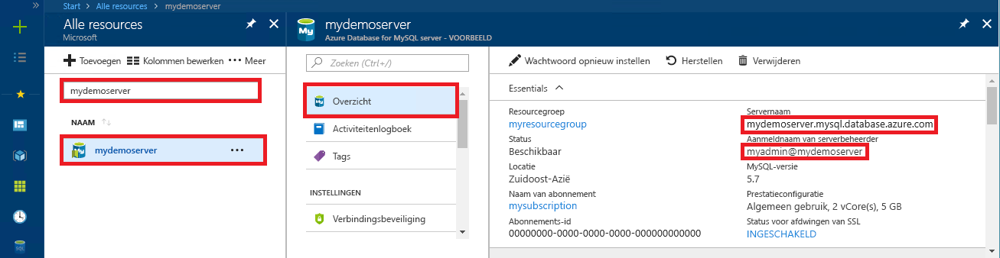

# <a name="azure-database-for-mysql-use-net-c-to-connect-and-query-data"></a>Azure Database for MySQL: .NET (C#) gebruiken om verbinding te maken met gegevens en er query's op uit te voeren
In deze quickstart ziet u hoe u met behulp van een C#-toepassing verbinding maakt met Azure Database voor MySQL. U ziet hier hoe u SQL-instructies gebruikt om gegevens in de database op te vragen, in te voegen, bij te werken en te verwijderen. In dit artikel wordt ervan uitgegaan dat u bekend bent met het ontwikkelen met C#, maar geen ervaring hebt met het werken met Azure Database voor MySQL.

## <a name="prerequisites"></a>Vereisten
In deze snelstartgids worden de resources die in een van deze handleidingen zijn gemaakt, als uitgangspunt gebruikt:
- [Een Azure-database voor een MySQL-server maken met behulp van Azure Portal](./quickstart-create-mysql-server-database-using-azure-portal.md)
- [Een Azure-database voor een MySQL-server maken met behulp van Azure CLI](./quickstart-create-mysql-server-database-using-azure-cli.md)

U moet ook het volgende doen:
- Installeer [.NET](https://www.microsoft.com/net/download). Volg de stappen in het gekoppelde artikel om .NET specifiek voor uw platform (Windows, Ubuntu Linux en Mac OS) te installeren. 
- Installeer [Visual Studio](https://www.visualstudio.com/downloads/).

## <a name="create-a-c-project"></a>Een C#-project maken
Voer in een opdrachtprompt het volgende uit:

```
mkdir AzureMySqlExample
cd AzureMySqlExample
dotnet new console
dotnet add package MySqlConnector
```

## <a name="get-connection-information"></a>Verbindingsgegevens ophalen
Haal de verbindingsgegevens op die nodig zijn om verbinding te maken met de Azure Database voor MySQL. U hebt de volledig gekwalificeerde servernaam en aanmeldingsreferenties nodig.

1. Meld u aan bij [Azure Portal](https://portal.azure.com/).
2. Klik in het menu aan de linkerkant in Azure Portal op **Alle resources** en zoek naar de server die u hebt gemaakt (bijvoorbeeld **mydemoserver**).
3. Klik op de servernaam.
4. Ga naar het venster **Overzicht** van de server en noteer de **Servernaam** en de **Aanmeldingsnaam van de serverbeheerder**. Als u uw wachtwoord vergeet, kunt u het wachtwoord in dit venster opnieuw instellen.
 

## <a name="connect-create-table-and-insert-data"></a>Verbinden, tabel maken en gegevens invoegen
Gebruik de volgende code om verbinding te maken en de gegevens te laden met behulp van de SQL-instructies `CREATE TABLE` en `INSERT INTO`. In de code wordt de klasse `MySqlConnection` met de methode [OpenAsync()](https://docs.microsoft.com/dotnet/api/system.data.common.dbconnection.openasync#System_Data_Common_DbConnection_OpenAsync) gebruikt om een verbinding te maken met MySQL. Vervolgens wordt de methode [CreateCommand()](https://docs.microsoft.com/dotnet/api/system.data.common.dbconnection.createcommand) gebruikt, de eigenschap CommandText ingesteld en de methode [ExecuteNonQueryAsync()](https://docs.microsoft.com/dotnet/api/system.data.common.dbcommand.executenonqueryasync) aangeroepen om de databaseopdrachten uit te voeren. 

Vervang de parameters `Server`, `Database`, `UserID` en `Password` door de waarden die u hebt opgegeven tijdens het maken van de server en database. 

```csharp
using System;
using System.Threading.Tasks;
using MySql.Data.MySqlClient;

namespace AzureMySqlExample
{
    class MySqlCreate
    {
        static async Task Main(string[] args)
        {
            var builder = new MySqlConnectionStringBuilder
            {
                Server = "YOUR-SERVER.mysql.database.azure.com",
                Database = "YOUR-DATABASE",
                UserID = "USER@YOUR-SERVER",
                Password = "PASSWORD",
                SslMode = MySqlSslMode.Required,
            };

            using (var conn = new MySqlConnection(builder.ConnectionString))
            {
                Console.WriteLine("Opening connection");
                await conn.OpenAsync();

                using (var command = conn.CreateCommand())
                {
                    command.CommandText = "DROP TABLE IF EXISTS inventory;";
                    await command.ExecuteNonQueryAsync();
                    Console.WriteLine("Finished dropping table (if existed)");

                    command.CommandText = "CREATE TABLE inventory (id serial PRIMARY KEY, name VARCHAR(50), quantity INTEGER);";
                    await command.ExecuteNonQueryAsync();
                    Console.WriteLine("Finished creating table");

                    command.CommandText = @"INSERT INTO inventory (name, quantity) VALUES (@name1, @quantity1),
                        (@name2, @quantity2), (@name3, @quantity3);";
                    command.Parameters.AddWithValue("@name1", "banana");
                    command.Parameters.AddWithValue("@quantity1", 150);
                    command.Parameters.AddWithValue("@name2", "orange");
                    command.Parameters.AddWithValue("@quantity2", 154);
                    command.Parameters.AddWithValue("@name3", "apple");
                    command.Parameters.AddWithValue("@quantity3", 100);

                    int rowCount = await command.ExecuteNonQueryAsync();
                    Console.WriteLine(String.Format("Number of rows inserted={0}", rowCount));
                }

                // connection will be closed by the 'using' block
                Console.WriteLine("Closing connection");
            }

            Console.WriteLine("Press RETURN to exit");
            Console.ReadLine();
        }
    }
}
```

## <a name="read-data"></a>Gegevens lezen

Gebruik de volgende code om verbinding te maken en de gegevens te lezen met behulp van de SQL-instructie `SELECT`. In de code wordt de klasse `MySqlConnection` met de methode [OpenAsync()](https://docs.microsoft.com/dotnet/api/system.data.common.dbconnection.openasync#System_Data_Common_DbConnection_OpenAsync) gebruikt om een verbinding te maken met MySQL. Vervolgens worden de methoden [CreateCommand()](https://docs.microsoft.com/dotnet/api/system.data.common.dbconnection.createcommand) en [ExecuteReaderAsync()](https://docs.microsoft.com/dotnet/api/system.data.common.dbcommand.executereaderasync) gebruikt om de databaseopdrachten uit te voeren. Daarna wordt [ReadAsync()](https://docs.microsoft.com/dotnet/api/system.data.common.dbdatareader.readasync#System_Data_Common_DbDataReader_ReadAsync) gebruikt om naar de records in de resultaten te gaan. Vervolgens worden in de code GetInt32() en GetString() gebruikt om de waarden in de record te parseren.

Vervang de parameters `Server`, `Database`, `UserID` en `Password` door de waarden die u hebt opgegeven tijdens het maken van de server en database. 

```csharp
using System;
using System.Threading.Tasks;
using MySql.Data.MySqlClient;

namespace AzureMySqlExample
{
    class MySqlRead
    {
        static async Task Main(string[] args)
        {
            var builder = new MySqlConnectionStringBuilder
            {
                Server = "YOUR-SERVER.mysql.database.azure.com",
                Database = "YOUR-DATABASE",
                UserID = "USER@YOUR-SERVER",
                Password = "PASSWORD",
                SslMode = MySqlSslMode.Required,
            };

            using (var conn = new MySqlConnection(builder.ConnectionString))
            {
                Console.WriteLine("Opening connection");
                await conn.OpenAsync();

                using (var command = conn.CreateCommand())
                {
                    command.CommandText = "SELECT * FROM inventory;";

                    using (var reader = await command.ExecuteReaderAsync())
                    {
                        while (await reader.ReadAsync())
                        {
                            Console.WriteLine(string.Format(
                                "Reading from table=({0}, {1}, {2})",
                                reader.GetInt32(0),
                                reader.GetString(1),
                                reader.GetInt32(2)));
                        }
                    }
                }

                Console.WriteLine("Closing connection");
            }

            Console.WriteLine("Press RETURN to exit");
            Console.ReadLine();
        }
    }
}
```

## <a name="update-data"></a>Gegevens bijwerken
Gebruik de volgende code om verbinding te maken en de gegevens te lezen met behulp van de SQL-instructie `UPDATE`. In de code wordt de klasse `MySqlConnection` met de methode [OpenAsync()](https://docs.microsoft.com/dotnet/api/system.data.common.dbconnection.openasync#System_Data_Common_DbConnection_OpenAsync) gebruikt om een verbinding te maken met MySQL. Vervolgens wordt de methode [CreateCommand()](https://docs.microsoft.com/dotnet/api/system.data.common.dbconnection.createcommand) gebruikt, de eigenschap CommandText ingesteld en de methode [ExecuteNonQueryAsync()](https://docs.microsoft.com/dotnet/api/system.data.common.dbcommand.executenonqueryasync) aangeroepen om de databaseopdrachten uit te voeren. 

Vervang de parameters `Server`, `Database`, `UserID` en `Password` door de waarden die u hebt opgegeven tijdens het maken van de server en database. 

```csharp
using System;
using System.Threading.Tasks;
using MySql.Data.MySqlClient;

namespace AzureMySqlExample
{
    class MySqlUpdate
    {
        static async Task Main(string[] args)
        {
            var builder = new MySqlConnectionStringBuilder
            {
                Server = "YOUR-SERVER.mysql.database.azure.com",
                Database = "YOUR-DATABASE",
                UserID = "USER@YOUR-SERVER",
                Password = "PASSWORD",
                SslMode = MySqlSslMode.Required,
            };

            using (var conn = new MySqlConnection(builder.ConnectionString))
            {
                Console.WriteLine("Opening connection");
                await conn.OpenAsync();

                using (var command = conn.CreateCommand())
                {
                    command.CommandText = "UPDATE inventory SET quantity = @quantity WHERE name = @name;";
                    command.Parameters.AddWithValue("@quantity", 200);
                    command.Parameters.AddWithValue("@name", "banana");

                    int rowCount = await command.ExecuteNonQueryAsync();
                    Console.WriteLine(String.Format("Number of rows updated={0}", rowCount));
                }

                Console.WriteLine("Closing connection");
            }

            Console.WriteLine("Press RETURN to exit");
            Console.ReadLine();
        }
    }
}
```

## <a name="delete-data"></a>Gegevens verwijderen
Gebruik de volgende code om verbinding te maken en de gegevens te verwijderen met behulp van de SQL-instructie `DELETE`. 

In de code wordt de klasse `MySqlConnection` met de methode [OpenAsync()](https://docs.microsoft.com/dotnet/api/system.data.common.dbconnection.openasync#System_Data_Common_DbConnection_OpenAsync) gebruikt om een verbinding te maken met MySQL. Vervolgens wordt de methode [CreateCommand()](https://docs.microsoft.com/dotnet/api/system.data.common.dbconnection.createcommand) gebruikt, de eigenschap CommandText ingesteld en de methode [ExecuteNonQueryAsync()](https://docs.microsoft.com/dotnet/api/system.data.common.dbcommand.executenonqueryasync) aangeroepen om de databaseopdrachten uit te voeren. 

Vervang de parameters `Server`, `Database`, `UserID` en `Password` door de waarden die u hebt opgegeven tijdens het maken van de server en database. 

```csharp
using System;
using System.Threading.Tasks;
using MySql.Data.MySqlClient;

namespace AzureMySqlExample
{
    class MySqlDelete
    {
        static async Task Main(string[] args)
        {
            var builder = new MySqlConnectionStringBuilder
            {
                Server = "YOUR-SERVER.mysql.database.azure.com",
                Database = "YOUR-DATABASE",
                UserID = "USER@YOUR-SERVER",
                Password = "PASSWORD",
                SslMode = MySqlSslMode.Required,
            };

            using (var conn = new MySqlConnection(builder.ConnectionString))
            {
                Console.WriteLine("Opening connection");
                await conn.OpenAsync();

                using (var command = conn.CreateCommand())
                {
                    command.CommandText = "DELETE FROM inventory WHERE name = @name;";
                    command.Parameters.AddWithValue("@name", "orange");

                    int rowCount = await command.ExecuteNonQueryAsync();
                    Console.WriteLine(String.Format("Number of rows deleted={0}", rowCount));
                }

                Console.WriteLine("Closing connection");
            }

            Console.WriteLine("Press RETURN to exit");
            Console.ReadLine();
        }
    }
}
```

## <a name="next-steps"></a>Volgende stappen
> [!div class="nextstepaction"]
> [Uw MySQL-database migreren naar Azure Database voor MySQL met behulp van dumpen en terugzetten](concepts-migrate-dump-restore.md)
