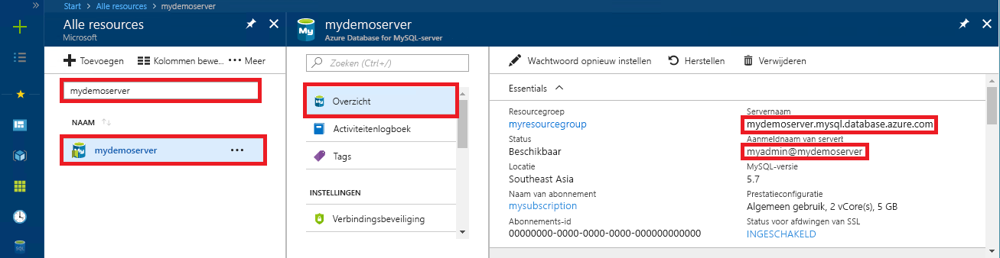

# <a name="azure-database-for-mysql-use-go-language-to-connect-and-query-data"></a>Azure-database voor MySQL: de taal Go gebruiken om verbinding te maken en gegevens op te vragen
In deze quickstart leest u hoe u op Windows-, Ubuntu Linux- en Apple macOS-platforms verbinding maakt met Azure Database for MySQL met behulp van code geschreven in de taal [Go](https://golang.org/). U ziet hier hoe u SQL-instructies gebruikt om gegevens in de database op te vragen, in te voegen, bij te werken en te verwijderen. In dit artikel wordt ervan uitgegaan dat u bekend bent met het ontwikkelen met behulp van Go, maar geen ervaring hebt met het werken met Azure Database for MySQL.

## <a name="prerequisites"></a>Vereisten
In deze snelstartgids worden de resources die in een van deze handleidingen zijn gemaakt, als uitgangspunt gebruikt:
- [Een Azure-database voor een MySQL-server maken met behulp van Azure Portal](./quickstart-create-mysql-server-database-using-azure-portal.md)
- [Een Azure-database voor een MySQL-server maken met behulp van Azure CLI](./quickstart-create-mysql-server-database-using-azure-cli.md)

## <a name="install-go-and-mysql-connector"></a>Go en de MySQL-connector installeren
Installeer [Go](https://golang.org/doc/install) en het [Go-SQL-stuurprogramma voor MySQL](https://github.com/go-sql-driver/mysql#installation) op uw computer. Afhankelijk van uw platform voert u de volgende stappen uit in de toepasselijke sectie:

### <a name="windows"></a>Windows
1. [Download](https://golang.org/dl/) en installeer Go voor Microsoft Windows volgens de [installatie-instructies](https://golang.org/doc/install).
2. Open de opdrachtprompt vanuit het Startmenu.
3. Maak een map voor uw project, bijvoorbeeld: `mkdir  %USERPROFILE%\go\src\mysqlgo`.
4. Wijzig de map in de projectmap, bijvoorbeeld `cd %USERPROFILE%\go\src\mysqlgo`.
5. Stel de omgevingsvariabele voor GOPATH zo in dat deze verwijst naar de broncodemap. `set GOPATH=%USERPROFILE%\go`.
6. Installeer het [Go-SQL-stuurprogramma voor MySQL](https://github.com/go-sql-driver/mysql#installation) door de opdracht `go get github.com/go-sql-driver/mysql` uit te voeren.

   Kortom: installeer Go en voer vervolgens deze opdrachten uit in de opdrachtprompt:
   ```cmd
   mkdir  %USERPROFILE%\go\src\mysqlgo
   cd %USERPROFILE%\go\src\mysqlgo
   set GOPATH=%USERPROFILE%\go
   go get github.com/go-sql-driver/mysql
   ```

### <a name="linux-ubuntu"></a>Linux (Ubuntu)
1. Open de Bash-shell. 
2. Installeer Go door `sudo apt-get install golang-go` uit te voeren.
3. Maak in de basismap een map voor uw project, bijvoorbeeld `mkdir -p ~/go/src/mysqlgo/`.
4. Wijzig de map in de map, bijvoorbeeld `cd ~/go/src/mysqlgo/`.
5. Stel de omgevingsvariabele GOPATH zo in dat deze verwijst naar een geldige bronmap, zoals de Go-map in uw huidige basismap. Voer `export GOPATH=~/go` in de Bash-shell uit om de Go-map toe te voegen als GOPATH voor de huidige shellsessie.
6. Installeer het [Go-SQL-stuurprogramma voor MySQL](https://github.com/go-sql-driver/mysql#installation) door de opdracht `go get github.com/go-sql-driver/mysql` uit te voeren.

   Kortom: voer deze Bash-opdrachten uit:
   ```bash
   sudo apt-get install golang-go
   mkdir -p ~/go/src/mysqlgo/
   cd ~/go/src/mysqlgo/
   export GOPATH=~/go/
   go get github.com/go-sql-driver/mysql
   ```

### <a name="apple-macos"></a>Apple macOS
1. Download en installeer Go volgens de [installatie-instructies](https://golang.org/doc/install) die overeenkomen met uw platform. 
2. Open de Bash-shell.
3. Maak in de basismap een map voor uw project, bijvoorbeeld `mkdir -p ~/go/src/mysqlgo/`.
4. Wijzig de map in de map, bijvoorbeeld `cd ~/go/src/mysqlgo/`.
5. Stel de omgevingsvariabele GOPATH zo in dat deze verwijst naar een geldige bronmap, zoals de Go-map in uw huidige basismap. Voer `export GOPATH=~/go` in de Bash-shell uit om de Go-map toe te voegen als GOPATH voor de huidige shellsessie.
6. Installeer het [Go-SQL-stuurprogramma voor MySQL](https://github.com/go-sql-driver/mysql#installation) door de opdracht `go get github.com/go-sql-driver/mysql` uit te voeren.

   Kortom: installeer Go en voer deze Bash-opdrachten uit:
   ```bash
   mkdir -p ~/go/src/mysqlgo/
   cd ~/go/src/mysqlgo/
   export GOPATH=~/go/
   go get github.com/go-sql-driver/mysql
   ```

## <a name="get-connection-information"></a>Verbindingsgegevens ophalen
Haal de verbindingsgegevens op die nodig zijn om verbinding te maken met de Azure Database voor MySQL. U hebt de volledig gekwalificeerde servernaam en aanmeldingsreferenties nodig.

1. Meld u aan bij [Azure Portal](https://portal.azure.com/).
2. Klik in het menu aan de linkerkant in Azure Portal op **Alle resources** en zoek naar de server die u hebt gemaakt (bijvoorbeeld **mydemoserver**).
3. Klik op de servernaam.
4. Ga naar het venster **Overzicht** van de server en noteer de **Servernaam** en de **Aanmeldingsnaam van de serverbeheerder**. Als u uw wachtwoord vergeet, kunt u het wachtwoord in dit venster opnieuw instellen.
 
   

## <a name="build-and-run-go-code"></a>Go-code schrijven en uitvoeren 
1. Als u Golang-code wilt schrijven, gebruikt u een eenvoudige teksteditor zoals Kladblok in Microsoft Windows, [vi](http://manpages.ubuntu.com/manpages/xenial/man1/nvi.1.html#contenttoc5) of [Nano](https://www.nano-editor.org/) in Ubuntu en TextEdit in macOS. Als u liever een uitgebreidere Interactive Development Environment (IDE) gebruikt, gaat u aan de slag met [Gogland](https://www.jetbrains.com/go/) van Jetbrains, [Visual Studio Code](https://code.visualstudio.com/) van Microsoft of [Atom](https://atom.io/).
2. Plak de Go-code uit de secties hieronder in tekstbestanden en sla deze in de projectmap op met de bestandsextensie \*.go, bijvoorbeeld het pad `%USERPROFILE%\go\src\mysqlgo\createtable.go` (voor Windows) of het pad `~/go/src/mysqlgo/createtable.go` (voor Linux).
3. Zoek de constanten `HOST`, `DATABASE`, `USER` en `PASSWORD` in de code en vervang de voorbeeldwaarden door uw eigen waarden. 
4. Open de opdrachtprompt of de Bash-shell. Wijzig de map in de projectmap. Voorbeeld voor Windows: `cd %USERPROFILE%\go\src\mysqlgo\`. Voorbeeld voor Linux: `cd ~/go/src/mysqlgo/`.  Sommige van de vermelde IDE-editors bieden mogelijkheden voor foutopsporing en runtime zonder dat daarvoor shell-opdrachten zijn vereist.
5. Voer de code uit door de opdracht `go run createtable.go` te typen. De toepassing wordt nu gecompileerd en uitgevoerd. 
6. Als u de code wilt bouwen in een systeemeigen toepassing, kunt u ook `go build createtable.go` gebruiken en vervolgens `createtable.exe` starten om de toepassing uit te voeren.

## <a name="connect-create-table-and-insert-data"></a>Verbinden, tabel maken en gegevens invoegen
Gebruik de volgende code om verbinding te maken met de server, een tabel te maken en de gegevens te laden met behulp van de SQL-instructie **INSERT**. 

Met de code worden drie pakketten geïmporteerd: het [SQL-pakket](https://golang.org/pkg/database/sql/), het [GO-SQL-stuurprogramma voor MySQL](https://github.com/go-sql-driver/mysql#installation) (als stuurprogramma voor de communicatie met de Azure-database voor MySQL) en het [fmt-pakket](https://golang.org/pkg/fmt/) (voor de weergave van invoer en uitvoer op de opdrachtregel).

In de code wordt de methode [sql.Open()](http://go-database-sql.org/accessing.html) aangeroepen om verbinding te maken met Azure Database for MySQL. Vervolgens wordt de verbinding gecontroleerd met de methode [db.Ping()](https://golang.org/pkg/database/sql/#DB.Ping). Er wordt telkens gebruikgemaakt van een [database-ingang](https://golang.org/pkg/database/sql/#DB), die de verbindingsgroep voor de databaseserver bevat. In de code wordt de methode [Exec()](https://golang.org/pkg/database/sql/#DB.Exec) meerdere keren aangeroepen om diverse DDL-opdrachten uit te voeren. De code maakt ook gebruik van [Prepare()](http://go-database-sql.org/prepared.html) en Exec() om voorbereide instructies uit te voeren met verschillende parameters, zodat er drie rijen worden ingevoegd. Telkens wordt er een aangepaste checkError()-methode gebruikt om te controleren of er fouten zijn opgetreden en af te sluiten als dit het geval is.

Vervang de constanten `host`, `database`, `user` en `password` door uw eigen waarden. 

```Go
package main

import (
    "database/sql"
    "fmt"

    _ "github.com/go-sql-driver/mysql"
)

const (
    host     = "mydemoserver.mysql.database.azure.com"
    database = "quickstartdb"
    user     = "myadmin@mydemoserver"
    password = "yourpassword"
)

func checkError(err error) {
    if err != nil {
        panic(err)
    }
}

func main() {

    // Initialize connection string.
    var connectionString = fmt.Sprintf("%s:%s@tcp(%s:3306)/%s?allowNativePasswords=true", user, password, host, database)

    // Initialize connection object.
    db, err := sql.Open("mysql", connectionString)
    checkError(err)
    defer db.Close()

    err = db.Ping()
    checkError(err)
    fmt.Println("Successfully created connection to database.")

    // Drop previous table of same name if one exists.
    _, err = db.Exec("DROP TABLE IF EXISTS inventory;")
    checkError(err)
    fmt.Println("Finished dropping table (if existed).")

    // Create table.
    _, err = db.Exec("CREATE TABLE inventory (id serial PRIMARY KEY, name VARCHAR(50), quantity INTEGER);")
    checkError(err)
    fmt.Println("Finished creating table.")

    // Insert some data into table.
    sqlStatement, err := db.Prepare("INSERT INTO inventory (name, quantity) VALUES (?, ?);")
    res, err := sqlStatement.Exec("banana", 150)
    checkError(err)
    rowCount, err := res.RowsAffected()
    fmt.Printf("Inserted %d row(s) of data.\n", rowCount)

    res, err = sqlStatement.Exec("orange", 154)
    checkError(err)
    rowCount, err = res.RowsAffected()
    fmt.Printf("Inserted %d row(s) of data.\n", rowCount)

    res, err = sqlStatement.Exec("apple", 100)
    checkError(err)
    rowCount, err = res.RowsAffected()
    fmt.Printf("Inserted %d row(s) of data.\n", rowCount)
    fmt.Println("Done.")
}

```

## <a name="read-data"></a>Gegevens lezen
Gebruik de volgende code om verbinding te maken en de gegevens te lezen met behulp van de SQL-instructie **SELECT**. 

Met de code worden drie pakketten geïmporteerd: het [SQL-pakket](https://golang.org/pkg/database/sql/), het [GO-SQL-stuurprogramma voor MySQL](https://github.com/go-sql-driver/mysql#installation) (als stuurprogramma voor de communicatie met de Azure-database voor MySQL) en het [fmt-pakket](https://golang.org/pkg/fmt/) (voor de weergave van invoer en uitvoer op de opdrachtregel).

In de code wordt de methode [sql.Open()](http://go-database-sql.org/accessing.html) aangeroepen om verbinding te maken met de Azure-database voor MySQL. Vervolgens wordt de verbinding gecontroleerd met de methode [db.Ping()](https://golang.org/pkg/database/sql/#DB.Ping). Er wordt telkens gebruikgemaakt van een [database-ingang](https://golang.org/pkg/database/sql/#DB), die de verbindingsgroep voor de databaseserver bevat. De code roept de [Query()](https://golang.org/pkg/database/sql/#DB.Query)-methode aan om de geselecteerde opdracht uit te voeren. Vervolgens wordt [Next()](https://golang.org/pkg/database/sql/#Rows.Next) uitgevoerd om de resultatenset te doorlopen en [Scan()](https://golang.org/pkg/database/sql/#Rows.Scan) om de kolomwaarden te parseren, waarbij deze worden opgeslagen in de vorm van variabelen. Telkens wordt er een aangepaste checkError()-methode gebruikt om te controleren of er fouten zijn opgetreden en af te sluiten als dit het geval is.

Vervang de constanten `host`, `database`, `user` en `password` door uw eigen waarden. 

```Go
package main

import (
    "database/sql"
    "fmt"

    _ "github.com/go-sql-driver/mysql"
)

const (
    host     = "mydemoserver.mysql.database.azure.com"
    database = "quickstartdb"
    user     = "myadmin@mydemoserver"
    password = "yourpassword"
)

func checkError(err error) {
    if err != nil {
        panic(err)
    }
}

func main() {

    // Initialize connection string.
    var connectionString = fmt.Sprintf("%s:%s@tcp(%s:3306)/%s?allowNativePasswords=true", user, password, host, database)

    // Initialize connection object.
    db, err := sql.Open("mysql", connectionString)
    checkError(err)
    defer db.Close()

    err = db.Ping()
    checkError(err)
    fmt.Println("Successfully created connection to database.")

    // Variables for printing column data when scanned.
    var (
        id       int
        name     string
        quantity int
    )

    // Read some data from the table.
    rows, err := db.Query("SELECT id, name, quantity from inventory;")
    checkError(err)
    defer rows.Close()
    fmt.Println("Reading data:")
    for rows.Next() {
        err := rows.Scan(&id, &name, &quantity)
        checkError(err)
        fmt.Printf("Data row = (%d, %s, %d)\n", id, name, quantity)
    }
    err = rows.Err()
    checkError(err)
    fmt.Println("Done.")
}
```

## <a name="update-data"></a>Gegevens bijwerken
Gebruik de volgende code om verbinding te maken en de gegevens bij te werken met de SQL-instructie **UPDATE**. 

Met de code worden drie pakketten geïmporteerd: het [SQL-pakket](https://golang.org/pkg/database/sql/), het [GO-SQL-stuurprogramma voor MySQL](https://github.com/go-sql-driver/mysql#installation) (als stuurprogramma voor de communicatie met de Azure-database voor MySQL) en het [fmt-pakket](https://golang.org/pkg/fmt/) (voor de weergave van invoer en uitvoer op de opdrachtregel).

In de code wordt de methode [sql.Open()](http://go-database-sql.org/accessing.html) aangeroepen om verbinding te maken met de Azure-database voor MySQL. Vervolgens wordt de verbinding gecontroleerd met de methode [db.Ping()](https://golang.org/pkg/database/sql/#DB.Ping). Er wordt telkens gebruikgemaakt van een [database-ingang](https://golang.org/pkg/database/sql/#DB), die de verbindingsgroep voor de databaseserver bevat. De code roept de [Exec()](https://golang.org/pkg/database/sql/#DB.Exec)-methode aan om de opdracht Bijwerken uit te voeren. Telkens wordt er een aangepaste checkError()-methode gebruikt om te controleren of er fouten zijn opgetreden en af te sluiten als dit het geval is.

Vervang de constanten `host`, `database`, `user` en `password` door uw eigen waarden. 

```Go
package main

import (
    "database/sql"
    "fmt"

    _ "github.com/go-sql-driver/mysql"
)

const (
    host     = "mydemoserver.mysql.database.azure.com"
    database = "quickstartdb"
    user     = "myadmin@mydemoserver"
    password = "yourpassword"
)

func checkError(err error) {
    if err != nil {
        panic(err)
    }
}

func main() {

    // Initialize connection string.
    var connectionString = fmt.Sprintf("%s:%s@tcp(%s:3306)/%s?allowNativePasswords=true", user, password, host, database)

    // Initialize connection object.
    db, err := sql.Open("mysql", connectionString)
    checkError(err)
    defer db.Close()

    err = db.Ping()
    checkError(err)
    fmt.Println("Successfully created connection to database.")

    // Modify some data in table.
    rows, err := db.Exec("UPDATE inventory SET quantity = ? WHERE name = ?", 200, "banana")
    checkError(err)
    rowCount, err := rows.RowsAffected()
    fmt.Printf("Deleted %d row(s) of data.\n", rowCount)
    fmt.Println("Done.")
}
```

## <a name="delete-data"></a>Gegevens verwijderen
Gebruik de volgende code om verbinding te maken en de gegevens te verwijderen met de SQL-instructie **DELETE**. 

Met de code worden drie pakketten geïmporteerd: het [SQL-pakket](https://golang.org/pkg/database/sql/), het [GO-SQL-stuurprogramma voor MySQL](https://github.com/go-sql-driver/mysql#installation) (als stuurprogramma voor de communicatie met de Azure-database voor MySQL) en het [fmt-pakket](https://golang.org/pkg/fmt/) (voor de weergave van invoer en uitvoer op de opdrachtregel).

In de code wordt de methode [sql.Open()](http://go-database-sql.org/accessing.html) aangeroepen om verbinding te maken met de Azure-database voor MySQL. Vervolgens wordt de verbinding gecontroleerd met de methode [db.Ping()](https://golang.org/pkg/database/sql/#DB.Ping). Er wordt telkens gebruikgemaakt van een [database-ingang](https://golang.org/pkg/database/sql/#DB), die de verbindingsgroep voor de databaseserver bevat. De code roept de [Exec()](https://golang.org/pkg/database/sql/#DB.Exec)-methode aan om de opdracht Verwijderen uit te voeren. Telkens wordt er een aangepaste checkError()-methode gebruikt om te controleren of er fouten zijn opgetreden en af te sluiten als dit het geval is.

Vervang de constanten `host`, `database`, `user` en `password` door uw eigen waarden. 

```Go
package main

import (
    "database/sql"
    "fmt"
    _ "github.com/go-sql-driver/mysql"
)

const (
    host     = "mydemoserver.mysql.database.azure.com"
    database = "quickstartdb"
    user     = "myadmin@mydemoserver"
    password = "yourpassword"
)

func checkError(err error) {
    if err != nil {
        panic(err)
    }
}

func main() {

    // Initialize connection string.
    var connectionString = fmt.Sprintf("%s:%s@tcp(%s:3306)/%s?allowNativePasswords=true", user, password, host, database)

    // Initialize connection object.
    db, err := sql.Open("mysql", connectionString)
    checkError(err)
    defer db.Close()

    err = db.Ping()
    checkError(err)
    fmt.Println("Successfully created connection to database.")

    // Modify some data in table.
    rows, err := db.Exec("DELETE FROM inventory WHERE name = ?", "orange")
    checkError(err)
    rowCount, err := rows.RowsAffected()
    fmt.Printf("Deleted %d row(s) of data.\n", rowCount)
    fmt.Println("Done.")
}
```

## <a name="next-steps"></a>Volgende stappen
> [!div class="nextstepaction"]
> [Een database migreren met behulp van Exporteren en importeren](./concepts-migrate-import-export.md)
