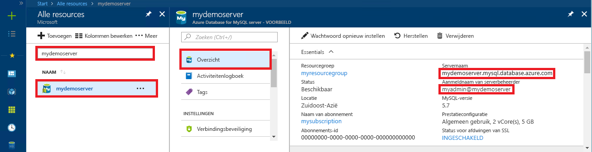

# <a name="quickstart-use-java-to-connect-to-and-query-data-in-azure-database-for-mysql"></a>Quickstart: Java gebruiken om verbinding te maken met en gegevens op te vragen in Azure Database for MySQL

In deze Quick start ziet u hoe u verbinding maakt met een Azure Database for MySQL met behulp van een Java-toepassing en het JDBC-stuur programma [MariaDB Connector/J](https://mariadb.com/kb/en/library/mariadb-connector-j/). U ziet hier hoe u SQL-instructies gebruikt om gegevens in de database op te vragen, in te voegen, bij te werken en te verwijderen. In dit artikel wordt ervan uitgegaan dat u bekend bent met het ontwikkelen met behulp van Java, maar geen ervaring hebt met het werken met Azure Database voor MySQL.

## <a name="prerequisites"></a>Vereisten
1. In deze snelstartgids worden de resources die in een van deze handleidingen zijn gemaakt, als uitgangspunt gebruikt:
   - [Een Azure-database voor een MySQL-server maken met behulp van Azure Portal](./quickstart-create-mysql-server-database-using-azure-portal.md)
   - [Een Azure-database voor een MySQL-server maken met behulp van Azure CLI](./quickstart-create-mysql-server-database-using-azure-cli.md)

2. Zorg dat de beveiliging van uw Azure Database voor MySQL-verbinding is geconfigureerd met de firewall geopend en SSL-instellingen aangepast. Anders kan de toepassing geen maken.

3. Gebruik een van de volgende benaderingen om de MariaDB Connector/J-connector te verkrijgen:
   - Gebruik het maven [-pakket mariadb-Java-client](https://search.maven.org/search?q=a:mariadb-java-client) voor het toevoegen van de [mariadb-Java-client-afhankelijkheid](https://mvnrepository.com/artifact/org.mariadb.jdbc/mariadb-java-client) in het pom-bestand voor uw project.
   - Down load het JDBC [-stuur programma MariaDB Connector/J](https://downloads.mariadb.org/connector-java/) en neem het JDBC jar-bestand (bijvoorbeeld mariadb-Java-client-2.4.3. jar) op in het klassepad van uw toepassing. Als u problemen met klassepaden hebt, raadpleegt u de documentatie van uw omgeving voor informatie over de klassepaden, zoals [Apache Tomcat](https://tomcat.apache.org/tomcat-7.0-doc/class-loader-howto.html) of [Java SE](https://docs.oracle.com/javase/7/docs/technotes/tools/windows/classpath.html)

## <a name="get-connection-information"></a>Verbindingsgegevens ophalen
Haal de verbindingsgegevens op die nodig zijn om verbinding te maken met de Azure Database voor MySQL. U hebt de volledig gekwalificeerde servernaam en aanmeldingsreferenties nodig.

1. Meld u aan bij [Azure Portal](https://portal.azure.com/).
2. Klik in het menu aan de linkerkant in Azure Portal op **Alle resources** en zoek naar de server die u hebt gemaakt (bijvoorbeeld **mydemoserver**).
3. Klik op de servernaam.
4. Ga naar het venster **Overzicht** van de server en noteer de **Servernaam** en de **Aanmeldingsnaam van de serverbeheerder**. Als u uw wachtwoord vergeet, kunt u het wachtwoord in dit venster opnieuw instellen.
 

## <a name="connect-create-table-and-insert-data"></a>Verbinden, tabel maken en gegevens invoegen
Gebruik de volgende code om verbinding te maken en de gegevens te laden met de functie met een SQL-instructie **INSERT**. De methode [getConnection()](https://mariadb.com/kb/en/library/about-mariadb-connector-j/#using-drivermanager) wordt gebruikt om verbinding te maken met MySQL. De methoden [createStatement()](https://mariadb.com/kb/en/library/about-mariadb-connector-j/#creating-a-table-on-a-mariadb-or-mysql-server) en execute() worden gebruikt om de tabel te verwijderen en te maken. Het object prepareStatement wordt gebruikt voor het bouwen van de INSERT-opdrachten, waarbij setString() en setInt() worden gebruikt om de parameterwaarden te koppelen. Met de methode executeUpdate() wordt de opdracht voor elke set parameters uitgevoerd om de waarden in te voegen. 

Vervang de parameters voor host, database, gebruiker en wachtwoord door de waarden die u hebt opgegeven tijdens het maken van uw eigen server en database.

```java
import java.sql.*;
import java.util.Properties;

public class CreateTableInsertRows {

    public static void main (String[] args)  throws Exception
    {
        // Initialize connection variables. 
        String host = "mydemoserver.mysql.database.azure.com";
        String database = "quickstartdb";
        String user = "myadmin@mydemoserver";
        String password = "<server_admin_password>";

        // check that the driver is installed
        try
        {
            Class.forName("org.mariadb.jdbc");
        }
        catch (ClassNotFoundException e)
        {
            throw new ClassNotFoundException("MariaDB JDBC driver NOT detected in library path.", e);
        }

        System.out.println("MariaDB JDBC driver detected in library path.");

        Connection connection = null;

        // Initialize connection object
        try
        {
            String url = String.format("jdbc:mariadb://%s/%s", host, database);

            // Set connection properties.
            Properties properties = new Properties();
            properties.setProperty("user", user);
            properties.setProperty("password", password);
            properties.setProperty("useSSL", "true");
            properties.setProperty("verifyServerCertificate", "true");
            properties.setProperty("requireSSL", "false");

            // get connection
            connection = DriverManager.getConnection(url, properties);
        }
        catch (SQLException e)
        {
            throw new SQLException("Failed to create connection to database.", e);
        }
        if (connection != null) 
        { 
            System.out.println("Successfully created connection to database.");
        
            // Perform some SQL queries over the connection.
            try
            {
                // Drop previous table of same name if one exists.
                Statement statement = connection.createStatement();
                statement.execute("DROP TABLE IF EXISTS inventory;");
                System.out.println("Finished dropping table (if existed).");
    
                // Create table.
                statement.execute("CREATE TABLE inventory (id serial PRIMARY KEY, name VARCHAR(50), quantity INTEGER);");
                System.out.println("Created table.");
                
                // Insert some data into table.
                int nRowsInserted = 0;
                PreparedStatement preparedStatement = connection.prepareStatement("INSERT INTO inventory (name, quantity) VALUES (?, ?);");
                preparedStatement.setString(1, "banana");
                preparedStatement.setInt(2, 150);
                nRowsInserted += preparedStatement.executeUpdate();

                preparedStatement.setString(1, "orange");
                preparedStatement.setInt(2, 154);
                nRowsInserted += preparedStatement.executeUpdate();

                preparedStatement.setString(1, "apple");
                preparedStatement.setInt(2, 100);
                nRowsInserted += preparedStatement.executeUpdate();
                System.out.println(String.format("Inserted %d row(s) of data.", nRowsInserted));
    
                // NOTE No need to commit all changes to database, as auto-commit is enabled by default.
    
            }
            catch (SQLException e)
            {
                throw new SQLException("Encountered an error when executing given sql statement.", e);
            }       
        }
        else {
            System.out.println("Failed to create connection to database.");
        }
        System.out.println("Execution finished.");
    }
}

```

## <a name="read-data"></a>Gegevens lezen
Gebruik de volgende code om de gegevens te lezen met de SQL-instructie **SELECT**. De methode [getConnection()](https://mariadb.com/kb/en/library/about-mariadb-connector-j/#using-drivermanager) wordt gebruikt om verbinding te maken met MySQL. De methoden [createStatement ()](https://mariadb.com/kb/en/library/about-mariadb-connector-j/#creating-a-table-on-a-mariadb-or-mysql-server) en executeQuery () worden gebruikt om verbinding te maken en de SELECT-instructie uit te voeren. De resultaten worden verwerkt met behulp van een resultatenset-object. 

Vervang de parameters voor host, database, gebruiker en wachtwoord door de waarden die u hebt opgegeven tijdens het maken van uw eigen server en database.

```java
import java.sql.*;
import java.util.Properties;

public class ReadTable {

    public static void main (String[] args)  throws Exception
    {
        // Initialize connection variables.
        String host = "mydemoserver.mysql.database.azure.com";
        String database = "quickstartdb";
        String user = "myadmin@mydemoserver";
        String password = "<server_admin_password>";

        // check that the driver is installed
        try
        {
            Class.forName("org.mariadb.jdbc");
        }
        catch (ClassNotFoundException e)
        {
            throw new ClassNotFoundException("MariaDB JDBC driver NOT detected in library path.", e);
        }

        System.out.println("MariaDB JDBC driver detected in library path.");

        Connection connection = null;

        // Initialize connection object
        try
        {
            String url = String.format("jdbc:mariadb://%s/%s", host, database);

            // Set connection properties.
            Properties properties = new Properties();
            properties.setProperty("user", user);
            properties.setProperty("password", password);
            properties.setProperty("useSSL", "true");
            properties.setProperty("verifyServerCertificate", "true");
            properties.setProperty("requireSSL", "false");
            
            // get connection
            connection = DriverManager.getConnection(url, properties);
        }
        catch (SQLException e)
        {
            throw new SQLException("Failed to create connection to database", e);
        }
        if (connection != null) 
        { 
            System.out.println("Successfully created connection to database.");
        
            // Perform some SQL queries over the connection.
            try
            {
    
                Statement statement = connection.createStatement();
                ResultSet results = statement.executeQuery("SELECT * from inventory;");
                while (results.next())
                {
                    String outputString = 
                        String.format(
                            "Data row = (%s, %s, %s)",
                            results.getString(1),
                            results.getString(2),
                            results.getString(3));
                    System.out.println(outputString);
                }
            }
            catch (SQLException e)
            {
                throw new SQLException("Encountered an error when executing given sql statement", e);
            }       
        }
        else {
            System.out.println("Failed to create connection to database."); 
        }
        System.out.println("Execution finished.");
    }
}
```

## <a name="update-data"></a>Gegevens bijwerken
Gebruik de volgende code om de gegevens te wijzigen met de SQL-instructie **UPDATE**. De methode [getConnection()](https://mariadb.com/kb/en/library/about-mariadb-connector-j/#using-drivermanager) wordt gebruikt om verbinding te maken met MySQL. De methoden [prepareStatement()](https://docs.oracle.com/javase/tutorial/jdbc/basics/prepared.html) en executeUpdate() worden gebruikt om de UPDATE-instructie voor te bereiden en uit te voeren. 

Vervang de parameters voor host, database, gebruiker en wachtwoord door de waarden die u hebt opgegeven tijdens het maken van uw eigen server en database.

```java
import java.sql.*;
import java.util.Properties;

public class UpdateTable {
    public static void main (String[] args)  throws Exception
    {
        // Initialize connection variables. 
        String host = "mydemoserver.mysql.database.azure.com";
        String database = "quickstartdb";
        String user = "myadmin@mydemoserver";
        String password = "<server_admin_password>";

        // check that the driver is installed
        try
        {
            Class.forName("org.mariadb.jdbc");
        }
        catch (ClassNotFoundException e)
        {
            throw new ClassNotFoundException("MariaDB JDBC driver NOT detected in library path.", e);
        }

        System.out.println("MariaDB JDBC driver detected in library path.");

        Connection connection = null;

        // Initialize connection object
        try
        {
            String url = String.format("jdbc:mariadb://%s/%s", host, database);
            
            // set up the connection properties
            Properties properties = new Properties();
            properties.setProperty("user", user);
            properties.setProperty("password", password);
            properties.setProperty("useSSL", "true");
            properties.setProperty("verifyServerCertificate", "true");
            properties.setProperty("requireSSL", "false");

            // get connection
            connection = DriverManager.getConnection(url, properties);
        }
        catch (SQLException e)
        {
            throw new SQLException("Failed to create connection to database.", e);
        }
        if (connection != null) 
        { 
            System.out.println("Successfully created connection to database.");
        
            // Perform some SQL queries over the connection.
            try
            {
                // Modify some data in table.
                int nRowsUpdated = 0;
                PreparedStatement preparedStatement = connection.prepareStatement("UPDATE inventory SET quantity = ? WHERE name = ?;");
                preparedStatement.setInt(1, 200);
                preparedStatement.setString(2, "banana");
                nRowsUpdated += preparedStatement.executeUpdate();
                System.out.println(String.format("Updated %d row(s) of data.", nRowsUpdated));
    
                // NOTE No need to commit all changes to database, as auto-commit is enabled by default.
            }
            catch (SQLException e)
            {
                throw new SQLException("Encountered an error when executing given sql statement.", e);
            }       
        }
        else {
            System.out.println("Failed to create connection to database.");
        }
        System.out.println("Execution finished.");
    }
}
```

## <a name="delete-data"></a>Gegevens verwijderen
Gebruik de volgende code om de gegevens te verwijderen met de SQL-instructie **DELETE**. De methode [getConnection()](https://mariadb.com/kb/en/library/about-mariadb-connector-j/#using-drivermanager) wordt gebruikt om verbinding te maken met MySQL.  De methoden [prepareStatement ()](https://docs.oracle.com/javase/tutorial/jdbc/basics/prepared.html) en executeUpdate () worden gebruikt om de DELETE-instructie voor te bereiden en uit te voeren. 

Vervang de parameters voor host, database, gebruiker en wachtwoord door de waarden die u hebt opgegeven tijdens het maken van uw eigen server en database.

```java
import java.sql.*;
import java.util.Properties;

public class DeleteTable {
    public static void main (String[] args)  throws Exception
    {
        // Initialize connection variables.
        String host = "mydemoserver.mysql.database.azure.com";
        String database = "quickstartdb";
        String user = "myadmin@mydemoserver";
        String password = "<server_admin_password>";
        
        // check that the driver is installed
        try
        {
            Class.forName("org.mariadb.jdbc");
        }
        catch (ClassNotFoundException e)
        {
            throw new ClassNotFoundException("MariaDB JDBC driver NOT detected in library path.", e);
        }

        System.out.println("MariaDB JDBC driver detected in library path.");

        Connection connection = null;

        // Initialize connection object
        try
        {
            String url = String.format("jdbc:mariadb://%s/%s", host, database);
            
            // set up the connection properties
            Properties properties = new Properties();
            properties.setProperty("user", user);
            properties.setProperty("password", password);
            properties.setProperty("useSSL", "true");
            properties.setProperty("verifyServerCertificate", "true");
            properties.setProperty("requireSSL", "false");
            
            // get connection
            connection = DriverManager.getConnection(url, properties);
        }
        catch (SQLException e)
        {
            throw new SQLException("Failed to create connection to database", e);
        }
        if (connection != null) 
        { 
            System.out.println("Successfully created connection to database.");
        
            // Perform some SQL queries over the connection.
            try
            {
                // Delete some data from table.
                int nRowsDeleted = 0;
                PreparedStatement preparedStatement = connection.prepareStatement("DELETE FROM inventory WHERE name = ?;");
                preparedStatement.setString(1, "orange");
                nRowsDeleted += preparedStatement.executeUpdate();
                System.out.println(String.format("Deleted %d row(s) of data.", nRowsDeleted));
    
                // NOTE No need to commit all changes to database, as auto-commit is enabled by default.
            }
            catch (SQLException e)
            {
                throw new SQLException("Encountered an error when executing given sql statement.", e);
            }       
        }
        else {
            System.out.println("Failed to create connection to database.");
        }
        System.out.println("Execution finished.");
    }
}
```

## <a name="next-steps"></a>Volgende stappen

> [!div class="nextstepaction"]
> [Uw MySQL-database migreren naar Azure Database voor MySQL met behulp van dumpen en terugzetten](concepts-migrate-dump-restore.md)
