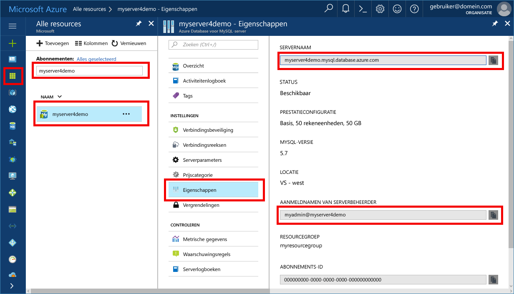

# <a name="azure-database-for-mysql-use-php-to-connect-and-query-data"></a>Azure Database voor MySQL: PHP gebruiken om verbinding te maken en gegevens op te vragen
In deze snelstartgids ziet u hoe u met behulp van een [PHP](http://php.net/manual/intro-whatis.php)-toepassing verbinding maakt met een Azure Database voor MySQL. U ziet hier hoe u SQL-instructies gebruikt om gegevens in de database op te vragen, in te voegen, bij te werken en te verwijderen. In dit artikel wordt ervan uitgegaan dat u bekend bent met het ontwikkelen met behulp van PHP, maar geen ervaring hebt met het werken met Azure Database voor MySQL.

## <a name="prerequisites"></a>Vereisten
In deze snelstartgids worden de resources die in een van deze handleidingen zijn gemaakt, als uitgangspunt gebruikt:
- [Een Azure-database voor een MySQL-server maken met behulp van Azure Portal](./quickstart-create-mysql-server-database-using-azure-portal.md)
- [Een Azure-database voor een MySQL-server maken met behulp van Azure CLI](./quickstart-create-mysql-server-database-using-azure-cli.md)

## <a name="install-php"></a>PHP installeren
Installeer PHP op uw eigen server of maak een Azure-[web-app](../app-service/app-service-web-overview.md) die PHP omvat.

### <a name="macos"></a>MacOS
- Download [PHP 7.1.4](http://php.net/downloads.php).
- Installeer PHP en raadpleeg de [PHP-handleiding](http://php.net/manual/install.macosx.php) voor verdere configuratie.

### <a name="linux-ubuntu"></a>Linux (Ubuntu)
- Download [PHP 7.1.4 niet-thread-veilig (x64)](http://php.net/downloads.php).
- Installeer PHP en raadpleeg de [PHP-handleiding](http://php.net/manual/install.unix.php) voor verdere configuratie.

### <a name="windows"></a>Windows
- Download [PHP 7.1.4 niet-thread-veilig (x64)](http://windows.php.net/download#php-7.1).
- Installeer PHP en raadpleeg de [PHP-handleiding](http://php.net/manual/install.windows.php) voor verdere configuratie.

## <a name="get-connection-information"></a>Verbindingsgegevens ophalen
Haal de verbindingsgegevens op die nodig zijn om verbinding te maken met de Azure Database voor MySQL. U hebt de volledig gekwalificeerde servernaam en aanmeldingsreferenties nodig.

1. Meld u aan bij [Azure Portal](https://portal.azure.com/).
2. Klik in het linkerdeelvenster op **Alle resources** en zoek vervolgens naar de server die u hebt gemaakt (bijvoorbeeld **myserver4demo**).
3. Klik op de servernaam.
4. Selecteer de pagina **Eigenschappen** van de server en noteer vervolgens de **Servernaam** en de **Aanmeldingsnaam van de serverbeheerder**.
 
5. Als u uw aanmeldingsgegevens voor de server bent vergeten, gaat u naar de pagina **Overzicht** om de aanmeldingsnaam van de serverbeheerder weer te geven en indien nodig het wachtwoord opnieuw in te stellen.

## <a name="connect-and-create-a-table"></a>Verbinding maken en een tabel maken
Gebruik de volgende code om verbinding te maken en een tabel te maken met behulp van de SQL-instructie **CREATE TABLE**. 

Voor de code wordt gebruikgemaakt van de klasse **MySQL Improved extension** (mysqli) die deel uitmaakt van PHP. Met de code worden de methoden [mysqli_init](http://php.net/manual/mysqli.init.php) en [mysqli_real_connect](http://php.net/manual/mysqli.real-connect.php) aangeroepen om verbinding te maken met MySQL. Daarna wordt de methode [mysqli_query](http://php.net/manual/mysqli.query.php) aangeroepen op de query uit te voeren. Vervolgens wordt methode [mysqli_close](http://php.net/manual/mysqli.close.php) aangeroepen om de verbinding te sluiten.

Vervang de parameters Host, Gebruikersnaam, Wachtwoord en db_name door uw eigen waarden. 

```php
<?php
$host = 'myserver4demo.mysql.database.azure.com';
$username = 'myadmin@myserver4demo';
$password = 'your_password';
$db_name = 'your_database';

//Establishes the connection
$conn = mysqli_init();
mysqli_real_connect($conn, $host, $username, $password, $db_name, 3306);
if (mysqli_connect_errno($conn)) {
die('Failed to connect to MySQL: '.mysqli_connect_error());
}

// Run the create table query
if (mysqli_query($conn, '
CREATE TABLE Products (
`Id` INT NOT NULL AUTO_INCREMENT ,
`ProductName` VARCHAR(200) NOT NULL ,
`Color` VARCHAR(50) NOT NULL ,
`Price` DOUBLE NOT NULL ,
PRIMARY KEY (`Id`)
);
')) {
printf("Table created\n");
}

//Close the connection
mysqli_close($conn);
?>
```

## <a name="insert-data"></a>Gegevens invoegen
Gebruik de volgende code om verbinding te maken en de gegevens in te voegen met behulp van de SQL-instructie **INSERT**.

Voor de code wordt gebruikgemaakt van de klasse **MySQL Improved extension** (mysqli) die deel uitmaakt van PHP. Met de code wordt gebruikgemaakt van de methode [mysqli_prepare](http://php.net/manual/mysqli.prepare.php) om een invoeginstructie te maken. Daarna worden de parameters van elke ingevoegde kolomwaarde verbonden met de methode [mysqli_stmt_bind_param](http://php.net/manual/mysqli-stmt.bind-param.php). Met de code wordt de instructie uitgevoerd via de methode [mysqli_stmt_execute](http://php.net/manual/mysqli-stmt.execute.php). Daarna wordt de instructie gesloten via de methode [mysqli_stmt_close](http://php.net/manual/mysqli-stmt.close.php).

Vervang de parameters Host, Gebruikersnaam, Wachtwoord en db_name door uw eigen waarden. 

```php
<?php
$host = 'myserver4demo.mysql.database.azure.com';
$username = 'myadmin@myserver4demo';
$password = 'your_password';
$db_name = 'your_database';

//Establishes the connection
$conn = mysqli_init();
mysqli_real_connect($conn, $host, $username, $password, $db_name, 3306);
if (mysqli_connect_errno($conn)) {
die('Failed to connect to MySQL: '.mysqli_connect_error());
}

//Create an Insert prepared statement and run it
$product_name = 'BrandNewProduct';
$product_color = 'Blue';
$product_price = 15.5;
if ($stmt = mysqli_prepare($conn, "INSERT INTO Products (ProductName, Color, Price) VALUES (?, ?, ?)")) {
mysqli_stmt_bind_param($stmt, 'ssd', $product_name, $product_color, $product_price);
mysqli_stmt_execute($stmt);
printf("Insert: Affected %d rows\n", mysqli_stmt_affected_rows($stmt));
mysqli_stmt_close($stmt);
}

// Close the connection
mysqli_close($conn);
?>
```

## <a name="read-data"></a>Gegevens lezen
Gebruik de volgende code om verbinding te maken en de gegevens te lezen met behulp van de SQL-instructie **SELECT**.  Voor de code wordt gebruikgemaakt van de klasse **MySQL Improved extension** (mysqli) die deel uitmaakt van PHP. De code gebruikt de methode [mysqli_query](http://php.net/manual/mysqli.query.php) om de SQL-query uit te voeren en de methode [mysqli_fetch_assoc](http://php.net/manual/mysqli-result.fetch-assoc.php) om de resulterende rijen op te halen.

Vervang de parameters Host, Gebruikersnaam, Wachtwoord en db_name door uw eigen waarden. 

```php
<?php
$host = 'myserver4demo.mysql.database.azure.com';
$username = 'myadmin@myserver4demo';
$password = 'your_password';
$db_name = 'your_database';

//Establishes the connection
$conn = mysqli_init();
mysqli_real_connect($conn, $host, $username, $password, $db_name, 3306);
if (mysqli_connect_errno($conn)) {
die('Failed to connect to MySQL: '.mysqli_connect_error());
}

//Run the Select query
printf("Reading data from table: \n");
$res = mysqli_query($conn, 'SELECT * FROM Products');
while ($row = mysqli_fetch_assoc($res)) {
var_dump($row);
}

//Close the connection
mysqli_close($conn);
?>
```

## <a name="update-data"></a>Gegevens bijwerken
Gebruik de volgende code om verbinding te maken en de gegevens bij te werken met behulp van de SQL-instructie **UPDATE**.

Voor de code wordt gebruikgemaakt van de klasse **MySQL Improved extension** (mysqli) die deel uitmaakt van PHP. Met de code wordt gebruikgemaakt van de methode [mysqli_prepare](http://php.net/manual/mysqli.prepare.php) om een bijwerkinstructie te maken. Daarna worden de parameters van elke bijgewerkte kolomwaarde verbonden met de methode [mysqli_stmt_bind_param](http://php.net/manual/mysqli-stmt.bind-param.php). Met de code wordt de instructie uitgevoerd via de methode [mysqli_stmt_execute](http://php.net/manual/mysqli-stmt.execute.php). Daarna wordt de instructie gesloten via de methode [mysqli_stmt_close](http://php.net/manual/mysqli-stmt.close.php).

Vervang de parameters Host, Gebruikersnaam, Wachtwoord en db_name door uw eigen waarden. 

```php
<?php
$host = 'myserver4demo.mysql.database.azure.com';
$username = 'myadmin@myserver4demo';
$password = 'your_password';
$db_name = 'your_database';

//Establishes the connection
$conn = mysqli_init();
mysqli_real_connect($conn, $host, $username, $password, $db_name, 3306);
if (mysqli_connect_errno($conn)) {
die('Failed to connect to MySQL: '.mysqli_connect_error());
}

//Run the Update statement
$product_name = 'BrandNewProduct';
$new_product_price = 15.1;
if ($stmt = mysqli_prepare($conn, "UPDATE Products SET Price = ? WHERE ProductName = ?")) {
mysqli_stmt_bind_param($stmt, 'ds', $new_product_price, $product_name);
mysqli_stmt_execute($stmt);
printf("Update: Affected %d rows\n", mysqli_stmt_affected_rows($stmt));

//Close the connection
mysqli_stmt_close($stmt);
}

mysqli_close($conn);
?>
```


## <a name="delete-data"></a>Gegevens verwijderen
Gebruik de volgende code om verbinding te maken en de gegevens te lezen met behulp van de SQL-instructie **DELETE**. 

Voor de code wordt gebruikgemaakt van de klasse **MySQL Improved extension** (mysqli) die deel uitmaakt van PHP. Met de code wordt gebruikgemaakt van de methode [mysqli_prepare](http://php.net/manual/mysqli.prepare.php) om een verwijderinstructie te maken. Daarna worden de parameters verbonden voor het Where-component in de instructie. Hiervoor wordt de methode [mysqli_stmt_bind_param](http://php.net/manual/mysqli-stmt.bind-param.php) gebruikt. Met de code wordt de instructie uitgevoerd via de methode [mysqli_stmt_execute](http://php.net/manual/mysqli-stmt.execute.php). Daarna wordt de instructie gesloten via de methode [mysqli_stmt_close](http://php.net/manual/mysqli-stmt.close.php).

Vervang de parameters Host, Gebruikersnaam, Wachtwoord en db_name door uw eigen waarden. 

```php
<?php
$host = 'myserver4demo.mysql.database.azure.com';
$username = 'myadmin@myserver4demo';
$password = 'your_password';
$db_name = 'your_database';

//Establishes the connection
$conn = mysqli_init();
mysqli_real_connect($conn, $host, $username, $password, $db_name, 3306);
if (mysqli_connect_errno($conn)) {
die('Failed to connect to MySQL: '.mysqli_connect_error());
}

//Run the Delete statement
$product_name = 'BrandNewProduct';
if ($stmt = mysqli_prepare($conn, "DELETE FROM Products WHERE ProductName = ?")) {
mysqli_stmt_bind_param($stmt, 's', $product_name);
mysqli_stmt_execute($stmt);
printf("Delete: Affected %d rows\n", mysqli_stmt_affected_rows($stmt));
mysqli_stmt_close($stmt);
}

//Close the connection
mysqli_close($conn);
?>
```

## <a name="next-steps"></a>Volgende stappen
> [!div class="nextstepaction"]
> [Verbinding maken met Azure Database voor MySQL via SSL] (howto-configure-ssl.md)
