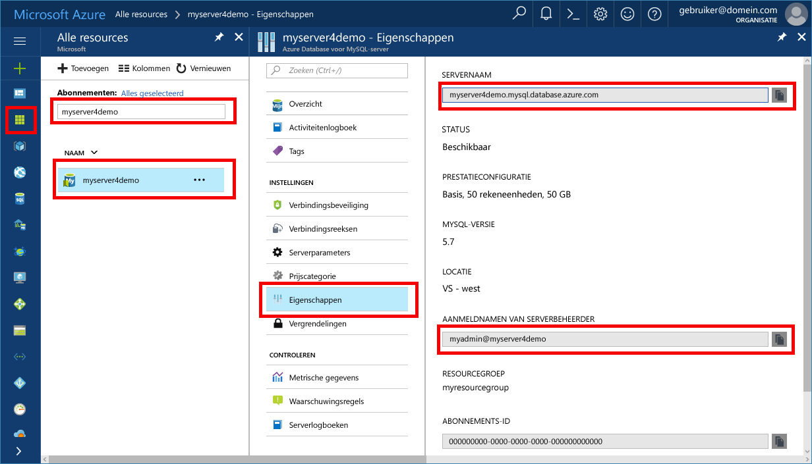

# <a name="azure-database-for-mysql-use-mysql-workbench-to-connect-and-query-data"></a>Azure Database for MySQL: MySQL Workbench gebruiken om verbinding te maken en gegevens op te vragen
In deze quickstart ziet u hoe u met behulp van een MySQL Workbench-toepassing verbinding maakt met een Azure Database for MySQL. 

## <a name="prerequisites"></a>Vereisten
In deze snelstartgids worden de resources die in een van deze handleidingen zijn gemaakt, als uitgangspunt gebruikt:
- [Een Azure-database voor een MySQL-server maken met behulp van Azure Portal](./quickstart-create-mysql-server-database-using-azure-portal.md)
- [Een Azure-database voor een MySQL-server maken met behulp van Azure CLI](./quickstart-create-mysql-server-database-using-azure-cli.md)

## <a name="install-mysql-workbench"></a>MySQL Workbench installeren
MySQL Workbench downloaden en installeren op de computer vanaf de [MySQL-website](https://dev.mysql.com/downloads/workbench/).

## <a name="get-connection-information"></a>Verbindingsgegevens ophalen
Haal de verbindingsgegevens op die nodig zijn om verbinding te maken met de Azure Database voor MySQL. U hebt de volledig gekwalificeerde servernaam en aanmeldingsreferenties nodig.

1. Meld u aan bij [Azure Portal](https://portal.azure.com/).

2. Klik in het menu aan de linkerkant in Azure Portal op **Alle resources** en ga naar de server die u hebt gemaakt (bijvoorbeeld **myserver4demo**).

3. Klik op de servernaam.

4. Selecteer de pagina **Eigenschappen** van de server en noteer vervolgens de **Servernaam** en de **Aanmeldingsnaam van de serverbeheerder**.

 
 
5. Als u uw aanmeldingsgegevens voor de server bent vergeten, gaat u naar de pagina **Overzicht** om de aanmeldingsnaam van de serverbeheerder weer te geven en indien nodig het wachtwoord opnieuw in te stellen.

## <a name="connect-to-the-server-by-using-mysql-workbench"></a>Verbinding maken met de server met MySQL Workbench 
Verbinding maken met Azure MySQL Server met behulp van het GUI-hulpprogramma MySQL Workbench:

1.  Start de toepassing MySQL Workbench op de computer. 

2.  Voer in het dialoogvenster **Nieuwe verbinding instellen** de volgende gegevens in op het tabblad **Parameters**:

    

    | **Instelling** | **Voorgestelde waarde** | **Beschrijving van veld** |
    |---|---|---|
    |   Verbindingsnaam | Demo-verbinding | Geef een label op voor deze verbinding. |
    | Verbindingsmethode | Standard (TCP/IP) | Standard (TCP/IP) is voldoende. |
    | Hostnaam | *servernaam* | Geef de waarde van de servernaam op die u hebt gebruikt toen u de Azure Database voor MySQL-server eerder hebt gemaakt. De server in ons voorbeeld is myserver4demo.mysql.database.azure.com. Gebruik de FQDN (Fully Qualified Domain Name) (\*.mysql.database.azure.com) zoals weergegeven in het voorbeeld. Volg de stappen in de vorige sectie om de verbindingsgegevens op te halen als u de servernaam bent vergeten.  |
    | Poort | 3306 | Gebruik altijd poort 3306 bij het verbinden met Azure Database voor MySQL. |
    | Gebruikersnaam |  *aanmeldnaam van serverbeheerder* | Typ de gebruikersnaam van de serverbeheerder die u hebt opgegeven toen u de Azure Database voor MySQL-server eerder hebt gemaakt. De gebruikersnaam in ons voorbeeld is myadmin@myserver4demo. Volg de stappen in de vorige sectie om de verbindingsgegevens op te halen als u de gebruikersnaam bent vergeten. De indeling is *username@servername*.
    | Wachtwoord | Uw wachtwoord | Klik op de knop **Opslaan in de kluis...** om het wachtwoord op te slaan. |

3.   Klik op **Verbinding testen** om te controleren of alle parameters juist zijn geconfigureerd. 

4.   Klik op **OK** om de verbinding op te slaan. 

5.   Klik in de lijst met **MySQL Connections** op de tegel die voor uw server is bedoeld en wacht tot de verbinding tot stand is gebracht.

        Er wordt een nieuw SQL-tabblad geopend met een lege editor waar u uw query's kunt typen.
    
        > [!NOTE]
        > Standaard wordt SSL-verbindingsbeveiliging vereist. Deze wordt afgedwongen op uw Azure Database for MySQL-server. Hoewel er gewoonlijk geen aanvullende configuratie met SSL-certificaten is vereist om MySQL Workbench verbinding met de server te laten maken, verdient het aanbeveling de SSL CA-certificering te binden aan MySQL Workbench. Zie [Configure SSL connectivity in your application to securely connect to Azure Database for MySQL](./howto-configure-ssl.md) (SSL-connectiviteit in uw toepassing configureren om veilig verbinding te maken met Azure-database voor MySQL) voor meer informatie over het downloaden en binden van de certificering.  Als u SSL wilt uitschakelen, gaat u naar Azure Portal en klikt u op de pagina Verbindingsbeveiliging om de wisselknop SSL-verbinding afdwingen op Uit te zetten.

## <a name="create-a-table-insert-data-read-data-update-data-delete-data"></a>Tabel maken, gegevens invoegen, gegevens lezen, gegevens bijwerken, gegevens verwijderen
1. Kopieer de SQL-voorbeeldcode en plak deze in een leeg SQL-tabblad om enkele voorbeeldgegevens te illustreren.

    Met deze code wordt een lege database gemaakt met de naam quickstartdb. Vervolgens wordt er een voorbeeldtabel gemaakt met de naam inventory (voorraad). Er worden een paar rijen ingevoegd, die vervolgens gelezen worden. De gegevens worden gewijzigd met een update-instructie, waarna de rijen opnieuw worden gelezen. Ten slotte wordt er een rij verwijderd, en worden de rijen opnieuw gelezen.
    
    ```sql
    -- Create a database
    -- DROP DATABASE IF EXISTS quickstartdb;
    CREATE DATABASE quickstartdb;
    USE quickstartdb;
    
    -- Create a table and insert rows
    DROP TABLE IF EXISTS inventory;
    CREATE TABLE inventory (id serial PRIMARY KEY, name VARCHAR(50), quantity INTEGER);
    INSERT INTO inventory (name, quantity) VALUES ('banana', 150);
    INSERT INTO inventory (name, quantity) VALUES ('orange', 154);
    INSERT INTO inventory (name, quantity) VALUES ('apple', 100);
    
    -- Read
    SELECT * FROM inventory;
    
    -- Update
    UPDATE inventory SET quantity = 200 WHERE id = 1;
    SELECT * FROM inventory;
    
    -- Delete
    DELETE FROM inventory WHERE id = 2;
    SELECT * FROM inventory;
    ```

    In de schermopname wordt een voorbeeld getoond van SQL-code in SQL Workbench, alsmede de uitvoer nadat de code is uitgevoerd.
    
    

2. Als u de SQL-code wilt uitvoeren, klikt u op het bliksemstraalpictogram in de werkbalk van het tabblad **SQL File**.
3. Let op de drie tabbladen met resultaten in de sectie **Result Grid** in het midden van de pagina. 
4. Let ook op de lijst **Output** onderaan de pagina. De status van elke opdracht wordt weergegeven. 

U hebt nu verbinding gemaakt met Azure Database for MySQL met behulp van MyQL Workbench en u hebt query's uitgevoerd op gegevens met behulp van de taal SQL.

## <a name="next-steps"></a>Volgende stappen
> [!div class="nextstepaction"]
> [Een database migreren met behulp van Exporteren en importeren](./concepts-migrate-import-export.md)
