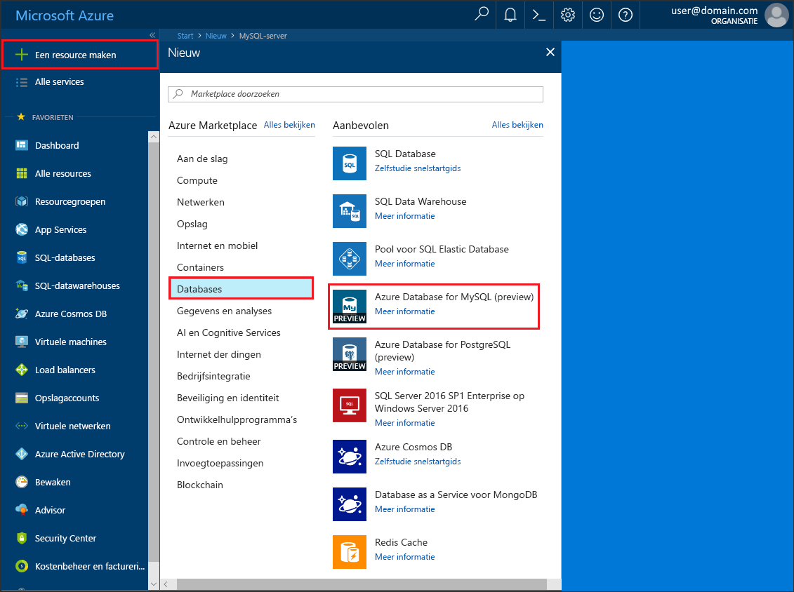
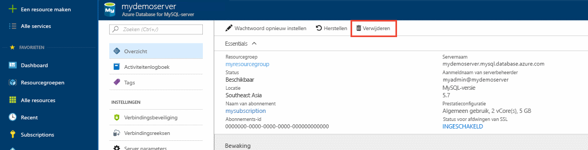

# <a name="create-an-azure-database-for-mysql-server-by-using-the-azure-portal"></a>Een Azure-database voor MySQL-server maken met behulp van Azure Portal
Azure Database voor MySQL is een beheerde service waarmee u MySQL-databases met hoge beschikbaarheid in de cloud kunt uitvoeren, beheren en schalen. In deze Quick Start ontdekt u hoe u in ongeveer vijf minuten een Azure Database voor MySQL-server maakt in Azure Portal.  

Als u nog geen abonnement op Azure hebt, maak dan een [gratis Azure-account](https://azure.microsoft.com/free/) aan voordat u begint.

## <a name="sign-in-to-azure"></a>Aanmelden bij Azure
Open uw webbrowser en ga naar [Azure Portal](https://portal.azure.com/). Voer uw referenties in om u aan te melden bij de portal. De standaardweergave is uw service-dashboard.

## <a name="create-an-azure-database-for-mysql-server"></a>Een Azure-database voor MySQL-server maken
U maakt een Azure Database voor MySQL-server met een gedefinieerde set [reken- en opslagresources](./concepts-compute-unit-and-storage.md). De server wordt gemaakt binnen een [Azure-resourcegroep](../azure-resource-manager/resource-group-overview.md).

Volg deze stappen voor het maken van een Azure Database voor MySQL-server:

1. Selecteer de knop **Nieuw** (+) in de linkerbovenhoek van de portal.

2. Selecteer **Databases** > **Azure Database voor MySQL**. U kunt ook **MySQL** in het zoekvak typen om de service te vinden.

    

4. Vul het formulier voor gegevens van de nieuwe server in met de volgende informatie, zoals in de voorgaande afbeelding wordt weergegeven:

    **Instelling** | **Voorgestelde waarde** | **Beschrijving van veld** 
    ---|---|---
    Servernaam | myserver4demo | Een unieke naam ter identificatie van de Azure Database voor MySQL-server. De domeinnaam *mysql.database.azure.com* wordt toegevoegd aan de naam van de server die u opgeeft. De servernaam mag alleen kleine letters, cijfers en het koppelteken (-) bevatten. en moet 3 tot 63 tekens lang zijn.
    Abonnement | Uw abonnement | Het Azure-abonnement dat u wilt gebruiken voor uw server. Als u meerdere abonnementen hebt, kiest u het abonnement waarin u wordt gefactureerd voor de resource.
    Resourcegroep | myResourceGroup | De naam van een nieuwe of bestaande resourcegroep.
    Aanmeldgegevens van serverbeheerder | myadmin | Een aanmeldingsaccount die moet worden gebruikt om verbinding te maken met de server. De aanmeldingsnaam voor de beheerder kan niet **azure_superuser**, **admin**, **administrator**, **root**, **guest** of **public** zijn.
    Wachtwoord | *Uw keuze* | Een nieuw wachtwoord voor het beheerdersaccount voor de server. Het wachtwoord moet tussen 8 en 128 tekens lang zijn. Uw wachtwoord moet tekens bevatten uit drie van de volgende categorieën: Nederlandse hoofdletters, Nederlandse kleine letters, cijfers (0-9) en niet-alfanumerieke tekens (!, $, #, %, enzovoort).
    Wachtwoord bevestigen | *Uw keuze*| Het bevestigde wachtwoord voor het beheerdersaccount.
    Locatie | *De regio het dichtst bij uw gebruikers*| De locatie die zich het dichtst bij uw gebruikers of andere Azure-toepassingen bevindt.
    Versie | *De nieuwste versie*| De nieuwste versie (tenzij u specifieke vereisten hebt en een andere versie moet gebruiken).
    Prijscategorie | **Basic**, **50 rekeneenheden**, **50 GB** | De servicelaag en het prestatieniveau voor uw database wijzigen. Selecteer de prijscategorie **Basic** op het tabblad bovenaan. Selecteer de linkerkant van de schuifregelaar **Rekeneenheden**, zodat de waarde zo laag mogelijk is voor deze Quick Start. Selecteer **OK** om de geselecteerde prijscategorie op te slaan. Zie de volgende schermafbeelding voor meer informatie.
    Vastmaken aan dashboard | Selecteren | Hiermee kunt u gegevens van uw server overzichtelijk weergeven op de eerste dashboardpagina van Azure Portal.

    > [!IMPORTANT]
    > De beheerdersaanmelding bij de server en het wachtwoord die u hier opgeeft, zijn vereist voor aanmelding bij de server en de bijbehorende databases verderop in deze Quick Start. Onthoud of noteer deze informatie voor later gebruik.
    > 

    

4.  Selecteer **Maken** om de server in te richten. Dit kan maximaal 20 minuten duren.
   
5.  Selecteer **Meldingen** op de werkbalk (pictogram van een klok) om het implementatieproces te bewaken.

## <a name="configure-a-server-level-firewall-rule"></a>Een serverfirewallregel configureren

De service Azure Database voor MySQL maakt een firewall op serverniveau. De firewall voorkomt dat externe toepassingen en hulpprogramma's verbinding maken met de server of databases op de server, tenzij er een firewallregel wordt gemaakt om de firewall te openen voor specifieke IP-adressen. 

1.   Ga naar de server nadat de implementatie is voltooid. U kunt indien nodig naar de server zoeken. Selecteer bijvoorbeeld **Alle resources** in het menu aan de linkerkant. Voer vervolgens de naam van de server in (zoals **myserver4demo** uit het voorbeeld) om te zoeken naar de zojuist gemaakte server. Selecteer de naam van de server in de lijst met zoekresultaten. De pagina **Overzicht** wordt geopend voor uw server en biedt opties voor verdere configuratie.

2. Selecteer **Verbindingsbeveiliging** op de serverpagina.

3.  Selecteer onder de kop **Firewallregels** het lege tekstvak in de kolom **Regelnaam** om te beginnen met het maken van de firewallregel. 

    In deze Quick Start staan we alle IP-adressen toe op de server door in het vak in elke kolom de volgende waarden in te vullen:

    Regelnaam | Start-IP | Eind-IP 
    ---|---|---
    AllowAllIps |  0.0.0.0 | 255.255.255.255

4. Selecteer **Opslaan** op de bovenste werkbalk van de pagina **Verbindingsbeveiliging**. Ga pas verder als u de melding ziet dat de update is voltooid. 

    > [!NOTE]
    > Verbindingen met Azure Database voor MySQL communiceren via poort 3306. Als u verbinding probeert te maken vanuit een bedrijfsnetwerk, wordt uitgaand verkeer via poort 3306 mogelijk niet toegestaan. In dat geval kunt u alleen verbinding maken met uw server als uw IT-afdeling poort 3306 openstelt.
    > 

## <a name="get-the-connection-information"></a>De verbindingsgegevens ophalen
Voor verbinding met uw databaseserver moet u beschikken over de volledige servernaam en aanmeldingsreferenties van de beheerder. U hebt deze waarden mogelijk al eerder in dit artikel genoteerd. Als u dat niet hebt gedaan, kunt u de servernaam en aanmeldingsgegevens eenvoudig terugvinden op de pagina **Overzicht** of  **Eigenschappen** van de server in Azure Portal.

Ga hiervoor als volgt te werk: 

1. Open de pagina **Overzicht** van de server. Noteer de **servernaam** en de **gebruikersnaam van de serverbeheerder**. 

2. Beweeg de muisaanwijzer de cursor over elk veld. Het kopieerpictogram wordt rechts van de tekst weergegeven. Selecteer het kopieerpictogram indien nodig om de waarden te kopiëren.

In dit voorbeeld is de servernaam **myserver4demo.mysql.database.azure.com** en de aanmeldingsgegevens van de serverbeheerder zijn **myadmin@myserver4demo**.

## <a name="connect-to-mysql-by-using-the-mysql-command-line-tool"></a>Verbinding maken met MySQL via het opdrachtregelprogramma mysql
Er zijn verschillende toepassingen die u kunt gebruiken om verbinding te maken met uw Azure Database voor MySQL-server. 

We gaan eerst het opdrachtregelprogramma [mysql](https://dev.mysql.com/doc/refman/5.7/en/mysql.html) gebruiken om te laten zien hoe u verbinding maakt met de server. U kunt ook een webbrowser en Azure Cloud Shell gebruiken zoals hier wordt beschreven zonder dat u extra software hoeft te installeren. Als het hulpprogramma mysql lokaal is geïnstalleerd, kunt u dit ook gebruiken om verbinding te maken.

1. Open Azure Cloud Shell via het terminalpictogram (**>_**) in de rechterbovenhoek van Azure Portal.

2.  Azure Cloud Shell wordt geopend in uw browser, zodat u bash shell-opdrachten kunt invoeren.

    

3. Maak vanaf de Cloud Shell-prompt verbinding met uw Azure Database voor MySQL-server door de mysql-opdrachtregel te typen.

    Gebruik de volgende indeling om verbinding te maken met een Azure Database voor MySQL-server via het hulpprogramma mysql:

    ```bash
    mysql --host <yourserver> --user <server admin login> --password
    ```

    Met de volgende opdracht maakt u bijvoorbeeld verbinding met onze voorbeeldserver:

    ```azurecli-interactive
    mysql --host myserver4demo.mysql.database.azure.com --user myadmin@myserver4demo --password
    ```

    mysql-parameter |Voorgestelde waarde|Beschrijving
    ---|---|---
    --host | *Servernaam* | De servernaam die u eerder hebt gebruikt toen u de Azure Database voor MySQL-server hebt gemaakt. De server in ons voorbeeld is **myserver4demo.mysql.database.azure.com**. Gebruik de FQDN (Fully Qualified Domain Name) (**\*.mysql.database.azure.com**) zoals weergegeven in het voorbeeld. Als u de servernaam niet meer weet, volgt u de stappen in de vorige sectie om de verbindingsgegevens op te halen. 
    --user | *Aanmeldingsnaam van serverbeheerder* |De gebruikersnaam van de serverbeheerder die u hebt opgegeven toen u de Azure Database voor MySQL-server eerder hebt gemaakt. Als u de gebruikersnaam niet meer weet, volgt u de stappen in de vorige sectie om de verbindingsgegevens op te halen. De indeling is *username@servername*.
    --password | *Wacht totdat u hierom wordt gevraagd* |Dit is het wachtwoord dat u hebt opgegeven tijdens het maken van de server. Houd er rekening mee dat de ingevoerde wachtwoordtekens niet worden weergegeven bij de bash-prompt terwijl u de tekens typt. Nadat u het wachtwoord hebt ingevoerd, selecteert u **Enter**.

   Als de verbinding tot stand is gebracht, geeft het hulpprogramma mysql de prompt `mysql>` weer voor het typen van opdrachten. 

   Dit is een voorbeeld van mysql-uitvoer:

    ```bash
    Welcome to the MySQL monitor.  Commands end with ; or \g.
    Your MySQL connection id is 65505
    Server version: 5.6.26.0 MySQL Community Server (GPL)
    
    Copyright (c) 2000, 2017, Oracle and/or its affiliates. All rights reserved.
    
    Oracle is a registered trademark of Oracle Corporation and/or its
    affiliates. Other names may be trademarks of their respective
    owners.

    Type 'help;' or '\h' for help. Type '\c' to clear the current input statement.
    
    mysql>
    ```
    > [!TIP]
    > Als de firewall niet is geconfigureerd voor het toestaan van het IP-adres van Azure Cloud Shell, wordt het volgende foutbericht weergegeven:
    >
    > ERROR 2003 (28000): Client with IP address 123.456.789.0 is not allowed to access the server.
    >
    > U kunt deze fout oplossen door ervoor te zorgen dat de serverconfiguratie overeenkomt met de stappen in de sectie 'Een serverfirewallregel configureren' van het artikel.

4. Controleer of de verbinding werkt door de status van de server weer te geven door `status` te typen bij de prompt mysql>.

    ```sql
    status
    ```

   > [!TIP]
   > Zie [hoofdstuk 4.5.1 in de Engelstalige naslaghandleiding van MySQL 5.7](https://dev.mysql.com/doc/refman/5.7/en/mysql.html) voor aanvullende opdrachten.

5.  Maak een lege database door bij de prompt **mysql>** de volgende opdracht te typen:
    ```sql
    CREATE DATABASE quickstartdb;
    ```
    Het uitvoeren van de opdracht kan even duren. 

    Op een Azure Database voor MySQL-server kunt u een of meerdere databases maken. U kunt kiezen voor het maken van één database per server om gebruik te maken van alle resources of voor meerdere databases om de resources te delen. Er geldt geen limiet voor het aantal databases dat u kunt maken, maar meerdere databases delen wel dezelfde serverresources. 

6. Vraag de databases op bij de prompt **mysql>** door de volgende opdracht te typen:

    ```sql
    SHOW DATABASES;
    ```

7.  Typ `\q` en druk vervolgens op **Enter** om het hulpprogramma mysql af te sluiten. U kunt Azure Cloud Shell sluiten als u klaar bent.

U hebt nu verbinding gemaakt met de Azure Database voor MySQL-server en een lege gebruikersdatabase gemaakt. Ga verder met de volgende sectie voor een vergelijkbare oefening. In de volgende oefening wordt verbinding gemaakt met dezelfde server, maar met behulp van een andere veelgebruikt hulpprogramma, MySQL Workbench.

## <a name="connect-to-the-server-by-using-the-mysql-workbench-gui-tool"></a>Verbinding maken met de server met het GUI-hulpprogramma MySQL Workbench
Als u verbinding met de server wilt maken met behulp van het GUI-hulpprogramma MySQL Workbench, voert u de volgende stappen uit:

1.  Open de toepassing MySQL Workbench op uw clientcomputer. U kunt MySQL Workbench downloaden en installeren vanaf [deze website](https://dev.mysql.com/downloads/workbench/).

2.  Voer in het dialoogvenster **Nieuwe verbinding instellen** de volgende gegevens in op het tabblad **Parameters**:

    

    |Instelling |Voorgestelde waarde|Beschrijving van veld|
    |---|---|---|
     Verbindingsnaam | Demo connection | Een label voor deze verbinding. |
    Verbindingsmethode | Standard (TCP/IP) | Standard (TCP/IP) is voldoende. |
    Hostnaam | *Servernaam* | De servernaam die u hebt gebruikt toen u eerder de Azure Database voor MySQL-server hebt gemaakt. De server in ons voorbeeld is **myserver4demo.mysql.database.azure.com**. Gebruik de FQDN (Fully Qualified Domain Name) (**\*.mysql.database.azure.com**) zoals weergegeven in het voorbeeld. Als u de servernaam niet meer weet, volgt u de stappen in de vorige sectie om de verbindingsgegevens op te halen.|
     Poort | 3306 | De poort om verbinding te maken met uw Azure Database voor MySQL-server. |
    Gebruikersnaam |  *Aanmeldingsnaam van serverbeheerder* | De aanmeldingsgegevens van de serverbeheerder die u hebt opgegeven toen u de Azure Database voor MySQL-server eerder hebt gemaakt. De gebruikersnaam in ons voorbeeld is **myadmin@myserver4demo**. Als u de gebruikersnaam niet meer weet, volgt u de stappen in de vorige sectie om de verbindingsgegevens op te halen. De indeling is *username@servername*.
    Wachtwoord | *Uw wachtwoord* | Selecteer de knop **Opslaan in de kluis...** om het wachtwoord op te slaan. |

3. Selecteer **Verbinding testen** om te controleren of alle parameters juist zijn geconfigureerd. Selecteer ten slotte **OK** om de verbinding op te slaan. 

    > [!NOTE]
    > SSL wordt standaard afgedwongen op uw server. Om verbinding te kunnen maken, is hiervoor aanvullende configuratie nodig. Zie [Configure SSL connectivity in your application to securely connect to Azure Database for MySQL](./howto-configure-ssl.md) (SSL-connectiviteit in uw toepassing configureren om veilig verbinding te maken met Azure-database voor MySQL) voor meer informatie. Als u SSL wilt uitschakelen voor deze Quick Start, gaat u naar Azure Portal. Ga vervolgens naar de pagina Verbindingsbeveiliging om de wisselknop **SSL afdwingen** op Uit te zetten.

## <a name="clean-up-resources"></a>Resources opschonen
De resources die u hebt gemaakt in de Quick Start kunt u op twee manieren opschonen. U kunt de [Azure-resourcegroep](../azure-resource-manager/resource-group-overview.md) verwijderen, met alle resources uit de resourcegroep. Als u de andere resources intact wilt houden, verwijdert u alleen de ene server-resource.

> [!TIP]
> Andere Quick Starts in deze verzameling zijn op deze Quick Start gebaseerd. Als u van plan bent om ook deze Quick Starts te volgen, moet u geen resources opschonen die u in deze Quick Start hebt gemaakt. Als u niet wilt doorgaan, gebruikt u de volgende stappen om alle resources te verwijderen die tijdens deze Quick Start zijn gemaakt.
>

Ga als volgt te werk om de hele resourcegroep te verwijderen, inclusief de nieuwe server:

1.  Zoek de resourcegroep in Azure Portal. Selecteer **Resourcegroepen** in het menu aan de linkerkant en selecteer vervolgens de naam van uw resourcegroep (zoals **myresourcegroup** in ons voorbeeld).

2.  Selecteer **Verwijderen** op de pagina van de resourcegroep. Typ vervolgens de naam van de resourcegroep (zoals **myresourcegroup** uit het voorbeeld) in het tekstvak om het verwijderen te bevestigen en selecteer vervolgens **Verwijderen**.

Ga als volgt te werk om alleen de zojuist gemaakte server te verwijderen:

1.  Zoek de server in Azure Portal als de server nog niet is geopend. Klik in het menu aan de linkerkant van Azure Portal op **Alle resources**. Zoek vervolgens naar de server die u hebt gemaakt.

2.  Selecteer **Verwijderen** op de pagina **Overzicht**. 

    

3.  Controleer de naam van de server die u gaat verwijderen en kijk welke databases eveneens worden verwijderd. Typ de naam van uw server in het vak (zoals **myserver4demo** uit ons voorbeeld). Selecteer **Verwijderen**.

## <a name="next-steps"></a>Volgende stappen

> [!div class="nextstepaction"]
> [Uw eerste Azure-database voor MySQL-database ontwerpen](./tutorial-design-database-using-portal.md)

