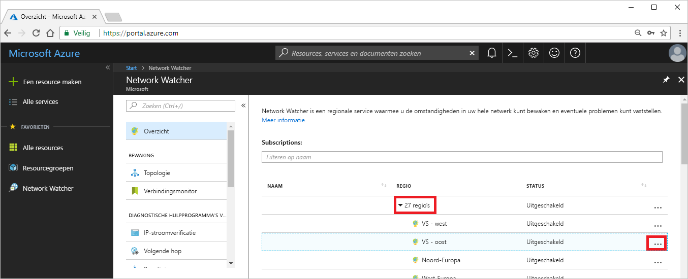

# Zelfstudie: Diagnose van een routeringsprobleem in een netwerk van virtuele machines met behulp van Azure Portal

Wanneer u een virtuele machine (VM) implementeert, maakt Azure verschillende standaardroutes voor de VM. U kunt uw eigen, aangepaste routes maken om de standaardroutes van Azure te overschrijven. Soms kan een aangepaste route tot gevolg hebben dat een VM niet kan communiceren met andere resources. In deze zelfstudie leert u het volgende:

> [!div class="checklist"]
> * Een virtuele machine maken
> * Communicatie naar een URL testen met behulp van de functie Volgende hop van Network Watcher
> * Communicatie naar een IP-adres testen
> * Een diagnose stellen voor een routeringsprobleem en leren hoe u dit kunt oplossen

Als u dat liever doet, kunt u de diagnose van een routeringsprobleem in een netwerk van virtuele machines ook uitvoeren met behulp van [Azure CLI](diagnose-vm-network-routing-problem-cli.md) of [Azure PowerShell](diagnose-vm-network-routing-problem-powershell.md).

Als u nog geen abonnement op Azure hebt, maak dan een [gratis account](https://azure.microsoft.com/free/?WT.mc_id=A261C142F) aan voordat u begint.

## Meld u aan bij Azure.

Meld u aan bij Azure Portal op https://portal.azure.com.

## Een virtuele machine maken

1. Selecteer **+ Een resource maken** in de linkerbovenhoek van Azure Portal.
2. Selecteer **Compute** en selecteer vervolgens **Windows Server 2016 Datacenter** of **Ubuntu Server 17.10 VM**.
3. Voer de volgende informatie in of selecteer deze, accepteer de standaardwaarden voor de overige instellingen en selecteer **OK**:

    |Instelling|Waarde|
    |---|---|
    |Naam|myVm|
    |Gebruikersnaam| Voer een gebruikersnaam naar keuze in.|
    |Wachtwoord| Voer een wachtwoord naar keuze in. Het wachtwoord moet minstens 12 tekens lang zijn en moet voldoen aan de [gedefinieerde complexiteitsvereisten](../virtual-machines/windows/faq.md?toc=%2fazure%2fnetwork-watcher%2ftoc.json#what-are-the-password-requirements-when-creating-a-vm).|
    |Abonnement| Selecteer uw abonnement.|
    |Resourcegroep| Selecteer **Nieuwe maken** en voer **myResourceGroup** in.|
    |Locatie| Selecteer **VS Oost**|

4. Selecteer een grootte voor de virtuele machine en selecteer **Selecteren**.
5. Accepteer onder **Instellingen** alle standaardwaarden en selecteer **OK**.
6. Selecteer onder **Maken** bij **Samenvatting** de optie **Maken** om de implementatie van de virtuele machine te starten. Het implementeren van de VM duurt een paar minuten. Wacht tot de VM is geïmplementeerd voordat u doorgaat met de resterende stappen.

## Netwerkcommunicatie testen

Als u de netwerkcommunicatie wilt testen met Network Watcher, schakelt u eerst een netwerk-watcher in minstens één Azure-regio in, en gebruikt u vervolgens de functie Volgende hop van Network Watcher om de communicatie te testen.

### Netwerk-watcher inschakelen

Als u al een netwerk-watcher hebt ingeschakeld in ten minste één regio, gaat u verder met [Volgende hop gebruiken](#use-next-hop).

1. Selecteer in de portal de optie **Alle services**. Typ *Network Watcher* in het vak **Filteren**. Selecteer **Network Watcher** in de resultaten.
2. Selecteer **Regio's** om dit item uit te vouwen en selecteer vervolgens **...** rechts van **VS - oost**, zoals wordt weergegeven in de volgende afbeelding:

    

3. Selecteer **Network Watcher inschakelen**.

### Volgende hop gebruiken

Azure maakt automatisch routes naar standaardbestemmingen. U kunt uw eigen, aangepaste routes maken om die standaardroutes te overschrijven. Soms hebben aangepaste routes tot gevolg dat de communicatie mislukt. Gebruik de functie Volgende hop van Network Watcher om te bepalen welke route Azure gebruikt om verkeer te routeren.

1. Selecteer in Azure Portal **Volgende hop** onder **Network Watcher**.
2. Selecteer uw abonnement, typ of selecteer de volgende waarden en selecteer vervolgens **Volgende hop**, zoals wordt weergegeven in de onderstaande afbeelding:

    |Instelling                  |Waarde                                                   |
    |---------                |---------                                               |
    | Resourcegroep          | Selecteer myResourceGroup                                 |
    | Virtuele machine         | Selecteer myVm                                            |
    | Netwerkinterface       | myvm - uw netwerkinterface kan een andere naam hebben.   |
    | IP-adres van bron       | 10.0.0.4                                               |
    | IP-adres van doel  | 13.107.21.200 - een van de adressen voor www.bing.com. |

    

    Na enkele seconden ziet u de melding dat het volgende hoptype **Internet** is, en dat de waarde voor **Routetabel-id** **System Route** is. U weet nu dat er een geldige systeemroute naar de bestemming is.

3. Wijzig de waarde voor **IP-adres van doel** in *172.31.0.100* en selecteer nogmaals **Volgende hop**. In het resultaat ziet u de waarde **Geen** bij **Volgend hoptype**, en dat **Routetabel-id** ook hier **System Route** is. Hieruit kunt u afleiden dat er wel een geldige systeemroute is naar de bestemming, maar dat er geen volgende hop is voor het routeren van het verkeer naar de bestemming.

## Details van een route weergeven

1. Als u de route verder wilt analyseren, bekijkt u de effectieve routes voor de netwerkinterface. Typ in het zoekvak boven aan de portal *myvm* (of een andere naam voor de netwerkinterface die u hebt gecontroleerd). Als **myvm** wordt weergegeven in de zoekresultaten, selecteert u de naam.
2. Selecteer **Effectieve routes** onder **ONDERSTEUNING EN PROBLEEMOPLOSSING**, zoals wordt weergegeven in de volgende afbeelding:

    

    Tijdens het uitvoeren van de test met 13.107.21.200 als waarde voor [IP-adres van doel](#use-next-hop), werd de route met het adresvoorvoegsel 0.0.0.0/0 gebruikt voor het routeren van verkeer naar het adres, aangezien geen enkele andere route het adres bevat. De standaardinstelling is dat alle adressen die niet zijn opgegeven in het adresvoorvoegsel van een andere route, worden doorgestuurd naar internet.

    Bij het uitvoeren van de test met het adres 172.31.0.100 kreeg u echter de melding dat er geen volgend hoptype was gevonden. Zoals u kunt zien in de vorige afbeelding, is er wel een standaardroute naar het voorvoegsel 172.16.0.0/12, waaronder het adres 172.31.0.100 valt, maar is de waarde voor **VOLGEND HOPTYPE** **Geen**. Azure maakt een standaardroute naar 172.16.0.0/12, maar stelt geen volgend hoptype in, tenzij daar een reden voor is. Als u bijvoorbeeld het adresbereik 172.16.0.0/12 hebt toegevoegd aan de adresruimte van het virtuele netwerk, wijzigt Azure de waarde van **VOLGEND HOPTYPE** in **Virtueel netwerk** voor de route. Bij een volgende test wordt dan **Virtueel netwerk** weergegeven bij **VOLGEND HOPTYPE**.

## Resources opschonen

U kunt de resourcegroep en alle gerelateerde resources die deze bevat verwijderen wanneer u deze niet meer nodig hebt:

1. Voer *myResourceGroup* in het vak **Zoeken** bovenaan de portal in. Wanneer u **myResourceGroup** ziet in de zoekresultaten, selecteert u deze.
2. Selecteer **Resourcegroep verwijderen**.
3. Voer *myResourceGroup* in voor **TYP DE RESOURCEGROEPNAAM:** en selecteer **Verwijderen**.

## Volgende stappen

In deze zelfstudie hebt u een VM gemaakt en een diagnose uitgevoerd van netwerkroutering vanaf de VM. U hebt geleerd dat Azure verschillende standaardroutes maakt en u hebt de routering naar twee verschillende bestemmingen getest. Lees hier meer over [routering in Azure](../virtual-network/virtual-networks-udr-overview.md?toc=%2fazure%2fnetwork-watcher%2ftoc.json) en hoe u [aangepaste routes maakt](../virtual-network/manage-route-table.md?toc=%2fazure%2fnetwork-watcher%2ftoc.json#create-a-route).

Voor uitgaande VM-verbindingen kunt u ook de latentie bepalen, evenals toegestaan en geweigerd netwerkverkeer tussen de VM en een eindpunt, en de route die wordt gebruikt naar een eindpunt. Hiervoor gebruikt u de functie [Problemen met de verbinding oplossen](network-watcher-connectivity-portal.md) van Network Watcher. Leer hoe u de communicatie tussen een VM en een eindpunt kunt controleren, zoals een IP-adres of URL, met de functie Problemen met de verbinding oplossen van Network Watcher.

> [!div class="nextstepaction"]
> [Een netwerkverbinding controleren](connection-monitor.md)