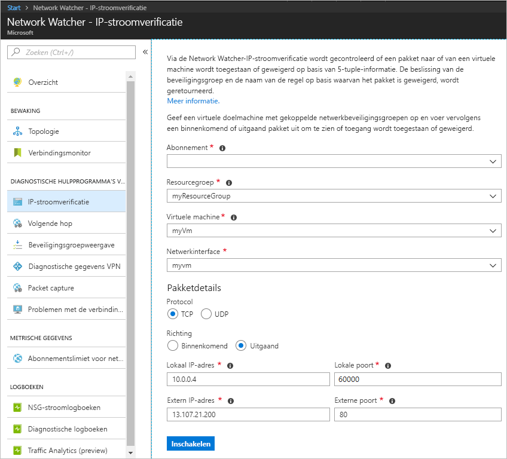
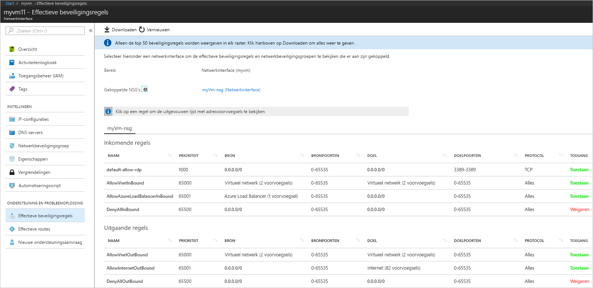
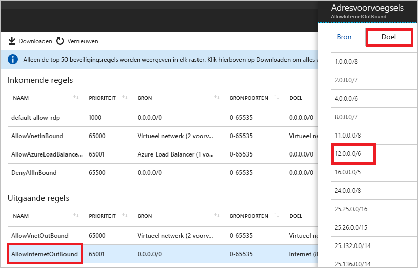

# Quickstart: Diagnose uitvoeren voor een probleem met netwerkverkeersfilters op een virtuele machine met behulp van de Azure-portal

In deze snelstart implementeert u een VM (virtuele machine) en controleert u vervolgens de communicatie naar een IP-adres en URL, en vanaf een IP-adres. U stelt de oorzaak van mislukte communicatie vast en leert hoe u dit probleem kunt oplossen.

Als u nog geen abonnement op Azure hebt, maak dan een [gratis account](https://azure.microsoft.com/free/?WT.mc_id=A261C142F) aan voordat u begint.

## Meld u aan bij Azure.

Meld u aan bij Azure Portal op https://portal.azure.com.

## Een virtuele machine maken

1. Selecteer **+ Een resource maken** in de linkerbovenhoek van Azure Portal.
2. Selecteer **Compute** en selecteer **Windows Server 2016 Datacenter** of een versie van **Ubuntu Server**.
3. Voer de volgende informatie in of selecteer deze, accepteer de standaardwaarden voor de overige instellingen en selecteer **OK**:

    |Instelling|Waarde|
    |---|---|
    |Naam|myVm|
    |Gebruikersnaam| Voer een gebruikersnaam naar keuze in.|
    |Wachtwoord| Voer een wachtwoord naar keuze in. Het wachtwoord moet minstens 12 tekens lang zijn en moet voldoen aan de [gedefinieerde complexiteitsvereisten](../virtual-machines/windows/faq.md?toc=%2fazure%2fnetwork-watcher%2ftoc.json#what-are-the-password-requirements-when-creating-a-vm).|
    |Abonnement| Selecteer uw abonnement.|
    |Resourcegroep| Selecteer **Nieuwe maken** en voer **myResourceGroup** in.|
    |Locatie| Selecteer **VS Oost**|

4. Selecteer een grootte voor de virtuele machine en selecteer **Selecteren**.
5. Accepteer onder **Instellingen** alle standaardwaarden en selecteer **OK**.
6. Selecteer onder **Maken** bij **Samenvatting** de optie **Maken** om de implementatie van de virtuele machine te starten. Het implementeren van de VM duurt een paar minuten. Wacht tot de VM is geïmplementeerd voordat u doorgaat met de resterende stappen.

## Netwerkcommunicatie testen

Als u de netwerkcommunicatie wilt testen met Network Watcher, moet u eerst een netwerk-watcher inschakelen in minstens één Azure-regio. Gebruik vervolgens de functie IP-stroomverificatie in Network Watcher.

### Netwerk-watcher inschakelen

Als u al een netwerk-watcher hebt ingeschakeld in minstens één regio, gaat u verder met [IP-stroomverificatie gebruiken](#use-ip-flow-verify).

1. Selecteer in de portal de optie **Alle services**. Typ *Network Watcher* in het vak **Filteren**. Selecteer **Network Watcher** in de resultaten.
2. Schakel een netwerk-watcher in de regio US - oost in, omdat dat de regio is waarin de VM is geïmplementeerd in de vorige stap. Selecteer **Regio's** om dit item uit te vouwen en selecteer vervolgens **...** rechts van **US - oost**, zoals wordt weergegeven in de volgende afbeelding:

    

3. Selecteer **Network Watcher inschakelen**.

### IP-stroomverificatie gebruiken

Als u een VM maakt, wordt netwerkverkeer van en naar de VM standaard toegestaan en geweigerd in Azure. U kunt de standaardinstellingen in Azure later negeren en extra typen verkeer toestaan en weigeren.

1. Selecteer in de portal de optie **Alle services**. Voer *Network Watcher* in het vak **Alle services** *Filter* in. Selecteer **Network Watcher** in de resultaten.
2. Selecteer **IP-stroomverificatie** onder **DIAGNOSTISCHE HULPPROGRAMMA’S VOOR NETWERK**.
3. Selecteer uw abonnement, typ of selecteer de volgende waarden, en selecteer vervolgens **Controleren**, zoals wordt weergegeven in de onderstaande afbeelding:

    |Instelling            |Waarde                                                                                              |
    |---------          |---------                                                                                          |
    | Resourcegroep    | Selecteer myResourceGroup                                                                            |
    | Virtuele machine   | Selecteer myVm                                                                                       |
    | Netwerkinterface | myvm - De naam van de netwerkinterface die is gemaakt in de portal toen u de VM maakte, wijkt af. |
    | Protocol          | TCP                                                                                               |
    | Richting         | Uitgaand                                                                                          |
    | Lokaal IP-adres  | 10.0.0.4                                                                                          |
    | Lokale poort      | 60000                                                                                                |
    | Extern IP-adres | 13.107.21.200 - Een van de adressen voor www.bing.com.                                             |
    | Externe poort       | 80                                                                                                |

    

    Na enkele seconden blijkt uit het resultaat dat toegang is toegestaan vanwege een beveiligingsregel met de naam **AllowInternetOutbound**. Toen u de controle uitvoerde, werd met Network Watcher automatisch een netwerk-watcher gemaakt in de regio US - oost, als u een bestaande netwerk-watcher had in een andere regio dan US - oost voordat u de controle uitvoerde.
4. Voltooi stap 3 nogmaals, maar wijzig het **Externe IP-adres** in **172.31.0.100**. Uit het resultaat blijkt dat toegang wordt geweigerd vanwege een beveiligingsregel met de naam **DefaultOutboundDenyAll**.
5. Voltooi stap 3 nogmaals, maar wijzig de **Richting** in **Binnenkomend**, de **Lokale poort** in **80** en de **Externe poort** in **60000**. Uit het resultaat blijkt dat toegang wordt geweigerd vanwege een beveiligingsregel met de naam **DefaultInboundDenyAll**.

Nu u weet op basis van welke beveiligingsregels verkeer van en naar een VM is toegestaan of wordt geweigerd, kunt u bepalen hoe u de problemen wilt oplossen.

## Details van een beveiligingsregel weergeven

1. Als u wilt vaststellen waarom communicatie is toegestaan of wordt geweigerd op basis van de regels in stap 3-5 van [IP-stroomverificatie gebruiken](#use-ip-flow-verify), controleert u de effectieve beveiligingsregels voor de netwerkinterface op de VM. Voer in het zoekvak boven aan de portal *myvm* in. Wanneer de netwerkinterface **myvm** (of eventueel een andere naam van de netwerkinterface) wordt weergegeven in de zoekresultaten, selecteert u deze.
2. Selecteer **Effectieve beveiligingsregels** onder **ONDERSTEUNING EN PROBLEEMOPLOSSING**, zoals wordt weergegeven in de volgende afbeelding:

    

    In stap 3 van [IP-stroomverificatie gebruiken](#use-ip-flow-verify) hebt u geleerd dat de communicatie is toegestaan vanwege de regel **AllowInternetOutbound**. In de vorige afbeelding ziet u dat de **BESTEMMING** voor de regel **Internet** is. Het is niet duidelijk hoe 13.107.21.200, het adres dat u hebt getest in stap 3 van [IP-stroomverificatie gebruiken](#use-ip-flow-verify), is gerelateerd aan **Internet**.
3. Selecteer de regel **AllowInternetOutBound** en selecteer vervolgens **Bestemming**, zoals wordt weergegeven in de volgende afbeelding:

    

    Een van de voorvoegsels in de lijst is **12.0.0.0/6**, dat het bereik met IP-adressen 12.0.0.1-15.255.255.254 bevat. Aangezien 13.107.21.200 zich binnen dit adresbereik bevindt, is uitgaand verkeer toegestaan op basis van de regel **AllowInternetOutBound**. Daarnaast worden in stap 2 geen regels met hogere prioriteit (lagere waarde) weergegeven op basis waarvan deze regel wordt genegeerd. Sluit het vak **Adresvoorvoegsels**. Als u uitgaande communicatie naar 13.107.21.200 wilt weigeren, kunt u een beveiligingsregel met een hogere prioriteit toevoegen op basis waarvan uitgaand verkeer naar het IP-adres wordt geweigerd op poort 80.
4. Toen u het uitgaand verkeer van 172.131.0.100 controleerde in stap 4 van [IP-stroomverificatie gebruiken](#use-ip-flow-verify), ontdekte u dat communicatie wordt geweigerd op basis van de regel **DefaultOutboundDenyAll**. Deze regel is gelijk aan de regel **DenyAllOutBound** die wordt weergegeven in de afbeelding bij stap 2. Op deze afbeelding ziet u **0.0.0.0/0** als de **BESTEMMING**. Op basis van de regel wordt uitgaande communicatie naar 172.131.0.100 geweigerd, omdat het adres zich niet binnen de **BESTEMMING** bevindt van een van de **regels voor uitgaand verkeer** zoals weergegeven in de afbeelding. Als u de uitgaande communicatie wilt toestaan, kunt u een beveiligingsregel toevoegen met een hogere prioriteit, op basis waarvan uitgaand verkeer naar poort 80 is toegestaan voor het adres 172.131.0.100.
5. Toen u het binnenkomende verkeer van 172.131.0.100 controleerde in stap 5 van [IP-stroomverificatie gebruiken](#use-ip-flow-verify), ontdekte u dat communicatie wordt geweigerd op basis van de regel **DefaultInboundDenyAll**. Deze regel is gelijk aan de regel **DenyAllInBound** die wordt weergegeven in de afbeelding bij stap 2. De regel **DenyAllInBound** wordt afgedwongen omdat er geen andere regel met hogere prioriteit bestaat op basis waarvan binnenkomend verkeer van 172.31.0.100 via poort 80 naar de VM is toegestaan. Als u de binnenkomende communicatie wilt toestaan, kunt u een beveiligingsregel met een hogere prioriteit toevoegen, op basis waarvan binnenkomend verkeer van 172.31.0.100 via poort 80 is toegestaan.

Met de controles in deze snelstart is de Azure-configuratie getest. Als de controles onverwachte resultaten retourneren en u nog steeds netwerkproblemen ondervindt, controleert u of er geen firewall is geplaatst tussen de VM en het eindpunt waarmee u communiceert, en of het besturingssysteem op de VM geen firewall heeft waardoor communicatie is toegestaan of wordt geweigerd.

## Resources opschonen

U kunt de resourcegroep en alle gerelateerde resources die deze bevat verwijderen wanneer u deze niet meer nodig hebt:

1. Voer *myResourceGroup* in het vak **Zoeken** bovenaan de portal in. Wanneer u **myResourceGroup** ziet in de zoekresultaten, selecteert u deze.
2. Selecteer **Resourcegroep verwijderen**.
3. Voer *myResourceGroup* in voor **TYP DE RESOURCEGROEPNAAM:** en selecteer **Verwijderen**.

## Volgende stappen

In deze snelstart hebt u een VM gemaakt en diagnose uitgevoerd voor netwerkfilters voor binnenkomend en uitgaand verkeer. U hebt geleerd dat verkeer van en naar een VM kan zijn toegestaan of worden geweigerd op basis van regels voor netwerkbeveiligingsgroepen. Meer informatie over [beveiligingsregels](../virtual-network/security-overview.md?toc=%2fazure%2fnetwork-watcher%2ftoc.json) en het [maken van beveiligingsregels](../virtual-network/manage-network-security-group.md?toc=%2fazure%2fnetwork-watcher%2ftoc.json#create-a-security-rule).

Zelfs als de juiste netwerkverkeersfilters zijn toegepast, kan communicatie naar een VM mislukken, vanwege de configuratie van de routering. Zie [Diagnose uitvoeren voor problemen met VM-routering](diagnose-vm-network-routing-problem.md) voor informatie over het vaststellen van routeringsproblemen met VM-netwerken. Of zie [Problemen met de verbinding oplossen ](network-watcher-connectivity-portal.md) om met één hulpprogramma de problemen vast te stellen met routering van uitgaand verkeer, latentie en verkeersfilters.
