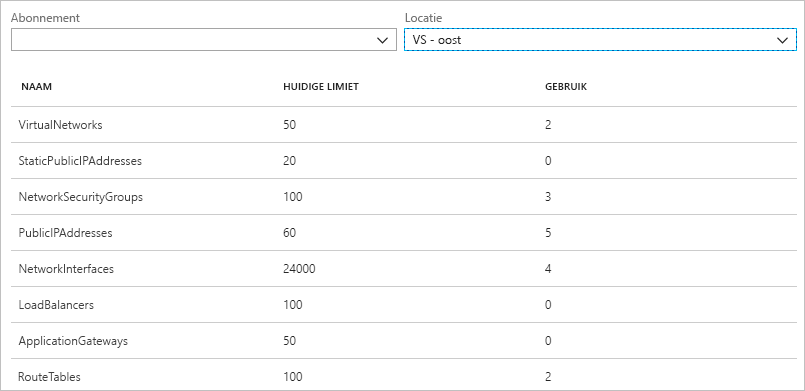
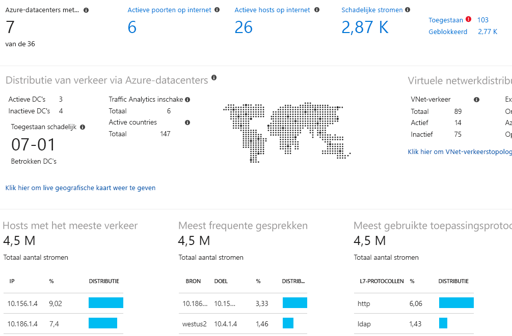

# Wat is Azure Network Watcher?

Azure Network Watcher biedt hulpprogramma's voor het controleren, diagnosticeren en weergeven van metrische gegevens en het in- of uitschakelen van logboekregistratie voor resources in een virtueel Azure-netwerk.

## Bewaking

### De communicatie tussen een virtuele machine en een eindpunt bewaken

Eindpunten kunnen een andere virtuele machine (VM), een volledig gekwalificeerde domeinnaam (FQDN), een uniform resource identifier (URI) of een IPv4-adres zijn. De *verbindingsmonitor* controleert regelmatig de communicatie en informeert u over wijzigingen in bereikbaarheid, latentie en de netwerktopologie tussen de virtuele machine en het eindpunt. U hebt bijvoorbeeld een webserver-VM die communiceert met een databaseserver-VM. Iemand in uw organisatie kan zonder dat u het weet een aangepaste route of netwerkbeveiligingsregel toepassen op de webserver- of databaseserver-VM of het subnet.

Als een eindpunt onbereikbaar wordt, wordt u geïnformeerd over de reden. Mogelijke oorzaken zijn een probleem met de DNS-naamomzetting, de CPU, het geheugen of de firewall binnen het besturingssysteem van een virtuele machine of het hoptype van een aangepaste route of beveiligingsregel voor de virtuele machine of een subnet van de uitgaande verbinding. Meer informatie over [beveiligingsregels](../virtual-network/security-overview.md?toc=%2fazure%2fnetwork-watcher%2ftoc.json#security-rules) en [hoptypen van routes](../virtual-network/virtual-networks-udr-overview.md?toc=%2fazure%2fnetwork-watcher%2ftoc.json) in Azure.

De verbindingsmonitor biedt ook de minimale, gemiddelde en maximale latentie waargenomen gedurende een bepaalde periode. Nadat u de latentie voor een verbinding hebt vernomen, kunt u de latentie misschien verminderen door uw Azure-resources te verplaatsen naar andere Azure-regio's. Meer informatie over het bepalen van [relatieve latenties tussen Azure-regio's en internetproviders](#determine-relative-latencies-between-azure-regions-and-internet-service-providers) en het controleren van de communicatie tussen een virtuele machine en een eindpunt met [verbindingsmonitor](connection-monitor.md). Als u liever een verbinding test op een bepaald tijdstip in plaats van in de loop van de tijd (wat u doet met een verbindingsmonitor), gebruikt u in plaats hiervan de functionaliteit voor het [oplossen van verbindingsproblemen](#connection-troubleshoot).

Netwerkprestatiemeter is een hybride cloud-gebaseerde oplossing voor netwerkcontrole die u helpt de prestaties van het netwerk tussen verschillende punten in uw netwerkinfrastructuur te bewaken. Daarnaast kunt u hiermee de netwerkverbinding met de service en toepassingseindpunten bewaken, evenals de prestaties van Azure ExpressRoute. Netwerkprestatiemeter detecteert netwerkproblemen, zoals verkeer dat in een zwart gat verdwijnt, routeringsfouten en problemen die niet worden gedetecteerd door conventionele controlemethoden. De oplossing genereert waarschuwingen en waarschuwt u als een drempelwaarde voor een netwerkverbinding wordt overschreden. Bovendien worden problemen met de netwerkprestaties tijdig gedetecteerd en wordt de oorzaak van het probleem op een bepaald netwerksegment of apparaat opgespoord. Lees meer over [Netwerkprestatiemeter](../log-analytics/log-analytics-network-performance-monitor.md?toc=%2fazure%2fnetwork-watcher%2ftoc.json).

### Resources in een virtueel netwerk en hun relaties weergeven

Wanneer resources worden toegevoegd aan een virtueel netwerk, kan het moeilijker worden om te weten welke resources zich in een virtueel netwerk bevinden en wat hun relatie is met elkaar. Met de *topologiefunctie* kunt u een visueel diagram van de resources in een virtueel netwerk en de relaties tussen de resources genereren. In de volgende afbeelding ziet u een voorbeeld van topologiediagram voor een virtueel netwerk met drie subnetten, twee virtuele machines, netwerkinterfaces, openbare IP-adressen, netwerkbeveiligingsgroepen, routetabellen en de relaties tussen de resources:

U kunt een bewerkbare versie van de afbeelding in SVG-indeling downloaden. Meer informatie over [topologieweergave](view-network-topology.md).

## Diagnostiek

### Problemen diagnosticeren met het filteren van netwerkverkeer naar of vanaf een VM

Wanneer u een VM implementeert, past Azure standaard beveiligingsregels toe op de VM, die verkeer naar of van de VM toestaan of weigeren. U kunt Azure-standaardregels overschrijven of zelf extra regels maken. Op een bepaald moment kan een VM mogelijk niet meer communiceren met andere resources vanwege een beveiligingsregel. De functie *IP-stroom controleren* biedt u de mogelijkheid een bron- en bestemmings-IPv4-adres, een poort, een protocol (TCP of UDP) en een verkeersrichting (inkomend of uitgaand) op te geven. IP-stroomcontrole test vervolgens de communicatie en informeert u als de verbinding slaagt of mislukt. Als de verbinding mislukt, laat de functie IP-stroom controleren u weten welke beveiligingsregel de communicatie heeft toegestaan of geweigerd, zodat u het probleem kunt oplossen. Lees meer over het controleren van de IP-stroom door de zelfstudie [Diagnose uitvoeren voor een probleem met netwerkverkeersfilters op een virtuele machine](diagnose-vm-network-traffic-filtering-problem.md) uit te voeren.

### Problemen met netwerkroutering vanaf een VM diagnosticeren

Wanneer u een virtueel netwerk maakt, maakt Azure verschillende standaard uitgaande routes voor netwerkverkeer. Het uitgaande verkeer van alle resources, zoals virtuele machines, geïmplementeerd in een virtueel netwerk worden gerouteerd op basis van de Azure-standaardroutes. U kunt Azure-standaardroutes overschrijven of zelf extra routes maken. Het is mogelijk dat een VM niet meer met andere resources kan communiceren vanwege een specifieke route. Met de mogelijkheid *Volgende hop* kunt u een IPv4-adres van een bron en een bestemming opgeven. Volgende hop test vervolgens de communicatie en informeert u welk type volgende hop wordt gebruikt voor het routeren van verkeer. U kunt vervolgens een route verwijderen, wijzigen of toevoegen om een routeringsprobleem op te lossen. Meer informatie over de mogelijkheid [Volgende hop](diagnose-vm-network-routing-problem.md).

### Problemen met uitgaande verbindingen vanaf een VM diagnosticeren

Met *Verbindingsproblemen oplossen* kunt u een verbinding tussen een VM en een andere VM, een FQDN-naam, een URI of een IPv4-adres testen. De test retourneert vergelijkbare gegevens als bij het gebruik van de [verbindingsmonitor](#connection-monitor), maar test de verbinding op een bepaald tijdstip in plaats van de verbinding in de loop van de tijd te controleren, zoals het geval is bij de verbindingsmonitor. Meer informatie over het oplossen van verbindingen met [Verbindingsproblemen oplossen](network-watcher-connectivity-overview.md).

### Pakketten van en naar een VM vastleggen

Geavanceerde filteropties en verfijnde besturingselementen, zoals de mogelijkheid om tijd- en groottebeperkingen in te stellen, bieden flexibiliteit. De vastgelegde gegevens kunnen worden opgeslagen in Azure Storage, op de schijf van de VM of beide. Vervolgens kunt u het opnamebestand analyseren met verschillende standaardtools voor het analyseren van vastgelegde gegevens. Meer informatie over [pakketopname](network-watcher-packet-capture-overview.md).

### Problemen met een Azure Virtual Network-gateway en -verbindingen diagnosticeren

Virtuele netwerkgateways bieden connectiviteit tussen on-premises resources en virtuele netwerken in Azure. Het bewaken van gateways en hun verbindingen is essentieel om te zorgen dat de communicatie niet wordt vebroken. *Diagnostische gegevens van VPN* biedt de mogelijkheid om gateways en verbindingen te diagnosticeren. Diagnostische gegevens van VPN analyseert de status van de gateway of gatewayverbinding en leet u weten of een gateway en gatewayverbindingen beschikbaar zijn. Als de gateway of de verbinding niet beschikbaar is, wordt u geïnformeerd over de reden zodat u het probleem kunt oplossen. Lees meer over diagnostische gegevens van een VPN door de zelfstudie [Een probleem vaststellen in de communicatie tussen netwerken](diagnose-communication-problem-between-networks.md) uit te voeren.

### Relatieve latenties tussen Azure-regio's en internetproviders bepalen

U kunt via Network Watcher informatie opvragen over latentie tussen Azure-regio's en van internetproviders. Als u de latenties tussen Azure-regio's en van serviceproviders weet, kunt u Azure-resources implementeren om de reactietijd van het netwerk te optimaliseren. Meer informatie over [relatieve latenties](view-relative-latencies.md).

### Beveiligingsregels voor een netwerkinterface weergeven

De effectieve beveiligingsregels voor een netwerkinterface zijn een combinatie van alle beveiligingsregels die worden toegepast op de netwerkinterface en het subnet waarin de netwerkinterface zich bevindt.  De *beveiligingsgroepweergave* toont u alle regels die zijn toegepast op de netwerkinterface, het subnet waarin de netwerkinterface zich bevindt, en het totaal van beide. Wanneer u weet welke regels worden toegepast op een netwerkinterface, kunt u regels toevoegen, verwijderen of wijzigen als deze verkeer toestaan of weigeren en u dit wilt wijzigen. Meer informatie over [beveiligingsgroepweergave](network-watcher-security-group-view-overview.md).

## Metrische gegevens

Er gelden [limieten](../azure-subscription-service-limits.md?toc=%2fazure%2fnetwork-watcher%2ftoc.json#azure-resource-manager-virtual-networking-limits) voor het aantal netwerkresources dat u binnen een Azure-abonnement en -regio kunt maken. Als u deze limieten bereikt, kunt u geen resources meer maken binnen het Azure-abonnement of de Azure-regio. De *Abonnementslimiet voor netwerk* laat zien hoeveel van elke netwerkresource u hebt geïmplementeerd in een abonnement en regio en wat de limiet voor de resource is. In de volgende afbeelding ziet u de gedeeltelijke uitvoer voor netwerkbronnen die zijn geïmplementeerd in de regio US - oost voor een voorbeeldabonnement:

De informatie is nuttig bij het plannen van toekomstige implementaties.

## Logboeken

### Verkeer naar of van een netwerkbeveiligingsgroep analyseren

Netwerkbeveiligingsgroepen (NSG) kunnen inkomend of uitgaand verkeer naar een netwerkinterface in een virtuele machine toestaan of weigeren. Met het *NSG-stroomlogboek* kunt u het IP-adres van de bron en de bestemming, de poort en het protocol vastleggen, en of er verkeer is toegestaan of geweigerd door een NSG. U kunt de logboeken met een aantal hulpprogramma's, zoals Power BI, en met de functie *Verkeersanalyse* analyseren. Verkeersanalyse biedt uitgebreide visualisaties van gegevens die naar NSG-stroomlogboeken worden geschreven. In de volgende afbeelding ziet u enkele gegevens en visualisaties die verkeersanalyse van de gegevens in het NSG-stroomlogboek laat zien:

Lees meer over NSG-stroomlogboeken en het implementeren van [verkeersanalyse](traffic-analytics.md) door de zelfstudie [Logboekregistratie van netwerkverkeer naar en van een virtuele machine met Azure Portal](network-watcher-nsg-flow-logging-portal.md) uit te voeren.

### Diagnostische logboeken voor netwerkresources weergeven

U kunt registratie in diagnoselogboek inschakelen voor Azure-netwerkresources, zoals netwerkbeveiligingsgroepen, openbare IP-adressen, load balancers, gateways van virtuele netwerken en toepassingsgateways. *Registratie in diagnoselogboek* biedt één interface voor het inschakelen en uitschakelen van diagnostische logboeken voor netwerkresources voor elke bestaande netwerkresource die een diagnoselogboek genereert. U kunt de logboeken met diagnostische gegevens weergeven met behulp van hulpprogramma's zoals Microsoft Power BI en Azure Log Analytics. Zie [Azure-netwerkoplossingen in logboekanalyse](../log-analytics/log-analytics-azure-networking-analytics.md?toc=%2fazure%2fnetwork-watcher%2ftoc.json) voor meer informatie over het analyseren van diagnostische logboeken van Azure-netwerk.

## Network Watcher automatisch inschakelen
Wanneer u een virtueel netwerk in uw abonnement maakt of bijwerkt, wordt Network Watcher automatisch ingeschakeld in de regio van uw virtuele netwerk. Het automatisch inschakelen van Network Watcher heeft geen invloed op uw resources en er worden geen kosten in rekening gebracht. Zie [Network Watcher maken](network-watcher-create.md) voor meer informatie.

## Volgende stappen

U hebt nu een overzicht van Azure Network Watcher. Diagnosticeer een veelvoorkomend communicatieprobleem naar en van een virtuele machine met IP-stroom controleren om te beginnen met het gebruik van Network Watcher. Zie de snelstart [Diagnose uitvoeren voor een probleem met netwerkverkeersfilters op een virtuele machine](diagnose-vm-network-traffic-filtering-problem.md) om te leren hoe u dit doet.
