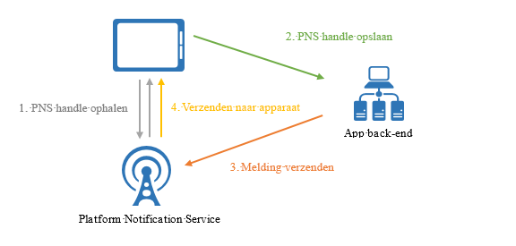
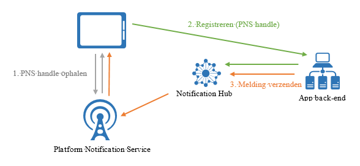

# Wat is Azure Notification Hubs?
Azure Notification Hubs biedt een eenvoudig te gebruiken en uitgeschaalde push-engine waarmee u vanuit elke back-end (cloud of on-premises) meldingen kunt verzenden naar ieder platform (iOS, Android, Windows, Kindle, Baidu, enzovoort). Notification Hubs is zeer geschikt voor zowel bedrijfs- als consumentenscenario's. Enkele voorbeelden:

- Meldingen van belangrijk nieuws met een lage latentie verzenden naar miljoenen gebruikers.
- Coupons op basis van locatie verzenden naar geïnteresseerde gebruikerssegmenten.
- Meldingen voor evenementen verzenden naar gebruikers of groepen voor bijvoorbeeld media-, sport- en financiële toepassingen.
- Aanbiedingen pushen naar toepassingen om klanten te benaderen en werven.
- Gebruikers van bedrijfsgebeurtenissen op de hoogte stellen, zoals nieuwe berichten en werkitems.
- Codes verzenden voor meervoudige verificatie.

## Wat zijn pushmeldingen?
Pushmeldingen zijn een vorm van app-naar-gebruiker communicatie waarbij gebruikers van mobiele apps op de hoogte worden gesteld van bepaalde gewenste informatie, meestal in een pop-upvenster of dialoogvenster. Gebruikers kunnen meestal kiezen of ze het bericht willen weergeven of verwijderen. In het eerste geval wordt de mobiele toepassing geopend die de melding heeft gecommuniceerd.

Pushmeldingen zijn essentieel voor consumenten-apps om de betrokkenheid en het gebruik te vergroten. Voor zakelijke apps zijn ze belangrijk om actuele bedrijfsgegevens te communiceren. Het is de beste app-naar-gebruiker communicatie omdat het energie-efficiënt is voor mobiele apparaten, flexibel voor de afzenders en beschikbaar wanneer de bijbehorende toepassingen niet actief zijn.

Zie de volgende onderwerpen voor meer informatie over pushmeldingen voor enkele populaire platforms: 
* [iOS](https://developer.apple.com/notifications/)
* [Android](https://developer.android.com/guide/topics/ui/notifiers/notifications.html)
* [Windows](http://msdn.microsoft.com/library/windows/apps/hh779725.aspx)

## Hoe werken pushmeldingen?
Pushmeldingen worden bezorgd via platformspecifieke infrastructuren, *PNS (Platform Notification System)* genoemd. Ze bieden essentiële pushfunctionaliteit voor het bezorgen van een bericht op een apparaat met een opgegeven ingang, en hebben geen algemene interface. Om een melding te verzenden naar alle klanten via de iOS-, Android- en Windows-versies van een app, moet de ontwikkelaar gebruikmaken van APNs (Apple Push Notification service), FCM (Firebase Cloud Messaging) en WNS (Windows Notification Service).

Dit zijn de algemene stappen voor het verzenden van pushberichten:

1. In de client-app wordt ingesteld dat er meldingen moeten worden verstuurd. Hiervoor wordt contact opgenomen met het bijbehorende PNS om een unieke en tijdelijke push-ingang op te vragen. Het type ingang is afhankelijk van het systeem (zo maakt WNS gebruik van URI's, terwijl APNs werkt met tokens).
2. De client-app slaat deze ingang op in de back-end of provider van de app.
3. Voor het verzenden van een pushmelding neemt de back-end van de app via de ingang contact op met het PNS om een bepaalde client-app te bereiken.
4. De PNS stuurt de melding door naar het apparaat dat is opgegeven door de ingang.

## Aandachtspunten voor pushmeldingen
Platform Notification System zijn krachtig. App-ontwikkelaars moeten echter zelfs voor meer algemene scenario’s voor pushmeldingen nog heel wat werk verrichten om deze te implementeren, bijvoorbeeld voor het broadcasten van pushmeldingen naar gesegmenteerde gebruikers.

Pushmeldingen vereisen een complexe infrastructuur die geen verband houdt met de voornaamste bedrijfslogica van de toepassing. Enkele aandachtspunten voor de infrastructuur:

- **Platformafhankelijkheid**
    - Aangezien de Platform Notification Systems niet uniform zijn, moet de back-end bestaan uit complexe en moeilijk te onderhouden, platformafhankelijke logica om meldingen te kunnen verzenden naar apparaten op verschillende platforms.
- **Schalen**
    - Volgens de PNS-richtlijnen moeten apparaattokens steeds worden vernieuwd als de app wordt gestart. Dit betekent dat de back-end een grote hoeveelheid verkeer en databasetoegang moet verwerken, alleen al om de tokens bij te werken. Wanneer het aantal apparaten groeit tot misschien wel miljoenen, lopen de kosten voor het maken en bijwerken van deze infrastructuur enorm op.
    - De meeste Platform Notification Systems bieden geen ondersteuning voor broadcasten naar meerdere apparaten. Om één bericht te broadcasten naar een miljoen apparaten, zijn een miljoen aanroepen naar de Platform Notification Systems nodig. Het is zeer lastig om een dergelijke hoeveelheid verkeer met een minimale latentie te schalen.
- **Routering** 
    - Hoewel Platform Notification Systems een manier bieden om berichten naar apparaten te verzenden, worden de meeste app-meldingen gericht op bepaalde gebruikers of belangengroepen. In de back-end moet een register worden bijgehouden om apparaten te koppelen aan belangengroepen, gebruikers, eigenschappen, enzovoort. Deze overhead verlengt de implementatietijd en verhoogt de onderhoudskosten van een app.

## Waarom kiezen voor Azure Notification Hubs?
Met Notification Hubs wordt alle complexiteit weggenomen waarmee u te maken krijgt als u zelf pushmeldingen wilt versturen vanuit uw eigen back-end. De uitgeschaalde infrastructuur ondersteunt meerdere platforms, waardoor er minder push-gerelateerde code nodig is en de back-end kan worden vereenvoudigd. Met Notification Hubs hoeven apparaten alleen maar hun PNS-ingangen te registreren bij een hub, terwijl de back-end berichten verstuurt naar gebruikers of belangengroepen, zoals wordt weergegeven in de volgende afbeelding:

Notification Hubs is een gebruiksklare push-engine met de volgende voordelen:

- **Platformoverschrijdend**
    - Ondersteuning voor alle belangrijke push-platforms, waaronder iOS, Android, Windows, en Kindle en Baidu.
    - Een algemene interface om te pushen naar alle platforms in platformspecifieke of platformonafhankelijk indelingen zonder platformspecifieke taken.
    - Beheer van apparaatingang op één plaats.
- **Ondersteuning voor verschillende back-ends**
    - Cloud of on-premises
    - .NET, Node.js, Java, enzovoort.
- **Veel verschillende bezorgingsmethoden**
    - Broadcasten naar een of meer platforms: u kunt met één API-aanroep direct broadcasten naar miljoenen apparaten op verschillende platforms.
    - Pushen naar apparaat: u kunt meldingen op afzonderlijke apparaten richten.
    - Pushen naar gebruiker: met behulp van tags en sjablonen kunt u alle apparaten van een gebruiker op meerdere platforms bereiken.
    - Pushen naar segment met dynamische tags: met behulp van tags of labels kunt u apparaten onderverdelen in segmenten en vervolgens alleen naar een bepaald segment pushen of naar meerdere segmenten door een expressie te gebruiken (bijvoorbeeld actief AND woont in Apeldoorn NOT nieuwe gebruiker). U bent niet beperkt tot pub sub, maar kunt tags van apparaten altijd en overal bijwerken.
    - Gelokaliseerd pushen: met behulp van sjablonen kunt u lokalisatie toepassen zonder dat de code voor de back end hoeft te worden gewijzigd.
    - Pushen op de achtergrond: u kunt het push-naar-pull-patroon inschakelen door op de achtergrond meldingen te verzenden naar apparaten en deze zo opdracht te geven om bepaalde pulls of acties te voltooien.
    - Gepland pushen: u kunt een schema opstellen om meldingen op elk gewenst moment te verzenden.
    - Direct pushen: u kunt het registreren van apparaten bij de Notification Hubs-service overslaan en rechtstreeks batchgewijs pushen naar een lijst met apparaatingangen.
    - Gepersonaliseerd pushen: push-variabelen voor apparaten maken het mogelijk om apparaatspecifieke, gepersonaliseerde pushmeldingen te verzenden met aangepaste sleutel-waardeparen.
- **Uitgebreide telemetrie**
    - Er zijn via Azure Portal en programmacode telemetriegegevens beschikbaar voor pushen, apparaten, fouten en bewerkingen.
    - Via de functie voor het bijhouden van telemetrie per bericht kunt u elk pushbericht volgen vanaf de eerste aanvraag tot het moment dat de Notification Hubs-service de pushberichten via een batchverwerking verstuurt.
    - Met de functie Feedback van Platform Notification System wordt alle feedback van Platform Notification Systems gecommuniceerd om te helpen bij foutopsporing.
- **Schaalbaarheid** 
    - U kunt snel berichten versturen naar miljoenen apparaten zonder dat u de architectuur hoeft aan te passen of sharding hoeft toe te passen.
- **Beveiliging**
    - Shared Access Secret (SAS) of federatieve verificatie.

## Integratie met App Service Mobile Apps
Voor een naadloze werking van alle Azure-services biedt [App Service Mobile Apps](../app-service-mobile/app-service-mobile-value-prop.md) ingebouwde ondersteuning voor pushmeldingen via Notification Hubs. Met [App Service Mobile Apps](../app-service-mobile/app-service-mobile-value-prop.md) kunnen ontwikkelaars van ondernemingen en systeemintegrators gebruikmaken van een zeer schaalbaar, algemeen beschikbaar ontwikkelplatform voor mobiele toepassingen, dat uitgebreide mogelijkheden biedt voor ontwikkelaars van mobiele apps.

Mobiele apps van ontwikkelaars kunnen gebruikmaken van Notification Hubs in de volgende werkstroom:

1. PNS-ingang van het apparaat ophalen
2. Apparaat registreren bij Notification Hubs via de handige registratie-API uit de Client-SDK van Mobile Apps

    > [!NOTE]
    > Om beveiligingsreden worden alle tags op registraties door mobiele apps verwijderd. Gebruik Notification Hubs om vanuit de back-end rechtstreeks tags aan apparaten koppelen.
1. Meldingen verzenden vanuit de back-end van uw app met Notification Hubs

Hier zijn een aantal voordelen voor ontwikkelaars:

- **Client-SDK's van Mobile Apps**: deze SDK's voor meerdere platforms bieden eenvoudige API's voor de registratie en het contact met de meldingshub die automatisch aan de mobiele app is gekoppeld. Ontwikkelaars hoeven niet op zoek naar de aanmeldgegevens voor Notification Hubs of met een extra service te werken.
    - *Pushen naar gebruiker*: de SDK's coderen een apparaat automatisch met de geverifieerde gebruikers-id van de mobiele app om het verzenden van pushberichten mogelijk te maken.
    - *Pushen naar apparaat*: de SDK's gebruiken de installatie-id van een mobiele app automatisch als GUID om te registreren bij Notification Hubs. Hierdoor is het niet meer nodig om meerdere service-GUID's bij te houden.
- **Installatiemodel**: mobiele apps werken met het meest recente pushmodel van Notification Hubs. Hierdoor zijn alle pusheigenschappen beschikbaar die aan een apparaat zijn gekoppeld in een JSON-installatie, die aansluit op de Push Notification Services en eenvoudig te gebruiken is.
- **Flexibiliteit**: ontwikkelaars kunnen altijd beslissen om rechtstreeks met Notification Hubs te werken, zelfs na integratie.
- **Geïntegreerde ervaring in [Azure Portal](https://portal.azure.com)**: de pushfunctie in mobiele apps is zeer visueel en ontwikkelaars kunnen eenvoudig via mobiele apps met de bijbehorende meldingshub werken.

## Volgende stappen

U kunt zelf een meldingshub maken en gebruiken door de zelfstudie [Aan de slag met Azure Notification Hubs voor Android-apps en Firebase Cloud Messaging](notification-hubs-android-push-notification-google-fcm-get-started.md) te volgen. 

[0]: ./media/notification-hubs-overview/registration-diagram.png

[1]: ./media/notification-hubs-overview/notification-hub-diagram.png

[How customers are using Notification Hubs]: http://azure.microsoft.com/services/notification-hubs

[Notification Hubs tutorials and guides]: http://azure.microsoft.com/documentation/services/notification-hubs

[iOS]: http://azure.microsoft.com/documentation/articles/notification-hubs-ios-get-started

[Android]: http://azure.microsoft.com/documentation/articles/notification-hubs-android-get-started

[Windows Universal]: http://azure.microsoft.com/documentation/articles/notification-hubs-windows-store-dotnet-get-started

[Windows Phone]: http://azure.microsoft.com/documentation/articles/notification-hubs-windows-phone-get-started

[Kindle]: http://azure.microsoft.com/documentation/articles/notification-hubs-kindle-get-started

[Xamarin.iOS]: http://azure.microsoft.com/documentation/articles/partner-xamarin-notification-hubs-ios-get-started

[Xamarin.Android]: http://azure.microsoft.com/documentation/articles/partner-xamarin-notification-hubs-android-get-started

[Microsoft.WindowsAzure.Messaging.NotificationHub]: http://msdn.microsoft.com/library/microsoft.windowsazure.messaging.notificationhub.aspx

[Microsoft.ServiceBus.Notifications]: http://msdn.microsoft.com/library/microsoft.servicebus.notifications.aspx

[App Service Mobile Apps]: https://azure.microsoft.com/documentation/articles/app-service-mobile-value-prop/

[templates]: notification-hubs-templates-cross-platform-push-messages.md

[Azure portal]: https://portal.azure.com

[tags]: (http://msdn.microsoft.com/library/azure/dn530749.aspx)
