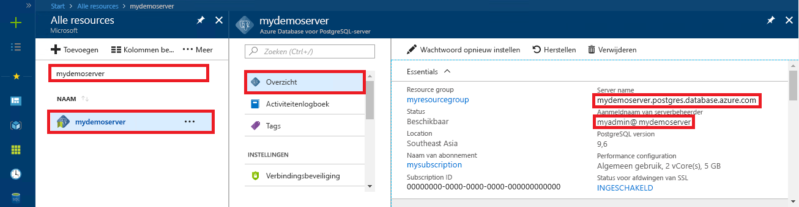

# <a name="azure-database-for-postgresql-use-net-c-to-connect-and-query-data"></a>Azure Database voor PostgreSQL: .NET (C#) gebruiken om verbinding te maken en gegevens op te vragen
In deze snelstartgids ziet u hoe u met behulp van een C#-toepassing verbinding maakt met een Azure Database voor PostgreSQL. U ziet hier hoe u SQL-instructies gebruikt om gegevens in de database op te vragen, in te voegen, bij te werken en te verwijderen. In de stappen van dit artikel wordt ervan uitgegaan dat u bekend bent met het ontwikkelen met C#, maar geen ervaring hebt met het werken met Azure Database voor PostgreSQL.

## <a name="prerequisites"></a>Vereisten
In deze snelstartgids worden de resources die in een van deze handleidingen zijn gemaakt, als uitgangspunt gebruikt:
- [Database maken - Portal](quickstart-create-server-database-portal.md)
- [Database maken - CLI](quickstart-create-server-database-azure-cli.md)

U moet ook het volgende doen:
- [.NET Framework](https://www.microsoft.com/net/download) installeren
- [Visual Studio](https://www.visualstudio.com/downloads/) installeren
- [Npgsql](http://www.npgsql.org/doc/index.html) installeren 

## <a name="install-visual-studio-and-net"></a>Visual Studio en .NET installeren
Voor de stappen in dit gedeelte wordt ervan uitgegaan dat u bekend bent met het ontwikkelen met .NET.

### <a name="windows-net-framework-and-net-core"></a>**Windows .NET Framework en .NET Core**
Visual Studio 2017 Community is een volledig functionele, uitbreidbare en gratis IDE voor het maken van moderne toepassingen voor Android, iOS en Windows, voor web- en databasetoepassingen, en voor cloudservices. U kunt het .NET Framework volledig installeren of alleen .NET Core. De codefragmenten in de Quick Start werken in beide gevallen. Als Visual Studio al is geïnstalleerd op uw computer, kunt u de volgende stappen overslaan.

1. Download het [installatieprogramma voor Visual Studio 2017](https://www.visualstudio.com/thank-you-downloading-visual-studio/?sku=Community&rel=15). 
2. Voer het installatieprogramma uit en volg de weergegeven opdrachten om de installatie te voltooien.

### <a name="mac-os"></a>**Mac OS**
Open de terminal en navigeer naar een map waar u van plan bent een .NET Core-project te maken. Voer de volgende opdrachten in voor het installeren van **Brew**, **OpenSSL** en **.NET Core**. 

```bash
ruby -e "$(curl -fsSL https://raw.githubusercontent.com/Homebrew/install/master/install)"
brew update
brew install openssl
mkdir -p /usr/local/lib
ln -s /usr/local/opt/openssl/lib/libcrypto.1.0.0.dylib /usr/local/lib/
ln -s /usr/local/opt/openssl/lib/libssl.1.0.0.dylib /usr/local/lib/
```

Installeer .NET Core op Mac OS. Download het [officiële installatieprogramma](https://go.microsoft.com/fwlink/?linkid=843444). Met dit installatieprogramma installeert u de hulpprogramma's en plaats u ze op het PAD, zodat u dotnet kunt uitvoeren vanuit de console

### <a name="linux-ubuntu"></a>**Linux (Ubuntu)**
Open de terminal en navigeer naar een map waar u van plan bent een .NET Core-project te maken. Voer de volgende opdrachten in om **.NET Core** te installeren.

```bash
sudo sh -c 'echo "deb [arch=amd64] https://apt-mo.trafficmanager.net/repos/dotnet-release/ xenial main" > /etc/apt/sources.list.d/dotnetdev.list'
sudo apt-key adv --keyserver hkp://keyserver.ubuntu.com:80 --recv-keys 417A0893
sudo apt-get update
sudo apt-get install dotnet-dev-1.0.1
```

## <a name="install-npgsql-references-into-your-visual-studio-solution"></a>Npgsql-verwijzingen installeren in uw Visual Studio-oplossing
Gebruik de open source ADO.Net-bibliotheek Npgsql om vanuit de C#-toepassing verbinding te maken met PostgreSQL. NuGet vergemakkelijkt het downloaden en beheren van de verwijzingen.

1. Maak als volgt een nieuwe C#-oplossing of open een bestaande: 
   - Maak in Visual Studio een oplossing door te klikken op het menu Bestand **Nieuw** > **Project**.
   - In het dialoogvenster Nieuw project vouwt u **Sjablonen** > **Visual C#** uit. 
   - Kies een geschikte sjabloon, bijvoorbeeld **Console-app (.NET Core)**.

2. Gebruik de Nuget Package Manager om Npgsql te installeren:
   - Klik in het menu **Extra** > **NuGet Package Manager** > **Package Manager Console**.
   - Typ `Install-Package Npgsql` in de **Package Manager Console**
   - Met de installatieopdracht worden Npgsql.dll en de bijbehorende assembly's gedownload en als afhankelijkheden toegevoegd in de oplossing.

## <a name="get-connection-information"></a>Verbindingsgegevens ophalen
Haal de verbindingsgegevens op die nodig zijn om verbinding te maken met de Azure Database voor PostgreSQL. U hebt de volledig gekwalificeerde servernaam en aanmeldingsreferenties nodig.

1. Meld u aan bij [Azure Portal](https://portal.azure.com/).
2. Klik in het menu links in Azure Portal op **Alle resources** en zoek de server die u hebt gemaakt (bijvoorbeeld **mypgserver-20170401**).
3. Klik op de servernaam **mypgserver-20170401**.
4. Selecteer de pagina **Overzicht** van de server. Noteer de **servernaam** en de **gebruikersnaam van de serverbeheerder**.
 
5. Als u uw aanmeldingsgegevens voor de server bent vergeten, gaat u naar de pagina **Overzicht** om de aanmeldingsnaam van de serverbeheerder weer te geven en indien nodig het wachtwoord opnieuw in te stellen.

## <a name="connect-create-table-and-insert-data"></a>Verbinden, tabel maken en gegevens invoegen
Gebruik de volgende code om verbinding te maken en de gegevens te laden met de SQL-instructies **CREATE TABLE** EN **INSERT INTO**. In de code wordt de klasse NpgsqlCommand met de methode [Open()](http://www.npgsql.org/api/Npgsql.NpgsqlConnection.html#Npgsql_NpgsqlConnection_Open) gebruikt om een verbinding te maken met PostgreSQL. Vervolgens wordt de methode [CreateCommand()](http://www.npgsql.org/api/Npgsql.NpgsqlConnection.html#Npgsql_NpgsqlConnection_CreateCommand) gebruikt, de eigenschap CommandText ingesteld en de methode [ExecuteNonQuery()](http://www.npgsql.org/api/Npgsql.NpgsqlCommand.html#Npgsql_NpgsqlCommand_ExecuteNonQuery) aangeroepen om de databaseopdrachten uit te voeren. 

Vervang de parameters Host, DBName, User en Password door de waarden die u hebt opgegeven tijdens het maken van de server en database. 

```csharp
using System;
using System.Collections.Generic;
using System.Linq;
using System.Text;
using System.Threading.Tasks;
using Npgsql;

namespace Driver
{
    public class AzurePostgresCreate
    {
        // Obtain connection string information from the portal
        //
        private static string Host = "mypgserver-20170401.postgres.database.azure.com";
        private static string User = "mylogin@mypgserver-20170401";
        private static string DBname = "mypgsqldb";
        private static string Password = "<server_admin_password>";
        private static string Port = "5432";

        static void Main(string[] args)
        {
            // Build connection string using parameters from portal
            //
            string connString =
                String.Format(
                    "Server={0}; User Id={1}; Database={2}; Port={3}; Password={4}; SSL Mode=Prefer; Trust Server Certificate=true",
                    Host,
                    User,
                    DBname,
                    Port,
                    Password);

            var conn = new NpgsqlConnection(connString);

            Console.Out.WriteLine("Opening connection");
            conn.Open();

            var command = conn.CreateCommand();
            command.CommandText = "DROP TABLE IF EXISTS inventory;";
            command.ExecuteNonQuery();
            Console.Out.WriteLine("Finished dropping table (if existed)");

            command.CommandText = "CREATE TABLE inventory (id serial PRIMARY KEY, name VARCHAR(50), quantity INTEGER);";
            command.ExecuteNonQuery();
            Console.Out.WriteLine("Finished creating table");

            command.CommandText =
                String.Format(
                    @"
                                INSERT INTO inventory (name, quantity) VALUES ({0}, {1});
                                INSERT INTO inventory (name, quantity) VALUES ({2}, {3});
                                INSERT INTO inventory (name, quantity) VALUES ({4}, {5});
                            ",
                    "\'banana\'", 150,
                    "\'orange\'", 154,
                    "\'apple\'", 100
                    );

            int nRows = command.ExecuteNonQuery();
            Console.Out.WriteLine(String.Format("Number of rows inserted={0}", nRows));

            Console.Out.WriteLine("Closing connection");
            conn.Close();

            Console.WriteLine("Press RETURN to exit");
            Console.ReadLine();
        }
    }
}
```

## <a name="read-data"></a>Gegevens lezen
Gebruik de volgende code om verbinding te maken en de gegevens te lezen met de SQL-instructie **SELECT**. In de code wordt de klasse NpgsqlCommand met de methode [Open()](http://www.npgsql.org/api/Npgsql.NpgsqlConnection.html#Npgsql_NpgsqlConnection_Open) gebruikt om een verbinding te maken met PostgreSQL. Vervolgens worden de methoden [CreateCommand()](http://www.npgsql.org/api/Npgsql.NpgsqlConnection.html#Npgsql_NpgsqlConnection_CreateCommand) en [ExecuteReader())](http://www.npgsql.org/api/Npgsql.NpgsqlCommand.html#Npgsql_NpgsqlCommand_ExecuteReader) gebruikt om de databaseopdrachten uit te voeren. Daarna wordt [Read()](http://www.npgsql.org/api/Npgsql.NpgsqlDataReader.html#Npgsql_NpgsqlDataReader_Read) gebruikt om naar de records in de resultaten te gaan. Vervolgens wordt in de code [GetInt32()](http://www.npgsql.org/api/Npgsql.NpgsqlDataReader.html#Npgsql_NpgsqlDataReader_GetInt32_System_Int32_) en [GetString()](http://www.npgsql.org/api/Npgsql.NpgsqlDataReader.html#Npgsql_NpgsqlDataReader_GetString_System_Int32_) gebruikt om de waarden in de record te parseren.

Vervang de parameters Host, DBName, User en Password door de waarden die u hebt opgegeven tijdens het maken van de server en database. 

```csharp
using System;
using System.Collections.Generic;
using System.Linq;
using System.Text;
using System.Threading.Tasks;
using Npgsql;

namespace Driver
{
    public class AzurePostgresRead
    {
        // Obtain connection string information from the portal
        //
        private static string Host = "mypgserver-20170401.postgres.database.azure.com";
        private static string User = "mylogin@mypgserver-20170401";
        private static string DBname = "mypgsqldb";
        private static string Password = "<server_admin_password>";
        private static string Port = "5432";

        static void Main(string[] args)
        {
            // Build connection string using parameters from portal
            //
            string connString =
                String.Format(
                    "Server={0}; User Id={1}; Database={2}; Port={3}; Password={4};",
                    Host,
                    User,
                    DBname,
                    Port,
                    Password);

            var conn = new NpgsqlConnection(connString);

            Console.Out.WriteLine("Opening connection");
            conn.Open();

            var command = conn.CreateCommand();
            command.CommandText = "SELECT * FROM inventory;";

            var reader = command.ExecuteReader();
            while (reader.Read())
            {
                Console.WriteLine(
                    string.Format(
                        "Reading from table=({0}, {1}, {2})",
                        reader.GetInt32(0).ToString(),
                        reader.GetString(1),
                        reader.GetInt32(2).ToString()
                        )
                    );
            }

            Console.Out.WriteLine("Closing connection");
            conn.Close();

            Console.WriteLine("Press RETURN to exit");
            Console.ReadLine();
        }
    }
}
```


## <a name="update-data"></a>Gegevens bijwerken
Gebruik de volgende code om verbinding te maken en de gegevens te lezen met de SQL-instructie **UPDATE**. In de code wordt de klasse NpgsqlCommand met de methode [Open()](http://www.npgsql.org/api/Npgsql.NpgsqlConnection.html#Npgsql_NpgsqlConnection_Open) gebruikt om een verbinding te maken met PostgreSQL. Vervolgens wordt de methode [CreateCommand()](http://www.npgsql.org/api/Npgsql.NpgsqlConnection.html#Npgsql_NpgsqlConnection_CreateCommand) gebruikt, de eigenschap CommandText ingesteld en de methode [ExecuteNonQuery()](http://www.npgsql.org/api/Npgsql.NpgsqlCommand.html#Npgsql_NpgsqlCommand_ExecuteNonQuery) aangeroepen om de databaseopdrachten uit te voeren.

Vervang de parameters Host, DBName, User en Password door de waarden die u hebt opgegeven tijdens het maken van de server en database. 

```csharp
using System;
using System.Collections.Generic;
using System.Linq;
using System.Text;
using System.Threading.Tasks;
using Npgsql;

namespace Driver
{
    public class AzurePostgresUpdate
    {
        // Obtain connection string information from the portal
        //
        private static string Host = "mypgserver-20170401.postgres.database.azure.com";
        private static string User = "mylogin@mypgserver-20170401";
        private static string DBname = "mypgsqldb";
        private static string Password = "<server_admin_password>";
        private static string Port = "5432";

        static void Main(string[] args)
        {
            // Build connection string using parameters from portal
            //
            string connString =
                String.Format(
                    "Server={0}; User Id={1}; Database={2}; Port={3}; Password={4};",
                    Host,
                    User,
                    DBname,
                    Port,
                    Password);

            var conn = new NpgsqlConnection(connString);

            Console.Out.WriteLine("Opening connection");
            conn.Open();

            var command = conn.CreateCommand();
            command.CommandText =
            String.Format("UPDATE inventory SET quantity = {0} WHERE name = {1};",
                200,
                "\'banana\'"
                );

            int nRows = command.ExecuteNonQuery();
            Console.Out.WriteLine(String.Format("Number of rows updated={0}", nRows));

            Console.Out.WriteLine("Closing connection");
            conn.Close();

            Console.WriteLine("Press RETURN to exit");
            Console.ReadLine();
        }
    }
}
```


## <a name="delete-data"></a>Gegevens verwijderen
Gebruik de volgende code om verbinding te maken en de gegevens te lezen met de SQL-instructie **DELETE**. 

 In de code wordt de klasse NpgsqlCommand met de methode [Open()](http://www.npgsql.org/api/Npgsql.NpgsqlConnection.html#Npgsql_NpgsqlConnection_Open) gebruikt om een verbinding te maken met PostgreSQL. Vervolgens wordt de methode [CreateCommand()](http://www.npgsql.org/api/Npgsql.NpgsqlConnection.html#Npgsql_NpgsqlConnection_CreateCommand) gebruikt, de eigenschap CommandText ingesteld en de methode [ExecuteNonQuery()](http://www.npgsql.org/api/Npgsql.NpgsqlCommand.html#Npgsql_NpgsqlCommand_ExecuteNonQuery) aangeroepen om de databaseopdrachten uit te voeren.

Vervang de parameters Host, DBName, User en Password door de waarden die u hebt opgegeven tijdens het maken van de server en database. 

```csharp
using System;
using System.Collections.Generic;
using System.Linq;
using System.Text;
using System.Threading.Tasks;
using Npgsql;

namespace Driver
{
    public class AzurePostgresDelete
    {
        // Obtain connection string information from the portal
        //
        private static string Host = "mypgserver-20170401.postgres.database.azure.com";
        private static string User = "mylogin@mypgserver-20170401";
        private static string DBname = "mypgsqldb";
        private static string Password = "<server_admin_password>";
        private static string Port = "5432";

        static void Main(string[] args)
        {
            // Build connection string using parameters from portal
            //
            string connString =
                String.Format(
                    "Server={0}; User Id={1}; Database={2}; Port={3}; Password={4};",
                    Host,
                    User,
                    DBname,
                    Port,
                    Password);

            var conn = new NpgsqlConnection(connString);

            Console.Out.WriteLine("Opening connection");
            conn.Open();

            var command = conn.CreateCommand();
            command.CommandText =
            String.Format("DELETE FROM inventory WHERE name = {0};",
                "\'orange\'");
            int nRows = command.ExecuteNonQuery();
            Console.Out.WriteLine(String.Format("Number of rows deleted={0}", nRows));

            Console.Out.WriteLine("Closing connection");
            conn.Close();

            Console.WriteLine("Press RETURN to exit");
            Console.ReadLine();
        }
    }
}
```

## <a name="next-steps"></a>Volgende stappen
> [!div class="nextstepaction"]
> [Een database migreren met behulp van Exporteren en importeren](./howto-migrate-using-export-and-import.md)

