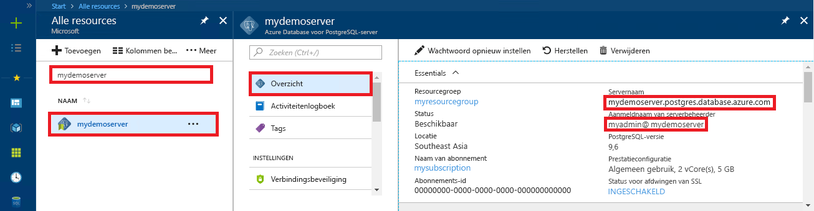

# <a name="azure-database-for-postgresql-use-go-language-to-connect-and-query-data"></a>Azure Database voor PostgreSQL: Go-taal gebruiken om verbinding te maken en gegevens op te vragen
In deze snelstartgids ziet u hoe u met behulp van code in de [Go](https://golang.org/)-taal (golang) verbinding maakt met een Azure-database voor PostgreSQL. U ziet hier hoe u SQL-instructies gebruikt om gegevens in de database op te vragen, in te voegen, bij te werken en te verwijderen. In dit artikel wordt ervan uitgegaan dat u bekend bent met het ontwikkelen met Go, maar geen ervaring hebt met het werken met Azure Database voor PostgreSQL.

## <a name="prerequisites"></a>Vereisten
In deze snelstartgids worden de resources die in een van deze handleidingen zijn gemaakt, als uitgangspunt gebruikt:
- [Database maken - Portal](quickstart-create-server-database-portal.md)
- [Database maken - Azure CLI](quickstart-create-server-database-azure-cli.md)

## <a name="install-go-and-pq-connector"></a>Go en de pq-connector installeren
Installeer [Go](https://golang.org/doc/install) en het [Pure Go Postgres-stuurprogramma (pq)](https://github.com/lib/pq) op uw computer. Volg de stappen voor uw platform uit:

### <a name="windows"></a>Windows
1. [Download](https://golang.org/dl/) en installeer Go voor Microsoft Windows volgens de [installatie-instructies](https://golang.org/doc/install).
2. Open de opdrachtprompt vanuit het Startmenu.
3. Maak een map voor uw project, bijvoorbeeld: `mkdir  %USERPROFILE%\go\src\postgresqlgo`.
4. Wijzig de map in de projectmap, bijvoorbeeld `cd %USERPROFILE%\go\src\postgresqlgo`.
5. Stel de omgevingsvariabele voor GOPATH zo in dat deze verwijst naar de broncodemap. `set GOPATH=%USERPROFILE%\go`.
6. Installeer het [Pure Go Postgres-stuurprogramma (pq)](https://github.com/lib/pq) door de opdracht `go get github.com/lib/pq` uit te voeren.

   Kortom: installeer Go en voer vervolgens deze opdrachten uit in de opdrachtprompt:
   ```cmd
   mkdir  %USERPROFILE%\go\src\postgresqlgo
   cd %USERPROFILE%\go\src\postgresqlgo
   set GOPATH=%USERPROFILE%\go
   go get github.com/lib/pq
   ```

### <a name="linux-ubuntu"></a>Linux (Ubuntu)
1. Open de Bash-shell. 
2. Installeer Go door `sudo apt-get install golang-go` uit te voeren.
3. Maak in de basismap een map voor uw project, bijvoorbeeld `mkdir -p ~/go/src/postgresqlgo/`.
4. Wijzig de map in de map, bijvoorbeeld `cd ~/go/src/postgresqlgo/`.
5. Stel de omgevingsvariabele GOPATH zo in dat deze verwijst naar een geldige bronmap, zoals de Go-map in uw huidige basismap. Voer `export GOPATH=~/go` in de Bash-shell uit om de Go-map toe te voegen als GOPATH voor de huidige shellsessie.
6. Installeer het [Pure Go Postgres-stuurprogramma (pq)](https://github.com/lib/pq) door de opdracht `go get github.com/lib/pq` uit te voeren.

   Kortom: voer deze Bash-opdrachten uit:
   ```bash
   sudo apt-get install golang-go
   mkdir -p ~/go/src/postgresqlgo/
   cd ~/go/src/postgresqlgo/
   export GOPATH=~/go/
   go get github.com/lib/pq
   ```

### <a name="apple-macos"></a>Apple macOS
1. Download en installeer Go volgens de [installatie-instructies](https://golang.org/doc/install) die overeenkomen met uw platform. 
2. Open de Bash-shell. 
3. Maak in de basismap een map voor uw project, bijvoorbeeld `mkdir -p ~/go/src/postgresqlgo/`.
4. Wijzig de map in de map, bijvoorbeeld `cd ~/go/src/postgresqlgo/`.
5. Stel de omgevingsvariabele GOPATH zo in dat deze verwijst naar een geldige bronmap, zoals de Go-map in uw huidige basismap. Voer `export GOPATH=~/go` in de Bash-shell uit om de Go-map toe te voegen als GOPATH voor de huidige shellsessie.
6. Installeer het [Pure Go Postgres-stuurprogramma (pq)](https://github.com/lib/pq) door de opdracht `go get github.com/lib/pq` uit te voeren.

   Kortom: installeer Go en voer deze Bash-opdrachten uit:
   ```bash
   mkdir -p ~/go/src/postgresqlgo/
   cd ~/go/src/postgresqlgo/
   export GOPATH=~/go/
   go get github.com/lib/pq
   ```

## <a name="get-connection-information"></a>Verbindingsgegevens ophalen
Haal de verbindingsgegevens op die nodig zijn om verbinding te maken met de Azure Database voor PostgreSQL. U hebt de volledig gekwalificeerde servernaam en aanmeldingsreferenties nodig.

1. Meld u aan bij [Azure Portal](https://portal.azure.com/).
2. Klik in het menu links in Azure Portal op **Alle resources** en zoek de server die u hebt gemaakt (bijvoorbeeld **mypgserver-20170401**).
3. Klik op de servernaam **mypgserver-20170401**.
4. Selecteer de pagina **Overzicht** van de server. Noteer de **servernaam** en de **gebruikersnaam van de serverbeheerder**.
 
5. Als u uw aanmeldingsgegevens voor de server bent vergeten, gaat u naar de pagina **Overzicht** om de aanmeldingsnaam van de serverbeheerder weer te geven. Stel het wachtwoord indien nodig opnieuw in.

## <a name="build-and-run-go-code"></a>Go-code schrijven en uitvoeren 
1. Als u Golang-code wilt schrijven, gebruikt u een eenvoudige teksteditor zoals Kladblok in Microsoft Windows, [vi](http://manpages.ubuntu.com/manpages/xenial/man1/nvi.1.html#contenttoc5) of [Nano](https://www.nano-editor.org/) in Ubuntu en TextEdit in macOS. Als u liever een uitgebreidere Interactive Development Environment (IDE) gebruikt, gaat u aan de slag met [Gogland](https://www.jetbrains.com/go/) van Jetbrains, [Visual Studio Code](https://code.visualstudio.com/) van Microsoft of [Atom](https://atom.io/).
2. Plak de Golang-code uit de secties hieronder in tekstbestanden en sla deze in de projectmap op met de bestandsextensie \*.go, zoals het pad `%USERPROFILE%\go\src\postgresqlgo\createtable.go` (voor Windows) of het pad `~/go/src/postgresqlgo/createtable.go` (voor Linux).
3. Zoek de constanten `HOST`, `DATABASE`, `USER` en `PASSWORD` in de code en vervang de voorbeeldwaarden door uw eigen waarden.  
4. Open de opdrachtprompt of de Bash-shell. Wijzig de map in de projectmap. Voorbeeld voor Windows: `cd %USERPROFILE%\go\src\postgresqlgo\`. Voorbeeld voor Linux: `cd ~/go/src/postgresqlgo/`. Sommige van de vermelde IDE-omgevingen bieden mogelijkheden voor foutopsporing en runtime zonder dat daarvoor shell-opdrachten zijn vereist.
5. Voer de code uit door de opdracht `go run createtable.go` te typen. De toepassing wordt nu gecompileerd en uitgevoerd. 
6. Als u de code wilt bouwen in een systeemeigen toepassing, kunt u ook `go build createtable.go` gebruiken en vervolgens `createtable.exe` starten om de toepassing uit te voeren.

## <a name="connect-and-create-a-table"></a>Verbinding maken en een tabel maken
Gebruik de volgende code om een tabel te verbinden en te maken met de SQL-instructie **CREATE TABLE**, gevolgd door **INSERT INTO**-instructies om rijen in de tabel toe te voegen.

Met de code worden drie pakketten geïmporteerd: het [sql-pakket](https://golang.org/pkg/database/sql/), het [pq-pakket](http://godoc.org/github.com/lib/pq) als een stuurprogramma om te communiceren met de Postgres-server, en het [fmt-pakket](https://golang.org/pkg/fmt/) voor de weergave van invoer en uitvoer op de opdrachtregel.

In de code wordt de methode [sql.Open()](http://godoc.org/github.com/lib/pq#Open) aangeroepen om verbinding te maken met Azure Database voor PostgreSQL, en wordt de verbinding gecontroleerd met de methode [db.Ping()](https://golang.org/pkg/database/sql/#DB.Ping). Er wordt telkens gebruikgemaakt van een [database-ingang](https://golang.org/pkg/database/sql/#DB), die de verbindingsgroep voor de databaseserver bevat. In de code wordt de methode [Exec()](https://golang.org/pkg/database/sql/#DB.Exec) meerdere keren aangeroepen om diverse SQL-opdrachten uit te voeren. Telkens wordt een aangepaste checkError()-methode gebruikt om te controleren of er fouten zijn opgetreden en af te sluiten als er een fout is opgetreden.

Vervang de parameters `HOST`, `DATABASE`, `USER` en `PASSWORD` door uw eigen waarden. 

```go
package main

import (
    "database/sql"
    "fmt"
    _ "github.com/lib/pq"
)

const (
    // Initialize connection constants.
    HOST     = "mypgserver-20170401.postgres.database.azure.com"
    DATABASE = "mypgsqldb"
    USER     = "mylogin@mypgserver-20170401"
    PASSWORD = "<server_admin_password>"
)

func checkError(err error) {
    if err != nil {
        panic(err)
    }
}

func main() {
    // Initialize connection string.
    var connectionString string = fmt.Sprintf("host=%s user=%s password=%s dbname=%s sslmode=require", HOST, USER, PASSWORD, DATABASE)

    // Initialize connection object.
    db, err := sql.Open("postgres", connectionString)
    checkError(err)

    err = db.Ping()
    checkError(err)
    fmt.Println("Successfully created connection to database")

    // Drop previous table of same name if one exists.
    _, err = db.Exec("DROP TABLE IF EXISTS inventory;")
    checkError(err)
    fmt.Println("Finished dropping table (if existed)")

    // Create table.
    _, err = db.Exec("CREATE TABLE inventory (id serial PRIMARY KEY, name VARCHAR(50), quantity INTEGER);")
    checkError(err)
    fmt.Println("Finished creating table")

    // Insert some data into table.
    sql_statement := "INSERT INTO inventory (name, quantity) VALUES ($1, $2);"
    _, err = db.Exec(sql_statement, "banana", 150)
    checkError(err)
    _, err = db.Exec(sql_statement, "orange", 154)
    checkError(err)
    _, err = db.Exec(sql_statement, "apple", 100)
    checkError(err)
    fmt.Println("Inserted 3 rows of data")
}
```

## <a name="read-data"></a>Gegevens lezen
Gebruik de volgende code om verbinding te maken en de gegevens te lezen met de SQL-instructie **SELECT**. 

Met de code worden drie pakketten geïmporteerd: het [sql-pakket](https://golang.org/pkg/database/sql/), het [pq-pakket](http://godoc.org/github.com/lib/pq) als een stuurprogramma om te communiceren met de Postgres-server, en het [fmt-pakket](https://golang.org/pkg/fmt/) voor de weergave van invoer en uitvoer op de opdrachtregel.

In de code wordt de methode [sql.Open()](http://godoc.org/github.com/lib/pq#Open) aangeroepen om verbinding te maken met Azure Database voor PostgreSQL, en wordt de verbinding gecontroleerd met de methode [db.Ping()](https://golang.org/pkg/database/sql/#DB.Ping). Er wordt telkens gebruikgemaakt van een [database-ingang](https://golang.org/pkg/database/sql/#DB), die de verbindingsgroep voor de databaseserver bevat. De selectiequery wordt uitgevoerd door de methode [db.Query()](https://golang.org/pkg/database/sql/#DB.Query) aan te roepen, en de resulterende rijen wordt bewaard in een variabele van het type [rijen](https://golang.org/pkg/database/sql/#Rows). In de code worden de kolomgegevenswaarden in de huidige rij gelezen met de methode [rows.Scan()](https://golang.org/pkg/database/sql/#Rows.Scan) en de rijen worden helemaal doorlopen met behulp van de iterator [rows.Next()](https://golang.org/pkg/database/sql/#Rows.Next), totdat er geen rijen meer zijn. De kolomwaarden van elke rij worden weergegeven in de console. Telkens wordt een aangepaste checkError()-methode gebruikt om te controleren of er fouten zijn opgetreden en af te sluiten als er een fout is opgetreden.

Vervang de parameters `HOST`, `DATABASE`, `USER` en `PASSWORD` door uw eigen waarden. 

```go
package main

import (
    "database/sql"
    "fmt"
    _ "github.com/lib/pq"
)

const (
    // Initialize connection constants.
    HOST     = "mypgserver-20170401.postgres.database.azure.com"
    DATABASE = "mypgsqldb"
    USER     = "mylogin@mypgserver-20170401"
    PASSWORD = "<server_admin_password>"
)

func checkError(err error) {
    if err != nil {
        panic(err)
    }
}

func main() {

    // Initialize connection string.
    var connectionString string = fmt.Sprintf("host=%s user=%s password=%s dbname=%s sslmode=require", HOST, USER, PASSWORD, DATABASE)

    // Initialize connection object.
    db, err := sql.Open("postgres", connectionString)
    checkError(err)

    err = db.Ping()
    checkError(err)
    fmt.Println("Successfully created connection to database")

    // Read rows from table.
    var id int
    var name string
    var quantity int

    sql_statement := "SELECT * from inventory;"
    rows, err := db.Query(sql_statement)
    checkError(err)

    for rows.Next() {
        switch err := rows.Scan(&id, &name, &quantity); err {
        case sql.ErrNoRows:
            fmt.Println("No rows were returned")
        case nil:
            fmt.Printf("Data row = (%d, %s, %d)\n", id, name, quantity)
        default:
            checkError(err)
        }
    }
}
```

## <a name="update-data"></a>Gegevens bijwerken
Gebruik de volgende code om verbinding te maken en de gegevens bij te werken met de SQL-instructie **UPDATE**.

Met de code worden drie pakketten geïmporteerd: het [sql-pakket](https://golang.org/pkg/database/sql/), het [pq-pakket](http://godoc.org/github.com/lib/pq) als een stuurprogramma om te communiceren met de Postgres-server, en het [fmt-pakket](https://golang.org/pkg/fmt/) voor de weergave van invoer en uitvoer op de opdrachtregel.

In de code wordt de methode [sql.Open()](http://godoc.org/github.com/lib/pq#Open) aangeroepen om verbinding te maken met Azure Database voor PostgreSQL, en wordt de verbinding gecontroleerd met de methode [db.Ping()](https://golang.org/pkg/database/sql/#DB.Ping). Er wordt telkens gebruikgemaakt van een [database-ingang](https://golang.org/pkg/database/sql/#DB), die de verbindingsgroep voor de databaseserver bevat. In de code wordt de methode [Exec()](https://golang.org/pkg/database/sql/#DB.Exec) aangeroepen om de SQL-instructie uit te voeren waarmee de tabel wordt bijgewerkt. Er wordt een aangepaste checkError()-methode gebruikt om te controleren of er fouten zijn opgetreden en af te sluiten als er een fout is opgetreden.

Vervang de parameters `HOST`, `DATABASE`, `USER` en `PASSWORD` door uw eigen waarden. 
```go
package main

import (
  "database/sql"
  _ "github.com/lib/pq"
  "fmt"
)

const (
    // Initialize connection constants.
    HOST     = "mypgserver-20170401.postgres.database.azure.com"
    DATABASE = "mypgsqldb"
    USER     = "mylogin@mypgserver-20170401"
    PASSWORD = "<server_admin_password>"
)

func checkError(err error) {
    if err != nil {
        panic(err)
    }
}

func main() {
    
    // Initialize connection string.
    var connectionString string = 
        fmt.Sprintf("host=%s user=%s password=%s dbname=%s sslmode=require", HOST, USER, PASSWORD, DATABASE)

    // Initialize connection object.
    db, err := sql.Open("postgres", connectionString)
    checkError(err)

    err = db.Ping()
    checkError(err)
    fmt.Println("Successfully created connection to database")

    // Modify some data in table.
    sql_statement := "UPDATE inventory SET quantity = $2 WHERE name = $1;"
    _, err = db.Exec(sql_statement, "banana", 200)
    checkError(err)
    fmt.Println("Updated 1 row of data")
}
```

## <a name="delete-data"></a>Gegevens verwijderen
Gebruik de volgende code om verbinding te maken en de gegevens te lezen met de SQL-instructie **DELETE**. 

Met de code worden drie pakketten geïmporteerd: het [sql-pakket](https://golang.org/pkg/database/sql/), het [pq-pakket](http://godoc.org/github.com/lib/pq) als een stuurprogramma om te communiceren met de Postgres-server, en het [fmt-pakket](https://golang.org/pkg/fmt/) voor de weergave van invoer en uitvoer op de opdrachtregel.

In de code wordt de methode [sql.Open()](http://godoc.org/github.com/lib/pq#Open) aangeroepen om verbinding te maken met Azure Database voor PostgreSQL, en wordt de verbinding gecontroleerd met de methode [db.Ping()](https://golang.org/pkg/database/sql/#DB.Ping). Er wordt telkens gebruikgemaakt van een [database-ingang](https://golang.org/pkg/database/sql/#DB), die de verbindingsgroep voor de databaseserver bevat. In de code wordt de methode [Exec()](https://golang.org/pkg/database/sql/#DB.Exec) aangeroepen om de SQL-instructie uit te voeren waarmee de tabel wordt bijgewerkt. Er wordt een aangepaste checkError()-methode gebruikt om te controleren of er fouten zijn opgetreden en af te sluiten als er een fout is opgetreden.

Vervang de parameters `HOST`, `DATABASE`, `USER` en `PASSWORD` door uw eigen waarden. 
```go
package main

import (
  "database/sql"
  _ "github.com/lib/pq"
  "fmt"
)

const (
    // Initialize connection constants.
    HOST     = "mypgserver-20170401.postgres.database.azure.com"
    DATABASE = "mypgsqldb"
    USER     = "mylogin@mypgserver-20170401"
    PASSWORD = "<server_admin_password>"
)

func checkError(err error) {
    if err != nil {
        panic(err)
    }
}

func main() {
    
    // Initialize connection string.
    var connectionString string = 
        fmt.Sprintf("host=%s user=%s password=%s dbname=%s sslmode=require", HOST, USER, PASSWORD, DATABASE)

    // Initialize connection object.
    db, err := sql.Open("postgres", connectionString)
    checkError(err)

    err = db.Ping()
    checkError(err)
    fmt.Println("Successfully created connection to database")

    // Delete some data from table.
    sql_statement := "DELETE FROM inventory WHERE name = $1;"
    _, err = db.Exec(sql_statement, "orange")
    checkError(err)
    fmt.Println("Deleted 1 row of data")
}
```

## <a name="next-steps"></a>Volgende stappen
> [!div class="nextstepaction"]
> [Een database migreren met behulp van Exporteren en importeren](./howto-migrate-using-export-and-import.md)
