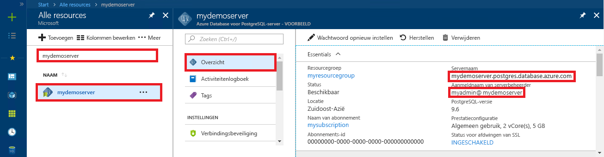

# <a name="azure-database-for-postgresql-use-java-to-connect-and-query-data"></a>Azure Database voor PostgreSQL: Java gebruiken om verbinding te maken en query's voor gegevens uit te voeren
In deze snelstartgids ziet u hoe u met behulp van een Java-toepassing verbinding maakt met een Azure Database voor PostgreSQL. U ziet hier hoe u SQL-instructies gebruikt om gegevens in de database op te vragen, in te voegen, bij te werken en te verwijderen. In de stappen van dit artikel wordt ervan uitgegaan dat u bekend bent met het ontwikkelen met behulp van Java, maar geen ervaring hebt met het werken met Azure Database voor PostgreSQL.

## <a name="prerequisites"></a>Vereisten
In deze snelstartgids worden de resources die in een van deze handleidingen zijn gemaakt, als uitgangspunt gebruikt:
- [Database maken - Portal](quickstart-create-server-database-portal.md)
- [Database maken - Azure CLI](quickstart-create-server-database-azure-cli.md)

U moet ook het volgende doen:
- Download het [PostgreSQL JDBC-stuurprogramma](https://jdbc.postgresql.org/download.html) dat hoort bij uw versie van Java en de Java Development Kit.
- Neem het PostgreSQL JDBC jar-bestand (bijvoorbeeld postgresql-42.1.1.jar) op in het klassepad van uw toepassing. Zie de [gegevens van het klassepad](https://jdbc.postgresql.org/documentation/head/classpath.html) voor meer informatie.

## <a name="get-connection-information"></a>Verbindingsgegevens ophalen
Haal de verbindingsgegevens op die nodig zijn om verbinding te maken met de Azure Database voor PostgreSQL. U hebt de volledig gekwalificeerde servernaam en aanmeldingsreferenties nodig.

1. Meld u aan bij [Azure Portal](https://portal.azure.com/).
2. Klik in het menu links in Azure Portal op **Alle resources** en zoek de server die u hebt gemaakt (bijvoorbeeld **mypgserver-20170401**).
3. Klik op de servernaam **mypgserver-20170401**.
4. Selecteer de pagina **Overzicht** van de server. Noteer de **servernaam** en de **gebruikersnaam van de serverbeheerder**.
 
5. Als u uw aanmeldingsgegevens voor de server bent vergeten, gaat u naar de pagina **Overzicht** om de aanmeldingsnaam van de serverbeheerder weer te geven en indien nodig het wachtwoord opnieuw in te stellen.

## <a name="connect-create-table-and-insert-data"></a>Verbinden, tabel maken en gegevens invoegen
Gebruik de volgende code om verbinding te maken en de gegevens te laden met de functie met een SQL-instructie **INSERT**. De methoden [getConnection()](https://www.postgresql.org/docs/7.4/static/jdbc-use.html), [createStatement()](https://jdbc.postgresql.org/documentation/head/query.html) en [executeQuery()](https://jdbc.postgresql.org/documentation/head/query.html) worden gebruikt om verbinding maken met de tabel, de tabel neer te zetten en de tabel te maken. Het object [prepareStatement](https://jdbc.postgresql.org/documentation/head/query.html) wordt gebruikt voor het bouwen van de INSERT-opdrachten, waarbij setString() en setInt() worden gebruikt om de parameterwaarden te koppelen. Met de methode [executeUpdate()](https://jdbc.postgresql.org/documentation/head/update.html) wordt de opdracht voor elke set parameters uitgevoerd. 

Vervang de parameters voor host, database, gebruiker en wachtwoord door de waarden die u hebt opgegeven tijdens het maken van uw eigen server en database.

```java
import java.sql.*;
import java.util.Properties;

public class CreateTableInsertRows {

    public static void main (String[] args)  throws Exception
    {

        // Initialize connection variables.
        String host = "mypgserver-20170401.postgres.database.azure.com";
        String database = "mypgsqldb";
        String user = "mylogin@mypgserver-20170401";
        String password = "<server_admin_password>";

        // check that the driver is installed
        try
        {
            Class.forName("org.postgresql.Driver");
        }
        catch (ClassNotFoundException e)
        {
            throw new ClassNotFoundException("PostgreSQL JDBC driver NOT detected in library path.", e);
        }

        System.out.println("PostgreSQL JDBC driver detected in library path.");

        Connection connection = null;

        // Initialize connection object
        try
        {
            String url = String.format("jdbc:postgresql://%s/%s", host, database);
            
            // set up the connection properties
            Properties properties = new Properties();
            properties.setProperty("user", user);
            properties.setProperty("password", password);
            properties.setProperty("ssl", "true");

            // get connection
            connection = DriverManager.getConnection(url, properties);
        }
        catch (SQLException e)
        {
            throw new SQLException("Failed to create connection to database.", e);
        }
        if (connection != null) 
        { 
            System.out.println("Successfully created connection to database.");
        
            // Perform some SQL queries over the connection.
            try
            {
                // Drop previous table of same name if one exists.
                Statement statement = connection.createStatement();
                statement.execute("DROP TABLE IF EXISTS inventory;");
                System.out.println("Finished dropping table (if existed).");
    
                // Create table.
                statement.execute("CREATE TABLE inventory (id serial PRIMARY KEY, name VARCHAR(50), quantity INTEGER);");
                System.out.println("Created table.");
    
                // Insert some data into table.
                int nRowsInserted = 0;
                PreparedStatement preparedStatement = connection.prepareStatement("INSERT INTO inventory (name, quantity) VALUES (?, ?);");
                preparedStatement.setString(1, "banana");
                preparedStatement.setInt(2, 150);
                nRowsInserted += preparedStatement.executeUpdate();

                preparedStatement.setString(1, "orange");
                preparedStatement.setInt(2, 154);
                nRowsInserted += preparedStatement.executeUpdate();

                preparedStatement.setString(1, "apple");
                preparedStatement.setInt(2, 100);
                nRowsInserted += preparedStatement.executeUpdate();
                System.out.println(String.format("Inserted %d row(s) of data.", nRowsInserted));
    
                // NOTE No need to commit all changes to database, as auto-commit is enabled by default.
    
            }
            catch (SQLException e)
            {
                throw new SQLException("Encountered an error when executing given sql statement.", e);
            }       
        }
        else {
            System.out.println("Failed to create connection to database.");
        }
        System.out.println("Execution finished.");
    }
}
```

## <a name="read-data"></a>Gegevens lezen
Gebruik de volgende code om de gegevens te lezen met de SQL-instructie **SELECT**. De methoden [getConnection()](https://www.postgresql.org/docs/7.4/static/jdbc-use.html), [createStatement()](https://jdbc.postgresql.org/documentation/head/query.html) en [executeQuery()](https://jdbc.postgresql.org/documentation/head/query.html) worden gebruikt om verbinding te maken met de SELECT-instructie en deze te maken en uit te voeren. De resultaten worden verwerkt met behulp van een [ResultSet](https://www.postgresql.org/docs/7.4/static/jdbc-query.html)-object. 

Vervang de parameters voor host, database, gebruiker en wachtwoord door de waarden die u hebt opgegeven tijdens het maken van uw eigen server en database.

```java
import java.sql.*;
import java.util.Properties;

public class ReadTable {

    public static void main (String[] args)  throws Exception
    {

        // Initialize connection variables.
        String host = "mypgserver-20170401.postgres.database.azure.com";
        String database = "mypgsqldb";
        String user = "mylogin@mypgserver-20170401";
        String password = "<server_admin_password>";

        // check that the driver is installed
        try
        {
            Class.forName("org.postgresql.Driver");
        }
        catch (ClassNotFoundException e)
        {
            throw new ClassNotFoundException("PostgreSQL JDBC driver NOT detected in library path.", e);
        }

        System.out.println("PostgreSQL JDBC driver detected in library path.");

        Connection connection = null;

        // Initialize connection object
        try
        {
            String url = String.format("jdbc:postgresql://%s/%s", host, database);
            
            // set up the connection properties
            Properties properties = new Properties();
            properties.setProperty("user", user);
            properties.setProperty("password", password);
            properties.setProperty("ssl", "true");

            // get connection
            connection = DriverManager.getConnection(url, properties);
        }
        catch (SQLException e)
        {
            throw new SQLException("Failed to create connection to database.", e);
        }
        if (connection != null) 
        { 
            System.out.println("Successfully created connection to database.");
        
            // Perform some SQL queries over the connection.
            try
            {
    
                Statement statement = connection.createStatement();
                ResultSet results = statement.executeQuery("SELECT * from inventory;");
                while (results.next())
                {
                    String outputString = 
                        String.format(
                            "Data row = (%s, %s, %s)",
                            results.getString(1),
                            results.getString(2),
                            results.getString(3));
                    System.out.println(outputString);
                }
            }
            catch (SQLException e)
            {
                throw new SQLException("Encountered an error when executing given sql statement.", e);
            }       
        }
        else {
            System.out.println("Failed to create connection to database.");
        }
        System.out.println("Execution finished.");
    }
}

```

## <a name="update-data"></a>Gegevens bijwerken
Gebruik de volgende code om de gegevens te wijzigen met de SQL-instructie **UPDATE**. De methoden [getConnection()](https://www.postgresql.org/docs/7.4/static/jdbc-use.html), [prepareStatement()](https://jdbc.postgresql.org/documentation/head/query.html) en [executeUpdate()](https://jdbc.postgresql.org/documentation/head/update.html) worden gebruikt om verbinding te maken en de UPDATE-instructie voor te bereiden en uit te voeren. 

Vervang de parameters voor host, database, gebruiker en wachtwoord door de waarden die u hebt opgegeven tijdens het maken van uw eigen server en database.

```java
import java.sql.*;
import java.util.Properties;

public class UpdateTable {
    public static void main (String[] args)  throws Exception
    {

        // Initialize connection variables.
        String host = "mypgserver-20170401.postgres.database.azure.com";
        String database = "mypgsqldb";
        String user = "mylogin@mypgserver-20170401";
        String password = "<server_admin_password>";

        // check that the driver is installed
        try
        {
            Class.forName("org.postgresql.Driver");
        }
        catch (ClassNotFoundException e)
        {
            throw new ClassNotFoundException("PostgreSQL JDBC driver NOT detected in library path.", e);
        }

        System.out.println("PostgreSQL JDBC driver detected in library path.");

        Connection connection = null;

        // Initialize connection object
        try
        {
            String url = String.format("jdbc:postgresql://%s/%s", host, database);
            
            // set up the connection properties
            Properties properties = new Properties();
            properties.setProperty("user", user);
            properties.setProperty("password", password);
            properties.setProperty("ssl", "true");

            // get connection
            connection = DriverManager.getConnection(url, properties);
        }
        catch (SQLException e)
        {
            throw new SQLException("Failed to create connection to database.", e);
        }
        if (connection != null) 
        { 
            System.out.println("Successfully created connection to database.");
        
            // Perform some SQL queries over the connection.
            try
            {
                // Modify some data in table.
                int nRowsUpdated = 0;
                PreparedStatement preparedStatement = connection.prepareStatement("UPDATE inventory SET quantity = ? WHERE name = ?;");
                preparedStatement.setInt(1, 200);
                preparedStatement.setString(2, "banana");
                nRowsUpdated += preparedStatement.executeUpdate();
                System.out.println(String.format("Updated %d row(s) of data.", nRowsUpdated));
    
                // NOTE No need to commit all changes to database, as auto-commit is enabled by default.
            }
            catch (SQLException e)
            {
                throw new SQLException("Encountered an error when executing given sql statement.", e);
            }       
        }
        else {
            System.out.println("Failed to create connection to database.");
        }
        System.out.println("Execution finished.");
    }
}
```
## <a name="delete-data"></a>Gegevens verwijderen
Gebruik de volgende code om de gegevens te verwijderen met de SQL-instructie **DELETE**. De methoden [getConnection()](https://www.postgresql.org/docs/7.4/static/jdbc-use.html), [prepareStatement()](https://jdbc.postgresql.org/documentation/head/query.html) en [executeUpdate()](https://jdbc.postgresql.org/documentation/head/update.html) worden gebruikt om verbinding te maken en de UPDATE-instructie voor te bereiden, uit te voeren en te verwijderen. 

Vervang de parameters voor host, database, gebruiker en wachtwoord door de waarden die u hebt opgegeven tijdens het maken van uw eigen server en database.

```java
import java.sql.*;
import java.util.Properties;

public class DeleteTable {
    public static void main (String[] args)  throws Exception
    {

        // Initialize connection variables.
        String host = "mypgserver-20170401.postgres.database.azure.com";
        String database = "mypgsqldb";
        String user = "mylogin@mypgserver-20170401";
        String password = "<server_admin_password>";

        // check that the driver is installed
        try
        {
            Class.forName("org.postgresql.Driver");
        }
        catch (ClassNotFoundException e)
        {
            throw new ClassNotFoundException("PostgreSQL JDBC driver NOT detected in library path.", e);
        }

        System.out.println("PostgreSQL JDBC driver detected in library path.");

        Connection connection = null;

        // Initialize connection object
        try
        {
            String url = String.format("jdbc:postgresql://%s/%s", host, database);
            
            // set up the connection properties
            Properties properties = new Properties();
            properties.setProperty("user", user);
            properties.setProperty("password", password);
            properties.setProperty("ssl", "true");

            // get connection
            connection = DriverManager.getConnection(url, properties);
        }
        catch (SQLException e)
        {
            throw new SQLException("Failed to create connection to database.", e);
        }
        if (connection != null) 
        { 
            System.out.println("Successfully created connection to database.");
        
            // Perform some SQL queries over the connection.
            try
            {
                // Delete some data from table.
                int nRowsDeleted = 0;
                PreparedStatement preparedStatement = connection.prepareStatement("DELETE FROM inventory WHERE name = ?;");
                preparedStatement.setString(1, "orange");
                nRowsDeleted += preparedStatement.executeUpdate();
                System.out.println(String.format("Deleted %d row(s) of data.", nRowsDeleted));
    
                // NOTE No need to commit all changes to database, as auto-commit is enabled by default.
            }
            catch (SQLException e)
            {
                throw new SQLException("Encountered an error when executing given sql statement.", e);
            }       
        }
        else {
            System.out.println("Failed to create connection to database.");
        }
        System.out.println("Execution finished.");
    }
}
```

## <a name="next-steps"></a>Volgende stappen
> [!div class="nextstepaction"]
> [Een database migreren met behulp van Exporteren en importeren](./howto-migrate-using-export-and-import.md)
