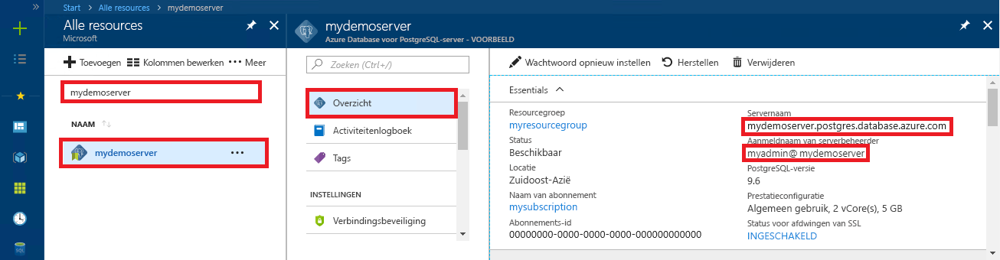

<a id="azure-database-for-postgresql-use-nodejs-to-connect-and-query-data" class="xliff"></a>

# Azure Database voor PostgreSQL: Node.js gebruiken om verbinding te maken en query's uit te voeren op gegevens
In deze snelstartgids ziet u hoe u vanuit de platformen Windows, Ubuntu Linux, en Mac met behulp van [Node.js](https://nodejs.org/) verbinding maakt met een Azure Database voor PostgreSQL. U ziet hier hoe u SQL-instructies gebruikt om gegevens in de database op te vragen, in te voegen, bij te werken en te verwijderen. In de stappen van dit artikel wordt ervan uitgegaan dat u bekend bent met het ontwikkelen met behulp van Node.js, maar geen ervaring hebt met het werken met Azure Database voor PostgreSQL.

<a id="prerequisites" class="xliff"></a>

## Vereisten
In deze snelstartgids worden de resources die in een van deze handleidingen zijn gemaakt, als uitgangspunt gebruikt:
- [Database maken - Portal](quickstart-create-server-database-portal.md)
- [Database maken - CLI](quickstart-create-server-database-azure-cli.md)

U moet ook het volgende doen:
- [Node.js](https://nodejs.org) installeren
- Installeer het [pg](https://www.npmjs.com/package/pg)-pakket. 

<a id="install-nodejs" class="xliff"></a>

## Node.js installeren 
Afhankelijk van uw platform, doet u het volgende om Node.js te installeren:

<a id="mac-os" class="xliff"></a>

### **Mac OS**
Voer de volgende opdrachten in om **brew** te installeren, een eenvoudig te gebruiken pakketbeheerprogramma voor Mac OS X en **Node.js**.

```bash
ruby -e "$(curl -fsSL https://raw.githubusercontent.com/Homebrew/install/master/install)"
brew install node
```

<a id="linux-ubuntu" class="xliff"></a>

### **Linux (Ubuntu)**
Voer de volgende opdrachten in om **Node.js** en **NPM**, het pakketbeheerprogramma voor Node.js, te installeren.

```bash
sudo apt-get install -y nodejs npm
```

<a id="windows" class="xliff"></a>

### **Windows**
Ga naar de [downloadpagina van Node.js](https://nodejs.org/en/download/) en selecteer het gewenste Windows-installatieprogramma.

<a id="install-pg-client" class="xliff"></a>

## pg-client installeren
Installeer [pg](https://www.npmjs.com/package/pg), een niet-blokkerende JavaScript-client voor Node.js die handig is om verbinding maken met en query's uit te voeren in PostgreSQL.

Voer de Node Package Manager (NPM) voor JavaScript uit vanaf de opdrachtregel om de pg-client te installeren.
```bash
npm install pg
```

Controleer de installatie door de geïnstalleerde pakketten weer te geven.
```bash
npm list
```
De uitvoer van de lijstopdracht bevestigt de versie van elk onderdeel. 
```
`-- pg@6.2.3
  +-- buffer-writer@1.0.1
  +-- packet-reader@0.3.1
etc...
```

<a id="get-connection-information" class="xliff"></a>

## Verbindingsgegevens ophalen
Haal de verbindingsgegevens op die nodig zijn om verbinding te maken met de Azure Database voor PostgreSQL. U hebt de volledig gekwalificeerde servernaam en aanmeldingsreferenties nodig.

1. Meld u aan bij [Azure Portal](https://portal.azure.com/).
2. In het menu links in Azure Portal klikt u op **Alle resources** en zoekt u naar de server die u zojuist hebt gemaakt: **mypgserver-20170401**.
3. Klik op de servernaam **mypgserver-20170401**.
4. Selecteer de pagina **Overzicht** van de server. Noteer de **servernaam** en de **gebruikersnaam van de serverbeheerder**.
 
5. Als u uw aanmeldingsgegevens voor de server bent vergeten, gaat u naar de pagina **Overzicht** om de aanmeldingsnaam van de serverbeheerder weer te geven en indien nodig het wachtwoord opnieuw in te stellen.

<a id="running-the-javascript-code-in-nodejs" class="xliff"></a>

## De JavaScript-code in Node.js uitvoeren
U kunt Node.js starten vanuit de Bash-shell of opdrachtprompt van Windows door `node` in te voeren. Voer vervolgens de JavaScript-voorbeeldcode interactief uit door deze te kopiëren en in de prompt te plakken. U kunt de JavaScript-code ook in een tekstbestand opslaan en `node filename.js` starten met de bestandsnaam als parameter om de code uit te voeren.

<a id="connect-create-table-and-insert-data" class="xliff"></a>

## Verbinden, tabel maken en gegevens invoegen
Gebruik de volgende code om verbinding te maken en de gegevens te laden met de SQL-instructies **CREATE TABLE** EN **INSERT INTO**.
Het object [pg.Client](https://github.com/brianc/node-postgres/wiki/Client) wordt gebruikt voor interactie met de PostgreSQL-server. De functie [pg.Client.Connect()](https://github.com/brianc/node-postgres/wiki/Client#method-connect) wordt gebruikt om verbinding met de server te maken. De functie [pg.Client.query()](https://github.com/brianc/node-postgres/wiki/Query) wordt gebruikt om de SQL-query uit te voeren op de PostgreSQL-database. 

Vervang de parameters host, dbname, user en password door de waarden die u hebt opgegeven tijdens het maken van de server en database. 

```javascript
const pg = require('pg');

var config =
{
    host: 'mypgserver-20170401.postgres.database.azure.com',
    user: 'mylogin@mypgserver-20170401',
    password: '<server_admin_password>',
    database: 'mypgsqldb',
    port: 5432,
    ssl: true
};

const client = new pg.Client(config);

client.connect(function (err)
{
    if (err)
        throw err;
    else
    {
        queryDatabase();
    }
});

function queryDatabase()
{
    client.query(
        ' \
            DROP TABLE IF EXISTS inventory; \
            CREATE TABLE inventory (id serial PRIMARY KEY, name VARCHAR(50), quantity INTEGER); \
            INSERT INTO inventory (name, quantity) VALUES (\'banana\', 150); \
            INSERT INTO inventory (name, quantity) VALUES (\'orange\', 154); \
            INSERT INTO inventory (name, quantity) VALUES (\'apple\', 100); \
        ',
        function (err)
    {
        console.log("Connection established");

        if (err)
            throw err;
        else
        {
            client.end(function (err)
            {
                if (err)
                    throw err;

                // Else closing connection finished without error
                console.log("Closed client connection");
            });

            console.log("Finished execution, exiting now");
            process.exit()
        }
    });
}
```

<a id="read-data" class="xliff"></a>

## Gegevens lezen
Gebruik de volgende code om verbinding te maken en de gegevens te lezen met de SQL-instructie **SELECT**. Het object [pg.Client](https://github.com/brianc/node-postgres/wiki/Client) wordt gebruikt voor interactie met de PostgreSQL-server. De functie [pg.Client.Connect()](https://github.com/brianc/node-postgres/wiki/Client#method-connect) wordt gebruikt om verbinding met de server te maken. De functie [pg.Client.query()](https://github.com/brianc/node-postgres/wiki/Query) wordt gebruikt om de SQL-query uit te voeren op de PostgreSQL-database. 

Vervang de parameters host, dbname, user en password door de waarden die u hebt opgegeven tijdens het maken van de server en database. 

```javascript
const pg = require('pg');

var config =
{
    host: 'mypgserver-20170401.postgres.database.azure.com',
    user: 'mylogin@mypgserver-20170401',
    password: '<server_admin_password>',
    database: 'mypgsqldb',
    port: 5432,
    ssl: true
};


const client = new pg.Client(config);

client.connect(function (err)
{
    if (err)
        throw err;

    else
    {
        console.log("Connected to Azure Database for PostgreSQL server:" + config.host);
        queryDatabase();
    }
});

function queryDatabase()
{
    // Declare array to hold query result set
    const results = [];

    console.log("Running query to PostgreSQL server:" + config.host);

    // Perform query
    var query = client.query('SELECT * FROM inventory;');

    // Print result set
    query.on('row', function(row)
    {
        console.log("Read " + JSON.stringify(row));
    });

    // Exit program after execution
    query.on('end', function(row)
    {
        console.log("Finished execution, exiting now");
        process.exit()
    });
}
```

<a id="update-data" class="xliff"></a>

## Gegevens bijwerken
Gebruik de volgende code om verbinding te maken en de gegevens te lezen met de SQL-instructie **UPDATE**. Het object [pg.Client](https://github.com/brianc/node-postgres/wiki/Client) wordt gebruikt voor interactie met de PostgreSQL-server. De functie [pg.Client.Connect()](https://github.com/brianc/node-postgres/wiki/Client#method-connect) wordt gebruikt om verbinding met de server te maken. De functie [pg.Client.query()](https://github.com/brianc/node-postgres/wiki/Query) wordt gebruikt om de SQL-query uit te voeren op de PostgreSQL-database. 

Vervang de parameters host, dbname, user en password door de waarden die u hebt opgegeven tijdens het maken van de server en database. 

```javascript
const pg = require('pg');

var config =
{
    host: 'mypgserver-20170401.postgres.database.azure.com',
    user: 'mylogin@mypgserver-20170401',
    password: '<server_admin_password>',
    database: 'mypgsqldb',
    port: 5432,
    ssl: true
};

const client = new pg.Client(config);

client.connect(function (err)
{
    if (err)
        throw err;
    else
    {
        queryDatabase();
    }   
});

function queryDatabase()
{
    client.query('UPDATE inventory SET quantity= 1000 WHERE name=\'banana\';', function (err, result)
    {
        console.log("Connection established");

        if (err)
            throw err;
        else
        {
            client.end(function (err)
            {
                if (err)
                    throw err;
                
                // Else closing connection finished without error
                console.log("Closed client connection");
            });             
        }

        console.log("Finished execution, exiting now");
        process.exit()
    });
}
```

<a id="delete-data" class="xliff"></a>

## Gegevens verwijderen
Gebruik de volgende code om verbinding te maken en de gegevens te lezen met de SQL-instructie **DELETE**. Het object [pg.Client](https://github.com/brianc/node-postgres/wiki/Client) wordt gebruikt voor interactie met de PostgreSQL-server. De functie [pg.Client.Connect()](https://github.com/brianc/node-postgres/wiki/Client#method-connect) wordt gebruikt om verbinding met de server te maken. De functie [pg.Client.query()](https://github.com/brianc/node-postgres/wiki/Query) wordt gebruikt om de SQL-query uit te voeren op de PostgreSQL-database. 

Vervang de parameters host, dbname, user en password door de waarden die u hebt opgegeven tijdens het maken van de server en database. 

```javascript
const pg = require('pg');

var config =
{
    host: 'mypgserver-20170401.postgres.database.azure.com',
    user: 'mylogin@mypgserver-20170401',
    password: '<server_admin_password>',
    database: 'mypgsqldb',
    port: 5432,
    ssl: true
};

const client = new pg.Client(config);

client.connect(function (err)
{
    if (err)
        throw err;
    else
    {
        queryDatabase();
    }   
});

function queryDatabase()
{
    client.query('DELETE FROM inventory WHERE name=\'apple\';', function (err, result)
    {
        console.log("Connection established");
        
        if (err)
            throw err;
        else
        {
            client.end(function (err)
            {
                if (err)
                    throw err;
                
                // Else closing connection finished without error
                console.log("Closed client connection");
            });

            console.log("Finished execution, exiting now");
            process.exit()          
        }
    }); 
}
```

<a id="next-steps" class="xliff"></a>

## Volgende stappen
> [!div class="nextstepaction"]
> [Een database migreren met behulp van Exporteren en Importeren](./howto-migrate-using-export-and-import.md)

