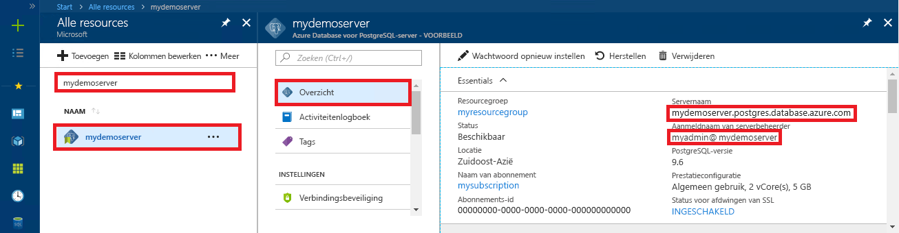

# <a name="azure-database-for-postgresql-use-php-to-connect-and-query-data"></a>Azure Database voor PostgreSQL: PHP gebruiken om verbinding te maken en gegevens op te vragen
In deze quickstart ziet u hoe u met behulp van een [PHP](http://php.net/manual/intro-whatis.php)-toepassing verbinding maakt met een Azure Database voor PostgreSQL. U ziet hier hoe u SQL-instructies gebruikt om gegevens in de database op te vragen, in te voegen, bij te werken en te verwijderen. In de stappen van dit artikel wordt ervan uitgegaan dat u bekend bent met het ontwikkelen met behulp van PHP en geen ervaring hebt met het werken met Azure Database for PostgreSQL.

## <a name="prerequisites"></a>Vereisten
In deze quickstart worden de resources die in een van deze handleidingen zijn gemaakt, als uitgangspunt gebruikt:
- [Database maken - Portal](quickstart-create-server-database-portal.md)
- [Database maken - Azure CLI](quickstart-create-server-database-azure-cli.md)

## <a name="install-php"></a>PHP installeren
Installeer PHP op uw eigen server of maak een Azure-[web-app](../app-service/app-service-web-overview.md) die PHP omvat.

### <a name="windows"></a>Windows
- [PHP versie 7.1.4 non-thread safe (x64)](http://windows.php.net/download#php-7.1) downloaden
- PHP installeren en de [PHP-handleiding](http://php.net/manual/install.windows.php) bekijken voor verdere configuratie
- In de code wordt de klasse **pgsql** (ext/php_pgsql.dll) gebruikt; deze is opgenomen in de PHP-installatie. 
- Schakel de **pgsql**-extensie in door het configuratiebestand php.ini te bewerken. Dit staat gewoonlijk in `C:\Program Files\PHP\v7.1\php.ini`. Het configuratiebestand moet een regel bevatten met de tekst `extension=php_pgsql.so`. Als deze niet wordt weergegeven, voegt u de tekst toe en slaat u het bestand op. Als de tekst aanwezig is, maar met behulp van het voorvoegsel puntkomma als opmerking is gemarkeerd, haalt u de puntkomma weg zodat de tekst geen opmerking meer is.

### <a name="linux-ubuntu"></a>Linux (Ubuntu)
- [PHP versie 7.1.4 non-thread safe (x64)](http://php.net/downloads.php) downloaden 
- PHP installeren en de [PHP-handleiding](http://php.net/manual/install.unix.php) bekijken voor verdere configuratie
- In de code wordt de **pgsql** klasse (php_pgsql.so) gebruikt. Installeer deze door `sudo apt-get install php-pgsql` uit te voeren.
- Schakel de **pgsql**-extensie in door het configuratiebestand php.ini te bewerken. Dit staat doorgaans in `/etc/php/7.0/mods-available/pgsql.ini`. Het configuratiebestand moet een regel bevatten met de tekst `extension=php_pgsql.so`. Als deze niet wordt weergegeven, voegt u de tekst toe en slaat u het bestand op. Als de tekst aanwezig is, maar met behulp van het voorvoegsel puntkomma als opmerking is gemarkeerd, haalt u de puntkomma weg zodat de tekst geen opmerking meer is.

### <a name="macos"></a>MacOS
- [PHP versie 7.1.4](http://php.net/downloads.php) downloaden
- PHP installeren en de [PHP-handleiding](http://php.net/manual/install.macosx.php) bekijken voor verdere configuratie

## <a name="get-connection-information"></a>Verbindingsgegevens ophalen
Haal de verbindingsgegevens op die nodig zijn om verbinding te maken met de Azure Database voor PostgreSQL. U hebt de volledig gekwalificeerde servernaam en aanmeldingsreferenties nodig.

1. Meld u aan bij [Azure Portal](https://portal.azure.com/).
2. Klik in het menu links in Azure Portal op **Alle resources** en zoek de server die u hebt gemaakt (bijvoorbeeld **mypgserver-20170401**).
3. Klik op de servernaam **mypgserver-20170401**.
4. Selecteer de pagina **Overzicht** van de server. Noteer de **servernaam** en de **gebruikersnaam van de serverbeheerder**.
 
5. Als u uw aanmeldingsgegevens voor de server bent vergeten, gaat u naar de pagina **Overzicht** om de aanmeldingsnaam van de serverbeheerder weer te geven en indien nodig het wachtwoord opnieuw in te stellen.

## <a name="connect-and-create-a-table"></a>Verbinding maken en een tabel maken
Gebruik de volgende code om een tabel te verbinden en te maken met de SQL-instructie **CREATE TABLE**, gevolgd door **INSERT INTO**-instructies om rijen in de tabel toe te voegen.

In de code wordt methode [pg_connect()](http://php.net/manual/en/function.pg-connect.php) aangeroepen om verbinding te maken met Azure Database voor PostgreSQL. Vervolgens wordt methode [pg_query()](http://php.net/manual/en/function.pg-query.php) een aantal keer aangeroepen om diverse opdrachten uit te voeren, en wordt [pg_last_error()](http://php.net/manual/en/function.pg-last-error.php) aangeroepen om de details te controleren telkens wanneer er een fout is opgetreden. Vervolgens wordt methode [pg_close()](http://php.net/manual/en/function.pg-close.php) aangeroepen om de verbinding te sluiten.

Vervang de parameters `$host`, `$database`, `$user` en `$password` door uw eigen waarden. 

```php
<?php
    // Initialize connection variables.
    $host = "mypgserver-20170401.postgres.database.azure.com";
    $database = "mypgsqldb";
    $user = "mylogin@mypgserver-20170401";
    $password = "<server_admin_password>";

    // Initialize connection object.
    $connection = pg_connect("host=$host dbname=$database user=$user password=$password") 
        or die("Failed to create connection to database: ". pg_last_error(). "<br/>");
    print "Successfully created connection to database.<br/>";

    // Drop previous table of same name if one exists.
    $query = "DROP TABLE IF EXISTS inventory;";
    pg_query($connection, $query) 
        or die("Encountered an error when executing given sql statement: ". pg_last_error(). "<br/>");
    print "Finished dropping table (if existed).<br/>";

    // Create table.
    $query = "CREATE TABLE inventory (id serial PRIMARY KEY, name VARCHAR(50), quantity INTEGER);";
    pg_query($connection, $query) 
        or die("Encountered an error when executing given sql statement: ". pg_last_error(). "<br/>");
    print "Finished creating table.<br/>";

    // Insert some data into table.
    $name = '\'banana\'';
    $quantity = 150;
    $query = "INSERT INTO inventory (name, quantity) VALUES ($1, $2);";
    pg_query($connection, $query) 
        or die("Encountered an error when executing given sql statement: ". pg_last_error(). "<br/>");

    $name = '\'orange\'';
    $quantity = 154;
    $query = "INSERT INTO inventory (name, quantity) VALUES ($name, $quantity);";
    pg_query($connection, $query) 
        or die("Encountered an error when executing given sql statement: ". pg_last_error(). "<br/>");

    $name = '\'apple\'';
    $quantity = 100;
    $query = "INSERT INTO inventory (name, quantity) VALUES ($name, $quantity);";
    pg_query($connection, $query) 
        or die("Encountered an error when executing given sql statement: ". pg_last_error()). "<br/>";

    print "Inserted 3 rows of data.<br/>";

    // Closing connection
    pg_close($connection);
?>
```

## <a name="read-data"></a>Gegevens lezen
Gebruik de volgende code om verbinding te maken en de gegevens te lezen met de SQL-instructie **SELECT**. 

 In de code wordt methode [pg_connect()](http://php.net/manual/en/function.pg-connect.php) aangeroepen om verbinding te maken met Azure Database voor PostgreSQL. Vervolgens wordt methode [pg_query()](http://php.net/manual/en/function.pg-query.php) aangeroepen om de SELECT-opdracht uit te voeren, waarbij de resultaten worden vastgehouden in een resultatenset, en wordt [pg_last_error()](http://php.net/manual/en/function.pg-last-error.php) uitgevoerd om de details te controleren als er een fout is opgetreden.  Om de resultatenset te lezen, wordt methode [pg_fetch_row()](http://php.net/manual/en/function.pg-fetch-row.php) in een lus aangeroepen, eenmaal per rij, en worden de rijgegevens opgehaald in een matrix `$row`, met één waarde per kolom in elke matrixpositie.  Methode [pg_free_result()](http://php.net/manual/en/function.pg-free-result.php) wordt aangeroepen om de resultatenset vrij te geven. Vervolgens wordt methode [pg_close()](http://php.net/manual/en/function.pg-close.php) aangeroepen om de verbinding te sluiten.

Vervang de parameters `$host`, `$database`, `$user` en `$password` door uw eigen waarden. 

```php
<?php
    // Initialize connection variables.
    $host = "mypgserver-20170401.postgres.database.azure.com";
    $database = "mypgsqldb";
    $user = "mylogin@mypgserver-20170401";
    $password = "<server_admin_password>";
    
    // Initialize connection object.
    $connection = pg_connect("host=$host dbname=$database user=$user password=$password")
                or die("Failed to create connection to database: ". pg_last_error(). "<br/>");

    print "Successfully created connection to database. <br/>";

    // Perform some SQL queries over the connection.
    $query = "SELECT * from inventory";
    $result_set = pg_query($connection, $query) 
        or die("Encountered an error when executing given sql statement: ". pg_last_error(). "<br/>");
    while ($row = pg_fetch_row($result_set))
    {
        print "Data row = ($row[0], $row[1], $row[2]). <br/>";
    }

    // Free result_set
    pg_free_result($result_set);

    // Closing connection
    pg_close($connection);
?>
```

## <a name="update-data"></a>Gegevens bijwerken
Gebruik de volgende code om verbinding te maken en de gegevens bij te werken met de SQL-instructie **UPDATE**.

In de code wordt methode [pg_connect()](http://php.net/manual/en/function.pg-connect.php) aangeroepen om verbinding te maken met Azure Database voor PostgreSQL. Vervolgens wordt methode [pg_query()](http://php.net/manual/en/function.pg-query.php) een aantal keer aangeroepen om een opdracht uit te voeren, en wordt [pg_last_error()](http://php.net/manual/en/function.pg-last-error.php) aangeroepen om de details te controleren als er een fout is opgetreden. Vervolgens wordt methode [pg_close()](http://php.net/manual/en/function.pg-close.php) aangeroepen om de verbinding te sluiten.

Vervang de parameters `$host`, `$database`, `$user` en `$password` door uw eigen waarden. 

```php
<?php
    // Initialize connection variables.
    $host = "mypgserver-20170401.postgres.database.azure.com";
    $database = "mypgsqldb";
    $user = "mylogin@mypgserver-20170401";
    $password = "<server_admin_password>";

    // Initialize connection object.
    $connection = pg_connect("host=$host dbname=$database user=$user password=$password")
                or die("Failed to create connection to database: ". pg_last_error(). ".<br/>");

    print "Successfully created connection to database. <br/>";

    // Modify some data in table.
    $new_quantity = 200;
    $name = '\'banana\'';
    $query = "UPDATE inventory SET quantity = $new_quantity WHERE name = $name;";
    pg_query($connection, $query) 
        or die("Encountered an error when executing given sql statement: ". pg_last_error(). ".<br/>");
    print "Updated 1 row of data. </br>";

    // Closing connection
    pg_close($connection);
?>
```


## <a name="delete-data"></a>Gegevens verwijderen
Gebruik de volgende code om verbinding te maken en de gegevens te lezen met de SQL-instructie **DELETE**. 

 In de code wordt methode [pg_connect()](http://php.net/manual/en/function.pg-connect.php) aangeroepen om verbinding te maken met Azure Database voor PostgreSQL. Vervolgens wordt methode [pg_query()](http://php.net/manual/en/function.pg-query.php) een aantal keer aangeroepen om een opdracht uit te voeren, en wordt [pg_last_error()](http://php.net/manual/en/function.pg-last-error.php) aangeroepen om de details te controleren als er een fout is opgetreden. Vervolgens wordt methode [pg_close()](http://php.net/manual/en/function.pg-close.php) aangeroepen om de verbinding te sluiten.

Vervang de parameters `$host`, `$database`, `$user` en `$password` door uw eigen waarden. 

```php
<?php
    // Initialize connection variables.
    $host = "mypgserver-20170401.postgres.database.azure.com";
    $database = "mypgsqldb";
    $user = "mylogin@mypgserver-20170401";
    $password = "<server_admin_password>";

    // Initialize connection object.
    $connection = pg_connect("host=$host dbname=$database user=$user password=$password")
            or die("Failed to create connection to database: ". pg_last_error(). ". </br>");

    print "Successfully created connection to database. <br/>";

    // Delete some data from table.
    $name = '\'orange\'';
    $query = "DELETE FROM inventory WHERE name = $name;";
    pg_query($connection, $query) 
        or die("Encountered an error when executing given sql statement: ". pg_last_error(). ". <br/>");
    print "Deleted 1 row of data. <br/>";

    // Closing connection
    pg_close($connection);
?>
```

## <a name="next-steps"></a>Volgende stappen
> [!div class="nextstepaction"]
> [Een database migreren met behulp van Exporteren en importeren](./howto-migrate-using-export-and-import.md)
