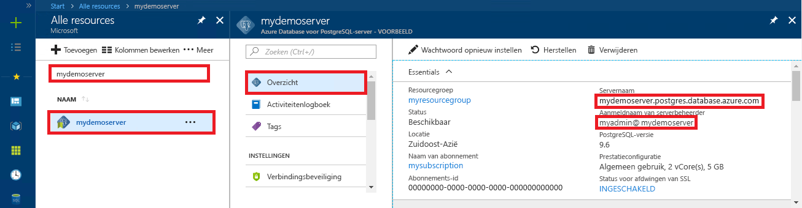

# <a name="azure-database-for-postgresql-use-python-to-connect-and-query-data"></a>Azure Database voor PostgreSQL: Python gebruiken om verbinding te maken en gegevens op te vragen
In deze quickstart ziet u hoe u met behulp van [Python](https://python.org) verbinding maakt met Azure Database PostgreSQL. U kunt ook zien hoe SQL-instructies worden gebruikt om gegevens in te voegen, bij te werken, te verwijderen en er query's op uit te voeren in de database vanaf Mac OS-, Ubuntu Linux- en Windows-platforms. In de stappen van dit artikel wordt ervan uitgegaan dat u bekend bent met het ontwikkelen met behulp van Python en geen ervaring hebt met het werken met Azure Database voor PostgreSQL.

## <a name="prerequisites"></a>Vereisten
In deze quickstart worden de resources die in een van deze handleidingen zijn gemaakt, als uitgangspunt gebruikt:
- [Database maken - Portal](quickstart-create-server-database-portal.md)
- [Database maken - CLI](quickstart-create-server-database-azure-cli.md)

U hebt ook het volgende nodig:
- [Python](https://www.python.org/downloads/) geïnstalleerd
- [pip](https://pip.pypa.io/en/stable/installing/)-pakket geïnstalleerd (pip is al geïnstalleerd als u werkt met binaire bestanden van Python 2 > =2.7.9 of Python 3 >=3.4 die zijn gedownload van [python.org](https://python.org).)

## <a name="install-the-python-connection-libraries-for-postgresql"></a>De Python-verbindingsbibliotheken voor PostgreSQL installeren
Installeer het [psycopg2](http://initd.org/psycopg/docs/install.html)-pakket waarmee u verbinding kunt maken met de database en er query's op kunt uitvoeren. psycopg2 is [beschikbaar op PyPI](https://pypi.python.org/pypi/psycopg2/) als [wheel](http://pythonwheels.com/)-pakketten voor de meest voorkomende platformen (Linux, OS x, Windows). Gebruik de pip-installatie om de binaire versie van de module te krijgen, inclusief alle afhankelijkheden.

1. Start op uw eigen computer een opdrachtregelinterface:
    - Op Linux start u de Bash-shell.
    - Op Mac OS start u de Terminal.
    - Op Windows, start u de opdrachtprompt vanuit het Startmenu.
2. Zorg ervoor dat u gebruikmaakt van de meest recente versie van pip door een opdracht uit te voeren zoals:
    ```cmd
    pip install -U pip
    ```

3. Voer de volgende opdracht uit om het psycopg2-pakket te installeren:
    ```cmd
    pip install psycopg2
    ```

## <a name="get-connection-information"></a>Verbindingsgegevens ophalen
Haal de verbindingsgegevens op die nodig zijn om verbinding te maken met de Azure Database voor PostgreSQL. U hebt de volledig gekwalificeerde servernaam en aanmeldingsreferenties nodig.

1. Meld u aan bij [Azure Portal](https://portal.azure.com/).
2. Klik in het menu aan de linkerkant in Azure Portal op **Alle resources** en zoek naar: **mypgserver-20170401** (de server die u hebt gemaakt).
3. Klik op de servernaam **mypgserver-20170401**.
4. Selecteer de pagina **Overzicht** van de server en noteer de **Servernaam** en de **Aanmeldingsnaam van de serverbeheerder**.
 
5. Als u uw aanmeldingsgegevens voor de server bent vergeten, gaat u naar de pagina **Overzicht** om de aanmeldingsnaam van de serverbeheerder weer te geven en indien nodig het wachtwoord opnieuw in te stellen.

## <a name="how-to-run-python-code"></a>Python-code uitvoeren
Dit artikel bevat in totaal vier codevoorbeelden. Met elk van deze codes kan een specifieke functie worden uitgevoerd. In de volgende instructies leest u hoe u een tekstbestand maakt, een codeblok invoegt en het bestand vervolgens opslaat zodat u het later kunt uitvoeren. Zorg ervoor dat vier afzonderlijke bestanden maakt, één voor elk codeblok.

- Maak een nieuw bestand in uw favoriete teksteditor.
- Kopieer en plak een van de codevoorbeelden uit de volgende secties in het tekstbestand. Vervang de parameters **host**, **dbname**, **user** en **password** door de waarden die u hebt opgegeven tijdens het maken van de server en database.
- Sla het bestand met de extensie .py (bijvoorbeeld postgres.py) op in de projectmap. Als u Windows gebruikt, selecteert u UTF-8-codering als u het bestand opslaat. 
- Start de opdrachtprompt-, Terminal- of Bash-shell en wijzig vervolgens de map in uw projectmap, bijvoorbeeld `cd postgres`.
-  Typ de Python-opdracht, gevolgd door de bestandsnaam (bijvoorbeeld `Python postgres.py`) om de code uit te voeren.

> [!NOTE]
> Vanaf Python versie 3 ziet u mogelijk de fout `SyntaxError: Missing parentheses in call to 'print'` bij het uitvoeren van de volgende codeblokken: als dit gebeurt, vervangt u elke aanroep van de opdracht `print "string"` door een functieaanroep met haakjes, zoals `print("string")`.

## <a name="connect-create-table-and-insert-data"></a>Verbinden, tabel maken en gegevens invoegen
Gebruik de volgende code om verbinding te maken en de gegevens te laden met de functie [psycopg2.connect](http://initd.org/psycopg/docs/connection.html) met een SQL-instructie **INSERT**. De functie [cursor.execute](http://initd.org/psycopg/docs/cursor.html#execute) wordt gebruikt om de SQL-query uit te voeren op de PostgreSQL-database. Vervang de parameters host, dbname, user en password door de waarden die u hebt opgegeven tijdens het maken van de server en database.

```Python
import psycopg2

# Update connection string information obtained from the portal
host = "mypgserver-20170401.postgres.database.azure.com"
user = "mylogin@mypgserver-20170401"
dbname = "mypgsqldb"
password = "<server_admin_password>"
sslmode = "require"

# Construct connection string
conn_string = "host={0} user={1} dbname={2} password={3} sslmode={4}".format(host, user, dbname, password, sslmode)
conn = psycopg2.connect(conn_string) 
print "Connection established"

cursor = conn.cursor()

# Drop previous table of same name if one exists
cursor.execute("DROP TABLE IF EXISTS inventory;")
print "Finished dropping table (if existed)"

# Create table
cursor.execute("CREATE TABLE inventory (id serial PRIMARY KEY, name VARCHAR(50), quantity INTEGER);")
print "Finished creating table"

# Insert some data into table
cursor.execute("INSERT INTO inventory (name, quantity) VALUES (%s, %s);", ("banana", 150))
cursor.execute("INSERT INTO inventory (name, quantity) VALUES (%s, %s);", ("orange", 154))
cursor.execute("INSERT INTO inventory (name, quantity) VALUES (%s, %s);", ("apple", 100))
print "Inserted 3 rows of data"

# Cleanup
conn.commit()
cursor.close()
conn.close()
```

Als de code wordt uitgevoerd, ziet de uitvoer er als volgt uit:


## <a name="read-data"></a>Gegevens lezen
Gebruik de volgende code om de gegevens te lezen die zijn ingevoegd met behulp van de functie [cursor.execute](http://initd.org/psycopg/docs/cursor.html#execute) met de SQL-instructie **SELECT**. Deze functie accepteert een query en retourneert een resultatenset die met behulp van [cursor.fetchall()](http://initd.org/psycopg/docs/cursor.html#cursor.fetchall) kan worden herhaald. Vervang de parameters host, dbname, user en password door de waarden die u hebt opgegeven tijdens het maken van de server en database.

```Python
import psycopg2

# Update connection string information obtained from the portal
host = "mypgserver-20170401.postgres.database.azure.com"
user = "mylogin@mypgserver-20170401"
dbname = "mypgsqldb"
password = "<server_admin_password>"
sslmode = "require"

# Construct connection string
conn_string = "host={0} user={1} dbname={2} password={3} sslmode={4}".format(host, user, dbname, password, sslmode)
conn = psycopg2.connect(conn_string) 
print "Connection established"

cursor = conn.cursor()

# Fetch all rows from table
cursor.execute("SELECT * FROM inventory;")
rows = cursor.fetchall()

# Print all rows
for row in rows:
    print "Data row = (%s, %s, %s)" %(str(row[0]), str(row[1]), str(row[2]))

# Cleanup
conn.commit()
cursor.close()
conn.close()
```

## <a name="update-data"></a>Gegevens bijwerken
Gebruik de volgende code om met de SQL-instructie **UPDATE** de inventarisrij bij te werken die u eerder hebt ingevoegd met behulp van de functie [cursor.execute](http://initd.org/psycopg/docs/cursor.html#execute). Vervang de parameters host, dbname, user en password door de waarden die u hebt opgegeven tijdens het maken van de server en database.

```Python
import psycopg2

# Update connection string information obtained from the portal
host = "mypgserver-20170401.postgres.database.azure.com"
user = "mylogin@mypgserver-20170401"
dbname = "mypgsqldb"
password = "<server_admin_password>"
sslmode = "require"

# Construct connection string
conn_string = "host={0} user={1} dbname={2} password={3} sslmode={4}".format(host, user, dbname, password, sslmode)
conn = psycopg2.connect(conn_string) 
print "Connection established"

cursor = conn.cursor()

# Update a data row in the table
cursor.execute("UPDATE inventory SET quantity = %s WHERE name = %s;", (200, "banana"))
print "Updated 1 row of data"

# Cleanup
conn.commit()
cursor.close()
conn.close()
```

## <a name="delete-data"></a>Gegevens verwijderen
Gebruik de volgende code om met de SQL-instructie **DELETE** de inventarisrij te verwijderen die u eerder hebt ingevoegd met behulp van de functie [cursor.execute](http://initd.org/psycopg/docs/cursor.html#execute). Vervang de parameters host, dbname, user en password door de waarden die u hebt opgegeven tijdens het maken van de server en database.

```Python
import psycopg2

# Update connection string information obtained from the portal
host = "mypgserver-20170401.postgres.database.azure.com"
user = "mylogin@mypgserver-20170401"
dbname = "mypgsqldb"
password = "<server_admin_password>"
sslmode = "require"

# Construct connection string
conn_string = "host={0} user={1} dbname={2} password={3} sslmode={4}".format(host, user, dbname, password, sslmode)
conn = psycopg2.connect(conn_string) 
print "Connection established"

cursor = conn.cursor()

# Delete data row from table
cursor.execute("DELETE FROM inventory WHERE name = %s;", ("orange",))
print "Deleted 1 row of data"

# Cleanup
conn.commit()
cursor.close()
conn.close()
```

## <a name="next-steps"></a>Volgende stappen
> [!div class="nextstepaction"]
> [Een database migreren met behulp van Exporteren en importeren](./howto-migrate-using-export-and-import.md)
