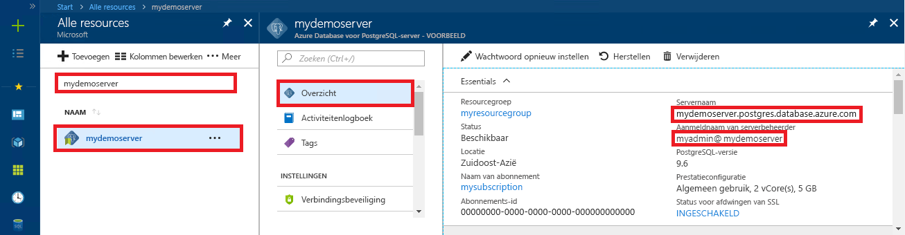

# <a name="azure-database-for-postgresql-use-ruby-to-connect-and-query-data"></a>Azure Database voor PostgreSQL: Ruby gebruiken om verbinding te maken en gegevens op te vragen
In deze snelstartgids ziet u hoe u met behulp van een [Ruby](https://www.ruby-lang.org)-toepassing verbinding maakt met een Azure Database voor PostgreSQL. U ziet hier hoe u SQL-instructies gebruikt om gegevens in de database op te vragen, in te voegen, bij te werken en te verwijderen. In de stappen van dit artikel wordt ervan uitgegaan dat u bekend bent met het ontwikkelen met behulp van Ruby en geen ervaring hebt met het werken met Azure Database for PostgreSQL.

## <a name="prerequisites"></a>Vereisten
In deze snelstartgids worden de resources die in een van deze handleidingen zijn gemaakt, als uitgangspunt gebruikt:
- [Database maken - Portal](quickstart-create-server-database-portal.md)
- [Database maken - Azure CLI](quickstart-create-server-database-azure-cli.md)

## <a name="install-ruby"></a>Ruby installeren
Installeer Ruby op uw eigen machine. 

### <a name="windows"></a>Windows
- Download en installeer de nieuwste versie van [Ruby](http://rubyinstaller.org/downloads/).
- Op het voltooiingsscherm van het MSI-installatieprogramma schakelt u het selectievakje in bij 'ridk install' uitvoeren om MSYS2 en de ontwikkelingsketen voor het hulpprogramma te installeren. Klik vervolgens op **Voltooien** om het volgende installatieprogramma te openen.
- Het installatieprogramma RubyInstaller2 voor Windows wordt gestart. Voer 2 in om de MSYS2-opslagplaatsupdate te installeren. Wanneer het installeren is voltooid en u terugkeert naar het installatieprompt, sluit u het opdrachtvenster.
- Open een nieuw opdrachtprompt (cmd) vanuit het menu Start.
- Test de Ruby-installatie `ruby -v` om te bekijken welke versie is geïnstalleerd.
- Test de Gem-installatie `gem -v` om te bekijken welke versie is geïnstalleerd.
- Bouw de PostgreSQL-module voor Ruby. Gebruik hiervoor Gem en voer de opdracht `gem install pg` uit.

### <a name="macos"></a>MacOS
- Installeer Ruby met Homebrew. Voer daarvoor de opdracht `brew install ruby` uit. Zie de Ruby-[documentatie voor installatie](https://www.ruby-lang.org/en/documentation/installation/#homebrew) voor meer installatieopties
- Test de Ruby-installatie `ruby -v` om te bekijken welke versie is geïnstalleerd.
- Test de Gem-installatie `gem -v` om te bekijken welke versie is geïnstalleerd.
- Bouw de PostgreSQL-module voor Ruby. Gebruik hiervoor Gem en voer de opdracht `gem install pg` uit.

### <a name="linux-ubuntu"></a>Linux (Ubuntu)
- Installeer Ruby door de opdracht `sudo apt-get install ruby-full` uit te voeren. Zie de Ruby-[documentatie voor installatie](https://www.ruby-lang.org/en/documentation/installation/) voor meer installatieopties.
- Test de Ruby-installatie `ruby -v` om te bekijken welke versie is geïnstalleerd.
- Installeer de nieuwste updates voor Gem door de opdracht `sudo gem update --system` uit te voeren.
- Test de Gem-installatie `gem -v` om te bekijken welke versie is geïnstalleerd.
- Installeer gcc, make en andere buildhulpprogramma's door de opdracht `sudo apt-get install build-essential` uit te voeren.
- Installeer de PostgreSQL-bibliotheken door de opdracht `sudo apt-get install libpq-dev` uit te voeren.
- Bouw de Ruby pg-module met behulp van Gem. Voer daarvoor de opdracht `sudo gem install pg` uit.

## <a name="run-ruby-code"></a>Ruby-code uitvoeren 
- Sla de code op in een tekstbestand en sla het bestand op met de bestandsextensie .rb in een projectmap, zoals `C:\rubypostgres\read.rb` of `/home/username/rubypostgres/read.rb`
- Voor het uitvoeren van de code opent u het opdrachtprompt of de bash-shell. Verander de map in de projectmap `cd rubypostgres` en typ de opdracht `ruby read.rb` om de toepassing uit te voeren.

## <a name="get-connection-information"></a>Verbindingsgegevens ophalen
Haal de verbindingsgegevens op die nodig zijn om verbinding te maken met de Azure Database voor PostgreSQL. U hebt de volledig gekwalificeerde servernaam en aanmeldingsreferenties nodig.

1. Meld u aan bij [Azure Portal](https://portal.azure.com/).
2. Klik in het menu aan de linkerkant in Azure Portal op **Alle resources** en zoek naar de server die u hebt gemaakt (bijvoorbeeld **mydemoserver**).
3. Klik op de servernaam.
4. Ga naar het venster **Overzicht** van de server en noteer de **Servernaam** en de **Aanmeldingsnaam van de serverbeheerder**. Als u uw wachtwoord vergeet, kunt u het wachtwoord in dit venster opnieuw instellen.
 

## <a name="connect-and-create-a-table"></a>Verbinding maken en een tabel maken
Gebruik de volgende code om een tabel te verbinden en te maken met de SQL-instructie **CREATE TABLE**, gevolgd door **INSERT INTO**-instructies om rijen in de tabel toe te voegen.

In de code wordt het object [PG::Connection](http://www.rubydoc.info/gems/pg/PG/Connection) gebruikt met de constructor [new()](http://www.rubydoc.info/gems/pg/PG%2FConnection:initialize) om verbinding te maken met Azure Database voor PostgreSQL. Vervolgens wordt de methode [exec()](http://www.rubydoc.info/gems/pg/PG/Connection#exec-instance_method) aangeroepen op de opdrachten DROP, CREATE TABLE en INSERT INTO uit te voeren. Met de code wordt met de klasse [PG::Error](http://www.rubydoc.info/gems/pg/PG/Error) gecontroleerd op fouten. Vervolgens wordt methode [close()](http://www.rubydoc.info/gems/pg/PG/Connection#lo_close-instance_method) aangeroepen om de verbinding vóór het sluiten te verbreken.

Vervang de tekenreeksen `host`, `database`, `user` en `password` door uw eigen waarden. 
```ruby
require 'pg'

begin
    # Initialize connection variables.
    host = String('mydemoserver.postgres.database.azure.com')
    database = String('postgres')
    user = String('mylogin@mydemoserver')
    password = String('<server_admin_password>')

    # Initialize connection object.
    connection = PG::Connection.new(:host => host, :user => user, :dbname => database, :port => '5432', :password => password)
    puts 'Successfully created connection to database'

    # Drop previous table of same name if one exists
    connection.exec('DROP TABLE IF EXISTS inventory;')
    puts 'Finished dropping table (if existed).'

    # Drop previous table of same name if one exists.
    connection.exec('CREATE TABLE inventory (id serial PRIMARY KEY, name VARCHAR(50), quantity INTEGER);')
    puts 'Finished creating table.'

    # Insert some data into table.
    connection.exec("INSERT INTO inventory VALUES(1, 'banana', 150)")
    connection.exec("INSERT INTO inventory VALUES(2, 'orange', 154)")
    connection.exec("INSERT INTO inventory VALUES(3, 'apple', 100)")
    puts 'Inserted 3 rows of data.'

rescue PG::Error => e
    puts e.message 
    
ensure
    connection.close if connection
end
```

## <a name="read-data"></a>Gegevens lezen
Gebruik de volgende code om verbinding te maken en de gegevens te lezen met de SQL-instructie **SELECT**. 

In de code wordt het object [PG::Connection](http://www.rubydoc.info/gems/pg/PG/Connection) gebruikt met de constructor [new()](http://www.rubydoc.info/gems/pg/PG%2FConnection:initialize) om verbinding te maken met Azure Database voor PostgreSQL. De methode [exec()](http://www.rubydoc.info/gems/pg/PG/Connection#exec-instance_method) wordt dan aangeroepen om de opdracht SELECT uit te voeren. De resultaten worden in een resultatenset opgeslagen. De resultatensetverzameling wordt herhaald met de lus `resultSet.each do`. De huidige rijwaarden worden opgeslagen in de variabele `row`. Met de code wordt met de klasse [PG::Error](http://www.rubydoc.info/gems/pg/PG/Error) gecontroleerd op fouten. Vervolgens wordt methode [close()](http://www.rubydoc.info/gems/pg/PG/Connection#lo_close-instance_method) aangeroepen om de verbinding vóór het sluiten te verbreken.

Vervang de tekenreeksen `host`, `database`, `user` en `password` door uw eigen waarden. 

```ruby
require 'pg'

begin
    # Initialize connection variables.
    host = String('mydemoserver.postgres.database.azure.com')
    database = String('postgres')
    user = String('mylogin@mydemoserver')
    password = String('<server_admin_password>')

    # Initialize connection object.
    connection = PG::Connection.new(:host => host, :user => user, :database => dbname, :port => '5432', :password => password)
    puts 'Successfully created connection to database.'

    resultSet = connection.exec('SELECT * from inventory;')
    resultSet.each do |row|
        puts 'Data row = (%s, %s, %s)' % [row['id'], row['name'], row['quantity']]
    end

rescue PG::Error => e
    puts e.message 
    
ensure
    connection.close if connection
end
```

## <a name="update-data"></a>Gegevens bijwerken
Gebruik de volgende code om verbinding te maken en de gegevens bij te werken met de SQL-instructie **UPDATE**.

In de code wordt het object [PG::Connection](http://www.rubydoc.info/gems/pg/PG/Connection) gebruikt met de constructor [new()](http://www.rubydoc.info/gems/pg/PG%2FConnection:initialize) om verbinding te maken met Azure Database voor PostgreSQL. Vervolgens wordt de methode [exec()](http://www.rubydoc.info/gems/pg/PG/Connection#exec-instance_method) aangeroepen om de opdracht UPDATE uit te voeren. Met de code wordt met de klasse [PG::Error](http://www.rubydoc.info/gems/pg/PG/Error) gecontroleerd op fouten. Vervolgens wordt methode [close()](http://www.rubydoc.info/gems/pg/PG/Connection#lo_close-instance_method) aangeroepen om de verbinding vóór het sluiten te verbreken.

Vervang de tekenreeksen `host`, `database`, `user` en `password` door uw eigen waarden. 

```ruby
require 'pg'

begin
    # Initialize connection variables.
    host = String('mydemoserver.postgres.database.azure.com')
    database = String('postgres')
    user = String('mylogin@mydemoserver')
    password = String('<server_admin_password>')

    # Initialize connection object.
    connection = PG::Connection.new(:host => host, :user => user, :dbname => database, :port => '5432', :password => password)
    puts 'Successfully created connection to database.'

    # Modify some data in table.
    connection.exec('UPDATE inventory SET quantity = %d WHERE name = %s;' % [200, '\'banana\''])
    puts 'Updated 1 row of data.'

rescue PG::Error => e
    puts e.message 
    
ensure
    connection.close if connection
end
```


## <a name="delete-data"></a>Gegevens verwijderen
Gebruik de volgende code om verbinding te maken en de gegevens te lezen met de SQL-instructie **DELETE**. 

In de code wordt het object [PG::Connection](http://www.rubydoc.info/gems/pg/PG/Connection) gebruikt met de constructor [new()](http://www.rubydoc.info/gems/pg/PG%2FConnection:initialize) om verbinding te maken met Azure Database voor PostgreSQL. Vervolgens wordt de methode [exec()](http://www.rubydoc.info/gems/pg/PG/Connection#exec-instance_method) aangeroepen om de opdracht UPDATE uit te voeren. Met de code wordt met de klasse [PG::Error](http://www.rubydoc.info/gems/pg/PG/Error) gecontroleerd op fouten. Vervolgens wordt methode [close()](http://www.rubydoc.info/gems/pg/PG/Connection#lo_close-instance_method) aangeroepen om de verbinding vóór het sluiten te verbreken.

Vervang de tekenreeksen `host`, `database`, `user` en `password` door uw eigen waarden. 

```ruby
require 'pg'

begin
    # Initialize connection variables.
    host = String('mydemoserver.postgres.database.azure.com')
    database = String('postgres')
    user = String('mylogin@mydemoserver')
    password = String('<server_admin_password>')

    # Initialize connection object.
    connection = PG::Connection.new(:host => host, :user => user, :dbname => database, :port => '5432', :password => password)
    puts 'Successfully created connection to database.'

    # Modify some data in table.
    connection.exec('DELETE FROM inventory WHERE name = %s;' % ['\'orange\''])
    puts 'Deleted 1 row of data.'

rescue PG::Error => e
    puts e.message 
    
ensure
    connection.close if connection
end
```

## <a name="next-steps"></a>Volgende stappen
> [!div class="nextstepaction"]
> [Een database migreren met behulp van Exporteren en importeren](./howto-migrate-using-export-and-import.md)
