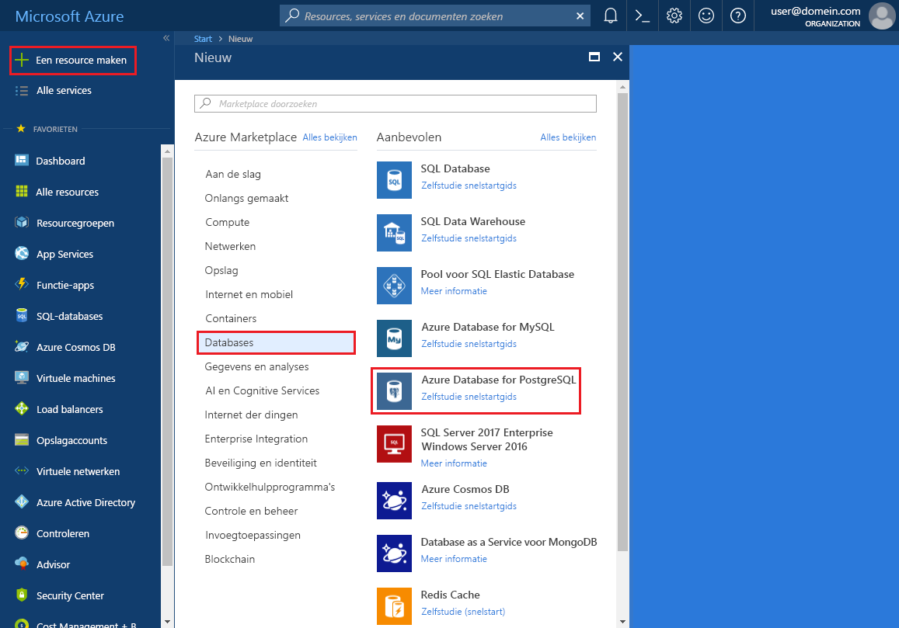
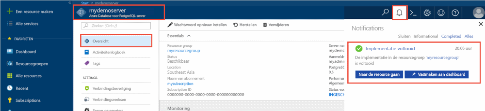
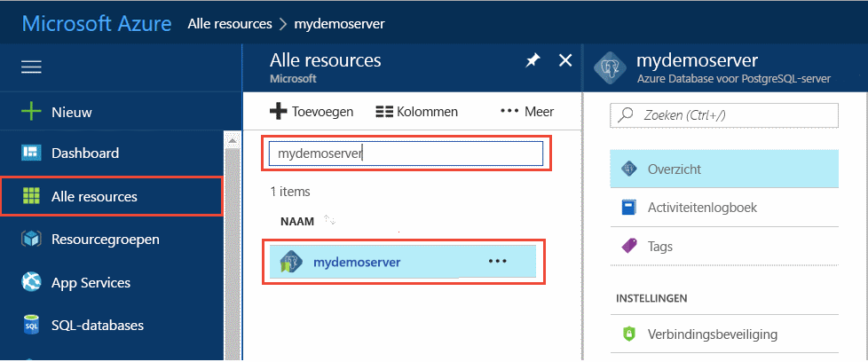
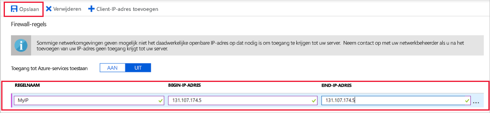
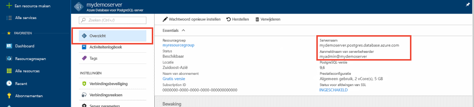
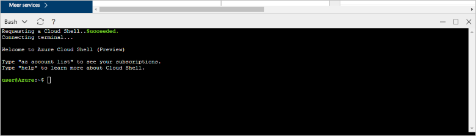
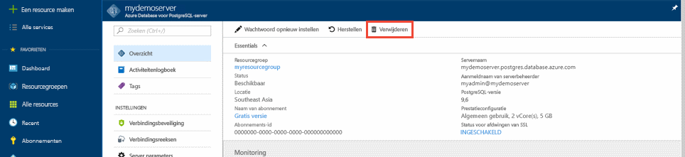

# <a name="create-an-azure-database-for-postgresql-server-in-the-azure-portal"></a>Een Azure Database for PostgreSQL-server maken in Azure Portal

Azure Database for PostgreSQL is een beheerde service waarmee u PostgreSQL-databases met hoge beschikbaarheid in de cloud kunt uitvoeren, beheren en schalen. In deze Quick Start ontdekt u hoe u in ongeveer vijf minuten een Azure Database for PostgreSQL-server maakt in Azure Portal.

Als u nog geen abonnement op Azure hebt, maak dan een [gratis Azure-account](https://azure.microsoft.com/free/) aan voordat u begint.

## <a name="sign-in-to-the-azure-portal"></a>Aanmelden bij Azure Portal
Open uw webbrowser en ga naar de [portal](https://portal.azure.com/). Voer uw referenties in om u aan te melden bij de portal. De standaardweergave is uw service-dashboard.

## <a name="create-an-azure-database-for-postgresql-server"></a>Een Azure-database voor PostgreSQL-server maken

Een Azure Database voor PostgreSQL-server wordt gemaakt met een gedefinieerde set [reken- en opslagresources](./concepts-compute-unit-and-storage.md). De server wordt gemaakt in een [Azure-resourcegroep](../azure-resource-manager/resource-group-overview.md).

Volg deze stappen voor het maken van een Azure Database for PostgreSQL-server:
1. Selecteer de knop **Nieuw** (+) in de linkerbovenhoek van de portal.

2. Selecteer **Databases** > **Azure Database for PostgreSQL**.

    

3. Vul het formulier voor gegevens van de nieuwe server in met de volgende informatie, zoals in de voorgaande afbeelding wordt weergegeven:

    Instelling|Voorgestelde waarde|Beschrijving
    ---|---|---
    Servernaam |*mypgserver-20170401*|Een unieke naam ter identificatie van uw Azure Database for PostgreSQL-server. De domeinnaam *postgres.database.azure.com* wordt toegevoegd aan de naam van de server die u opgeeft. De server mag alleen kleine letters, cijfers en het koppelteken (-) bevatten. Hij moet ten minste 3 en mag maximaal 63 tekens bevatten.
    Abonnement|Uw abonnement|Het Azure-abonnement dat u wilt gebruiken voor uw server. Als u meerdere abonnementen hebt, kiest u het abonnement waarin u wordt gefactureerd voor de resource.
    Resourcegroep|*myresourcegroup*| Een nieuwe resourcegroepnaam of een bestaande naam uit uw abonnement.
    Aanmeldgegevens van serverbeheerder |*mylogin*| Uw eigen aanmeldingsaccount dat moet worden gebruikt om verbinding te maken met de server. De aanmeldingsnaam voor de beheerder mag niet **azure_superuser,** **azure_pg_admin,** **admin,** **administrator,** **root,** **guest** of **public** zijn. De naam mag niet met **pg_** beginnen.
    Wachtwoord |Uw keuze | Een nieuw wachtwoord voor het beheerdersaccount voor de server. Het wachtwoord moet tussen 8 en 128 tekens lang zijn. Uw wachtwoord moet tekens bevatten uit drie van de volgende categorieën: Nederlandse hoofdletters, Nederlandse kleine letters, cijfers (0 tot en met 9) en niet-alfanumerieke tekens (!, $, #, % etc.).
    Locatie|De regio het dichtst bij uw gebruikers| De locatie die het dichtst bij uw gebruikers is.
    PostgreSQL-versie|De nieuwste versie| De nieuwste versie, tenzij u specifieke vereisten hebt.
    Prijscategorie | **Basic**, **50 rekeneenheden**, **50 GB** | De servicelaag en het prestatieniveau voor uw database wijzigen. Selecteer **Prijscategorie**. Selecteer vervolgens het tabblad **Basic**. Selecteer aan de linkerkant van de schuifregelaar **Rekeneenheden** zodat de waarde zo laag mogelijk is voor deze Quick Start. Selecteer **OK** om de geselecteerde prijscategorie op te slaan. Zie de volgende schermafbeelding voor meer informatie. 
    Vastmaken aan dashboard | Selecteren | Hiermee kunt u gegevens van uw server overzichtelijk weergeven op de eerste dashboardpagina van uw portal.

    > [!IMPORTANT]
    > De beheerdersaanmelding bij de server en het wachtwoord die u hier opgeeft, zijn vereist voor aanmelding bij de server en de bijbehorende databases verderop in deze Quick Start. Onthoud of noteer deze informatie voor later gebruik.

    

4. Selecteer **Maken** om de server in te richten. Dit kan maximaal 20 minuten duren.

5. Selecteer het **meldingen**pictogram op de werkbalk om het implementatieproces te bewaken.

    
   
  Standaard word een **postgres**-database op uw server gemaakt. De database [postgres](https://www.postgresql.org/docs/9.6/static/app-initdb.html) is een standaarddatabase die kan worden gebruikt door gebruikers, hulpprogramma's en toepassingen van derden. 

## <a name="configure-a-server-level-firewall-rule"></a>Een serverfirewallregel configureren

In Azure Database for PostgreSQL wordt een firewall op serverniveau gemaakt. De firewall voorkomt dat externe toepassingen en hulpprogramma's verbinding maken met de server of databases op de server, tenzij u een firewallregel maakt om de firewall te openen voor specifieke IP-adressen. 

1. Ga naar de server nadat de implementatie is voltooid. U kunt desgewenst naar de server zoeken. Selecteer bijvoorbeeld **Alle resources** in het menu aan de linkerkant. Typ de naam van de server, zoals **mypgserver-20170401**, om te zoeken naar de zojuist gemaakte server. Selecteer de naam van de server in de lijst met zoekresultaten. De pagina **Overzicht** wordt geopend voor uw server en biedt opties voor verdere configuratie.
 
    

2. Selecteer **Verbindingsbeveiliging** op de serverpagina.

    

3. Selecteer onder de kop **Firewallregels** het lege tekstvak in de kolom **Regelnaam** om te beginnen met het maken van de firewallregel. 

    Voor deze quickstart gaan we alle IP-adressen tot de server toelaten. Vul in het tekstvak in elke kolom de volgende waarden in:

    Regelnaam | Start-IP | Eind-IP 
    ---|---|---
    AllowAllIps | 0.0.0.0 | 255.255.255.255

4. Selecteer **Opslaan** op de bovenste werkbalk van de pagina **Verbindingsbeveiliging**. Ga pas verder als u de melding ziet dat de verbindingsbeveiliging is bijgewerkt.

    > [!NOTE]
    > Verbindingen met uw Azure Database voor PostgreSQL-server communiceren via poort 5432. Als u verbinding wilt maken vanuit een bedrijfsnetwerk, is uitgaand verkeer via poort 5432 mogelijk niet toegestaan vanwege de firewall van het netwerk. In dat geval kunt u alleen verbinding maken met uw server als uw IT-afdeling poort 5432 openstelt.
    >

## <a name="get-the-connection-information"></a>De verbindingsgegevens ophalen

Wanneer u de Azure Database for PostgreSQL-server maakt, wordt een standaarddatabase met de naam **postgres** gemaakt. Voor verbinding met uw databaseserver, hebt u de volledige servernaam en aanmeldingsreferenties van de beheerder nodig. U hebt deze waarden mogelijk al eerder in dit artikel genoteerd. Als u dat niet hebt gedaan, kunt u de servernaam en aanmeldingsgegevens gemakkelijk terugvinden op de **overzichtspagina** voor de server in de portal.

Open de pagina **Overzicht** van de server. Noteer de **servernaam** en de **gebruikersnaam van de serverbeheerder**. Beweeg de cursor over elk veld. Het kopieersymbool wordt rechts van de tekst weergegeven. Selecteer het kopieerpictogram indien nodig om de waarden te kopiëren.

 

## <a name="connect-to-the-postgresql-database-by-using-psql-in-cloud-shell"></a>Verbinding maken met de PostgreSQL-database met behulp van psql in Cloud Shell

Er zijn een aantal toepassingen die kunt gebruiken om verbinding te maken met uw Azure Database voor PostgreSQL-server. We gaan eerst het opdrachtregelprogramma psql gebruiken om te laten zien hoe u verbinding maakt met de server. U kunt een webbrowser en Azure Cloud Shell gebruiken zoals hier wordt beschreven, zonder dat u extra software hoeft te installeren. Als het hulpprogramma psql lokaal op uw computer is geïnstalleerd, kunt u dit ook gebruiken om verbinding te maken.

1. Selecteer in het bovenste navigatiedeelvenster het terminalsymbool om Cloud Shell te openen.

   

2. Cloud Shell wordt geopend in uw browser, zodat u Bash shell-opdrachten kunt invoeren.

   

3. Maak bij de Cloud Shell-prompt verbinding met een database in uw Azure Database for PostgreSQL-server door de psql-opdrachtregel te typen.

    Als u verbinding wilt maken met een Azure Database for PostgreSQL-server via het [psql](https://www.postgresql.org/docs/9.6/static/app-psql.html)-hulpprogramma, moet u de volgende indeling gebruiken:
    ```bash
    psql --host=<yourserver> --port=<port> --username=<server admin login> --dbname=<database name>
    ```

    De volgende opdracht maakt bijvoorbeeld verbinding met een voorbeeldserver:

    ```bash
    psql --host=mypgserver-20170401.postgres.database.azure.com --port=5432 --username=mylogin@mypgserver-20170401 --dbname=postgres
    ```

    psql parameter |Voorgestelde waarde|Beschrijving
    ---|---|---
    --host | Servernaam | De servernaam die u hebt gebruikt toen u eerder de Azure Database for PostgreSQL-server hebt gemaakt. De weergegeven voorbeeldserver is **mypgserver-20170401.postgres.database.azure.com**. Gebruik de FQDN (Fully Qualified Domain Name) (**\*. postgres.database.azure.com**) zoals weergegeven in het voorbeeld. Als u de servernaam niet meer weet, volgt u de stappen in de vorige sectie om de verbindingsgegevens op te halen. 
    --poort | 5432 | De poort die moet worden gebruikt wanneer u verbinding maakt met de Azure Database for PostgreSQL-server. 
    --gebruikersnaam | Aanmeldingsnaam van serverbeheerder |De aanmeldingsnaam van de serverbeheerder die u hebt opgegeven toen u de Azure Database for PostgreSQL-server eerder hebt gemaakt. Als u uw gebruikersnaam niet meer weet, volgt u de stappen in de vorige sectie om de verbindingsgegevens op te halen. De indeling is *username@servername*.
    --dbnaam | *postgres* | De standaardnaam voor de database die door het systeem is gegenereerd voor de eerste verbinding. Later gaat u uw eigen database maken.

    Nadat u de psql-opdracht met uw eigen parameterwaarden hebt uitgevoerd, wordt u gevraagd het wachtwoord van de serverbeheerder in te voeren. Dit is het wachtwoord dat u hebt opgegeven tijdens het maken van de server. 

    psql parameter |Voorgestelde waarde|Beschrijving
    ---|---|---
    wachtwoord | Uw beheerderswachtwoord | De getypte wachtwoordtekens worden niet weergegeven bij de bash-prompt. Nadat u alle tekens hebt getypt, moet u **Enter** selecteren om te verifiëren en verbinding te maken.

    Als de verbinding tot stand is gebracht, wordt er door het hulpprogramma psql een postgres-prompt weergegeven. Hier kunt u sql-opdrachten typen. In de uitvoer van de eerste verbinding kan een waarschuwing worden weergegeven omdat de psql in de Cloud Shell misschien niet dezelfde versie heeft als de Azure Database for PostgreSQL-server. 
    
    Voorbeeld van psql-uitvoer:
    ```bash
    psql (9.5.7, server 9.6.2)
    WARNING: psql major version 9.5, server major version 9.6.
        Some psql features might not work.
    SSL connection (protocol: TLSv1.2, cipher: ECDHE-RSA-AES256-SHA384, bits: 256, compression: off)
    Type "help" for help.
   
    postgres=> 
    ```

    > [!TIP]
    > Als de firewall niet is geconfigureerd voor het toestaan van het IP-adres van Cloud Shell, wordt het volgende foutbericht weergegeven:
    > 
    > "psql: FATAL:  no pg_hba.conf entry for host "138.91.195.82", user "mylogin", database "postgres", SSL on FATAL: SSL connection is required. Please specify SSL options and retry.
    > 
    > U kunt deze fout oplossen door ervoor te zorgen dat de serverconfiguratie overeenkomt met de stappen in de sectie 'Een serverfirewallregel configureren' van dit artikel.

4. Maak een lege database door bij de prompt de volgende opdracht te typen:
    ```bash
    CREATE DATABASE mypgsqldb;
    ```
    Het uitvoeren van de opdracht kan enkele minuten duren. 

5. In de prompt voert u de volgende opdracht uit om verbinding te maken met de zojuist gemaakte database **mypgsqldb**:
    ```bash
    \c mypgsqldb
    ```

6. Typ `\q` en druk vervolgens op **Enter** om het mysql af te sluiten. U kunt Cloud Shell sluiten als u klaar bent.

U hebt nu verbinding met de Azure Database for PostgreSQL-server en u hebt een lege gebruikersdatabase gemaakt. Ga verder met de volgende sectie om verbinding te maken via een ander algemeen hulpprogramma: pgAdmin.

## <a name="connect-to-the-postgresql-database-by-using-pgadmin"></a>Verbinding maken met de PostgreSQL-database met behulp van pgAdmin

Verbinding maken met de Azure PostgreSQL-server met behulp van het GUI-hulpprogramma pgAdmin:
1. Start de toepassing pgAdmin op uw clientcomputer. U kunt pgAdmin installeren vanaf de [pgAdmin-website](http://www.pgadmin.org/).

2. Selecteer op de dashboardpagina onder de sectie **Snelle koppelingen** het symbool om een **nieuwe server toe te voegen**.

3. In het dialoogvenster **Create - Server** gaat u naar het tabblad **General** en voert u een unieke beschrijvende naam in voor de server, zoals **Azure PostgreSQL-server**.

    

4. In het dialoogvenster **Create - Server** gaat u naar het tabblad **Connection**, gebruikt u de opgegeven instellingen en selecteert u **Save**.

   

    Parameter pgAdmin |Voorgestelde waarde|Beschrijving
    ---|---|---
    Host Name/Address | Servernaam | De servernaam die u hebt gebruikt toen u eerder de Azure Database for PostgreSQL-server hebt gemaakt. Onze voorbeeldserver is **mypgserver-20170401.postgres.database.azure.com.** Gebruik de FQDN (Fully Qualified Domain Name) (**\*. postgres.database.azure.com**) zoals weergegeven in het voorbeeld. Als u de servernaam niet meer weet, volgt u de stappen in de vorige sectie om de verbindingsgegevens op te halen. 
    Poort | 5432 | De poort die moet worden gebruikt wanneer u verbinding maakt met de Azure Database for PostgreSQL-server. 
    Onderhoudsdatabase | *postgres* | De door het systeem gegenereerde standaarddatabasenaam.
    Gebruikersnaam | Aanmeldingsnaam van serverbeheerder | De aanmeldingsnaam van de serverbeheerder die u hebt opgegeven toen u de Azure Database for PostgreSQL-server eerder hebt gemaakt. Als u de gebruikersnaam niet meer weet, volgt u de stappen in de vorige sectie om de verbindingsgegevens op te halen. De indeling is *username@servername*.
    Wachtwoord | Uw beheerderswachtwoord | Het wachtwoord dat u hebt gekozen toen u eerder in deze Quick Start de server maakte.
    Rol | Leeg laten | U hoeft op dit moment geen rolnaam op te geven. Laat het veld leeg.
    SSL-modus | Vereist | Standaard worden alle Azure PostgreSQL-servers gemaakt waarbij SSL geforceerd wordt ingeschakeld. Zie [SSL afdwingen](./concepts-ssl-connection-security.md) als u geforceerd SSL wilt uitschakelen.
    
5. Selecteer **Opslaan**.

6. Vouw in het linkerdeelvenster **Browser** het knooppunt **Server** uit. Selecteer uw server, bijvoorbeeld de **Azure PostgreSQL-server**. Klik erop om er verbinding mee te maken.

7. Vouw het knooppunt Servers uit en vouw vervolgens **Databases** eronder uit. De lijst moet uw bestaande *postgres*-database bevatten, evenals de gebruikersdatabase **mypgsqldb** die in de vorige sectie is gemaakt. U kunt met Azure Database for PostgreSQL meerdere databases per server maken.

8. Klik met de rechtermuisknop op **Databases**, kies het menu **Create** en selecteer **Database**.

9. Typ een naam voor de database in het veld **Database**, zoals **mypgsqldb** uit het voorbeeld.

10. Selecteer bij **Owner** de eigenaar voor de database uit de keuzelijst. Kies de aanmeldingsnaam van de serverbeheerder, zoals **mylogin** uit het voorbeeld.

11. Klik op **Save** om een nieuwe, lege database te maken.

12. In het deelvenster **Browser** ziet u de database die u hebt gemaakt nu in de lijst met databases onder de naam van uw server.

    


## <a name="clean-up-resources"></a>Resources opschonen
De resources die u hebt gemaakt in de Quick Start kunt u op een van de volgende twee manieren opschonen. U kunt de [Azure-resourcegroep](../azure-resource-manager/resource-group-overview.md) verwijderen, met alle resources uit de resourcegroep. Als u de andere resources intact wilt houden, verwijdert u alleen de ene serverresource.

> [!TIP]
> Andere Quick Starts in deze verzameling zijn op deze Quick Start gebaseerd. Als u van plan bent om ook deze Quick Starts te volgen, moet u geen resources opschonen die u in deze Quick Start hebt gemaakt. Als u niet wilt doorgaan, gebruikt u de volgende stappen om resources te verwijderen die tijdens deze Quick Start in de portal zijn gemaakt.

De hele resourcegroep verwijderen, met inbegrip van de nieuwe server:
1. Zoek de resourcegroep in de portal. Selecteer **Resourcegroepen** in het menu aan de linkerkant. Selecteer vervolgens de naam van de resourcegroep, zoals in het voorbeeld **myresourcegroup**.

2. Selecteer **Verwijderen** op de pagina van de resourcegroep. Typ vervolgens de naam van de resourcegroep, zoals **myresourcegroup** uit het voorbeeld, in het tekstvak om het verwijderen te bevestigen. Selecteer **Verwijderen**.

Alleen de zojuist gemaakte server verwijderen:
1. Als de server niet is geopend, zoekt u de server in de portal. Selecteer **Alle resources** in het menu aan de linkerkant. Zoek vervolgens naar de server die u hebt gemaakt.

2. Selecteer **Verwijderen** op de pagina **Overzicht**.

    

3. Controleer de naam van de server die u gaat verwijderen en kijk welke databases eveneens worden verwijderd. Typ de naam van uw server in het tekstvak, zoals **mypgserver-20170401** uit het voorbeeld. Selecteer **Verwijderen**.

## <a name="next-steps"></a>Volgende stappen
> [!div class="nextstepaction"]
> [Een database migreren met behulp van Exporteren en importeren](./howto-migrate-using-export-and-import.md)
