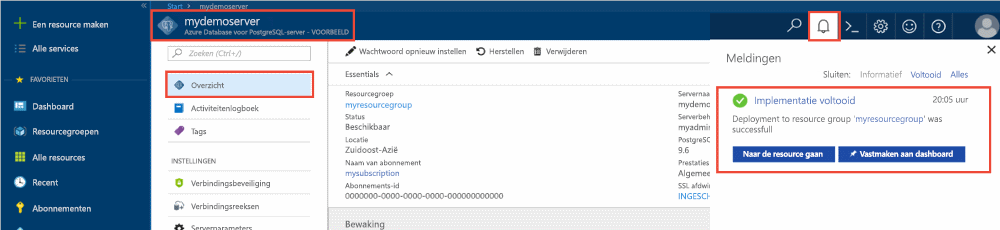
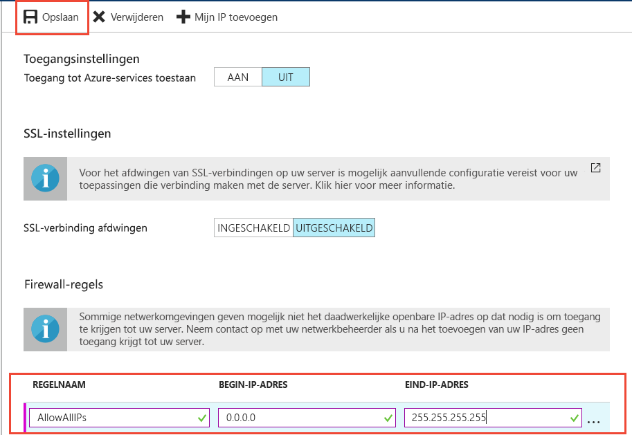
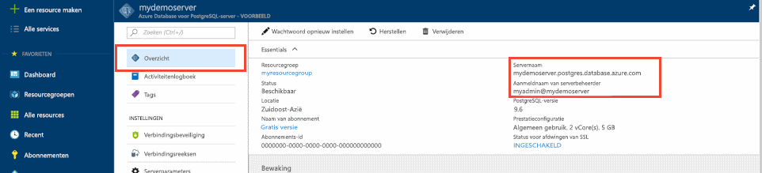

# <a name="design-your-first-azure-database-for-postgresql-using-the-azure-portal"></a>Ontwerp van uw eerste Azure-Database voor PostgreSQL met de Azure portal

Azure Database voor PostgreSQL is een beheerde service waarmee u PostgreSQL-databases met hoge beschikbaarheid in de cloud kunt uitvoeren, beheren en schalen. Met de Azure portal, kunt u eenvoudig beheren van uw server en ontwerpen van een database.

In deze zelfstudie maakt u de Azure portal gebruiken voor meer informatie over hoe:
> [!div class="checklist"]
> * Een Azure-database voor PostgreSQL-server maken
> * De serverfirewall configureren
> * Gebruik [ **psql** ](https://www.postgresql.org/docs/9.6/static/app-psql.html) hulpprogramma voor het maken van een database
> * Voorbeeldgegevens laden
> * Querygegevens
> * Gegevens bijwerken
> * Gegevens terugzetten

## <a name="prerequisites"></a>Vereisten
Als u nog geen Azure-abonnement hebt, maakt u een [gratis account](https://azure.microsoft.com/free/) voordat u begint.

## <a name="log-in-to-the-azure-portal"></a>Aanmelden bij Azure Portal
Meld u aan bij [Azure Portal](https://portal.azure.com).

## <a name="create-an-azure-database-for-postgresql"></a>Een Azure Database voor PostgreSQL-server maken

Een Azure Database voor PostgreSQL-server wordt gemaakt met een gedefinieerde set [reken- en opslagresources](./concepts-compute-unit-and-storage.md). De server wordt gemaakt in een [Azure-resourcegroep](../azure-resource-manager/resource-group-overview.md).

Volg deze stappen voor het maken van een Azure Database voor PostgreSQL-server:
1.  Klik op de **+ nieuw** knop gevonden in de linkerbovenhoek van de Azure portal.
2.  Selecteer **Databases** op de pagina **Nieuw** en selecteer **Azure Database voor PostgreSQL** op de pagina **Databases**.
 

3.  Vul het formulier voor gegevens van nieuwe server in met de volgende informatie, zoals in de voorgaande afbeelding wordt weergegeven:
    - Servernaam: **mypgserver-20170401** (de servernaam verwijst naar een DNS-naam en moet daarom wereldwijd uniek zijn) 
    - Abonnement: als u meerdere abonnementen hebt, kiest u het abonnement waarin de resource bestaat of waarvoor wordt gefactureerd.
    - Resourcegroep: **myresourcegroup**
    - De aanmeldgegevens van de serverbeheerder (gebruikersnaam en wachtwoord)
    - Locatie
    - PostgreSQL-versie

  > [!IMPORTANT]
  > De aanmeldgegevens van serverbeheerder en het wachtwoord dat u hier opgeeft, zijn vereist voor aanmelding bij de server en de databases verderop in deze snelstartgids. Onthoud of noteer deze informatie voor later gebruik.

4.  Klik op **Prijscategorie** om de servicelaag en het prestatieniveau voor de nieuwe database op te geven. Selecteer voor deze snelstartgids **Basic** laag, **50 Compute eenheden** en **50 GB** opgenomen opslag.
 
5.  Klik op **OK**.
6.  Klik op **Maken** om de server in te richten. De inrichting duurt een paar minuten.

  > [!TIP]
  > Schakel de optie **Vastmaken aan dashboard** in om uw implementaties eenvoudig te kunnen volgen.

7.  Klik op de werkbalk op **Meldingen** om het implementatieproces te bewaken.
 
   
  De database **postgres** wordt gemaakt op uw server. De database [postgres](https://www.postgresql.org/docs/9.6/static/app-initdb.html) is een standaarddatabase die kan worden gebruikt door gebruikers, hulpprogramma's en toepassingen van derden. 

## <a name="configure-a-server-level-firewall-rule"></a>Een serverfirewallregel configureren

De Azure-Database voor PostgreSQL-service maakt gebruik van een firewall op het serverniveau. Standaard deze firewall voorkomt u dat alle externe toepassingen en hulpprogramma's verbinding te maken met de server en alle databases op de server, tenzij een firewallregel is gemaakt om de firewall voor een specifiek IP-adresbereik te openen. 

1.  Nadat de implementatie is voltooid, klikt u op **Alle resources** in het menu links en voert u de naam **mypgserver-20170401** in om te zoeken naar de zojuist gemaakte server. Klik op de servernaam in de zoekresultaten. De pagina **Overzicht** wordt geopend voor uw server en biedt opties voor verdere configuratie.
 
 

2.  Selecteer **Verbindingsbeveiliging** op de serverpagina. 
3.  Klik in het tekstvak onder **Regelnaam** en voeg een nieuwe firewallregel toe om het IP-bereik voor connectiviteit op de goedgekeurde lijst te plaatsen. Voor deze zelfstudie gaan we toestaan dat alle IP-adressen door te typen in **regelnaam = AllowAllIps**, **eerste IP-0.0.0.0 =** en **End-IP 255.255.255.255 =** en klik vervolgens op **opslaan** . U kunt een specifieke firewallregel die betrekking heeft op een kleinere IP-adresbereik om verbinding te maken van uw netwerk te kunnen instellen.
 
 

4.  Klik op **opslaan** en klik vervolgens op de **X** sluiten de **verbindingen beveiliging** pagina.

  > [!NOTE]
  > De Azure PostgreSQL-server communiceert via poort 5432. Als u verbinding probeert te maken vanuit een bedrijfsnetwerk, wordt uitgaand verkeer via poort 5432 mogelijk niet toegestaan door de firewall van uw netwerk. Zo ja, u geen verbinding maken met uw Azure SQL Database-server tenzij uw IT-afdeling poort 5432 wordt geopend.
  >


## <a name="get-the-connection-information"></a>De verbindingsgegevens ophalen

Tijdens het maken van de Azure-Database voor PostgreSQL-server, de standaard **postgres** database ook is gemaakt. Als u verbinding met uw databaseserver wilt maken, moet u hostgegevens en toegangsreferenties opgeven.

1. Klik in het menu links in de Azure portal op **alle resources** en zoek naar de server die u zojuist hebt gemaakt **mypgserver 20170401**.

  

3. Klik op de servernaam **mypgserver-20170401**.

4. Selecteer de pagina **Overzicht** van de server. Noteer de **servernaam** en de **gebruikersnaam van de serverbeheerder**.

 


## <a name="connect-to-postgresql-database-using-psql-in-cloud-shell"></a>Verbinding maken met een PostgreSQL-database met behulp van psql in Cloud Shell

We gaan nu gebruiken de [psql](https://www.postgresql.org/docs/9.6/static/app-psql.html) opdrachtregelprogramma verbinding maken met de Azure-Database voor PostgreSQL-server. 
1. Open Azure Cloud Shell via het terminalpictogram in het navigatiedeelvenster bovenaan.

   

2. Azure Cloud Shell wordt geopend in uw browser zodat u bash-opdrachten kunt invoeren.

   

3. In het Cloud Shell-prompt maakt u verbinding met uw Azure Database voor PostgreSQL-server met de psql-opdrachten. De volgende indeling wordt gebruikt om verbinding te maken met een Azure Database voor PostgreSQL-server via het [psql](https://www.postgresql.org/docs/9.6/static/app-psql.html)-hulpprogramma:
   ```bash
   psql --host=<myserver> --port=<port> --username=<server admin login> --dbname=<database name>
   ```

   Met de volgende opdracht maakt u bijvoorbeeld verbinding met de standaarddatabase **postgres** op uw PostgreSQL-server **mypgserver-20170401.postgres.database.azure.com** met behulp van toegangsreferenties. Voer het wachtwoord van de serverbeheerder in wanneer dat wordt gevraagd.

   ```bash
   psql --host=mypgserver-20170401.postgres.database.azure.com --port=5432 --username=mylogin@mypgserver-20170401 --dbname=postgres
   ```

## <a name="create-a-new-database"></a>Een nieuwe database maken
Wanneer u met de server bent verbonden, maakt u in het prompt een lege database.
```bash
CREATE DATABASE mypgsqldb;
```

In het prompt voert u de volgende opdracht uit om verbinding te maken met de zojuist gemaakte database **mypgsqldb**.
```bash
\c mypgsqldb
```
## <a name="create-tables-in-the-database"></a>Tabellen maken in de database
Nu dat u hoe u verbinding maken met de Azure-Database voor PostgreSQL weet, kunt u enkele eenvoudige taken voltooien:

Eerst een tabel maken en deze met enkele gegevens te laden. We gaan een tabel maken die houdt inventarisgegevens met behulp van deze SQL-code:
```sql
CREATE TABLE inventory (
    id serial PRIMARY KEY, 
    name VARCHAR(50), 
    quantity INTEGER
);
```

U kunt nu de zojuist gemaakte tabel in de lijst met tabellen zien door te typen:
```sql
\dt
```

## <a name="load-data-into-the-tables"></a>Gegevens laden in de tabellen
Nu dat u een tabel hebt, moet u enkele gegevens invoegen in het. Voer de volgende query voor het invoegen van een aantal rijen van de gegevens in het venster opdrachtprompt openen.
```sql
INSERT INTO inventory (id, name, quantity) VALUES (1, 'banana', 150); 
INSERT INTO inventory (id, name, quantity) VALUES (2, 'orange', 154);
```

U hebt nu twee rijen van de voorbeeldgegevens in de inventaris-tabel die u eerder hebt gemaakt.

## <a name="query-and-update-the-data-in-the-tables"></a>Vragen en de gegevens in de tabellen bijwerken
De volgende query om informatie te halen uit de inventaris-databasetabel. 
```sql
SELECT * FROM inventory;
```

U kunt ook de gegevens in de tabel bijwerken.
```sql
UPDATE inventory SET quantity = 200 WHERE name = 'banana';
```

U kunt de bijgewerkte waarden zien wanneer u de gegevens worden opgehaald.
```sql
SELECT * FROM inventory;
```

## <a name="restore-data-to-a-previous-point-in-time"></a>Gegevens naar een eerder tijdstip herstellen
Stel dat u deze tabel per ongeluk hebt verwijderd. Deze situatie is iets dat die u eenvoudig niet vanuit herstellen. Azure PostgreSQL-Database kunt u teruggaan naar een punt-in-tijd (in de laatste tot 7 dagen (basis) en 35 dagen (standaard)) en dit punt in tijd naar een nieuwe server herstellen. U kunt deze nieuwe server gebruiken om uw verwijderde gegevens te herstellen. De volgende stappen uit herstellen de **mypgserver 20170401** server naar een punt voordat de tabel is toegevoegd.

1.  In de Azure-Database voor PostgreSQL **overzicht** pagina voor uw server, klikt u op **herstellen** op de werkbalk. De **herstellen** pagina wordt geopend.
  
2.  Vul de **herstellen** formulier met de vereiste informatie:

  
  - **Herstelpunt**: Selecteer een point-in-time die deze gebeurtenis treedt op voordat de server is gewijzigd
  - **Doelserver**: Geef een nieuwe servernaam die u terugzetten wilt naar
  - **Locatie**: U kunt de regio niet selecteren, standaard is dit hetzelfde als de bronserver
  - **Prijscategorie**: U kunt deze waarde niet wijzigen bij het herstellen van een server. Dit is hetzelfde als de bronserver. 
3.  Klik op **OK** [de-server herstellen naar een punt in tijd](./howto-restore-server-portal.md) voordat de tabel is verwijderd. Herstellen van een server naar een ander punt in tijd maakt een dubbele nieuwe server als de oorspronkelijke server vanaf het punt in tijd die u opgeeft, mits dit binnen de bewaarperiode voor uw [servicelaag](./concepts-service-tiers.md).

## <a name="next-steps"></a>Volgende stappen
In deze zelfstudie hebt u geleerd hoe u de Azure-portal en andere hulpprogramma's om te gebruiken:
> [!div class="checklist"]
> * Een Azure-database voor PostgreSQL-server maken
> * De serverfirewall configureren
> * Gebruik [ **psql** ](https://www.postgresql.org/docs/9.6/static/app-psql.html) hulpprogramma voor het maken van een database
> * Voorbeeldgegevens laden
> * Querygegevens
> * Gegevens bijwerken
> * Gegevens terugzetten

Bekijk vervolgens voor informatie over het gebruik van de Azure CLI voor vergelijkbare taken, deze zelfstudie: [ontwerpen van uw eerste Azure-Database voor PostgreSQL met Azure CLI](tutorial-design-database-using-azure-cli.md)
