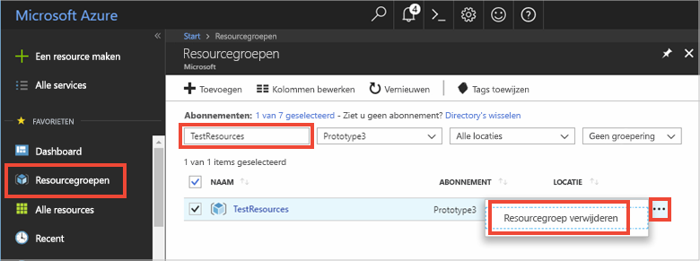

# <a name="quickstart-use-azure-redis-cache-with-a-net-application"></a>Snelstartgids: Azure Redis Cache gebruiken met een .NET-toepassing


In deze snelstartgids wordt beschreven hoe u Microsoft Azure Redis Cache gebruikt met .NET. Microsoft Azure Redis Cache is gebaseerd op het populaire open-source Redis Cache. Via Microsoft Azure Redis-cache hebt u toegang tot een beveiligde, toegewezen Redis-cache, beheerd door Microsoft. Een cache die u met Azure Redis-cache hebt gemaakt, is toegankelijk vanuit elke toepassing in Microsoft Azure.

In deze snelstartgids gebruikt u de client [StackExchange.Redis](https://github.com/StackExchange/StackExchange.Redis) met C\#-code in een console-app. U gaat een cache maken en de .NET-client-app configureren. Daarna gaat u objecten toevoegen en bijwerken in de cache. 


[!INCLUDE [quickstarts-free-trial-note](../../includes/quickstarts-free-trial-note.md)]

## <a name="prerequisites"></a>Vereisten

* [Visual Studio](https://www.visualstudio.com/downloads/)
* Voor de StackExchange.Redis-client is [.NET Framework 4 of hoger](https://www.microsoft.com/net/download/dotnet-framework-runtime) vereist.

## <a name="create-a-cache"></a>Een cache maken
[!INCLUDE [redis-cache-create](../../includes/redis-cache-create.md)]

[!INCLUDE [redis-cache-access-keys](../../includes/redis-cache-access-keys.md)]

Maak op uw computer een bestand met de naam *CacheSecrets.config*. Sla het op een locatie op waar het niet wordt ingecheckt met de broncode van uw voorbeeldtoepassing. Voor deze snelstart bevindt het bestand *CacheSecrets.config* zich hier: *C:\AppSecrets\CacheSecrets.config*.

Bewerk het bestand *CacheSecrets.config* en voeg de volgende inhoud toe:

```xml
<appSettings>
    <add key="CacheConnection" value="<cache-name>.redis.cache.windows.net,abortConnect=false,ssl=true,password=<access-key>"/>
</appSettings>
```

Vervang `<cache-name>` door de hostnaam van uw cache.

Vervang `<access-key>` door de primaire sleutel voor uw cache.


## <a name="create-a-console-app"></a>Een console-app maken

Klik in Visual Studio op **File** > **New** > **Project**.

Klik onder **Visual C#** op **Windows Classic Desktop** en klik vervolgens op **Console App** en **OK** om een nieuwe consoletoepassing te maken.


<a name="configure-the-cache-clients"></a>

## <a name="configure-the-cache-client"></a>De cacheclient configureren

In deze sectie configureert u de consoletoepassing voor het gebruik van de client [StackExchange.Redis](https://github.com/StackExchange/StackExchange.Redis) voor .NET.

Klik in Visual Studio op **Tools** > **NuGet Package Manager** > **Package Manager Console** en voer de volgende opdracht uit vanuit het venster Package Manager Console.

```powershell
Install-Package StackExchange.Redis
```

Zodra de installatie is voltooid, kan de *StackExchange.Redis*-cacheclient met uw project worden gebruikt.


## <a name="connect-to-the-cache"></a>Verbinding maken met de cache

Open in Visual Studio het bestand *App.config* en voeg een kenmerk `appSettings` `file` toe dat verwijst naar het bestand *CacheSecrets.config*.

```xml
<?xml version="1.0" encoding="utf-8" ?>
<configuration>
    <startup> 
        <supportedRuntime version="v4.0" sku=".NETFramework,Version=v4.7.1" />
    </startup>

    <appSettings file="C:\AppSecrets\CacheSecrets.config"></appSettings>  

</configuration>
```

Klik in Solution Explorer met de rechtermuisknop op **References** en klik op **Add a reference**. Voeg een verwijzing naar de assembly **System.Configuration** toe.

Voeg de volgende `using`-instructies toe aan *Program.cs*:

```csharp
using StackExchange.Redis;
using System.Configuration;
```

De verbinding met de Azure Redis-cache wordt beheerd door de klasse `ConnectionMultiplexer`. Deze klasse moet worden gedeeld en hergebruikt in uw clienttoepassing. Maak geen nieuwe verbinding voor elke bewerking. 

Sla referenties nooit op in broncode. Om dit voorbeeld overzichtelijk te houden, gebruik ik alleen een extern configuratiebestand met geheimen. Een betere benadering is om [Azure Key Vault met certificaten](https://docs.microsoft.com/rest/api/keyvault/certificate-scenarios) te gebruiken.

Voeg in *Program.cs* de volgende leden toe aan de klasse `Program` van uw consoletoepassing:

```csharp
        private static Lazy<ConnectionMultiplexer> lazyConnection = new Lazy<ConnectionMultiplexer>(() =>
        {
            string cacheConnection = ConfigurationManager.AppSettings["CacheConnection"].ToString();
            return ConnectionMultiplexer.Connect(cacheConnection);
        });

        public static ConnectionMultiplexer Connection
        {
            get
            {
                return lazyConnection.Value;
            }
        }
```


Deze benadering om een exemplaar van `ConnectionMultiplexer` in uw toepassing te delen, gebruikt een statische eigenschap die een verbonden exemplaar retourneert. De code biedt een thread-veilige manier om slechts één verbonden exemplaar van `ConnectionMultiplexer` te initialiseren. `abortConnect` is ingesteld op false. Dat betekent dat de aanroep slaagt, zelfs als er geen verbinding is gemaakt met de Azure Redis Cache. Een belangrijke functie van `ConnectionMultiplexer` is dat deze de verbinding met de cache automatisch herstelt als het netwerkprobleem of de andere oorzaken zijn opgelost.

De waarde van de appSetting *CacheConnection* wordt gebruikt om vanuit Azure Portal te verwijzen naar de verbindingsreeks voor de cache als de wachtwoordparameter.

## <a name="executing-cache-commands"></a>Cache-opdrachten uitvoeren

Voeg de volgende code toe voor de procedure `Main` van de klasse `Program` voor uw consoletoepassing:

```csharp
        static void Main(string[] args)
        {
            // Connection refers to a property that returns a ConnectionMultiplexer
            // as shown in the previous example.
            IDatabase cache = lazyConnection.Value.GetDatabase();

            // Perform cache operations using the cache object...

            // Simple PING command
            string cacheCommand = "PING";
            Console.WriteLine("\nCache command  : " + cacheCommand);
            Console.WriteLine("Cache response : " + cache.Execute(cacheCommand).ToString());

            // Simple get and put of integral data types into the cache
            cacheCommand = "GET Message";
            Console.WriteLine("\nCache command  : " + cacheCommand + " or StringGet()");
            Console.WriteLine("Cache response : " + cache.StringGet("Message").ToString());

            cacheCommand = "SET Message \"Hello! The cache is working from a .NET console app!\"";
            Console.WriteLine("\nCache command  : " + cacheCommand + " or StringSet()");
            Console.WriteLine("Cache response : " + cache.StringSet("Message", "Hello! The cache is working from a .NET console app!").ToString());

            // Demostrate "SET Message" executed as expected...
            cacheCommand = "GET Message";
            Console.WriteLine("\nCache command  : " + cacheCommand + " or StringGet()");
            Console.WriteLine("Cache response : " + cache.StringGet("Message").ToString());

            // Get the client list, useful to see if connection list is growing...
            cacheCommand = "CLIENT LIST";
            Console.WriteLine("\nCache command  : " + cacheCommand);
            Console.WriteLine("Cache response : \n" + cache.Execute("CLIENT", "LIST").ToString().Replace("id=", "id="));

            lazyConnection.Value.Dispose();
        }
```

Azure Redis-caches hebben een configureerbaar aantal databases (standaard 16) die kunnen worden gebruikt om de gegevens in een Redis-cache logisch te scheiden. De code maakt verbinding met de standaarddatabase, DB 0. Zie [Wat zijn Redis-databases?](cache-faq.md#what-are-redis-databases) en [Standaardconfiguratie voor Redis-server](cache-configure.md#default-redis-server-configuration) voor meer informatie.

Cache-items kunnen worden opgeslagen en opgehaald met behulp van de methoden `StringSet` en `StringGet`.

Redis slaat de meeste gegevens op als Redis-tekenreeksen, maar deze tekenreeksen kunnen veel soorten gegevens bevatten, waaronder geserialiseerde binaire gegevens die kunnen worden gebruikt voor het opslaan van .NET-objecten in de cache.

Druk op **Ctrl+F5** om de consoletoepassing te bouwen en uit te voeren.

In het onderstaande voorbeeld ziet u dat de `Message`-sleutel eerder een waarde in de cache had, die was ingesteld met behulp van de Redis Console in Azure Portal. De app heeft die waarde in de cache bijgewerkt. De app heeft ook de opdrachten `PING` en `CLIENT LIST` uitgevoerd.


## <a name="work-with-net-objects-in-the-cache"></a>Werken met .NET-objecten in de cache

Azure Redis Cache kan zowel .NET-objecten als oudere gegevenstypen opslaan in de cache, maar voordat een .NET-object in de cache kan worden opgeslagen, moet het worden geserialiseerd. Deze serialisatie van het .NET-object is de verantwoordelijkheid van de ontwikkelaar van de toepassing. Het geeft de ontwikkelaar flexibiliteit bij de keuze van de serializer.

Een eenvoudige manier om objecten te serialiseren is met de serialisatiemethoden `JsonConvert` in [Newtonsoft.Json](https://www.nuget.org/packages/Newtonsoft.Json/). Hiermee serialiseert u van en naar JSON. In deze sectie voegt u een .NET-object toe aan de cache.

Klik in Visual Studio op **Tools** > **NuGet Package Manager** > **Package Manager Console** en voer de volgende opdracht uit vanuit het venster Package Manager Console.

```powershell
Install-Package Newtonsoft.Json
```

Voeg de volgende `using`-instructie toe aan *Program.cs*:

```charp
using Newtonsoft.Json;
```

Voeg de volgende `Employee`-klassedefinitie toe aan *Program.cs*:

```csharp
        class Employee
        {
            public string Id { get; set; }
            public string Name { get; set; }
            public int Age { get; set; }

            public Employee(string EmployeeId, string Name, int Age)
            {
                this.Id = EmployeeId;
                this.Name = Name;
                this.Age = Age;
            }
        }
```

Voeg onderaan procedure `Main()` in *Program.cs* en vóór de aanroep van `Dispose()` de volgende regels code toe om een geserialiseerd .NET-object op te slaan in de cache en op te halen:

```csharp
            // Store .NET object to cache
            Employee e007 = new Employee("007", "Davide Columbo", 100);
            Console.WriteLine("Cache response from storing Employee .NET object : " + 
                cache.StringSet("e007", JsonConvert.SerializeObject(e007)));

            // Retrieve .NET object from cache
            Employee e007FromCache = JsonConvert.DeserializeObject<Employee>(cache.StringGet("e007"));
            Console.WriteLine("Deserialized Employee .NET object :\n");
            Console.WriteLine("\tEmployee.Name : " + e007FromCache.Name);
            Console.WriteLine("\tEmployee.Id   : " + e007FromCache.Id);
            Console.WriteLine("\tEmployee.Age  : " + e007FromCache.Age + "\n");
```

Druk op **Ctrl + F5** om de console-app te bouwen en uit te voeren en zo de serialisatie van .NET-objecten te testen. 


## <a name="clean-up-resources"></a>Resources opschonen

Als u verder wilt gaan met de volgende zelfstudie, kunt u de resources die in deze snelstart zijn gemaakt behouden en opnieuw gebruiken.

Als u niet verder wilt met de voorbeeldtoepassing uit de snelstart, kunt u de Azure-resources verwijderen die in deze snelstart zijn gemaakt om kosten te voorkomen. 

> [!IMPORTANT]
> Het verwijderen van een resourcegroep kan niet ongedaan worden gemaakt. De resourcegroep en alle bijbehorende resources worden permanent verwijderd. Zorg ervoor dat u niet per ongeluk de verkeerde resourcegroep of resources verwijdert. Als u de resources voor het hosten van dit voorbeeld in een bestaande resourcegroep hebt gemaakt en deze groep ook resources bevat die u wilt behouden, kunt u elke resource afzonderlijk verwijderen via hun respectievelijke blade.
>

Meld u aan bij de [Azure-portal](https://portal.azure.com) en klik op **Resourcegroepen**.

Typ de naam van de resourcegroep in het tekstvak **Filteren op naam...**. In de instructies voor dit artikel is een resourcegroep met de naam *TestResources* gebruikt. Klik in de resourcegroep in de lijst met resultaten op **...** en vervolgens op **Resourcegroep verwijderen**.



U wordt gevraagd om het verwijderen van de resourcegroep te bevestigen. Typ de naam van de resourcegroep om te bevestigen en klik op **Verwijderen**.

Na enkele ogenblikken worden de resourcegroep en alle resources in de groep verwijderd.


<a name="next-steps"></a>

## <a name="next-steps"></a>Volgende stappen

In deze snelstartgids hebt u geleerd hoe u Azure Redis Cache gebruikt vanuit een .NET-toepassing. Ga verder met de volgende snelstart om Redis Cache te gebruiken met een ASP.NET-web-app.

> [!div class="nextstepaction"]
> [Maak een ASP.NET-web-app die gebruikmaakt van Azure Redis Cache.](./cache-web-app-howto.md)


