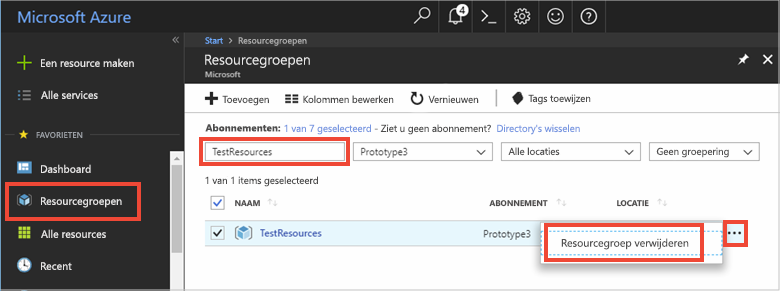

# <a name="quickstart-how-to-use-azure-redis-cache-with-java"></a>Snelstartgids: Azure Redis Cache gebruiken met Java


Azure Redis-cache geeft u toegang tot een toegewezen Redis-cache, beheerd door Microsoft. Uw cache is toegankelijk vanuit elke toepassing in Microsoft Azure.

In dit artikel leest u hoe u aan de slag gaat met Azure Redis Cache met behulp van de Redis Cache-client [Jedis](https://github.com/xetorthio/jedis) voor Java.


U kunt elke code-editor gebruiken om de stappen in deze snelstart uit te voeren. [Visual Studio Code](https://code.visualstudio.com/) is een uitstekende optie die beschikbaar is op de Windows-, macOS- en Linux-platforms.

[!INCLUDE [quickstarts-free-trial-note](../../includes/quickstarts-free-trial-note.md)]


## <a name="prerequisites"></a>Vereisten

[Apache Maven](http://maven.apache.org/)


## <a name="create-an-azure-redis-cache"></a>Een Azure Redis-cache maken

[!INCLUDE [redis-cache-create](../../includes/redis-cache-create.md)]

[!INCLUDE [redis-cache-access-keys](../../includes/redis-cache-access-keys.md)]

Voeg omgevingsvariabelen toe voor **HOST NAME** en **Primary** (primaire toegangssleutel). U gebruikt deze variabelen vanuit uw code in plaats van de gevoelige gegevens rechtstreeks op te nemen in uw code.

```
set REDISCACHEHOSTNAME=contosoCache.redis.cache.windows.net
set REDISCACHEKEY=XXXXXXXXXXXXXXXXXXXXXXXXXXXXXXXXXXXXXXXXXXXX
```

## <a name="create-a-new-java-app"></a>Een nieuwe Java-app maken

Met behulp van Maven een nieuwe snelstartgids-app maken:

```
mvn archetype:generate -DarchetypeGroupId=org.apache.maven.archetypes -DarchetypeArtifactId=maven-archetype-quickstart -DarchetypeVersion=1.3 -DgroupId=example.demo -DartifactId=redistest -Dversion=1.0
```

Ga naar de nieuwe projectmap *redistest*.

Open het bestand *pom.xml* en voeg een afhankelijkheid toe voor [Jedis](https://github.com/xetorthio/jedis):

```xml
    <dependency>
        <groupId>redis.clients</groupId>
        <artifactId>jedis</artifactId>
        <version>2.9.0</version>
        <type>jar</type>
        <scope>compile</scope>
    </dependency>
```

Sla het bestand *pom.xml* op.

Open *App.java* en vervang de code door de volgende code:

```java
package example.demo;

import redis.clients.jedis.Jedis;
import redis.clients.jedis.JedisShardInfo;

/**
 * Redis test
 *
 */
public class App 
{
    public static void main( String[] args )
    {

        boolean useSsl = true;
        String cacheHostname = System.getenv("REDISCACHEHOSTNAME");
        String cachekey = System.getenv("REDISCACHEKEY");

        // Connect to the Redis cache over the SSL port using the key.
        JedisShardInfo shardInfo = new JedisShardInfo(cacheHostname, 6380, useSsl);
        shardInfo.setPassword(cachekey); /* Use your access key. */
        Jedis jedis = new Jedis(shardInfo);      

        // Perform cache operations using the cache connection object...

        // Simple PING command        
        System.out.println( "\nCache Command  : Ping" );
        System.out.println( "Cache Response : " + jedis.ping());

        // Simple get and put of integral data types into the cache
        System.out.println( "\nCache Command  : GET Message" );
        System.out.println( "Cache Response : " + jedis.get("Message"));

        System.out.println( "\nCache Command  : SET Message" );
        System.out.println( "Cache Response : " + jedis.set("Message", "Hello! The cache is working from Java!"));

        // Demostrate "SET Message" executed as expected...
        System.out.println( "\nCache Command  : GET Message" );
        System.out.println( "Cache Response : " + jedis.get("Message"));

        // Get the client list, useful to see if connection list is growing...
        System.out.println( "\nCache Command  : CLIENT LIST" );
        System.out.println( "Cache Response : " + jedis.clientList());

        jedis.close();
    }
}
```

Deze code laat zien hoe u verbinding kunt maken met een exemplaar van Azure Redis Cache via de omgevingsvariabelen voor hostnaam en sleutel. Met de code wordt ook een tekenreekswaarde opgeslagen in de cache en daaruit opgehaald. De opdrachten `PING` en `CLIENT LIST` worden ook uitgevoerd. 

Sla *App.java* op.

## <a name="build-and-run-the-app"></a>De app bouwen en uitvoeren

Voer de volgende Maven-opdracht uit om de app te bouwen en uit te voeren:

```
mvn exec:java -D exec.mainClass=example.demo.App
```

In het onderstaande voorbeeld ziet u dat de `Message`-sleutel eerder een waarde in de cache had, die was ingesteld met behulp van de Redis Console in Azure Portal. De app heeft die waarde in de cache bijgewerkt. De app heeft ook de opdrachten `PING` en `CLIENT LIST` uitgevoerd.


## <a name="clean-up-resources"></a>Resources opschonen

Als u verder wilt gaan met de volgende zelfstudie, kunt u de resources die in deze snelstart zijn gemaakt behouden en opnieuw gebruiken.

Als u niet verder wilt met de voorbeeldtoepassing uit de snelstart, kunt u de Azure-resources verwijderen die in deze snelstart zijn gemaakt om kosten te voorkomen. 

> [!IMPORTANT]
> Het verwijderen van een resourcegroep kan niet ongedaan worden gemaakt. De resourcegroep en alle bijbehorende resources worden permanent verwijderd. Zorg ervoor dat u niet per ongeluk de verkeerde resourcegroep of resources verwijdert. Als u de resources voor het hosten van dit voorbeeld in een bestaande resourcegroep hebt gemaakt en deze groep ook resources bevat die u wilt behouden, kunt u elke resource afzonderlijk verwijderen via hun respectievelijke blade.
>

Meld u aan bij de [Azure-portal](https://portal.azure.com) en klik op **Resourcegroepen**.

Typ de naam van de resourcegroep in het tekstvak **Filteren op naam...**. In de instructies voor dit artikel is een resourcegroep met de naam *TestResources* gebruikt. Klik in de resourcegroep in de lijst met resultaten op **...** en vervolgens op **Resourcegroep verwijderen**.



U wordt gevraagd om het verwijderen van de resourcegroep te bevestigen. Typ de naam van de resourcegroep om te bevestigen en klik op **Verwijderen**.

Na enkele ogenblikken worden de resourcegroep en alle resources in de groep verwijderd.


## <a name="next-steps"></a>Volgende stappen

In deze snelstartgids hebt u geleerd hoe u Azure Redis Cache gebruikt vanuit een Java-toepassing. Ga verder met de volgende snelstart om Redis Cache te gebruiken met een ASP.NET-web-app.

> [!div class="nextstepaction"]
> [Maak een ASP.NET-web-app die gebruikmaakt van Azure Redis Cache.](./cache-web-app-howto.md)


