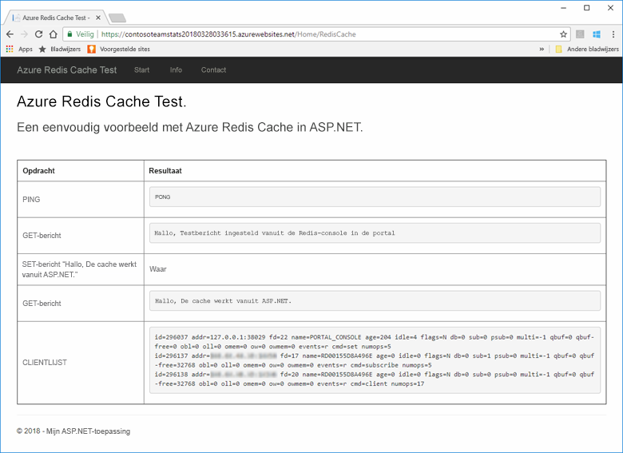
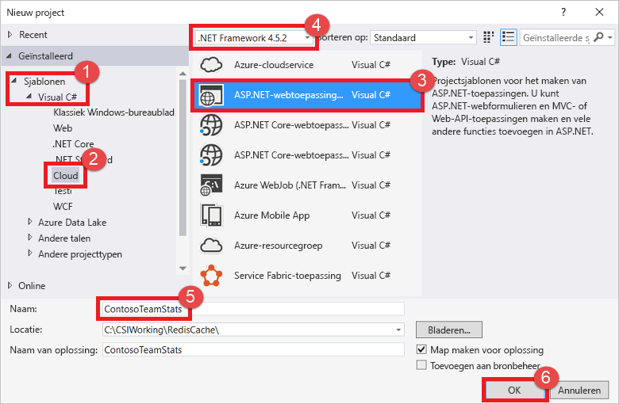
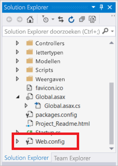
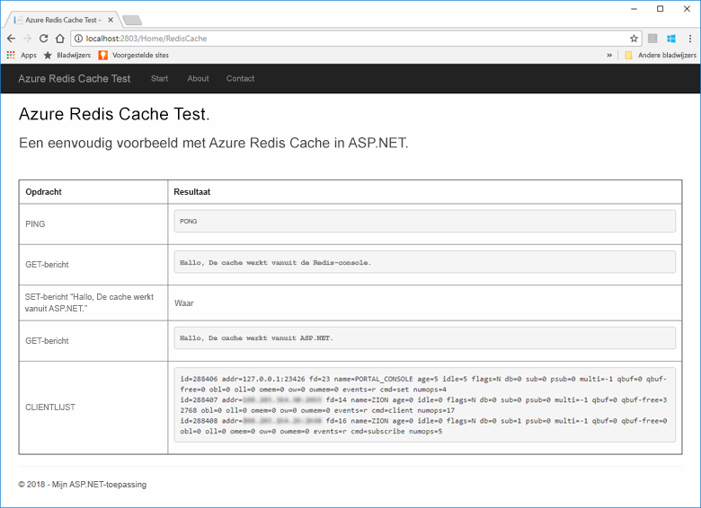
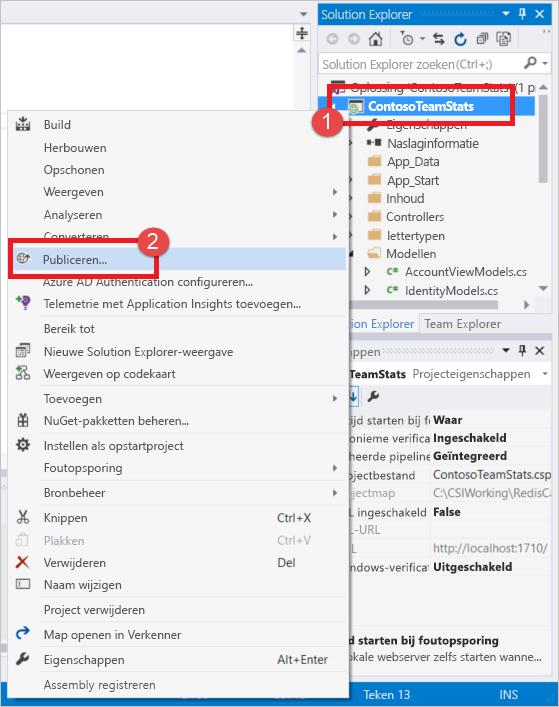
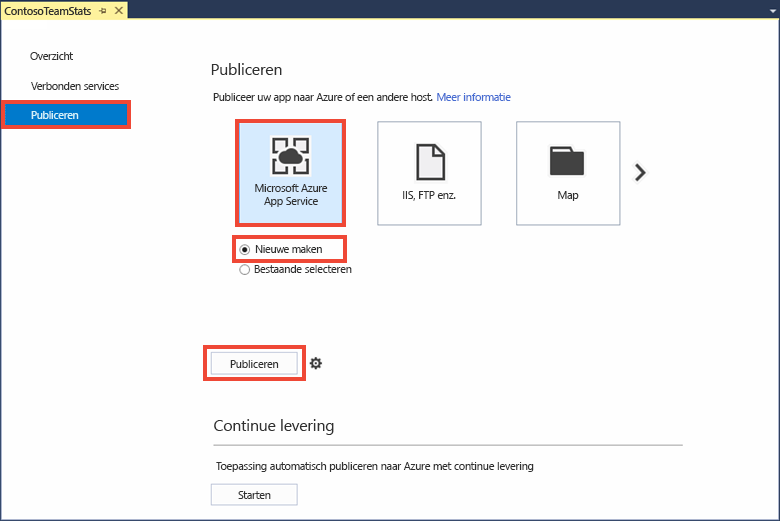
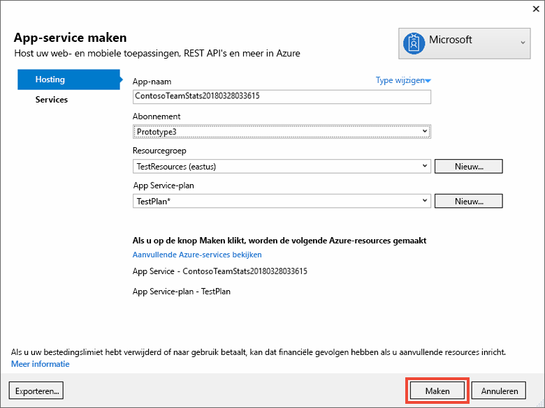
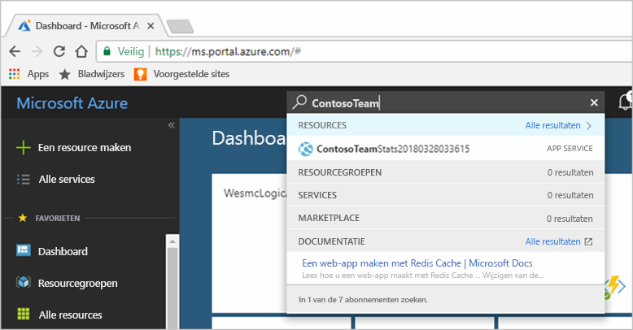
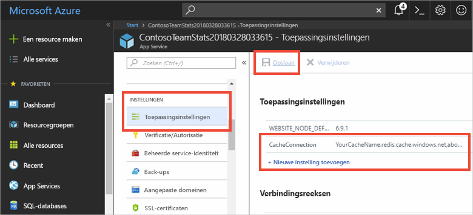
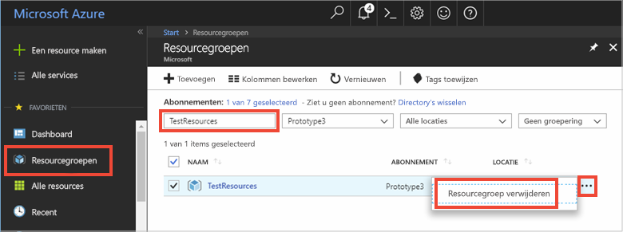

# <a name="quickstart-create-a-aspnet-web-app-with-redis-cache"></a>Snelstart: Een ASP.NET-web-app maken met Redis Cache


## <a name="introduction"></a>Inleiding

In deze snelstart ziet u hoe u een ASP.NET-webtoepassing maakt en implementeert in Azure App Service met behulp van Visual Studio 2017. De voorbeeldtoepassing maakt verbinding met een Azure Redis Cache om gegevens uit de cache op te slaan en op te halen. Wanneer u de snelstart hebt voltooid, hebt u een actieve web-app die wordt gehost in Azure en leest en schrijft naar een Azure Redis Cache.



[!INCLUDE [quickstarts-free-trial-note](../../includes/quickstarts-free-trial-note.md)]

## <a name="prerequisites"></a>Vereisten

U hebt het volgende nodig om deze snelstart te voltooien:

* Installeer [Visual Studio 2017](https://www.visualstudio.com/downloads/) met de volgende workloads:
    * ASP.NET-ontwikkeling en webontwikkeling
    * Azure-ontwikkeling

## <a name="create-the-visual-studio-project"></a>Het Visual Studio-project maken

Open Visual Studio en klik op **File**, **New**, **Project**.



Voer in het dialoogvenster Nieuw project de volgende stappen uit:

1. Vouw het **Visual C#**-knooppunt uit in de lijst **Templates**
1. Selecteer **Cloud**
1. Klik op **ASP.NET Web Application**
1. Zorg ervoor dat **.NET Framework 4.5.2** of hoger is geselecteerd
1. Geef het project een naam in het tekstvak **Name**. Voor dit voorbeeld hebben we **ContosoTeamStats** gebruikt
1. Klik op **OK**.

U krijgt een scherm met de nieuwe ASP.NET-webtoepassing te zien:


Selecteer **MVC** als het projecttype.

Zorg ervoor dat **Geen verificatie** is opgegeven voor de instellingen bij **Verificatie**. Afhankelijk van uw versie van Visual Studio kan de standaardwaarde op iets anders zijn ingesteld. Als u deze wilt wijzigen, klikt u op **Verificatie wijzigen** en selecteert u **Geen verificatie**.

Klik op **OK** om het project aan te maken.

## <a name="create-a-cache"></a>Een cache maken

Maak vervolgens de cache voor de app.

[!INCLUDE [redis-cache-create](../../includes/redis-cache-create.md)]

[!INCLUDE [redis-cache-access-keys](../../includes/redis-cache-access-keys.md)]

Maak op uw computer een bestand met de naam *CacheSecrets.config*. Sla het op een locatie op waar het niet wordt ingecheckt met de broncode van uw voorbeeldtoepassing. Voor deze snelstart bevindt het bestand *CacheSecrets.config* zich hier: *C:\AppSecrets\CacheSecrets.config*.

Bewerk het bestand *CacheSecrets.config* en voeg de volgende inhoud toe:

```xml
<appSettings>
    <add key="CacheConnection" value="<cache-name>.redis.cache.windows.net,abortConnect=false,ssl=true,password=<access-key>"/>
</appSettings>
```

Vervang `<cache-name>` door de hostnaam van uw cache.

Vervang `<access-key>` door de primaire sleutel voor uw cache.

> [!TIP]
> De secundaire toegangssleutel wordt tijdens sleutelroulatie als een alternatieve sleutel gebruikt terwijl u de primaire toegangssleutel opnieuw genereert.
>

Sla het bestand op.

## <a name="update-the-mvc-application"></a>De MVC-toepassing bijwerken

In deze sectie werkt u de toepassing bij voor de ondersteuning van een nieuwe weergave waarin een eenvoudige test op basis van een Azure Redis Cache wordt weergegeven.

* [Het web.config-bestand bijwerken met een app-instelling voor de cache](#Update-the-webconfig-file-with-an-app-setting-for-the-cache)
* [De toepassing configureren voor gebruik van de StackExchange.Redis-client](#configure-the-application-to-use-stackexchangeredis)
* [De HomeController en lay-out bijwerken](#update-the-homecontroller-and-layout)
* [Een nieuwe RedisCache-weergave toevoegen](#add-a-new-rediscache-view)

### <a name="update-the-webconfig-file-with-an-app-setting-for-the-cache"></a>Het web.config-bestand bijwerken met een app-instelling voor de cache

Als u de toepassing lokaal uitvoert, wordt de informatie in *CacheSecrets.config* gebruikt om verbinding te maken met uw exemplaar van Azure Redis Cache. Later implementeert u deze toepassing in Azure. Op dat moment configureert u een app-instelling in Azure die de toepassing gebruikt om de cacheverbindingsinformatie in plaats van dit bestand op te halen. Omdat *CacheSecrets.config* niet in Azure wordt geïmplementeerd met uw toepassing, gebruikt u dit alleen bij het lokaal testen van de toepassing. U wilt deze informatie zo veilig mogelijk houden om schadelijke toegang tot de gegevens in de cache te voorkomen.

Dubbelklik in **Solution Explorer** op het bestand *web.config* om het te openen.



Zoek in het bestand *web.config* het `<appSetting>`-element op en voeg het volgende `file`-kenmerk toe. Als u een andere bestandsnaam of -locatie gebruikt, vervang deze waarden dan door de waarden die in het voorbeeld worden weergegeven.

* Voor: `<appSettings>`
* Na: ` <appSettings file="C:\AppSecrets\CacheSecrets.config">`

De ASP.NET-runtime voegt de inhoud van het externe bestand samen met de opmaak van het element `<appSettings>`. Als het opgegeven bestand niet kan worden gevonden, negeert de runtime het bestandskenmerk. Uw geheimen (de verbindingsreeks naar uw cache) worden niet opgenomen in de broncode van de toepassing. Wanneer u uw web-app in Azure implementeert, wordt het bestand *CacheSecrests.config* niet geïmplementeerd.

### <a name="configure-the-application-to-use-stackexchangeredis"></a>De toepassing configureren voor gebruik van StackExchange.Redis

Als u de app wilt configureren voor gebruik van het NuGet-pakket [StackExchange.Redis voor Visual Studio ](https://github.com/StackExchange/StackExchange.Redis) klikt u op **Tools > NuGet Package Manager > Package Manager Console**.

Voer de volgende opdracht uit vanuit het venster `Package Manager Console`:

```powershell
Install-Package StackExchange.Redis
```

Het NuGet-pakket downloadt de vereiste assembly-verwijzingen voor de clienttoepassing en voegt deze toe om met de cacheclient StackExchange.Redis toegang te krijgen tot de Azure Redis-cache. Als u een versie met een sterke naam van de `StackExchange.Redis`-clientbibliotheek verkiest, installeert u het `StackExchange.Redis.StrongName`-pakket.

### <a name="update-the-homecontroller-and-layout"></a>De HomeController en lay-out bijwerken

Vouw in **Solution Explorer** de map **Controllers** uit en open het bestand *HomeController.cs*.

Voeg de volgende twee `using`-instructies boven aan het bestand toe ter ondersteuning van de cacheclient- en app-instellingen.

```csharp
using System.Configuration;
using StackExchange.Redis;
```

Voeg de volgende methode voor de `HomeController`-klasse toe ter ondersteuning van een nieuwe `RedisCache`-actie die bepaalde opdrachten voor de nieuwe cache uitvoert.

```csharp
    public ActionResult RedisCache()
    {
        ViewBag.Message = "A simple example with Azure Redis Cache on ASP.NET.";

        var lazyConnection = new Lazy<ConnectionMultiplexer>(() =>
        {
            string cacheConnection = ConfigurationManager.AppSettings["CacheConnection"].ToString();
            return ConnectionMultiplexer.Connect(cacheConnection);
        });

        // Connection refers to a property that returns a ConnectionMultiplexer
        // as shown in the previous example.
        IDatabase cache = lazyConnection.Value.GetDatabase();

        // Perform cache operations using the cache object...

        // Simple PING command
        ViewBag.command1 = "PING";
        ViewBag.command1Result = cache.Execute(ViewBag.command1).ToString();

        // Simple get and put of integral data types into the cache
        ViewBag.command2 = "GET Message";
        ViewBag.command2Result = cache.StringGet("Message").ToString();

        ViewBag.command3 = "SET Message \"Hello! The cache is working from ASP.NET!\"";
        ViewBag.command3Result = cache.StringSet("Message", "Hello! The cache is working from ASP.NET!").ToString();

        // Demostrate "SET Message" executed as expected...
        ViewBag.command4 = "GET Message";
        ViewBag.command4Result = cache.StringGet("Message").ToString();

        // Get the client list, useful to see if connection list is growing...
        ViewBag.command5 = "CLIENT LIST";
        ViewBag.command5Result = cache.Execute("CLIENT", "LIST").ToString().Replace(" id=", "\rid=");

        lazyConnection.Value.Dispose();

        return View();
    }
```

Vouw in **Solution Explorer** de map **Views**>**Shared** uit en open het bestand *_Layout.cshtml*.

Vervang:

```csharp
@Html.ActionLink("Application name", "Index", "Home", new { area = "" }, new { @class = "navbar-brand" })
```

Door:

```csharp
@Html.ActionLink("Azure Redis Cache Test", "RedisCache", "Home", new { area = "" }, new { @class = "navbar-brand" })
```

### <a name="add-a-new-rediscache-view"></a>Een nieuwe RedisCache-weergave toevoegen

Vouw in **Solution Explorer** de map **Views** uit en klik met de rechtermuisknop op de map **Home**. Kies **Add** > **View...**.

Voer in het dialoogvenster Add View **RedisCache** in voor de View Name en klik op **Add**.

Vervang de code in het bestand *RedisCache.cshtml* door de volgende code:

```csharp
@{
    ViewBag.Title = "Azure Redis Cache Test";
}

<h2>@ViewBag.Title.</h2>
<h3>@ViewBag.Message</h3>
<br /><br />
<table border="1" cellpadding="10">
    <tr>
        <th>Command</th>
        <th>Result</th>
    </tr>
    <tr>
        <td>@ViewBag.command1</td>
        <td><pre>@ViewBag.command1Result</pre></td>
    </tr>
    <tr>
        <td>@ViewBag.command2</td>
        <td><pre>@ViewBag.command2Result</pre></td>
    </tr>
    <tr>
        <td>@ViewBag.command3</td>
        <td><pre>@ViewBag.command3Result</pre></td>
    </tr>
    <tr>
        <td>@ViewBag.command4</td>
        <td><pre>@ViewBag.command4Result</pre></td>
    </tr>
    <tr>
        <td>@ViewBag.command5</td>
        <td><pre>@ViewBag.command5Result</pre></td>
    </tr>
</table>
```

## <a name="run-the-app-locally"></a>De app lokaal uitvoeren

Het project is standaard geconfigureerd voor het lokaal hosten van de app in [IIS Express](https://docs.microsoft.com/iis/extensions/introduction-to-iis-express/iis-express-overview) voor testen en foutopsporing.

Klik in Visual Studio in het menu op **Debug** > **Start Debugging** om de app lokaal te bouwen en te starten voor testen en foutopsporing.

Klik in de browser op **Azure Redis Cache Test** op de navigatiebalk.

In het onderstaande voorbeeld ziet u dat de `Message`-sleutel eerder een waarde in de cache had, die was ingesteld met behulp van de Redis Console in de portal. De app heeft die waarde in de cache bijgewerkt. De app heeft ook de opdrachten `PING` en `CLIENT LIST` uitgevoerd.



## <a name="publish-and-run-in-azure"></a>Publiceren en uitvoeren in Azure

Zodra u de app met succes lokaal hebt getest, implementeert u de app in Azure en voert u deze uit in de cloud.

### <a name="publish-the-app-to-azure"></a>De app publiceren in Azure

Klik in Solution Explorer met de rechtermuisknop op het projectknooppunt en kies **Publiceren**.



Klik op **Microsoft Azure App Service**, kies **Nieuwe maken** en klik op **Publiceren**.



Breng de volgende wijzigingen aan in het dialoogvenster**App Service maken**:

| Instelling | Aanbevolen waarde | Beschrijving |
| ------- | :---------------: | ----------- |
| **Naam van app** | Standaardwaarde gebruiken | De app-naam is de hostnaam voor de app wanneer deze is geïmplementeerd in Azure. Aan de naam is mogelijk een timestamp als achtervoegsel toegevoegd om deze indien nodig uniek te maken. |
| **Abonnement** | Kies uw Azure-abonnement | Aan dit abonnement worden eventuele gerelateerde hostingkosten in rekening gebracht. Als u meerdere Azure-abonnementen hebt, controleert u of het gewenste abonnement is geselecteerd.|
| **Resourcegroep** | Gebruik dezelfde resourcegroep waar u de cache hebt gemaakt. Bijvoorbeeld: *TestResourceGroup*. | Met een resourcegroep kunt u alle resources als een groep beheren. Later als u de app wilt verwijderen, kunt u gewoon de groep verwijderen. |
| **App Service Plan** | Klik op **Nieuw** en maak een nieuw App Service-plan met de naam *TestingPlan*. <br />Gebruik dezelfde **locatie** die u hebt gebruikt bij het maken van uw cache. <br />Kies **Vrij** voor de grootte. | Een App Service-plan definieert een set van rekenresources waarmee een web-app wordt uitgevoerd. |



Nadat u de hostinginstellingen voor de App Service hebt geconfigureerd, klikt u op **Maken** om een nieuwe App Service voor uw app te maken.

Controleer het venster **Uitvoer** in Visual Studio om de status van het publiceren naar Azure te bekijken. Als het publiceren is voltooid, wordt de URL voor de App Service geregistreerd zoals hieronder wordt weergegeven:


### <a name="add-the-app-setting-for-the-cache"></a>De app-instelling voor de cache toevoegen

Zodra het publiceren is voltooid voor de nieuwe App Service, voegt u een nieuwe app-instelling toe. Deze instelling wordt gebruikt voor het opslaan van de verbindingsgegevens van de cache. Typ de naam van de app in de zoekbalk boven aan Azure Portal om te zoeken naar de nieuwe App Service die u zojuist hebt gemaakt.



Voeg een nieuwe app instelling met de naam **CacheConnection** toe die de app kan gebruiken om verbinding te maken met de cache. Gebruik dezelfde waarde die u hebt geconfigureerd voor `CacheConnection` in het bestand *CacheSecrets.config*. De waarde bevat de hostnaam en toegangssleutel van de cache.



### <a name="run-the-app-in-azure"></a>De app in Azure uitvoeren

Blader in uw browser naar de URL voor de App Service. De URL wordt weergegeven in de resultaten van de publicatiebewerking in het uitvoervenster in Visual Studio. Deze is ook beschikbaar in Azure Portal op de pagina Overzicht van de App Service die u hebt gemaakt.

Klik op **Azure Redis Cache Test** op de navigatiebalk om toegang tot de cache te testen.


## <a name="clean-up-resources"></a>Resources opschonen

Als u verder wilt gaan met de volgende zelfstudie, kunt u de resources die in deze snelstart zijn gemaakt behouden en opnieuw gebruiken.

Als u niet verder wilt met de voorbeeldtoepassing uit de snelstart, kunt u de Azure-resources verwijderen die in deze snelstart zijn gemaakt om kosten te voorkomen. 

> [!IMPORTANT]
> Het verwijderen van een resourcegroep kan niet ongedaan worden gemaakt. De resourcegroep en alle bijbehorende resources worden permanent verwijderd. Zorg ervoor dat u niet per ongeluk de verkeerde resourcegroep of resources verwijdert. Als u de resources voor het hosten van dit voorbeeld in een bestaande resourcegroep hebt gemaakt en deze groep ook resources bevat die u wilt behouden, kunt u elke resource afzonderlijk verwijderen via hun respectievelijke blade.
>

Meld u aan bij de [Azure-portal](https://portal.azure.com) en klik op **Resourcegroepen**.

Typ de naam van de resourcegroep in het tekstvak **Filteren op naam...**. In de instructies voor dit artikel is een resourcegroep met de naam *TestResources* gebruikt. Klik in de resourcegroep in de lijst met resultaten op **...** en vervolgens op **Resourcegroep verwijderen**.



U wordt gevraagd om het verwijderen van de resourcegroep te bevestigen. Typ de naam van de resourcegroep om te bevestigen en klik op **Verwijderen**.

Na enkele ogenblikken worden de resourcegroep en alle resources in de groep verwijderd.

## <a name="next-steps"></a>Volgende stappen

In deze volgende zelfstudie gebruikt u Azure Redis Cache in een praktijkscenario om de prestaties van een app te verbeteren. U werkt deze toepassing bij zodat leaderboardresultaten in de cache worden geplaatst met behulp van het 'cache-aside'-patroon met ASP.NET en een database.

> [!div class="nextstepaction"]
> [Een 'cache-aside' leaderboard maken in ASP.NET](cache-web-app-cache-aside-leaderboard.md)
