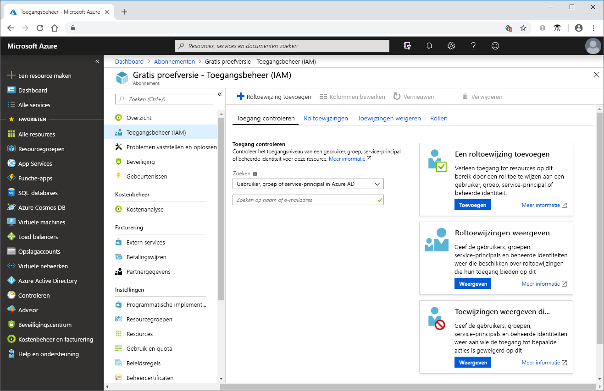
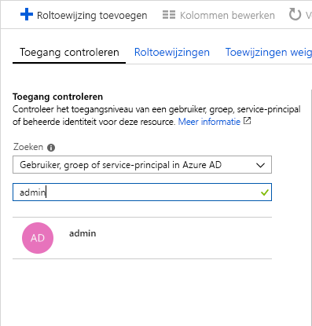
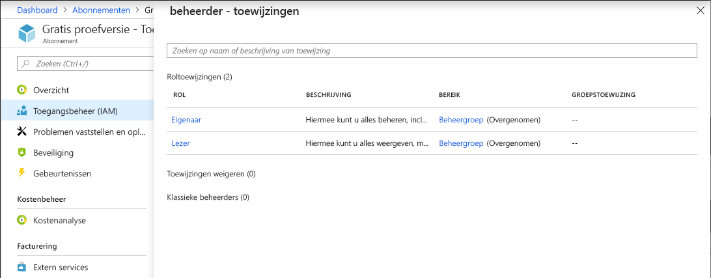

# Quickstart: Rollen weergeven die met behulp van de Azure-portal zijn toegewezen aan een gebruiker

U kunt de blade **Toegangsbeheer (IAM)** in [Op rollen gebaseerd toegangsbeheer (RBAC)](overview.md) gebruiken om de roltoewijzingen weer te geven voor meerdere gebruikers, groepen, service-principals en beheerde identiteiten, maar soms wilt u alleen snel de roltoewijzingen voor één gebruiker, groep, service-principal of beheerde identiteit bekijken. De eenvoudigste manier om dit te doen, is met de functie **Toegang controleren** in de Azure-portal.

## Roltoewijzingen weergeven

Volg deze stappen om de roltoewijzingen weer te geven voor één gebruiker, groep, service-principal of beheerde identiteit in het bereik van het abonnement.

1. Klik in de Azure-portal op de optie **Alle services** en vervolgens op **Abonnementen**.

1. Klik op uw abonnement.

1. Klik op **Toegangsbeheer (IAM)**.

1. Klik op het tabblad **Toegang controleren**.

    

1. Selecteer in de lijst **Zoeken** het type beveiligings-principal waarvoor u de toegang wilt controleren.

1. Voer in het zoekvak een tekenreeks in om de map te doorzoeken op weergavenamen, e-mailadressen of object-id's.

    

1. Klik op de beveiligings-principal om het deelvenster **Toewijzingen** te openen.

    

    In dit deelvenster ziet u de rollen die zijn toegewezen aan de geselecteerde beveiligings-principal en het bereik. Als er een in dit bereik toewijzingen zijn geweigerd of zijn overgenomen, worden deze weergegeven.

## Volgende stappen

> [!div class="nextstepaction"]
> [Zelfstudie: Toegang verlenen aan een gebruiker met behulp van RBAC en de Azure-portal](quickstart-assign-role-user-portal.md)
