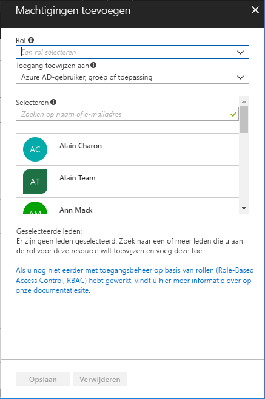

# Snelstart: Toegang verlenen aan een gebruiker met behulp van RBAC en Azure Portal

Op rollen gebaseerde toegangsbeheer (RBAC) is de manier waarop u de toegang tot resources in Azure beheert. In deze snelstart verleent u een gebruiker toegang tot het maken en beheren van virtuele machines in een resource -groep.

Als u nog geen abonnement op Azure hebt, maak dan een [gratis account](https://azure.microsoft.com/free/?WT.mc_id=A261C142F) aan voordat u begint.

## Aanmelden bij Azure

Meld u aan bij Azure Portal op http://portal.azure.com.

## Een resourcegroep maken

1. Kies **Resourcegroepen** in de navigatielijst.

1. Selecteer **Toevoegen** om de blade **Resourcegroep** te openen.

   

1. Voer bij **Resourcegroepnaam** **rbac-quickstart-resource-group** in.

1. Selecteer een abonnement en een locatie.

1. Kies **Maken** om de resourcegroep te maken.

1. Kies **Vernieuwen** om de lijst met resourcegroepen te vernieuwen.

   De nieuwe resourcegroep wordt weergegeven in de lijst met resourcegroepen.

   

## Toegang verlenen

In RBAC verleent u toegang door een roltoewijzing te maken.

1. Kies in de lijst met **Resourcegroepen** de nieuwe resourcegroep **rbac-quickstart-resource-group**.

1. Kies **Toegangsbeheer (IAM)** om de huidige lijst met roltoewijzingen te zien.

   

1. Kies **Toevoegen** om het deelvenster **Machtigingen toevoegen** te openen.

   Als u niet bevoegd bent om rollen toe te wijzen, ziet u de optie **Toevoegen** niet.

   

1. Selecteer in de vervolgkeuzelijst **Rol** **Inzender voor virtuele machines**.

1. Selecteer in de lijst **Selecteren** uzelf of een andere gebruiker.

1. Kies **Opslaan** om de roltoewijzing te maken.

   Na enkele ogenblikken krijgt de gebruiker de rol Inzender voor virtuele machines toegewezen in het bereik van de resourcegroep rbac-quickstart-resource-group.

   

## Toegang intrekken

Als u in RBAC de toegang wilt intrekken voor een rol, verwijdert u de roltoewijzing.

1. Voeg in de lijst met roltoewijzingen een vinkje toe naast de gebruiker met de rol Inzender voor virtuele machines.

1. Kies **Verwijderen**.

   

1. Kies **Ja** om te bevestigen dat u de roltoewijzing inderdaad wilt verwijderen.

## Opruimen

1. Kies **Resourcegroepen** in de navigatielijst.

1. Kies **rbac-quickstart-resource-group** om de resourcegroep te openen.

1. Kies **Resourcegroep verwijderen** om de resourcegroep te verwijderen.

   

1. Typ op de blade **Weet u zeker dat u wilt verwijderen** de naam van de resourcegroep: **rbac-quickstart-resource-group**.

1. Kies **Verwijderen** om de resourcegroep te verwijderen.

## Volgende stappen

> [!div class="nextstepaction"]
> [Zelfstudie - Toegang verlenen aan een gebruiker met RBAC en PowerShell](tutorial-role-assignments-user-powershell.md)

