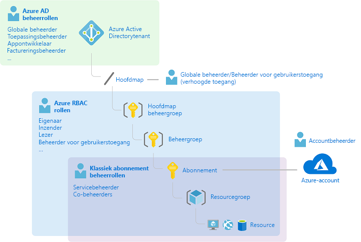
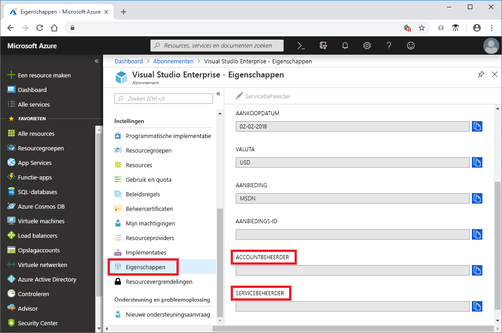
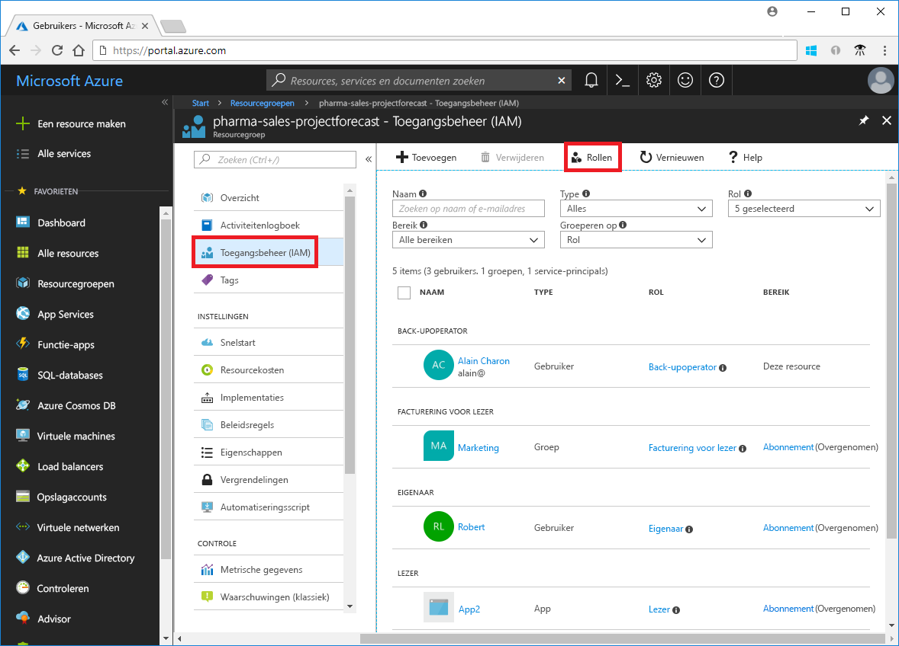
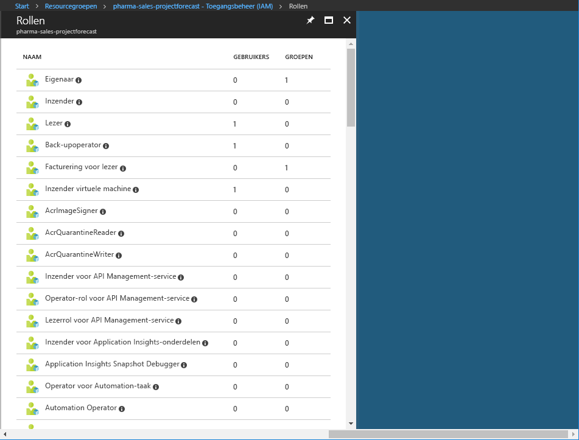
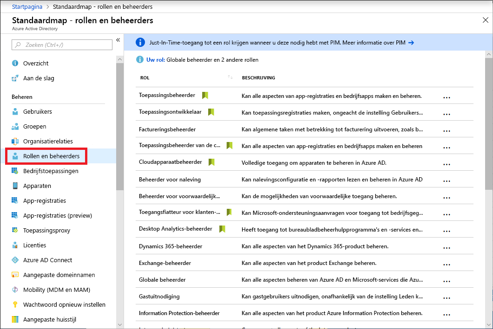
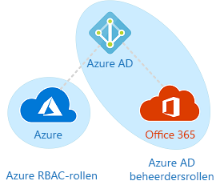

# Klassieke abonnementsbeheerdersrollen vs. Azure RBAC-rollen vs. Azure AD-beheerdersrollen

Als u nieuw bent bij Azure, is het misschien lastig om een goed beeld te krijgen van de verschillende rollen in Azure. In dit artikel vindt u informatie over de volgende rollen en wanneer u elk type rol moet gebruiken:
- Klassieke abonnementsbeheerdersrollen
- Azure RBAC-rollen (op rollen gebaseerd toegangsbeheer)
- Azure AD-beheerdersrollen (Azure Active Directory)

## Relatie tussen de rollen

Een korte beschrijving van de geschiedenis van Azure helpt om een beter beeld te krijgen van de verschillende rollen. Bij de introductie van Azure waren er voor het beheer van resources slechts drie beheerdersrollen: Accountbeheerder, Servicebeheerder en Medebeheerder. Later werd op rollen gebaseerd toegangsbeheer (RBAC) toegevoegd voor Azure-resources. Azure RBAC is een nieuwer autorisatiesysteem dat gedetailleerd toegangsbeheer biedt voor Azure-resources. RBAC bevat allerlei ingebouwde rollen, kan worden toegewezen aan verschillende bereiken en stelt u in staat om uw eigen aangepaste rollen te maken. Voor het beheren van resources in Azure AD, zoals gebruikers, groepen en domeinen, zijn verschillende Azure AD-beheerdersrollen beschikbaar.

In het volgende schema diagram ziet u een algemeen overzicht van hoe de klassieke abonnementsbeheerdersrollen, Azure RBAC-rollen en Azure AD-beheerdersrollen zich tot elkaar verhouden.

## Klassieke abonnementsbeheerdersrollen

Accountbeheerder, Servicebeheerder en Medebeheerder zijn de drie klassieke abonnementsbeheerdersrollen in Azure. Klassieke abonnementsbeheerders hebben volledige toegang tot het Azure-abonnement. Ze kunnen resources beheren met behulp van Azure Portal, API's van Azure Resource Manager en API's van het klassieke implementatiemodel. Het account dat wordt gebruikt voor registratie bij Azure wordt automatisch ingesteld als de accountbeheerder en de servicebeheerder. Vervolgens kunnen er extra medebeheerders of co-beheerders worden toegevoegd. De servicebeheerder en de medebeheerders hebben dezelfde toegang als gebruikers met de rol van eigenaar (een Azure RBAC-rol) op abonnementsniveau. De volgende tabel beschrijft de verschillen tussen deze drie klassieke abonnementsbeheerdersrollen.

| Klassiek abonnement beheerder | Limiet | Machtigingen | Opmerkingen |
| --- | --- | --- | --- |
| Accountbeheerder | 1 per Azure-account | <ul><li>[Azure-accountcentrum](https://account.azure.com/Subscriptions) openen</li><li>Alle abonnementen in een account beheren</li><li>Nieuwe abonnementen maken</li><li>Abonnementen annuleren</li><li>De facturering voor een abonnement wijzigen</li><li>De servicebeheerder wijzigen</li></ul> | Conceptueel gezien de factureringseigenaar van het abonnement.|
| Servicebeheerder | 1 per Azure-abonnement | <ul><li>Services beheren in [Azure Portal](https://portal.azure.com)</li><li>Gebruikers de rol van medebeheerder geven</li></ul> | Voor een nieuw abonnement is het standaard zo dat de accountbeheerder ook de servicebeheerder is. De servicebeheerder heeft dezelfde toegang als een gebruiker met de rol van eigenaar op abonnementsniveau. |
| Medebeheerder | 200 per abonnement | <ul><li>Deze rol heeft dezelfde toegangsrechten als de rol Servicebeheerder, maar kan de koppeling van abonnementen aan Azure-adreslijsten niet wijzigen</li><li>Gebruikers toewijzen aan de rol Medebeheerder, maar kan de servicebeheerder niet wijzigen</li></ul> | De medebeheerder heeft dezelfde toegang als een gebruiker met de rol van eigenaar op abonnementsniveau. |

In Azure Portal kunt u zien wie er is toegewezen aan de rol van servicebeheerder en van accountbeheerder door de eigenschappen van uw abonnement te bekijken.

Zie [Azure-abonnementsbeheerders toevoegen of wijzigen](../billing/billing-add-change-azure-subscription-administrator.md) in de documentatie van Azure Billing voor meer informatie over het toevoegen of wijzigen van abonnementsbeheerders.

### Azure-account en Azure-abonnementen

Een Azure-account vertegenwoordigt een factureringsrelatie. Een Azure-account wordt gevormd door een gebruikersidentiteit, een of meer Azure-abonnementen en een bijbehorende set Azure-resources. De persoon die het account maakt, is de accountbeheerder voor alle abonnementen die in dat account worden gemaakt. Deze persoon is standaard ook de servicebeheerder voor het abonnement.

Azure-abonnementen helpen u de toegang tot Azure-resources in goede banen te leiden. Ze helpen u ook om te bepalen hoe resourcegebruik wordt gerapporteerd, gefactureerd en betaald. Elk abonnement kan een andere facturerings- en betalingsinstelling hebben, zodat u per kantoor, afdeling, project, enzovoort verschillende abonnementen en plannen kunt hebben. Elke service hoort bij een abonnement en de abonnements-id is mogelijk vereist voor programmatische bewerkingen.

Accounts en abonnementen worden beheerd in het [Azure-accountcentrum](https://account.azure.com/Subscriptions).
## Azure RBAC-rollen

Azure RBAC staat voor op rollen gebaseerd toegangsbeheer en is een machtigingssysteem dat is gebouwd op [Azure Resource Manager](../azure-resource-manager/resource-group-overview.md). Het voorziet in een geavanceerd toegangsbeheer van resources in Azure, zoals rekenbronnen en opslag. Azure RBAC bevat meer dan 60 ingebouwde rollen. Er zijn vier primaire RBAC-rollen. De eerste drie gelden voor alle resourcetypen:

| Azure RBAC-rol | Machtigingen | Opmerkingen |
| --- | --- | --- |
| [Eigenaar](built-in-roles.md#owner) | <ul><li>Volledige toegang tot alle resources</li><li>Toegang aan anderen delegeren</li></ul> | De servicebeheerder en medebeheerders krijgen de rol van eigenaar op abonnementsniveau Geldt voor alle resourcetypen. |
| [Inzender](built-in-roles.md#contributor) | <ul><li>Alle soorten Azure-resources maken en beheren</li><li>Kan geen toegang aan anderen verlenen</li></ul> | Geldt voor alle resourcetypen. |
| [Lezer](built-in-roles.md#reader) | <ul><li>Azure-resources weergeven</li></ul> | Geldt voor alle resourcetypen. |
| [Beheerder van gebruikerstoegang](built-in-roles.md#user-access-administrator) | <ul><li>Toegang van gebruikers tot Azure-resources beheren</li></ul> |  |

De overige ingebouwde rollen zijn bedoeld voor het beheer van specifieke Azure-resources. Met de rol [Inzender voor virtuele machines](built-in-roles.md#virtual-machine-contributor) kan een gebruiker bijvoorbeeld virtuele machines maken en beheren. Zie [Ingebouwde rollen](built-in-roles.md) voor een lijst met alle ingebouwde rollen.

Alleen Azure Portal en de API's van Azure Resource Manager ondersteunen RBAC. Gebruikers, groepen en toepassingen met toegewezen RBAC-rollen kunnen geen gebruikmaken van de [API's van het klassieke implementatiemodel van Azure](../azure-resource-manager/resource-manager-deployment-model.md).

In Azure Portal worden roltoewijzingen met RBAC weergegeven op de blade **Toegangsbeheer (IAM)**. Deze blade is overal in de portal beschikbaar, zoals in abonnementen, resourcegroepen en verschillende resources.

Wanneer u op de optie **Rollen** klikt, ziet u de lijst met ingebouwde en aangepaste rollen.

## Azure AD-beheerdersrollen

Azure AD-beheerdersrollen worden gebruikt voor het beheren van Azure AD-resources in een adreslijst of directory, zoals voor het maken of bewerken van gebruikers, het toewijzen van beheerdersrollen aan anderen, het opnieuw instellen van gebruikerswachtwoorden, het beheren van gebruikerslicenties en het beheren van domeinen. In de volgende tabel worden enkele van de belangrijkste beheerdersrollen van Azure AD beschreven.

| Azure AD-beheerdersrol | Machtigingen | Opmerkingen |
| --- | --- | --- |
| [Globale beheerder](../active-directory/users-groups-roles/directory-assign-admin-roles.md#company-administrator) | <ul><li>Toegang tot alle beheerfuncties in Azure Active Directory beheren, evenals services die federeren naar Azure Active Directory</li><li>Beheerdersrollen aan anderen toewijzen</li><li>Het wachtwoord voor gebruikers en alle andere beheerders opnieuw instellen</li></ul> | De persoon die zich registreert voor de Azure Active Directory-tenant wordt de globale beheerder. |
| [Gebruikersbeheerder](../active-directory/users-groups-roles/directory-assign-admin-roles.md#user-account-administrator) | <ul><li>Alle aspecten van gebruikers en groepen maken en beheren</li><li>Ondersteuningstickets beheren</li><li>Servicestatus bewaken</li><li>Wachtwoorden wijzigen voor gebruikers, helpdeskbeheerders en andere gebruikersbeheerders</li></ul> |  |
| [Factureringsbeheerder](../active-directory/users-groups-roles/directory-assign-admin-roles.md#billing-administrator) | <ul><li>Aankopen doen</li><li>Abonnementen beheren</li><li>Ondersteuningstickets beheren</li><li>Servicestatus beheren</li></ul> |  |

Zie [Beheerdersrollen toewijzen in Azure Active Directory](/azure/active-directory/active-directory-assign-admin-roles-azure-portal) voor een lijst met alle Azure AD-beheerdersrollen.

In Azure Portal kunt u de lijst met Azure AD-beheerdersrollen bekijken op de blade **Rollen en beheerders**.

## Verschillen tussen Azure RBAC-rollen en Azure AD-beheerdersrollen

In algemene zin worden Azure RBAC-rollen gebruikt voor het beheren van Azure-resources, terwijl Azure AD-beheerdersrollen worden gebruikt voor het beheren van Azure Active Directory-resources. In de volgende tabel worden enkele verschillen vergeleken.

| Azure RBAC-rollen | Azure AD-beheerdersrollen |
| --- | --- |
| Toegang tot Azure-resources beheren | Toegang tot Azure Active Directory-resources beheren |
| Ondersteuning voor aangepaste rollen | Eigen rollen maken is niet mogelijk |
| Bereik kan worden opgegeven op meerdere niveaus (beheergroep, abonnement, resourcegroep, resource) | Bereik is op tenantniveau |
| Gegevens van rollen zijn beschikbaar vanuit Azure Portal, Azure CLI, Azure PowerShell, Azure Resource Manager-sjablonen en de REST-API | Gegevens van rollen zijn beschikbaar vanuit de beheerportal van Azure, het beheerportal van Office 365, Microsoft Graph en AzureAD PowerShell |

### Is er overlap tussen Azure RBAC-rollen en Azure AD-beheerdersrollen?

In het standaardscenario is er geen overlap tussen Azure RBAC-rollen en Azure AD-beheerdersrollen. Als een globale beheerder zijn of haar toegang echter verhoogt door de schakeloptie **Globale beheerder kan Azure-abonnementen en beheergroepen beheren** te kiezen in Azure Portal, krijgt de globale beheerder de rol [ Beheerder van gebruikerstoegang](built-in-roles.md#user-access-administrator) (een RBAC-rol) voor alle abonnementen voor een bepaalde tenant. De rol Beheerder van gebruikerstoegang stelt de gebruiker in staat om andere gebruikers toegang te verlenen tot Azure-resources. Deze schakeloptie kan handig zijn om weer toegang te krijgen tot een abonnement. Zie [Toegangsrechten verhogen als een Azure AD-beheerder](elevate-access-global-admin.md) voor meer informatie.

Er zijn verschillende Azure AD-beheerdersrollen die Azure AD en Microsoft Office 365 overlappen, zoals de rollen Globale beheerder en Gebruikersbeheerder. Als u bijvoorbeeld lid bent van de rol Globale beheerder, hebt u de bevoegdheden van globale beheerders in Azure AD en Office 365, zoals het doorvoeren van wijzigingen in Microsoft Exchange en Microsoft SharePoint. De globale beheerder heeft echter standaard geen toegang tot Azure-resources.

## Volgende stappen

- [Wat is toegangsbeheer op basis van rollen (RBAC)?](overview.md)
- [Beheerdersrollen toewijzen in Azure Active Directory](/azure/active-directory/active-directory-assign-admin-roles-azure-portal)
- [Azure-abonnementsbeheerders toevoegen of wijzigen](/azure/billing/billing-add-change-azure-subscription-administrator)
