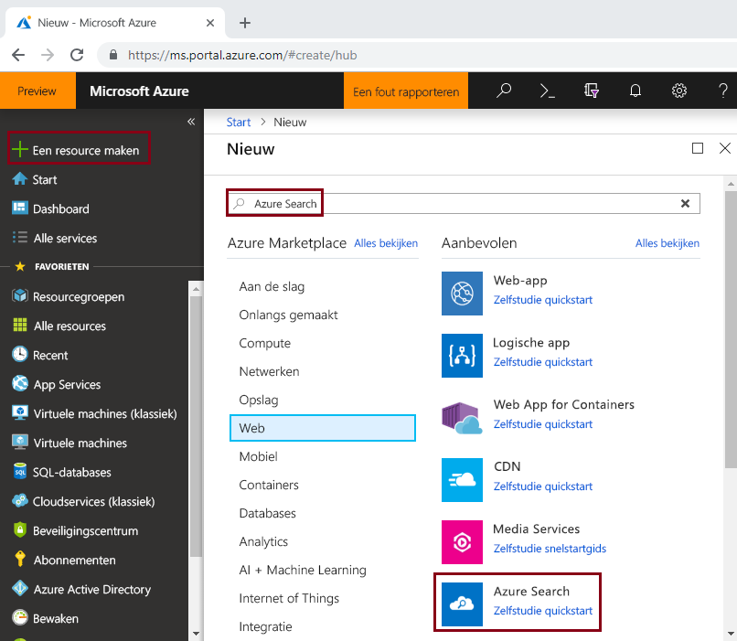
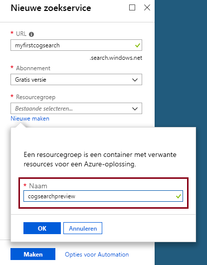
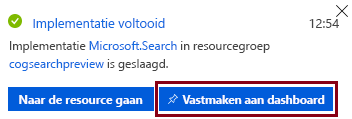
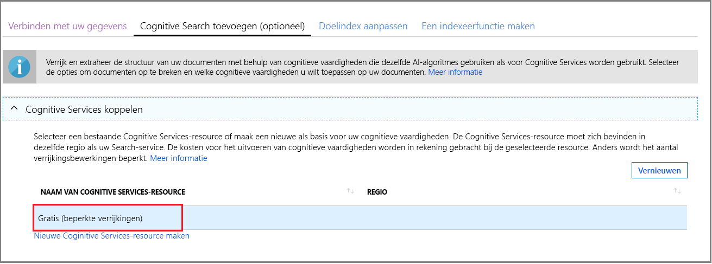

# Snelstart: Een pijplijn voor cognitief zoeken maken met vaardigheden en voorbeeldgegevens

Cognitief zoeken (preview) voegt vaardigheden voor gegevensextractie, verwerking van natuurlijke taal (NLP) en beeldverwerking toe aan een Azure Search-indexeringspijplijn, waardoor niet-doorzoekbare of ongestructureerde inhoud doorzoekbaarder wordt. 

Met een Cognitive Search-pijplijn kunnen [Cognitive Services-resources](https://azure.microsoft.com/services/cognitive-services/), zoals [OCR](cognitive-search-skill-ocr.md), [computertaaldetectie](cognitive-search-skill-language-detection.md) en [entiteitsherkenning](cognitive-search-skill-entity-recognition.md), worden geïntegreerd in een indexeringsproces. De AI-algoritmen van Cognitive Services worden gebruikt om patronen, functies en kenmerken in brongegevens te vinden en structuren en tekstuele inhoud te retourneren voor gebruik in oplossingen voor zoekopdrachten in volledige tekst op basis van Azure Search.

Maak in deze snelstart uw eerste verrijkingspijplijn in [Azure Portal](https://portal.azure.com) voordat u ook maar één regel code schrijft:

> [!div class="checklist"]
> * Begin met voorbeeldgegevens in Azure Blob-opslag
> * Configureer de wizard [**Gegevens importeren**](search-import-data-portal.md) voor cognitieve indexering en verrijking 
> * Voer de wizard uit (een entiteitsvaardigheid detecteert mensen, locatie en organisaties)
> * Gebruik [**Search Explorer**](search-explorer.md) om query's op de verrijkte gegevens uit te voeren

##  Ondersteunde regio's

U kunt cognitief zoeken uitproberen in een Azure Search-service in de volgende gebieden:

* US - west-centraal
* US - zuid-centraal
* US - oost
* US - oost 2
* US - west 2
* Canada - midden
* Europa -west
* Verenigd Koninkrijk Zuid
* Europa - noord
* Brazilië - zuid
* Azië - zuidoost
* India - centraal
* Australië - oost

Als u nog geen abonnement op Azure hebt, maak dan een [gratis account](https://azure.microsoft.com/free/?WT.mc_id=A261C142F) aan voordat u begint.

> [!NOTE]
> Met ingang van 21 december 2018 kunt u een Cognitive Services-resource koppelen aan een vaardighedenset van Azure Search. Hierdoor kunnen we beginnen met het factureren van kosten voor het uitvoeren van vaardighedensets. Vanaf deze datum gaan we ook kosten in rekening brengen voor het extraheren van afbeeldingen als onderdeel van de fase waarin de documenten kunnen worden gekraakt. Het extraheren van tekst uit documenten blijft gratis.
>
> Het uitvoeren van ingebouwde vaardigheden wordt in rekening gebracht tegen de huidige [betalen per gebruik-prijs van Cognitive Services](https://azure.microsoft.com/pricing/details/cognitive-services/). Het extraheren van afbeeldingen wordt tegen de prijs voor een preview in rekening gebracht en wordt beschreven op de [pagina met prijzen voor Azure Search](https://go.microsoft.com/fwlink/?linkid=2042400). [Meer](cognitive-search-attach-cognitive-services.md) informatie.

## Vereisten

[Wat is cognitief zoeken?](cognitive-search-concept-intro.md) introduceert de verrijkingsarchitectuur en -onderdelen. 

Azure-services worden uitsluitend in dit scenario gebruikt. Het maken van de services die u nodig hebt, maakt deel uit van de voorbereiding.

+ [Azure Blob Storage](https://azure.microsoft.com/services/storage/blobs/) biedt de brongegevens
+ [Cognitive Services](https://azure.microsoft.com/services/cognitive-services/) biedt de AI (u kunt deze resources in line maken bij het opgeven van de pijplijn)
+ [Azure Search](https://azure.microsoft.com/services/search/) biedt de verrijkte indexeringspijplijn en een uitgebreide ervaring voor het zoeken in tekst in vrije vorm voor gebruik in aangepaste apps

### Azure Search instellen

Registreer u eerst voor de Azure Search-service. 

1. Ga naar [Azure Portal](https://portal.azure.com) en meld u aan met uw Azure-account.

1. Klik op **Een resource maken**, zoek naar Azure Search en klik op **Maken**. Zie [Een Azure Search-service maken in de portal](search-create-service-portal.md) als u voor de eerste keer een zoekservice instelt en meer hulp nodig hebt.

  

1. Maak voor Resourcegroep een nieuwe resourcegroep voor alle resources die u in deze snelstart gaat maken. Dit vergemakkelijkt het opschonen van de resources nadat u de snelstart hebt voltooid.

1. Kies voor Locatie een van de [ondersteunde regio's](#supported-regions) voor Cognitive Search.

1. Voor de prijscategorie kunt u een **Gratis** service maken om de zelfstudies en snelstarts te voltooien. Voor nadere analyse met behulp van uw eigen gegevens, maakt u een [betaalde service](https://azure.microsoft.com/pricing/details/search/) zoals **Basic** of **Standard**. 

  Een gratis service is beperkt tot 3 indexen, maximaal 16 MB aan blobgrootte en 2 minuten indexeren. Dit is voldoende om de volledige functionaliteit van cognitief zoeken te verkennen. Zie [Servicelimieten](search-limits-quotas-capacity.md) om de limieten voor verschillende prijscategorieën te bekijken.

  

  > [!NOTE]
  > Cognitief zoeken is een openbare preview. De uitvoering van vaardigheden is momenteel in alle prijscategorieën beschikbaar, waaronder de gratis categorie. U kunt een beperkt aantal verrijkingen uitvoeren zonder een betaalde Cognitive Services-resource te koppelen. [Meer](cognitive-search-attach-cognitive-services.md) informatie.

1. Maak de service vast aan het dashboard voor snelle toegang tot service-informatie.

  

### Azure Blob service instellen en voorbeeldgegevens laden

De verrijkingspijplijn haalt gegevensbronnen op uit Azure ondersteund door [indexeerfuncties in Azure Search](search-indexer-overview.md). Houd er rekening mee dat Azure Table Storage niet wordt ondersteund voor cognitief zoeken. In dit voorbeeld gebruiken we blobopslag om meerdere inhoudstypen te laten zien.

1. [Download de voorbeeldgegevens](https://1drv.ms/f/s!As7Oy81M_gVPa-LCb5lC_3hbS-4) die bestaan uit een kleine set van verschillende typen bestanden. 

1. Meld u aan bij Azure Blob-opslag, maak een opslagaccount, open de Blob-servicepagina's en maak een container. Stel voor de container het openbare toegangsniveau in op **Container**. Zie de sectie [Een container maken](../storage/blobs/storage-unstructured-search.md#create-a-container) in de zelfstudie *Niet-gestructureerde gegevens doorzoeken* voor meer informatie.

1. Klik in de container die u hebt gemaakt op **Uploaden** om de voorbeeldbestanden te uploaden die u in een vorige stap hebt gedownload.

  

## De verrijkingspijplijn maken

Ga terug naar de dashboardpagina van de Azure Search-service en klik in de opdrachtbalk op **Gegevens importeren** om in vier stappen cognitieve verrijking in te stellen.

  

### Stap 1: Een gegevensbron maken

In **Verbinden met uw gegevens** kiest u **Azure Blob Storage** en selecteert u het account dat en de container die u hebt gemaakt. Geef een naam op voor de gegevensbron en gebruik standaardwaarden voor de rest. 

  

Ga door naar de volgende pagina.

  

### Stap 2: Cognitieve vaardigheden toevoegen

Voeg vervolgens verrijkingsstappen toevoegen aan de pijplijn voor indexering. Als u geen Cognitive Services-resource hebt, kunt u zich aanmelden voor een gratis versie met twintig transacties per dag. Omdat de voorbeeldgegevens uit veertien bestanden bestaan, verbruikt u met het uitvoeren van deze wizard een groot deel van uw dagelijkse toewijzing.

1. Vouw **Cognitive Services toevoegen** uit om opties voor brontoewijzing van de Cognitive Services-API's weer te geven. Voor deze zelfstudie kunt u de resource **Gratis** gebruiken.

  

2. Vouw **Verrijkingen toevoegen** uit en selecteer vaardigheden voor het verwerken van natuurlijke taal. Kies bij deze snelstart voor entiteitsherkenning voor personen, organisaties en locaties.

  

  De portal biedt ingebouwde vaardigheden voor OCR-analyse en tekstanalyse. In de portal werkt een set vaardigheden via één bronveld. Dat lijkt misschien een klein doel, maar voor Azure-blobs bevat het veld `content` het meeste van het blobdocument (bijvoorbeeld een Word-document of PowerPoint-presentatie). Dit veld is een ideale invoer omdat het alle inhoud van een blob bevat.

3. Ga door naar de volgende pagina.

  

> [!NOTE]
> Vaardigheden voor verwerking van natuurlijke taal werken met behulp van tekstinhoud in de set voorbeeldgegevens. Omdat we geen OCR-optie hebben geselecteerd, worden de JPEG- en PNG-bestanden die worden gevonden in de set voorbeeldgegevens niet verwerkt in deze snelstart. 

### Stap 3: De index configureren

De wizard kan gewoonlijk een standaardindex afleiden. U kunt in deze stap het gegenereerde indexschema bekijken en desgewenst instellingen wijzigen. Hieronder ziet u de standaardindex die voor de demoset Blobgegevens is gemaakt.

De wizard biedt goede standaardinstellingen voor deze snelstart: 

+ De standaardnaam is *azureblob-index*.
+ De standaardsleutel is *metadata_storage_path* (dit veld bevat unieke waarden).
+ Standaardgegevenstypen en -kenmerken zijn geldig voor scenario's waarbij wordt gezocht in volledige tekst.

U kunt eventueel **Ophaalbaar** wissen in het veld `content`. In blobs kan dit veld oplopen tot duizenden regels. U kunt zich voorstellen hoe lastig het is om bestanden met zware inhoud, zoals Word-documenten of PowerPoint-stapels als JSON, in een lijst met zoekresultaten weer te geven. 

Omdat u een set vaardigheden hebt gedefinieerd, gaat de wizard ervan uit dat u het gegevensveld van de oorspronkelijke bron wilt, plus de uitvoervelden die door de cognitieve pijplijn worden gemaakt. Daarom voegt de portal indexvelden toe voor `content`, `people`, `organizations` en `locations`. U ziet dat de wizard automatisch **Ophaalbaar** en **Doorzoekbaar** voor deze velden inschakelt. **Doorzoekbaar** geeft aan dat een veld kan worden doorzocht. **Ophaalbaar** betekent dat het in resultaten kan worden geretourneerd. 

  
  
Ga door naar de volgende pagina.

  

### Stap 4: De indexeerfunctie configureren

De indexeerfunctie is een belangrijke resource die het indexeerproces aandrijft. Hiermee specificeert u de naam van de gegevensbron, een doelindex en de uitvoerfrequentie. Het eindresultaat van de wizard **Gegevens importeren** is altijd een indexeerfunctie die u herhaaldelijk kunt uitvoeren.

Op de pagina **Indexeerfunctie** kunt u de standaardnaam accepteren en de schemaoptie **Eén keer uitvoeren** gebruiken om de indexeerfunctie direct uit te voeren. 

  

Klik op **Verzenden** om de indexeerfunctie te maken en tegelijkertijd uit te voeren.

## Het indexeren bewaken

Verrijkingsstappen vergen meer tijd dan gebruikelijke indexering op basis van tekst. De lijst van de indexeerfunctie moet door de wizard worden geopend op de overzichtspagina, zodat u de voortgang kunt volgen. Voor zelfnavigatie gaat u naar de overzichtspagina en klikt u op **Indexeerfuncties**.

De waarschuwing wordt weergegeven omdat JPG- en PNG-bestanden afbeeldingsbestanden zijn en we de OCR-vaardigheid voor deze pijplijn hebben weggelaten. U krijgt ook afkappingsmeldingen. In Azure Search is de extractie beperkt tot 32.000 tekens in de laag Gratis.

  

Indexeren en verrijken kunnen even duren. Daarom is het aan te raden om kleinere gegevenssets te gebruiken voor verkenning. 

## Query uitvoeren in Search Explorer

Nadat er een index is gemaakt, kunt u query's uitvoeren om documenten te retourneren uit de index. Gebruik **Search Explorer** in de portal om query's uit te voeren en resultaten te bekijken. 

1. Klik op de dashboardpagina van de zoekservice op **Search Explorer** in de opdrachtbalk.

1. Selecteer bovenaan **Index wijzigen** om de index die u hebt gemaakt te selecteren.

1. Voer een zoekopdracht in om een query op de index toe te passen, zoals `search=Microsoft&searchFields=organizations`.

Resultaten worden in JSON geretourneerd, wat uitgebreid en moeilijk te lezen kan zijn, met name in grote documenten die afkomstig zijn van Azure-blobs. Als u niet eenvoudig resultaten kunt scannen, gebruikt u CTRL+F om in documenten te zoeken. Voor deze query kunt u in de JSON zoeken naar specifieke voorwaarden. 

Met CTRL+F kunt u ook bepalen hoeveel documenten een bepaalde resultatenset bevat. Voor Azure-blobs kiest de portal 'metadata_storage_path' als de sleutel omdat elke waarde uniek voor het document is. Zoek met CTRL+F naar 'metadata_storage_path' om het aantal documenten te tellen. 

  

## Opgedane kennis

U hebt nu uw eerste oefening in indexeren met cognitieve verrijking voltooid. Het doel van deze snelstart is om belangrijke concepten te introduceren en u de wizard te laten doorlopen, zodat u snel een oplossing voor cognitief zoeken kunt maken met behulp van uw eigen gegevens.

Een van de belangrijke concepten die we wilden overbrengen, is de afhankelijkheid van Azure-gegevensbronnen. Verrijking van cognitief zoeken is gebonden aan indexeerfuncties, en indexeerfuncties zijn Azure- en bronspecifiek. Hoewel deze snelstart Azure Blob-opslag gebruikt, zijn andere Azure-gegevensbronnen ook mogelijk. Zie [Indexeerfuncties in Azure Search](search-indexer-overview.md) voor meer informatie.

Een ander belangrijk concept is dat vaardigheden via invoervelden werken. In de portal moet u één bronveld voor alle vaardigheden kiezen. Invoeren kunnen in code andere velden zijn, of de uitvoer van een upstream-vaardigheid.

 Invoeren voor een vaardigheid worden toegewezen aan een uitvoerveld in een index. Intern stelt de portal [aantekeningen](cognitive-search-concept-annotations-syntax.md) in en definieert een [set vaardigheden](cognitive-search-defining-skillset.md), waarmee de volgorde van bewerkingen en de algemene stroom wordt bepaald. Deze stappen zijn verborgen in de portal, maar wanneer u begint met het schrijven van code worden deze concepten belangrijk.

Tot slot hebt u geleerd dat u resultaten kunt bekijken door query's in de index uit te voeren. Azure Search biedt eigenlijk een doorzoekbare index, waarin u query's kunt uitvoeren met behulp van de [eenvoudige](https://docs.microsoft.com/rest/api/searchservice/simple-query-syntax-in-azure-search) of [volledig uitgebreide querysyntaxis](https://docs.microsoft.com/rest/api/searchservice/lucene-query-syntax-in-azure-search). Een index met verrijkte velden werkt zoals elke andere index. Als u standaard of [aangepaste analyse](search-analyzers.md), [scoreprofielen](https://docs.microsoft.com/rest/api/searchservice/add-scoring-profiles-to-a-search-index), [synoniemen](search-synonyms.md), [meervoudige filters](search-filters-facets.md), geografisch zoeken of een andere functie van Azure Search wilt opnemen, kunt u dat gewoon doen.

## Resources opschonen

Als u klaar bent met verkennen, kunt u het snelst opschonen door de resourcegroep met de Azure Search-service en Azure Blob service te verwijderen.  

Ervan uitgaande dat u beide services in dezelfde groep hebt geplaatst, verwijdert u de resourcegroep om alle inhoud ervan permanent te verwijderen, waaronder de services en alle opgeslagen inhoud die u voor deze oefening hebt gemaakt. De naam van de resourcegroep staat in de portal op de pagina Overzicht van elke service.

## Volgende stappen

Afhankelijk van hoe u de Cognitive Services-resource hebt ingericht, kunt u experimenteren met indexering en verrijking door de wizard opnieuw uit te voeren met verschillende vaardigheden en brongegevensvelden. Herhaal de stappen door de index en indexeerfunctie te verwijderen en vervolgens de indexeerfunctie opnieuw te maken met nieuwe selecties.

+ Selecteer in **Overzicht** > **Indexen** de index die u hebt gemaakt en klik vervolgens op **Verwijderen**.

+ Dubbelklik in **Overzicht** op de tegel **Indexeerfuncties**. Zoek de indexeerfunctie die u hebt gemaakt en verwijder deze.

U kunt ook de voorbeeldgegevens en de services die u hebt gemaakt opnieuw gebruiken in de volgende zelfstudie om meer te weten te komen over het programmatisch uitvoeren van dezelfde taken. 

> [!div class="nextstepaction"]
> [Zelfstudie: De REST API's voor cognitief zoeken gebruiken](cognitive-search-tutorial-blob.md)
