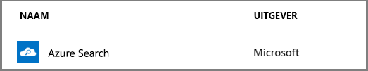

# Een Azure Search-service maken in de portal

Azure Search is een zelfstandige resource die wordt gebruikt voor het toevoegen van een zoekervaring aan aangepaste apps. Hoewel Azure Search eenvoudig kan worden geïntegreerd met veel andere Azure-services, kunt u deze ook zelfstandig gebruiken, met apps die worden gehost op netwerkservers of met software die wordt uitgevoerd op andere cloudplatforms. 

Dit artikel bevat meer informatie over hoe u een Azure Search-resource in [Azure Portal](https://portal.azure.com/) kunt maken. 

Hebt u liever PowerShell? Gebruik de [servicesjabloon](https://azure.microsoft.com/resources/templates/101-azure-search-create/) van Azure Resource Manager. Als u hulp nodig hebt bij het starten, gaat u naar [Azure Search beheren met PowerShell](search-manage-powershell.md) voor achtergrondinformatie.

## Abonneren (gratis of betaald)

[Maak een gratis Azure-account](https://azure.microsoft.com/pricing/free-trial/?WT.mc_id=A261C142F) en gebruik gratis tegoed om betaalde Azure-services uit te proberen. Nadat u het tegoed hebt opgemaakt, kunt u het account houden en de gratis Azure-services, zoals Websites, blijven gebruiken. Er wordt nooit geld van uw creditcard afgeschreven, tenzij u uw instellingen zelf wijzigt en expliciet aangeeft dat u wilt betalen.

U kunt ook [voordelen voor MSDN-abonnees activeren](https://azure.microsoft.com/pricing/member-offers/msdn-benefits-details/?WT.mc_id=A261C142F). Als u een MSDN-abonnement hebt, ontvangt u elke maand tegoeden die u voor betaalde Azure-services kunt gebruiken. 

## Azure Search vinden
1. Meld u aan bij [Azure Portal](https://portal.azure.com/).
2. Klik op het plusteken (+ Resource maken) in de linkerbovenhoek.
3. Gebruik de zoekbalk om te zoeken naar 'Azure Search' of ga naar de resource via **Web** > **Azure Search**.

## De service en het URL-eindpunt een naam geven

Een servicenaam is onderdeel van het URL-eindpunt waaraan API-aanroepen worden geadresseerd: `https://your-service-name.search.windows.net`. Voer de naam van uw service in het **URL**-veld in.

Als u bijvoorbeeld wilt dat het eindpunt `https://my-app-name-01.search.windows.net` wordt, voert u `my-app-name-01` in.

Vereisten voor servicenaam:
   * De naam moet uniek zijn binnen de naamruimte search.windows.net
   * tussen de 2 en 60 tekens lang zijn
   * Gebruik kleine letters, cijfers of streepjes (-)
   * Vermijd streepjes (-) bij de eerste 2 tekens of als het allerlaatste teken
   * Zorg ervoor dat er nergens twee opeenvolgende streepjes (--) staan

## Een abonnement selecteren
Als u meer dan één abonnement hebt, moet u er één kiezen dat ook services voor gegevensopslag of File Storage-services biedt. Azure Search kan automatisch Azure Table- en Blob-opslag, SQL-Database en Azure Cosmos DB detecteren voor indexering via [*indexeerfuncties*](search-indexer-overview.md), maar alleen voor services in hetzelfde abonnement.

## Een resourcegroep selecteren
Een resourcegroep is een verzameling Azure-services en -resources die samen worden gebruikt. Als u bijvoorbeeld Azure Search gebruikt om een SQL-database te indexeren, dan moeten beide services deel uitmaken van dezelfde resourcegroep.

Als u resources niet in één groep combineert of als bestaande resourcegroepen resources bevatten die worden gebruikt in oplossingen waartussen geen verband bestaat, maakt u een nieuwe resourcegroep voor uw Azure Search-resource.

> [!TIP]
> Als u een resourcegroep verwijdert, worden de services binnen die resourcegroep ook verwijderd. Bij prototypeprojecten die gebruikmaken van meerdere services, wordt het opschonen na afloop van het project gemakkelijker als die services zich allemaal in dezelfde resourcegroep bevinden. 

## Een hostinglocatie selecteren 
Azure Search kan als Azure-service worden gehost in datacenters over de hele wereld. Houd er rekening mee dat [prijzen geografisch kunnen verschillen](https://azure.microsoft.com/pricing/details/search/).

## Een prijscategorie selecteren (SKU)
[Azure Search wordt momenteel aangeboden in verschillende prijscategorieën](https://azure.microsoft.com/pricing/details/search/): Gratis, Basic of Standard. Elke categorie heeft eigen [capaciteiten en limieten](search-limits-quotas-capacity.md). Raadpleeg [Choose a pricing tier or SKU](search-sku-tier.md) (Een prijscategorie of SKU kiezen) voor hulp.

Standard wordt meestal gekozen voor productieworkloads, maar de meeste klanten beginnen met de gratis service.

Een prijscategorie kan niet worden gewijzigd nadat de service is gemaakt. Als u een hogere of lagere categorie nodig hebt, moet u de service opnieuw maken.

## Uw service maken

Vergeet niet om uw service aan het dashboard vast te maken voor eenvoudige toegang wanneer u zich aanmeldt.

## Uw service schalen
Het kan een paar minuten duren om een service te maken (15 minuten of meer, afhankelijk van de categorie). Nadat uw service is geconfigureerd, kunt u deze schalen, zodat de service aan uw behoeften voldoet. Aangezien u voor uw Azure Search-service hebt gekozen voor de categorie Standard, kunt u uw service in twee dimensies schalen: replica's en partities. Als u had gekozen voor de categorie Basic, had u alleen replica's kunnen toevoegen. Als u had gekozen voor de gratis service, had u niet kunnen schalen.

***Partities*** zorgen ervoor dat uw service meer documenten bewaart en meer documenten doorzoekt.

***Replica's*** zorgen ervoor dat uw services meer zoekquery's kunnen verwerken.

Als u resources toevoegt, wordt uw maandfactuur hoger. Met de [prijscalculator](https://azure.microsoft.com/pricing/calculator/) krijgt u inzicht in het effect van het toevoegen van resources op uw facturering. Onthoud dat u resources kunt aanpassen aan de benodigde capaciteit. Zo kunt u eerst resources toevoegen voor het maken van een volledige eerste index en later het aantal resources weer verlagen tot een niveau dat geschikt is voor incrementele indexering.

> [!Important]
> Een service moet [twee replica's hebben voor een alleen-lezen-SLA en drie replica's voor een lezen/schrijven-SLA](https://azure.microsoft.com/support/legal/sla/search/v1_0/).

1. Ga naar de pagina van uw zoekservice in Azure Portal.
2. Selecteer in het navigatiedeelvenster aan de linkerkant **Instellingen** > **Schalen**.
3. Gebruik de schuifbalk om resources van een bepaald type toe te voegen.

> [!Note] 
> Elke categorie heeft verschillende [limieten](search-limits-quotas-capacity.md) op het aantal zoekeenheden dat is toegestaan in een enkele service (replica's * partities = totaalaantal zoekeenheden).

## Wanneer u een tweede service moet toevoegen

De meeste klanten gebruiken maar één service die geconfigureerd is voor de categorie die de [juiste balans voor resources](search-sku-tier.md). Eén service kan meerdere indexen hosten, afhankelijk van de [maximale limieten van de door u geselecteerde categorie](search-capacity-planning.md), en alle indexen zijn van elkaar geïsoleerd. In Azure Search kunnen aanvragen alleen worden gericht aan één index, waardoor de kans dat er per ongeluk of opzettelijk gegevens worden opgehaald uit andere indexen in dezelfde service, wordt geminimaliseerd.

Hoewel de meeste klanten slechts één service gebruiken, kan serviceredundantie nodig zijn als de volgende operationele vereisten gelden:

+ Herstel na noodgevallen (onderbreking datacentrum). Azure Search biedt geen onmiddellijke failover in geval van een storing. Raadpleeg voor aanbevelingen en richtlijnen [Servicebeheer](search-manage.md).
+ Uit uw onderzoek naar multitenancymodellering blijkt dat een ontwerp met meerdere services optimaal is. Raadpleeg voor meer informatie [Ontwerp voor multitenancy](search-modeling-multitenant-saas-applications.md).
+ Voor globaal geïmplementeerde toepassingen kan het nodig zijn dat u een exemplaar van Azure Search in meerdere regio's plaatst om de latentie van het internationale verkeer in uw toepassing te minimaliseren.

> [!NOTE]
> In Azure Search kunt u indexering en querywerkbelastingen niet scheiden; u kunt dus nooit meerdere services voor gescheiden werkbelastingen maken. Een query wordt altijd uitgevoerd op de service waarin de index is gemaakt (u kunt niet een index in een service maken en vervolgens naar een andere service kopiëren).
>

Een tweede service is niet vereist voor hoge beschikbaarheid. Hoge beschikbaarheid voor query's wordt bereikt wanneer u twee of meer replica's in dezelfde service gebruikt. Replica-updates zijn sequentieel, wat betekent dat er ten minste één operationeel is wanneer er een service-update wordt geïmplementeerd. Voor meer informatie over uptime raadpleegt u [Service Level Agreements](https://azure.microsoft.com/support/legal/sla/search/v1_0/).

## Volgende stappen
Nadat u een Azure Search-service hebt ingericht, kunt u in de portal verdergaan met het maken van uw eerste index.

> [!div class="nextstepaction"]
> [Zelfstudie: Gegevens en index importeren, en query's uitvoeren in de portal](search-get-started-portal.md)
