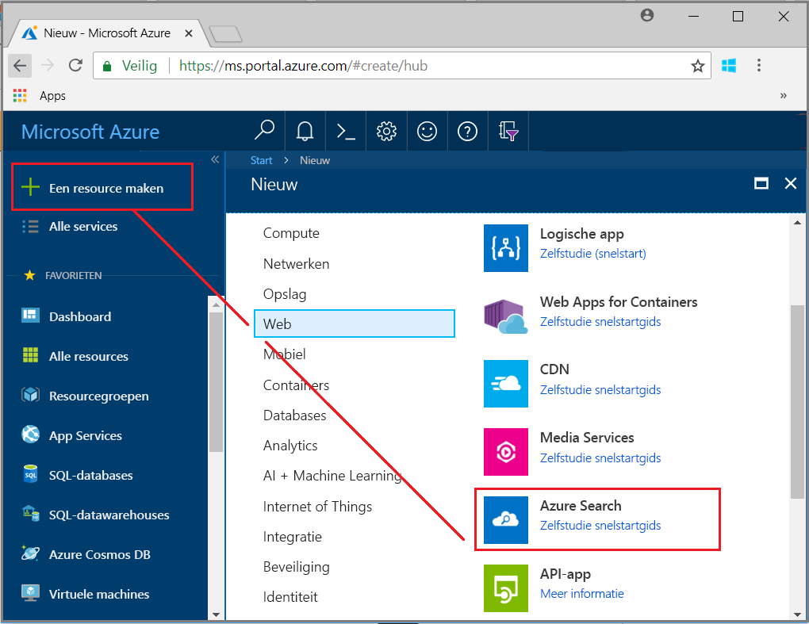
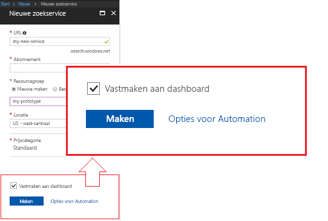
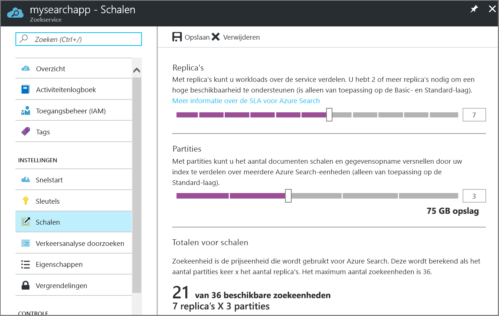

# Maak een Azure Search-service in de portal

Informatie over het maken of een Azure Search-service in de portal inrichten. 

Voorkeur PowerShell? Gebruik de Azure Resource Manager [servicesjabloon](https://azure.microsoft.com/resources/templates/101-azure-search-create/). Zie voor meer informatie aan de slag [Azure Search beheren met PowerShell](search-manage-powershell.md) voor de achtergrond.

## Abonneren (gratis of betaalde)

[Een gratis Azure-account openen](https://azure.microsoft.com/pricing/free-trial/?WT.mc_id=A261C142F) en gratis tegoed gebruiken om uit te proberen betaalde Azure-services. Nadat het tegoed is gebruikt, wordt het account houden en blijven gratis Azure-services, zoals Websites gebruiken. Uw creditcard is nooit in rekening gebracht tenzij u expliciet de instellingen wijzigen en vragen kunnen worden gebracht.

U kunt ook [voordelen als MSDN-abonnee activeren](https://azure.microsoft.com/pricing/member-offers/msdn-benefits-details/?WT.mc_id=A261C142F). Een MSDN-abonnement ontvangt u elke maand tegoeden die kunt u voor betaalde Azure-services. 

## Zoeken naar Azure Search
1. Meld u aan bij [Azure Portal](https://portal.azure.com/).
2. Klik op het plusteken ('+') in de linkerbovenhoek.
3. Selecteer **Web en mobiel** > **Azure Search**.

## Naam van de service en de URL-eindpunt

Naam van een service maakt deel uit van het URL-eindpunt met welke API aanroepen worden uitgegeven: `https://your-service-name.search.windows.net`. Voer de servicenaam van uw in de **URL** veld. 

Vereisten voor service-naam:
   * Deze naam moet uniek zijn binnen de naamruimte search.windows.net
   * 2 en 60 tekens lang zijn
   * Gebruik van kleine letters, getallen of streepjes ('-')
   * Vermijd streepjes ('-') in de eerste 2 tekens of als het laatste teken
   * Er zijn geen twee opeenvolgende streepjes ('--') een willekeurige plaats

## Een abonnement selecteren
Als u meer dan één abonnement hebt, kiest u dat ook gegevens of file storage-services heeft. Azure Search kunt automatische detectie Azure Table- en Blob-opslag, SQL-Database en Azure Cosmos DB voor indexeren [ *indexeerfuncties*](search-indexer-overview.md), maar alleen voor services in hetzelfde abonnement.

## Een resourcegroep selecteren
Een resourcegroep is een verzameling Azure-services en bronnen die samen worden gebruikt. Bijvoorbeeld, als u van Azure Search gebruikmaakt index van een SQL-database, moeten klikt u vervolgens beide services deel uitmaken van dezelfde resourcegroep.

> [!TIP]
> Verwijderen van een resourcegroep, verwijdert tevens de services in het. Prototype projecten met gebruik van meerdere services, gemakkelijker als ze allemaal in dezelfde resourcegroep opschoning nadat het project voltooid is. 

## Selecteer een hosting-locatie 
Als een Azure-service kan de Azure Search in datacenters over de hele wereld worden gehost. Houd er rekening mee dat [prijzen kunnen verschillen](https://azure.microsoft.com/pricing/details/search/) per Geografie.

## Selecteer een prijscategorie (SKU)
[Azure Search momenteel wordt aangeboden in meerdere Prijscategorieën](https://azure.microsoft.com/pricing/details/search/): gratis, basis of standaard. Elke laag heeft zijn eigen [capaciteit en limieten](search-limits-quotas-capacity.md). Zie [Kies een prijscategorie laag of SKU](search-sku-tier.md) voor hulp.

In dit overzicht hebben we de prijscategorie Standard gekozen voor onze service.

Een prijscategorie kan niet worden gewijzigd zodra de service is gemaakt. Als u een hogere of lagere laag later nodig hebt, hebt u de service opnieuw te maken.

## Uw service maken

Vergeet niet om uw service aan het dashboard voor gemakkelijke toegang vast wanneer u zich aanmeldt.

## Schalen van uw service
Het kan even duren om een service (15 minuten of langer, afhankelijk van de laag) te maken. Nadat de service is geconfigureerd, kunt u schalen om te voldoen aan uw behoeften. Omdat u de prijscategorie Standard voor uw Azure Search-service hebt gekozen, kunt u uw service schalen in twee dimensies: replica's en partities. Had u de basisstaffel gekozen, kunt u alleen toevoegen replica's. Als u de gratis service hebt ingericht, is scale niet beschikbaar.

***Partities*** zodat uw service voor het opslaan en doorzoeken meer documenten.

***Replica's*** zodat uw service voor het afhandelen van een hogere belasting van de zoekquery's.

> [!Important]
> Een service moet hebben [2 replica's voor alleen-lezen-SLA en 3 replica's voor lezen/schrijven SLA](https://azure.microsoft.com/support/legal/sla/search/v1_0/).

1. Ga naar de pagina van de zoekopdracht in de Azure portal.
2. Selecteer in het deelvenster navigatie aan de linkerkant **instellingen** > **Scale**.
3. Gebruik de slidebar replica's of partities toe te voegen.

> [!Note] 
> Elke laag zijn verschillende [limieten](search-limits-quotas-capacity.md) op het totale aantal Search-eenheden die zijn toegestaan in een enkele service (replica's * partities totaal aantal Search-eenheden =).

## Wanneer een tweede service toevoegen

Een grote meerderheid van klanten gebruik slechts één service ingericht op een laag met de [rechtermuisknop saldo van resources](search-sku-tier.md). Een service kan meerdere indexen hosten onderworpen aan de [maximaal limieten van de laag die u selecteert](search-capacity-planning.md), met elke geïsoleerd van een andere index. In Azure Search kunnen alleen aanvragen worden omgeleid naar een index, minimaliseert de kans op per ongeluk of opzettelijk gegevens ophalen uit andere indexen in dezelfde service.

Hoewel de meeste klanten slechts één service gebruikt, is het mogelijk dat service redundantie nodig als de volgende operationele vereisten gelden:

+ Herstel na noodgevallen (onderbreking datacentrum). Azure Search biedt geen chatberichten failover in geval van een storing. Zie voor aanbevelingen en richtlijnen [Service-beheer](search-manage.md).
+ Uw onderzoek van multi-tenancymodus modellering heeft vastgesteld dat extra services het ontwerp van de optimale is. Zie voor meer informatie [ontwerp voor multi-tenancy](search-modeling-multitenant-saas-applications.md).
+ Voor globaal geïmplementeerde toepassingen mogelijk een exemplaar van Azure Search in meerdere regio's te minimaliseren latentie van de internationale verkeer van uw toepassing.

> [!NOTE]
> In Azure Search kan niet u werkbelastingen voor indexering en opvragen; scheiden Zo maakt u meerdere services voor gescheiden werkbelastingen nooit. Een index is altijd een query uitgevoerd op de service waarin het is gemaakt (u kunt geen een index in een service maken of kopiëren naar een andere).
>

Een tweede service is niet vereist voor hoge beschikbaarheid. Hoge beschikbaarheid voor query's wordt bereikt wanneer u 2 of meer replica's in dezelfde service. Replica-updates zijn sequentiële, ten minste één operationeel is wanneer een service-update is geïmplementeerd. Zie voor meer informatie over bedrijfstijd [Service Level Agreements](https://azure.microsoft.com/support/legal/sla/search/v1_0/).

## Volgende stappen
Na het inrichten van een Azure Search-service, bent u klaar om [een index definiëren](search-what-is-an-index.md) zodat u kunt uploaden en uw gegevens te zoeken. 

> [!div class="nextstepaction"]
> [Het gebruik van Azure Search in .NET](search-howto-dotnet-sdk.md)
