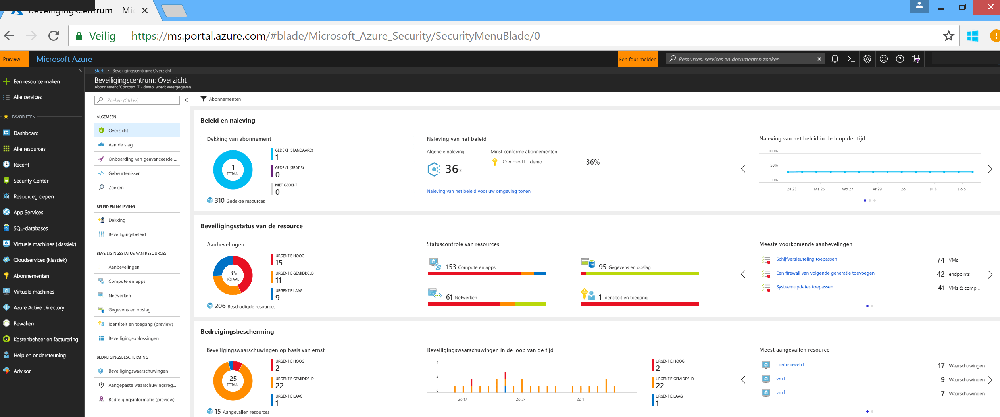
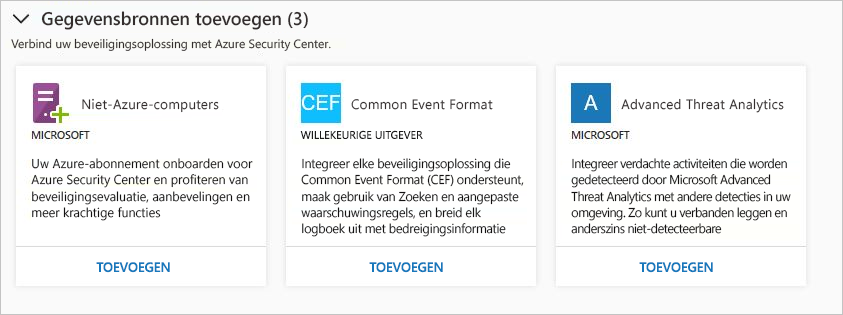
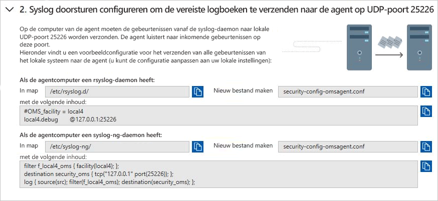
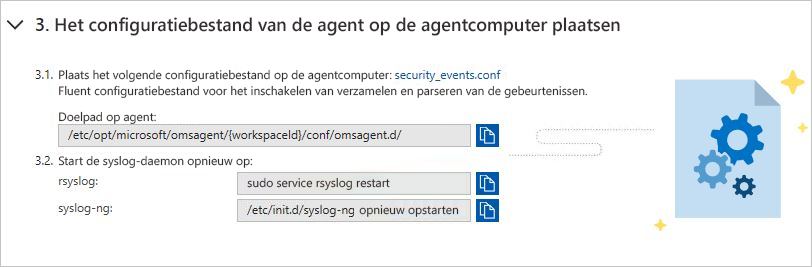
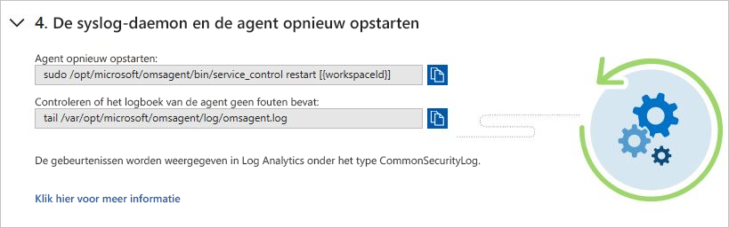
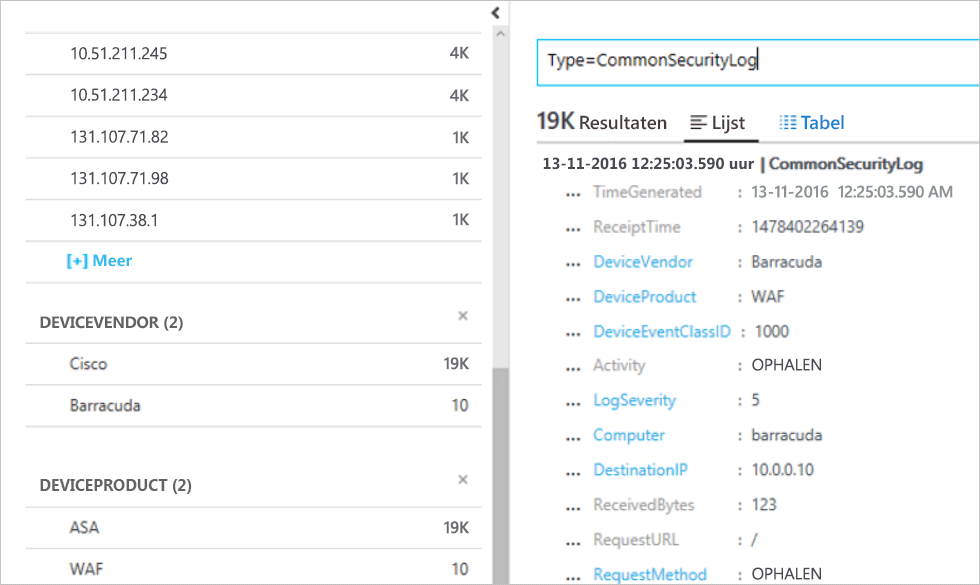

# Snelstartgids: Beveiligingsoplossingen verbinden met Security Center

U kunt niet alleen beveiligingsgegevens verzamelen van uw computers, maar u kunt ook beveiligingsgegevens integreren van tal van andere beveiligingsoplossingen, waaronder alle oplossingen die CEF (Common Event Format) ondersteunen. CEF is een standaardindeling in de branche voor Syslog-berichten. De indeling wordt door veel leveranciers van beveiligingsproducten gebruikt om gebeurtenisintegratie tussen verschillende platforms mogelijk te maken.

In deze snelstartgids leert u het volgende:
- Een beveiligingsoplossing met Security Center verbinden met behulp van CEF-logboeken
- De verbinding met de beveiligingsoplossing valideren

## Vereisten
U moet over een abonnement op Microsoft Azure beschikken om met Security Center aan de slag te gaan. Als u geen abonnement hebt, kunt u zich aanmelden voor een [gratis account](https://azure.microsoft.com/free/).

Om deze zelfstartgids te doorlopen, moet u zich in de Standard-prijscategorie van Security Center bevinden. U kunt Security Center Standard de eerste 60 dagen kosteloos proberen. In de snelstartgids [Onboard your Azure subscription to Security Center Standard](security-center-get-started.md) (Uw Azure-abonnement registreren voor Security Center Standard) wordt u begeleid bij het upgraden naar Standard.

U hebt ook een [Linux-machine](https://docs.microsoft.com/azure/log-analytics/log-analytics-agent-linux) nodig, waarop de Syslog-service al is verbonden met uw Security Center.

## Oplossing verbinden met behulp van CEF

1. Meld u aan bij de [Azure Portal](https://azure.microsoft.com/features/azure-portal/).
2. Ga naar het **Microsoft Azure**-menu en selecteer **Security Center**. **Security Center - Overzicht** wordt geopend.

      

3. Selecteer in het hoofdmenu van Security Center de optie **Beveiligingsoplossingen**.
4. Op de pagina Beveiligingsoplossingen gaat u naar **Gegevensbronnen toevoegen (3)** en klikt u onder **Common Event Format** op **Toevoegen**.

    

5. Vouw op de pagina Common Event Format-logboeken de tweede stap, **Syslog doorsturen configureren om de vereiste logboeken te zenden naar de agent op UDP-poort 25226**, uit en volg de onderstaande instructies op uw Linux-computer:

    

6. Vouw de derde stap, **Het configuratiebestand van de agent op de agentcomputer plaatsen**, uit en volg de onderstaande instructies op uw Linux-computer:

    

7. Vouw de derde stap, **De syslog-daemon en de agent opnieuw starten**, uit en volg de onderstaande instructies op uw Linux-computer:

    

## De verbinding valideren

Voordat u verder gaat met onderstaande stappen, moet u wachten tot de syslog is gestart met de rapportage aan Security Center. Dit kan enige tijd duren, afhankelijk van de grootte van de omgeving.

1.  Klik in het linkerdeelvenster van het dashboard van Security Center op **Zoeken**.
2.  Selecteer de werkruimte waarmee de Syslog (Linux-computer) is verbonden.
3.  Typ *CommonSecurityLog* en klik op de knop **Zoeken**.

Het volgende voorbeeld toont het resultaat van deze stappen: 

## Resources opschonen
Andere snelstartgidsen en zelfstudies in deze verzameling zijn gebaseerd op deze snelstartgids. Als u de volgende snelstartgidsen en zelfstudies ook wilt doornemen, blijf dan de prijscategorie Standard gebruiken en houd automatische inrichting ingeschakeld. Als u niet wilt doorgaan of wilt terugkeren naar de laag gratis:

1. Ga terug naar het hoofdmenu van Security Center en selecteer **Beveiligingsbeleid**.
2. Selecteer het abonnement of het beleid dat u wilt terugzetten op Gratis. **Beveiligingsbeleid** wordt geopend.
3. Selecteer onder **BELEIDSONDERDELEN** de optie **Prijscategorie**.
4. Selecteer **Gratis** om het abonnement te wijzigen van de Standard-laag in de Gratis laag.
5. Selecteer **Opslaan**.

Als u automatisch inrichten wilt uitschakelen:

1. Ga terug naar het hoofdmenu van Security Center en selecteer **Beveiligingsbeleid**.
2. Selecteer het abonnement waarvoor u automatisch inrichten wilt uitschakelen.
3. Ga naar **Beveiligingsbeleid – Gegevensverzameling** en selecteer onder **Onboarding** de optie **Uit** om automatisch inrichten uit te schakelen.
4. Selecteer **Opslaan**.

>[!NOTE]
> Wanneer u automatische inrichting uitschakelt, wordt MMA niet verwijderd van Azure-VM's waarop de agent is ingericht. Door automatische inrichting uit te schakelen, wordt de beveiligingsbewaking voor uw resources beperkt.
>

## Volgende stappen
In deze snelstartgids hebt u geleerd hoe u een Linux Syslog-oplossing met Security Center verbindt met behulp van CEF. Door uw CEF-logboeken te verbinden met Security Center, kunt u gebruikmaken van zoekfuncties en aangepaste waarschuwingsregels en de aanvulling met bedreigingsinformatie voor elk logboek. Voor meer informatie over het gebruik van Security Center gaat u verder met de zelfstudie voor het configureren van een beveiligingsbeleid en het beoordelen van de beveiliging van uw resources.

> [!div class="nextstepaction"]
> [Zelfstudie: Beveiligingsbeleidsregels opstellen en beoordelen](./tutorial-security-policy.md)
