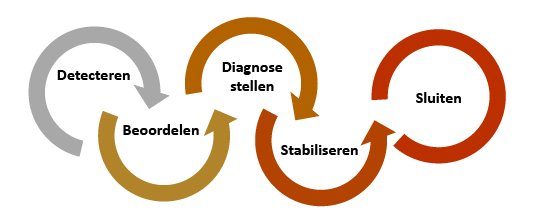
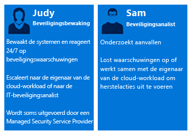
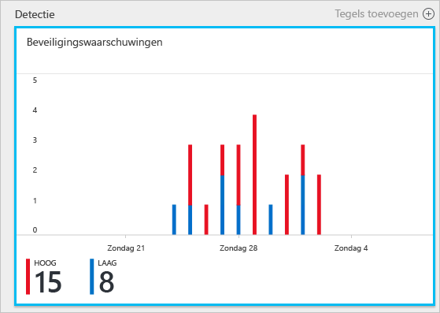
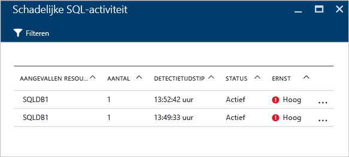
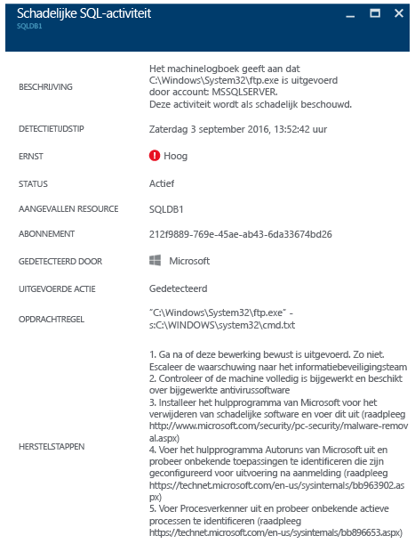

# Azure Security Center gebruiken voor reacties op incidenten
Veel organisaties leren pas hoe ze moeten reageren op beveiligingsincidenten nadat ze het slachtoffer zijn geworden van een aanval. Als u de kosten en schade wilt beperken, is het belangrijk dat u een plan hebt voor het reageren op incidenten voordat er een aanval plaatsvindt. U kunt Azure Security Center gebruiken in verschillende fasen tijdens een reactie op een incident.

## Planning voor het reageren op incidenten
Of een plan doeltreffend is, hangt af van drie belangrijke kenmerken: beveiliging, detectie en de mogelijkheid om te reageren op bedreigingen. Beveiliging heeft betrekking op het voorkomen van incidenten. Detectie betekent het identificeren van bedreigingen in een vroeg stadium. En bij reageren gaat het om het verwijderen van de aanvaller en het herstellen van systemen om de gevolgen van een inbreuk zo beperkt mogelijk te houden.

In dit artikel worden de fasen van een reactie op een beveiligingsincident gebruikt die worden beschreven in het artikel [Microsoft Azure Security Response in the Cloud](https://gallery.technet.microsoft.com/Azure-Security-Response-in-dd18c678) (Beveiligingsreactie van Microsoft Azure in de cloud), zoals weergegeven in het volgende diagram:

U kunt Security Center gebruiken tijdens de fasen van detectie, beoordeling en diagnose. Hier vindt u voorbeelden van hoe u Security Center nuttig kunt gebruiken tijdens de drie eerste fasen van een reactie op een incident:

* **Detecteren**: bekijken van de eerste indicatie dat er een gebeurtenis wordt onderzocht.
  * Voorbeeld: bekijk het eerste voorval waarbij tijdens een controle een beveiligingswaarschuwing met hoge prioriteit in het Security Center-dashboard is gegenereerd.
* **Beoordelen**: de eerste beoordeling uitvoeren voor meer informatie over de verdachte activiteiten.
  * Voorbeeld: haal meer informatie op over de beveiligingswaarschuwing.
* **Diagnose stellen**: een technisch onderzoek uitvoeren, en strategieën voor beheersing, risicobeperking en tijdelijke oplossingen in kaart brengen.
  * Voorbeeld: de herstelstappen volgen die in Security Center voor de desbetreffende beveiligingswaarschuwing worden beschreven.

Het volgende scenario laat zien hoe u Security Center kunt gebruiken tijdens de detectie-, beoordelings- en diagnose-/reactiefase van een beveiligingsincident. In Security Center is een [beveiligingsincident](security-center-incident.md) een samenloop van alle waarschuwingen voor een resource die overeenstemt met [kill chain](https://blogs.technet.microsoft.com/office365security/addressing-your-cxos-top-five-cloud-security-concerns/)-patronen. Incidenten worden weergegeven in de tegel en blade voor [Beveiligingswaarschuwingen](security-center-managing-and-responding-alerts.md). In geval van een incident ziet u de lijst met gerelateerde waarschuwingen, zodat u meer info krijgt over elke gebeurtenis. In Security Center worden ook zelfstandige beveiligingswaarschuwingen getoond die u kunt gebruiken om verdachte activiteiten op te sporen.

## Scenario
Contoso heeft enkele van de on-premises resources onlangs naar Azure gemigreerd, met inbegrip van een aantal line-of-business workloads en SQL-databases op virtuele machines. Het Contoso Core Computer Security Incident Response Team (CSIRT) heeft een probleem met het onderzoeken van mogelijke beveiligingskwesties. De oorzaak hiervan is dat het bedrijf geen beveiligingsintelligence heeft die is geïntegreerd in de aanwezige hulpmiddelen voor het reageren op incidenten. Doordat deze integratie niet is doorgevoerd, ontstaat er een probleem tijdens de detectiefase (teveel onjuist positieve resultaten), en tijdens de beoordelings- en diagnosefase. Als onderdeel van deze migratie besloten ze Security Center in te schakelen om hen te helpen dit probleem aan te pakken.

De eerste fase van deze migratie werd afgesloten nadat alle resources waren voorbereid en alle aanbevelingen voor beveiliging van Security Center waren opgevolgd. Contoso CSIRT is het centrale punt voor het afhandelen van computerbeveiligingsincidenten. Het team bestaat uit een groep mensen met voldoende bevoegdheden voor het afhandelen van elk type beveiligingsincident. De teamleden hebben duidelijk gedefinieerde taken om ervoor te zorgen dat er geen onderdeel van een fase van een reactie over het hoofd wordt gezien.

Voor dit scenario gaan we ons richten op de rollen van de volgende personen die deel uitmaken van Contoso CSIRT:

Judy houdt zich bezig met beveiligingsbewerkingen. Haar verantwoordelijkheden zijn onder andere:

* Het ononderbroken bewaken van en reageren op bedreigingen.
* Indien nodig een probleem doorverwijzen naar de eigenaar van de workloads in de cloud of naar de beveiligingsanalist.

Sam is een beveiligingsanalist en zijn verantwoordelijkheden omvatten:

* Het onderzoeken van aanvallen.
* Het oplossen van problemen die worden vermeld in beveiligingswaarschuwingen.
* Samenwerken met eigenaren van workloads om te bepalen hoe een probleem kan worden opgelost en hoe de oplossing kan worden toegepast.

Zoals u ziet, hebben Judy en Sam verschillende verantwoordelijkheden, en ze moeten samenwerken om de informatie te delen die ze van Security Center krijgen.

## Aanbevolen oplossing
Aangezien Judy en Sam verschillende rollen hebben, gebruiken ze verschillende gebieden van Security Center om relevante informatie voor hun dagelijkse activiteiten te verkrijgen. Judy gebruikt **beveiligingswaarschuwingen** als onderdeel van haar dagelijkse bewakingswerkzaamheden.

Judy gebruikt beveiligingswaarschuwingen tijdens de detectie- en beoordelingsfase. Zodra Judy de eerste beoordeling heeft uitgevoerd, kan ze het probleem doorverwijzen naar Sam als er extra onderzoek vereist is. Op dit punt in het proces moet Sam de informatie van Security Center, soms in combinatie met andere gegevensbronnen, gebruiken om verder te gaan naar de diagnosefase.

## Deze oplossing implementeren
Als u wilt zien hoe u Azure Security Center gebruikt in een scenario voor het reageren op incidenten, volgen we de stappen van Dena tijdens de detectie- en beoordelingsfasen, en gaan we vervolgens kijken naar wat Rolf doet om vast te stellen wat het probleem is.

### Detectie- en beoordelingsfase van de reactie op incidenten
Judy heeft zich aangemeld bij Azure Portal en werkt met de Security Center-console. Als onderdeel van haar dagelijkse bewakingsactiviteiten is ze begonnen met het bekijken van de beveiligingswaarschuwingen met hoge prioriteit. Ze voert hierbij de volgende stappen uit:

1. Klik op de tegel **Beveiligingswaarschuwingen** en open de blade **Beveiligingswaarschuwingen**.
    

   > [!NOTE]
   > In dit scenario gaat Judy een waarschuwing over schadelijke SQL-activiteit beoordelen, zoals te zien is in de afbeelding hierboven.
   >
   >
2. Klik op de waarschuwing **Schadelijke SQL-activiteit** en bekijk de aangevallen resources op de blade **Schadelijke SQL-activiteit**: 

    In deze blade kan Judy aantekeningen maken over de aangevallen resources, hoe vaak deze aanval heeft plaatsgevonden en wanneer deze is gedetecteerd.
3. Klik op de **aangevallen resource** voor meer informatie over deze aanval.

Na het lezen van de beschrijving is Dena ervan overtuigd dat het hier niet om een fout-positief gaat en dat ze deze case naar Rolf moet doorverwijzen.

### Diagnosefase van reactie op incidenten
Sam ontvangt de case van Judy en begint de herstelstappen door te nemen die worden geadviseerd door Security Center.

### Aanvullende bronnen
Bedrijven die hun SIEM-oplossing (Security Information and Event Management) tijdens het onderzoeksproces gebruiken, kunnen [Security Center integreren met hun oplossing](security-center-integrating-alerts-with-log-integration.md). Azure-auditlogboeken en VM-beveiligingsgebeurtenissen kunnen ook worden geïntegreerd met behulp van het [Azure-hulpprogramma voor integratie van logboeken](https://blogs.msdn.microsoft.com/azuresecurity/2016/07/21/microsoft-azure-log-integration-preview/). U kunt deze informatie, in combinatie met de informatie die door Security Center is verstrekt, gebruiken om een aanval te onderzoeken. U kunt ook de functie [Onderzoek](https://docs.microsoft.com/azure/security-center/security-center-investigation) in Security Center gebruiken om de hoofdoorzaak van een incident te bepalen.

## Conclusie
Het is heel belangrijk voor uw organisatie om een team samen te stellen voordat er zich een incident voordoet. Dit heeft een positieve invloed op de manier waarop incidenten worden afgehandeld. Met de juiste hulpprogramma's voor het bewaken van resources is dit team in staat om nauwgezette stappen uit te voeren om een beveiligingsincident op te lossen. De [detectiemogelijkheden](security-center-detection-capabilities.md) van Security Center helpen IT-medewerkers om snel te reageren op beveiligingsincidenten en beveiligingsproblemen vlug op te lossen.
