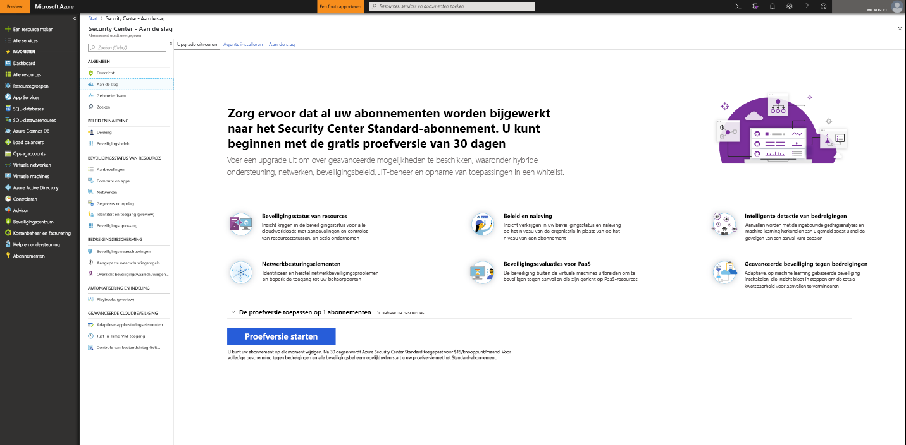
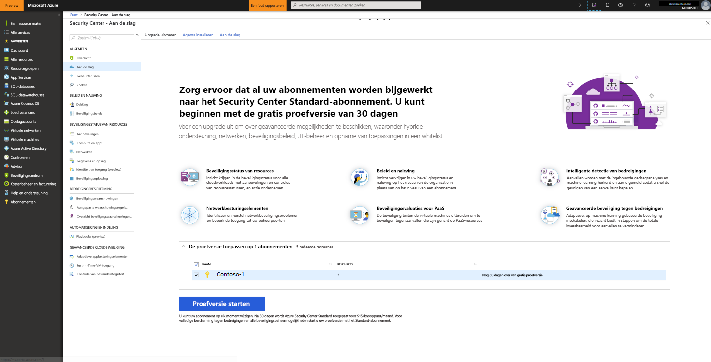

# Onboarding van Azure Security Center Standard voor verbeterde beveiliging
Upgrade uitvoeren naar Security Center Standard om te profiteren van verbeterde beveiligingsbeheer en bedreigingsbeveiliging voor uw hybride cloudworkloads.  U kunt de standaard gratis proberen. Zie het Security Center [pagina met prijzen](https://azure.microsoft.com/pricing/details/security-center/) voor meer informatie.

Standard van Security Center bevat:

- **Hybride beveiliging** : ophalen van een overzicht van beveiliging voor al uw on-premises en cloudworkloads. Beveiligingsbeleid toepassen en constant in de beveiliging van uw hybride cloudworkloads om te voldoen aan de beveiligingsstandaarden. Verzamel, zoek en analyseer beveiligingsgegevens van verschillende bronnen, inclusief firewalls en andere oplossingen van partners.
- **Geavanceerde detectie van bedreigingen** -gebruik Geavanceerd analyses en de Microsoft Intelligent Security Graph om op te halen van een rand over de zich ontwikkelende cyberaanvallen.  Maak gebruik van de ingebouwde gedragsanalyses en machine learning om aanvallen en zero-day exploits te identificeren. Controleer netwerken, computers en cloudservices op inkomende aanvallen en activiteiten na het schenden van de beveiliging. Stroomlijn het onderzoek met interactieve hulpprogramma's en contextuele bedreigingsinformatie.
- **Toegangs- en toepassingsbesturingselementen** -Blokkeer malware en andere ongewenste toepassingen door het toepassen van aanbevelingen voor opname in de whitelist aangepast aan uw specifieke workloads en gebruikmaken van machine learning. Verminder het oppervlak voor netwerkaanvallen met just-in-time, gecontroleerde toegang tot beheerpoorten op Azure Virtual machines, blootgesteld aan beveiligingsaanvallen en andere netwerkaanvallen drastisch wordt gereduceerd.

## Niet-beveiligde resources detecteren     
Security Center detecteert automatisch alle Azure-abonnementen of werkruimten die niet zijn ingeschakeld voor Security Center Standard. Hiertoe behoren Azure-abonnementen die Security Center Free gebruiken en werkruimten waarvoor de Security-oplossing niet is ingeschakeld.

U kunt een hele Azure-abonnement upgraden naar de laag standaard, die wordt overgenomen door alle ondersteunde bronnen binnen het abonnement. Toepassen van de standaard-laag een werkruimte is van toepassing op alle resources die rapporteren aan de werkruimte.

> [!NOTE]
> Mogelijk wilt uw kosten beheren en beperken van de hoeveelheid gegevens die worden verzameld voor een oplossing door deze te beperken tot een bepaalde set van agents. [Oplossingstargeting](../operations-management-suite/operations-management-suite-solution-targeting.md) kunt u een bereik toepassen op de oplossing en gericht op een subset van computers in de werkruimte.  Als u gebruikmaakt van oplossing die gericht is op, geeft de werkruimte niet dat een oplossing voor een lijst van Security Center.
>
>

## Een Azure-abonnement of de werkruimte een upgrade uitvoert
Een abonnement of een werkruimte upgraden naar Standard:
1. Selecteer in het hoofdmenu van Security Center de optie **Aan de slag**.
  
2. Onder **Upgrade** vermeldt Security Center abonnementen en werkruimten die in aanmerking komen voor onboarding. 
   - U kunt op het uitvouwbare **Uw proefversie toepassen** klikken om een lijst met alle abonnementen en werkruimten te bekijken met de status voor een proefversie.
   -    U kunt abonnementen en werkruimten upgraden die niet in aanmerking komen voor een proefversie.
   -    U kunt in aanmerking komende werkruimten en abonnementen selecteren om uw proefversie te beginnen.
3.  Klik op **Proefversie beginnen** om uw proefversie van de geselecteerde abonnementen te beginnen.
  

   > [!NOTE]
   > Gratis mogelijkheden van Security Center worden alleen toegepast op uw virtuele Azure-machines en VMSS. De gratis mogelijkheden worden niet toegepast op uw niet-Azure-computers. Als u standaard selecteert, wordt het Standard-uitvoering worden toegepast op alle Azure-VM's, schaalsets van virtuele machines en niet-Azure-computers die rapporteren aan de werkruimte. Het is raadzaam dat u van toepassing standaard zijn voor geavanceerde beveiliging voor uw Azure- en niet-Azure-resources.
   >
   >

## Niet-Azure-computers onboarden
Security Center kan de beveiligingsstatus van uw niet-Azure-computers controleren, maar u moet deze resources dan eerst onboarden. U kunt niet-Azure computers toevoegen uit de **aan de slag** blade of vanuit de **Compute** blade. We nemen door beide methoden.

### Toevoegen van nieuwe niet-Azure-computers vanuit **aan de slag**

1. Ga terug naar **aan de slag**.   
2. Selecteer het tabblad **Aan de slag**.

   

3. Klik op **Configureren** onder **Nieuwe niet-Azure-computers toevoegen**. Een lijst met uw Log Analytics-werkruimten wordt weergegeven. De lijst bevat, indien van toepassing, de standaardwerkruimte die is gemaakt door Security Center toen automatisch inrichten werd ingeschakeld. Selecteer deze werkruimte of een andere werkruimte die u wilt gebruiken.

   ![Niet-Azure-computer toevoegen][7]

Als u bestaande werkruimten hebt, worden deze weergegeven onder **nieuwe niet-Azure-computers toevoegen**. U kunt computers toevoegen aan een bestaande werkruimte of maak een nieuwe werkruimte. Selecteer de koppeling voor het maken van een nieuwe werkruimte **toevoegen van een nieuwe werkruimte**.

### Toevoegen van nieuwe niet-Azure-computers vanuit **Compute**

**Een nieuwe werkruimte maken en de computer toevoegen**

1. Onder **nieuwe niet-Azure-computers toevoegen**, selecteer **toevoegen van een nieuwe werkruimte**.

   ![Een nieuwe werkruimte toevoegen][4]

2. Onder **beveiliging en controle**, selecteer **OMS-werkruimte** om een nieuwe werkruimte te maken.
   > [!NOTE]
   > OMS-werkruimten worden nu aangeduid als Log Analytics-werkruimten.
3. Onder **OMS-werkruimte**, voer de gegevens voor uw werkruimte.
4. Onder **OMS-werkruimte**, selecteer **OK**.  Nadat u OK kiest, ontvangt u een koppeling voor het downloaden van een Windows- of Linux-agent en de sleutels voor uw werkruimte-ID te gebruiken bij het configureren van de agent.
5. Onder **beveiliging en controle**, selecteer **OK**.

**Selecteer een bestaande werkruimte en computer toevoegen**

U kunt een computer toevoegen aan de hand van de werkstroom van **Onboarding**, zoals hierboven wordt weergegeven. U kunt ook een computer toevoegen aan de hand van de werkstroom van **Compute**. In dit voorbeeld gebruiken we **Compute**.

1. Ga terug naar het hoofdmenu van Security Center en **overzicht** dashboard.

   ![Overzicht][5]

2. Selecteer **Compute en apps**.
3. Onder **Compute en apps**, selecteer **computers toevoegen**.

   ![Blade Compute][6]

4. Onder **nieuwe niet-Azure-computers toevoegen**, selecteer een werkruimte op uw computer verbinden met en klikt u op **Computers toevoegen**.

   ![Computers toevoegen][7]

   De **Direct Agent** blade bevat een koppeling voor het downloaden van een Windows- of Linux-agent, evenals de werkruimte-ID en sleutels voor het gebruik van bij het configureren van de agent.   

## Volgende stappen
In dit artikel hebt u geleerd hoe u ingebouwde Azure en niet-Azure-resources om te profiteren van geavanceerde beveiliging van Security Center bevinden.  Als u wilt doen met Zie uw resources toegevoegd,

- [Gegevensverzameling inschakelen](security-center-enable-data-collection.md)
- [Bedreigingsinformatierapport](security-center-threat-report.md)
- [Just-in-time-VM-toegang](security-center-just-in-time.md)

<!--Image references-->
[1]: ./media/security-center-onboarding/onboard.png
[2]: ./media/security-center-onboarding/onboard-subscription.png
[3]: ./media/security-center-onboarding/get-started.png
[4]: ./media/security-center-onboarding/create-workspace.png
[5]: ./media/security-center-onboarding/overview.png
[6]: ./media/security-center-onboarding/compute-blade.png
[7]: ./media/security-center-onboarding/add-computer.png
[8]: ./media/security-center-onboarding/onboard-workspace.png
