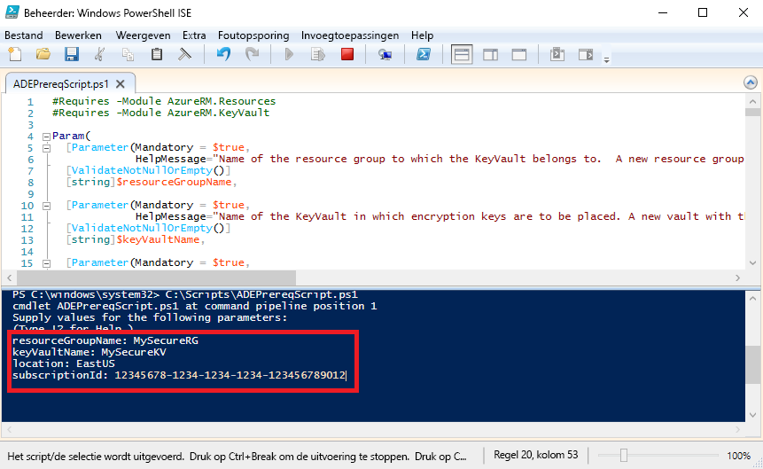

# <a name="quickstart-encrypt-a-windows-iaas-vm-with-azure-powershell"></a>Snelstartgids: Een Windows Iaas-VM versleutelen met Azure PowerShell

Met Azure Disk Encryption kunt u uw schijven van virtuele Windows- en Linux IaaS-machines versleutelen. De oplossing is geïntegreerd met Azure Key Vault, zodat u de schijfversleutelingssleutels en -geheimen kunt beheren. Met Azure Disk Encryption kunt u ervoor zorgen dat uw virtuele machines worden beveiligd met versleutelingstechnologie die voldoet aan industriële standaarden. In deze snelstart maakt u een Windows Server 2016-VM en versleutelt u de besturingssysteemschijf.

Als u nog geen abonnement op Azure hebt, maak dan een [gratis account](https://azure.microsoft.com/free/?WT.mc_id=A261C142F) aan voordat u begint.

## <a name="prerequisites"></a>Vereisten

- Windows PowerShell ISE
- De [nieuwste versie van de AzureRM PowerShell-module](/powershell/azure/azurerm/install-azurerm-ps?view=azurermps-6.13.0) installeren of bijwerken
    - De versie van de AzureRM-module moet 6.0.0 of hoger zijn. `Get-Module AzureRM -ListAvailable | Select-Object -Property Name,Version,Path`
- Een kopie van het [script met vereisten voor Azure Disk Encryption](https://raw.githubusercontent.com/Azure/azure-powershell/master/src/Compute/Compute/Extension/AzureDiskEncryption/Scripts/AzureDiskEncryptionPreRequisiteSetup.ps1).
    - Als u dit script al hebt, downloadt u een nieuw exemplaar omdat deze onlangs is gewijzigd. 
    - Gebruik **Ctrl-A** om alle tekst te selecteren en gebruik vervolgens **Ctrl-C** om alle tekst te kopiëren naar Kladblok.
    - Sla het bestand op als **ADEPrereqScript.ps1**


## <a name="sign-in-to-azure"></a>Aanmelden bij Azure

1. Klik met de rechtermuisknop op **Windows PowerShell ISE** en klik op **Als administrator uitvoeren**.
1. Klik in het venster **Administrator: Windows PowerShell ISE** op **Weergeven** en vervolgens op **Scriptvenster weergeven**.
1. Typ de volgende cmdlet in het scriptvenster: 

     ```azurepowershell
      Connect-AzureRMAccount
     ```

1. Klik op de groene pijl voor **Script uitvoeren** of gebruik F5. 
2. Gebruik de interactieve aanmelding om het maken van verbinding met uw Azure-account te voltooien.
3. Kopieer uw **abonnements-ID** die wordt geretourneerd voor gebruik bij het uitvoeren van het volgende PowerShell-script. 

## <a name="bkmk_PrereqScript"></a> Het script met vereisten voor Azure Disk Encryption uitvoeren
 Met behulp van **ADEPrereqScript.ps1** wordt er een resourcegroep en een sleutelkluis gemaakt en wordt het toegangsbeleid voor de sleutelkluis ingesteld. Met het script wordt er ook een resourcevergrendeling voor de sleutelkluis gemaakt om het te beveiligen tegen onopzettelijk verwijderen.  

1. Klik in het venster **Administrator: Windows PowerShell ISE** op **Bestand** en vervolgens op **Openen**. Ga naar het bestand **ADEPrereqScript.ps1** en dubbelklik hierop. Het script wordt geopend in het scriptvenster.
2. Klik op de groene pijl voor **Script uitvoeren** of gebruik F5 om het script uit te voeren. 
3. Typ de naam van een nieuwe **resourcegroep** en een nieuwe **sleutelkluis**. Gebruik geen bestaande resourcegroep of sleutelkluis voor deze snelstart omdat we de resourcegroep later verwijderen. 
4. Typ de locatie waarop u de resources wilt maken, zoals **EastUS**. Haal een locatielijst op met `Get-AzureRMLocation`.
5. Kopieer dit in uw **abonnements-ID**. U kunt uw abonnements-ID ophalen met `Get-AzureRMSubscription`.  
6. Klik op de groene pijl voor **Script uitvoeren**. 
7. Kopieer de geretourneerde **DiskEncryptionKeyVaultUrl** en **DiskEncryptionKeyVaultId** die u later moet gebruiken.




## <a name="create-a-virtual-machine"></a>Een virtuele machine maken 
Nu moet u een virtuele machine maken, zodat u de schijf kunt versleutelen. Met het script dat u gebruikt, wordt een Windows Server 2016-VM met 8 GB RAM en een besturingssysteemschijf van 30 GB gemaakt. 

1. Kopieer het script in het scriptvenster **Administrator: Windows PowerShell ISE** en wijzig de belangrijkste drie variabelen. De resourcegroep en locatie moeten hetzelfde zijn als de resourcegroep en locatie die u hebt gebruikt voor het [script met vereisten](#bkmk_PrereqScript).  

   ```azurepowershell
    # Variables for common values
    $resourceGroup = "MySecureRG"
    $location = "EastUS"
    $vmName = "MySecureVM"
    
    # Create user object
    $cred = Get-Credential -Message "Enter a username and password for the virtual machine."
    
    # Create a resource group
    #New-AzureRmResourceGroup -Name $resourceGroup -Location $location
    
    # Create a subnet configuration
    $subnetConfig = New-AzureRmVirtualNetworkSubnetConfig -Name mySubnet -AddressPrefix 192.168.1.0/24
    
    # Create a virtual network
    $vnet = New-AzureRmVirtualNetwork -ResourceGroupName $resourceGroup -Location $location `
      -Name MYvNET -AddressPrefix 192.168.0.0/16 -Subnet $subnetConfig
    
    # Create a public IP address and specify a DNS name
    $pip = New-AzureRmPublicIpAddress -ResourceGroupName $resourceGroup -Location $location `
      -Name "mypublicdns$(Get-Random)" -AllocationMethod Static -IdleTimeoutInMinutes 4
    
    # Create an inbound network security group rule for port 3389
    $nsgRuleRDP = New-AzureRmNetworkSecurityRuleConfig -Name myNetworkSecurityGroupRuleRDP  -Protocol Tcp `
      -Direction Inbound -Priority 1000 -SourceAddressPrefix * -SourcePortRange * -DestinationAddressPrefix * `
      -DestinationPortRange 3389 -Access Allow
    
    # Create a network security group
    $nsg = New-AzureRmNetworkSecurityGroup -ResourceGroupName $resourceGroup -Location $location `
      -Name myNetworkSecurityGroup -SecurityRules $nsgRuleRDP
    
    # Create a virtual network card and associate with public IP address and NSG
    $nic = New-AzureRmNetworkInterface -Name myNic -ResourceGroupName $resourceGroup -Location $location `
      -SubnetId $vnet.Subnets[0].Id -PublicIpAddressId $pip.Id -NetworkSecurityGroupId $nsg.Id
    
    # Create a virtual machine configuration
    $vmConfig = New-AzureRmVMConfig -VMName $vmName -VMSize Standard_D2_v3 | `
    Set-AzureRmVMOperatingSystem -Windows -ComputerName $vmName -Credential $cred | `
    Set-AzureRmVMSourceImage -PublisherName MicrosoftWindowsServer -Offer WindowsServer -Skus 2016-Datacenter-smalldisk -Version latest | `
    Add-AzureRmVMNetworkInterface -Id $nic.Id
    
    # Create a virtual machine
    New-AzureRmVM -ResourceGroupName $resourceGroup -Location $location -VM $vmConfig
   ```

2. Klik op de groene pijl voor **Script uitvoeren** om de VM te maken.  


## <a name="encrypt-the-disk-of-the-vm"></a>De schijf van de VM versleutelen
Nu u een sleutelkluis en virtuele machine hebt gemaakt en geconfigureerd, kunt u de schijf versleutelen met de cmdlet **Set-AzureRmVmDiskEncryptionExtension**. 
 
1. Voer de volgende cmdlet uit om de schijf van de VM te versleutelen:

    ```azurepowershell
     Set-AzureRmVmDiskEncryptionExtension -ResourceGroupName "MySecureRG" -VMName "MySecureVM" `
     -DiskEncryptionKeyVaultId "<Returned by the prerequisites script>" -DiskEncryptionKeyVaultUrl "<Returned by the prerequisites script>"
     ```


1. Wanneer de versleuteling is voltooid, kunt u controleren of de schijf is versleuteld met de volgende cmdlet: 

     ```azurepowershell
     Get-AzureRmVmDiskEncryptionStatus -ResourceGroupName "MySecureRG" -VMName "MySecureVM"
     ```
    
    
## <a name="clean-up-resources"></a>Resources opschonen
 Met **ADEPrereqScript.ps1** wordt er een resourcevergrendeling voor de sleutelkluis gemaakt. Als u de resources in deze snelstart wilt opschonen, moet u eerst de resourcevergrendeling en vervolgens de resourcegroep verwijderen. 

1. De resourcevergrendeling uit de sleutelkluis verwijderen

     ```azurepowershell
     $LockId =(Get-AzureRMResourceLock -ResourceGroupName "MySecureRG" -ResourceName "MySecureVault" -ResourceType "Microsoft.KeyVault/vaults").LockID 
     Remove-AzureRmResourceLock -LockID $LockId
      ```
    
2. Verwijder de resourcegroep. Hiermee worden ook alle resources in de groep verwijderd. 
     ```azurepowershell
      Remove-AzureRmResourceGroup -Name "MySecureRG"
      ```

## <a name="next-steps"></a>Volgende stappen
Ga naar het volgende artikel voor meer informatie over de vereisten voor Azure Disk Encryption voor IaaS-VM's.

> [!div class="nextstepaction"]
> [Vereisten voor Azure Disk Encryption](azure-security-disk-encryption-prerequisites.md)