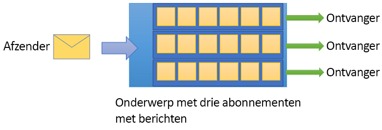

# Wat is Azure Service Bus?

Microsoft Azure Service Bus is een volledig beheerde berichtenbroker die binnen ondernemingen kan worden [geïntegreerd](http://azure.com/integration). Service Bus wordt meestal gebruikt om toepassingen en services van elkaar los te koppelen en is een stabiel en veilig platform voor asynchrone gegevens- en statusoverdracht. Gegevens worden uitgewisseld tussen verschillende toepassingen en services met behulp van *berichten*. Een bericht heeft een binaire indeling die JSON, XML of alleen tekst kan bevatten. 

Enkele algemene berichtenscenario's:

* Berichtenuitwisseling: overdracht van bedrijfsgegevens, zoals verkoop- of inkooporders, dagboeken of voorraadverplaatsingen.
* Loskoppelen van toepassingen: verbeteren van de betrouwbaarheid en schaalbaarheid van toepassingen en services (client en service hoeven niet op hetzelfde moment online te zijn).
* Onderwerpen en abonnementen: 1:*n*-relaties mogelijk maken tussen uitgevers en abonnees.
* Berichtsessies: werkstromen implementeren waarvoor het ordenen of uitstellen van berichten vereist is.

## Naamruimten

Een naamruimte is een scoping container voor alle berichtenonderdelen. Er kunnen zich meerdere wachtrijen en onderwerpen in één naamruimte bevinden, en naamruimten fungeren vaak als toepassingscontainers.

## Wachtrijen

Berichten worden verzonden naar en ontvangen van *wachtrijen*. Wachtrijen maken het mogelijk om berichten op te slaan totdat de ontvangende toepassing ze kan ontvangen en verwerken.

Berichten in wachtrijen worden bij ontvangst geordend en voorzien van een tijdstempel. Als een bericht is geaccepteerd, wordt het veilig ondergebracht in redundante opslag. Berichten worden afgeleverd in de  *pull*-modus, wat inhoudt dat berichten op aanvraag worden bezorgd.

## Onderwerpen

U kunt ook *onderwerpen* gebruiken voor het verzenden en ontvangen van berichten. Daar waar een wachtrij vaak wordt gebruikt voor punt-naar-punt communicatie, zijn onderwerpen handig in scenario's met publiceren/abonneren.

Onderwerpen kunnen meerdere, onafhankelijke abonnementen hebben. Een abonnee van een onderwerp kan een kopie ontvangen van elk bericht dat naar dat onderwerp wordt verzonden. Abonnementen zijn benoemde entiteiten die duurzaam worden gemaakt, maar die optioneel kunnen verlopen of automatisch kunnen worden verwijderd.

In sommige scenario's is het mogelijk niet wenselijk dat afzonderlijke abonnementen alle berichten ontvangen die naar een onderwerp worden gestuurd. In dat geval kunt u [regels en filters](topic-filters.md) gebruiken om voorwaarden te definiëren die optionele [acties](topic-filters.md#actions) activeren, opgegeven berichten filteren en berichteigenschappen instellen of wijzigen.

## Geavanceerde functies

Service Bus beschikt ook over geavanceerde functies waarmee u meer complexe problemen met berichtenuitwisseling kunt oplossen. In de volgende secties worden deze belangrijke functies in meer detail beschreven:

### Berichtsessies

Als u er zeker van wilt zijn dat berichten in Service Bus op basis van FIFO (first-in, first-out) worden verwerkt, moet u sessies gebruiken. [Berichtsessies](message-sessions.md) maken gezamenlijke en geordende verwerking van niet-gekoppelde reeksen gerelateerde berichten mogelijk. 

### Automatisch doorsturen

De functie [Automatisch doorsturen](service-bus-auto-forwarding.md) maakt het mogelijk om een wachtrij of abonnement te verbinden met andere wachtrijen of onderwerpen die deel uitmaken van dezelfde naamruimte. Wanneer automatisch doorsturen is ingeschakeld, worden berichten die in de eerste wachtrij of het eerste abonnement (bron) worden geplaatst, automatisch verwijdert en in de tweede wachtrij of het tweede onderwerp (doel) geplaatst.

### Verwerking van onbestelbare berichten

Service Bus ondersteunt een [wachtrij voor onbestelbare berichten](service-bus-dead-letter-queues.md) (dead-letter queue of DLQ) voor het opslaan van berichten die niet bij een ontvanger kunnen worden bezorgd of berichten die niet kunnen worden verwerkt. U kunt berichten in deze wachtrij vervolgens verwijderen en controleren.

### Geplande bezorging

U kunt berichten verzenden naar een wachtrij of onderwerp [voor vertraagde verwerking](message-sequencing.md#scheduled-messages), bijvoorbeeld om te plannen dat een taak op een bepaald moment beschikbaar komt voor verwerking door een systeem.

### Berichten uitstellen

Wanneer een wachtrij of abonnee een bericht ontvangt dat kan worden verwerkt, maar waarvoor verwerking momenteel niet mogelijk is vanwege speciale omstandigheden binnen de toepassing, heeft de entiteit de mogelijkheid om [het ophalen van het bericht ](message-deferral.md)uit te stellen tot een later tijdstip. Het bericht blijft aanwezig in de wachtrij of het abonnement, maar wordt nog niet verwerkt.

### Batchverwerking

[Batchverwerking aan de clientzijde](service-bus-performance-improvements.md#client-side-batching) zorgt ervoor dat een wachtrij of onderwerpabonnee het verzenden van een bericht voor een bepaalde tijd kan vertragen. Als de client aanvullende berichten verstuurt tijdens deze periode, worden de berichten in één batch verstuurd. 

### Transacties

Een [transactie](service-bus-transactions.md) groepeert twee of meer bewerkingen in een uitvoeringsbereik. Service Bus biedt ondersteuning voor het groeperen van bewerkingen voor één berichtentiteit (wachtrij, onderwerp of abonnement) binnen het bereik van een transactie.

### Filteren en acties

Abonnees kunnen definiëren welke berichten ze willen ontvangen van een onderwerp. Deze berichten worden opgegeven in de vorm van een of meer [benoemde abonnementsregels](topic-filters.md). Voor elke regelvoorwaarde waaraan wordt voldaan, produceert het abonnement een kopie van het bericht, dat anders voor elke overeenkomende regel anders kan worden geannoteerd.

### Automatische verwijderen bij inactiviteit

[Automatische verwijderen bij inactiviteit](/dotnet/api/microsoft.servicebus.messaging.queuedescription.autodeleteonidle) houdt in dat u een interval voor inactiviteit kunt opgeven waarna de wachtrij automatisch wordt verwijderd. De minimale duur is vijf minuten.

### Detectie van duplicaten

Als er een fout optreedt die tot gevolg heeft dat er bij de client twijfel is over de uitkomst van een verzendbewerking, neemt [duplicaatdetectie](duplicate-detection.md) deze twijfel weg door de afzender in staat te stellen hetzelfde bericht nogmaals te verzenden. Eventuele dubbele exemplaren worden hierbij verwijderd door de wachtrij of het onderwerp.

### SAS, RBAC en beheerde identiteiten voor Azure-resources

Service Bus biedt ondersteuning voor beveiligingsprotocollen zoals [SAS](service-bus-sas.md) (Shared Access Signatures), [RBAC](service-bus-role-based-access-control.md) (op rollen gebaseerd toegangsbeheer) en [MSI](service-bus-managed-service-identity.md) (Managed Service Identity) voor Azure-resources.

### Geo-noodherstel

Wanneer er sprake is van uitval in Azure-regio's of -datacenters, zorgt [Geo-noodherstel](service-bus-geo-dr.md) ervoor dat de gegevensverwerking kan plaatsvinden in een andere regio of in een ander datacenter.

### Beveiliging

Service Bus ondersteunt standaard [AMQP 1.0](service-bus-amqp-overview.md) en [HTTP/REST](/rest/api/servicebus/)-protocollen.

## Clientbibliotheken

Service Bus ondersteunt clientbibliotheken voor [.NET](https://github.com/Azure/azure-service-bus-dotnet/tree/master), [Java](https://github.com/Azure/azure-service-bus-java/tree/master) en [JMS](https://github.com/Azure/azure-service-bus/tree/master/samples/Java/qpid-jms-client).

## Integratie

Service Bus kan volledig worden geïntegreerd met de volgende Azure-services:

- [Event Grid](https://azure.microsoft.com/services/event-grid/) 
- [Logic Apps](https://azure.microsoft.com/services/logic-apps/) 
- [Functies](https://azure.microsoft.com/services/functions/) 
- [Dynamics 365](https://dynamics.microsoft.com)
- [Stream Analytics](https://azure.microsoft.com/services/stream-analytics/)
 
## Volgende stappen

Zie de volgende artikelen om aan de slag te gaan met de Service Bus-berichtenservice:

* [Kiezen tussen Azure-services die berichten bezorgen](../event-grid/compare-messaging-services.md?toc=%2fazure%2fservice-bus-messaging%2ftoc.json&bc=%2fazure%2fservice-bus-messaging%2fbreadcrumb%2ftoc.json)
* Meer informatie over de lagen [Standard en Premium](https://azure.microsoft.com/pricing/details/service-bus/) van Azure Service Bus en de bijbehorende tarieven
* [Prestaties en latentie van Azure Service Bus Premium-laag](https://blogs.msdn.microsoft.com/servicebus/2016/07/18/premium-messaging-how-fast-is-it/) (Engelstalig)
* Probeer de snelstartgidsen voor [.NET](service-bus-quickstart-powershell.md), [Java](service-bus-quickstart-powershell.md) of [JMS](service-bus-quickstart-powershell.md)
