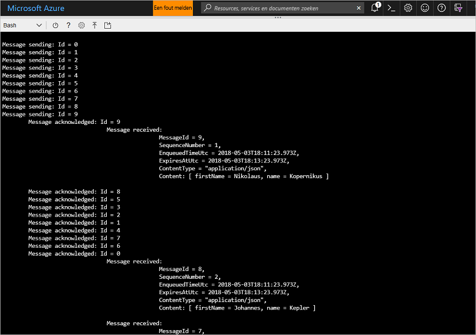

# <a name="quickstart-send-and-receive-messages-using-azure-cli-and-java"></a>Snelstart: berichten verzenden en ontvangen met behulp van Azure CLI en Java

Microsoft Azure Service Bus is een geïntegreerde berichtenbroker voor bedrijven die voor een beveiligde en betrouwbare berichtenuitwisseling zorgt. In een typisch Service Bus-scenario hebt u gewoonlijk te maken met het van elkaar loskoppelen van twee of meer toepassingen, services of processen (toepassingen hoeven niet op hetzelfde moment online zijn), het overbrengen van status- of gegevenswijzigingen en het verzenden van berichten tussen de toepassingen. 

Een detailhandelsbedrijf kan bijvoorbeeld gegevens van het verkooppunt naar een back-office of regionaal distributiecentrum verzenden in verband met het aanvullen en -bijwerken van de voorraad. In dit geval verzendt en ontvangt de client-app berichten naar en van een Service Bus-wachtrij:


In deze snelstart wordt beschreven hoe u berichten verzendt en ontvangt met Service Bus, met behulp van Azure CLI en de Service Bus-Java-bibliotheek. Als u ook bent geïnteresseerd in meer technische informatie, dan kunt u [de uitleg lezen](#understand-the-sample-code) van de belangrijkste elementen van de voorbeeldcode.

Als u nog geen abonnement op Azure hebt, kunt u een [gratis account][] maken voordat u begint.

[!INCLUDE [cloud-shell-try-it.md](../../includes/cloud-shell-try-it.md)]

## <a name="log-in-to-azure"></a>Meld u aan bij Azure.

Klik op de knop Cloud Shell in het menu in de rechterbovenhoek van Azure Portal en kies **Bash** in de vervolgkeuzelijst **Omgeving selecteren**. 

## <a name="use-cli-to-create-resources"></a>CLI gebruiken om resources te maken

Geef in Cloud-Shell bij de Bash-prompt de volgende opdrachten voor het inrichten van Service Bus-resources. Zorg dat u alle tijdelijke aanduidingen vervangt door de juiste waarden:

```azurecli-interactive
# Create a resource group
az group create --name myResourceGroup --location eastus

# Create a Service Bus messaging namespace with a unique name
namespaceName=myNameSpace$RANDOM
az servicebus namespace create \
   --resource-group myResourceGroup \
   --name $namespaceName \
   --location eastus

# Create a Service Bus queue
az servicebus queue create --resource-group myResourceGroup \
   --namespace-name $namespaceName \
   --name myQueue

# Get the connection string for the namespace
connectionString=$(az servicebus namespace authorization-rule keys list \
   --resource-group myResourceGroup \
   --namespace-name  $namespaceName \
   --name RootManageSharedAccessKey \
   --query primaryConnectionString --output tsv)
```

Wanneer de laatste opdracht is uitgevoerd, kopieert en plakt u de verbindingstekenreeks en de naam van de wachtrij die u hebt geselecteerd naar een tijdelijke locatie, zoals Kladblok. U hebt deze gegevens nodig in de volgende stap.

## <a name="send-and-receive-messages"></a>Berichten verzenden en ontvangen

Wanneer u de naamruimte en wachtrij hebt gemaakt en u over de benodigde referenties beschikt, kunt u berichten gaan verzenden en ontvangen. U kunt de code in [deze GitHub-voorbeeldmap](https://github.com/Azure/azure-service-bus/tree/master/samples/Java/quickstarts-and-tutorials/quickstart-java/src/main/java/samples/quickstart/SendAndReceiveMessages.java) bestuderen.

1. Zorg dat Cloud Shell is geopend en dat de Bash-prompt wordt weergegeven.

2. Kloon de [Service Bus GitHub-opslagplaats](https://github.com/Azure/azure-service-bus/) met behulp van de volgende opdracht:

   ```bash
   git clone https://github.com/Azure/azure-service-bus.git
   ```

2. Wijzig de huidige map in de voorbeeldmap, waarbij u de slash (/) als padscheidingstekens gebruikt:

   ```bash
   cd azure-service-bus/samples/Java/quickstarts-and-tutorials/quickstart-java 
   ```

3. Geef de volgende opdracht om de toepassing te compileren:
   
   ```bash
   mvn clean package -DskipTests
   ```

4. Geef de volgende opdracht om het programma uit te voeren. Zolang u de bash-shell niet opnieuw hebt gestart, wordt de variabele die de waarde van de verbindingsreeks bevat automatisch vervangen:

   ```bash
   java -jar ./target/samples.quickstart-1.0.0-jar-with-dependencies.jar -c $connectionString -q myQueue
   ```

6. Zie hoe 10 berichten naar de wachtrij worden verzonden. De volgorde van de berichten wordt niet gegarandeerd, maar u ziet dat de berichten worden verzonden en daarna worden bevestigd en ontvangen, samen met de nettoladingsgegevens:

   

## <a name="clean-up-resources"></a>Resources opschonen

Voer de volgende opdracht uit om de resourcegroep, de naamruimte en alle gerelateerde resources te verwijderen:

```azurecli-interactive
az group delete --resource-group myResourceGroup
```

## <a name="understand-the-sample-code"></a>De voorbeeldcode begrijpen

Deze sectie bevat meer informatie over de belangrijkste secties van de voorbeeldcode. U kunt [hier](https://github.com/Azure/azure-service-bus/blob/master/samples/Java/quickstarts-and-tutorials/quickstart-java/src/main/java/samples/quickstart/SendAndReceiveMessages.java) bladeren door de code, die zich in de GitHub-opslagplaats bevindt.

### <a name="get-connection-string-and-queue"></a>Verbindingsreeks en wachtrij ophalen

Eerst worden er in de code twee tekenreeksvariabelen gedeclareerd die als argumenten op de opdrachtregel aan het programma worden doorgegeven:

```java
String ConnectionString = null;
String QueueName = null;
```

Deze waarden worden via parameters toegevoegd en toegewezen in de methode `runApp()`:

```java
public static void main(String[] args) {
    SendAndReceiveMessages app = new SendAndReceiveMessages();
    try {
        app.runApp(args);
        app.run();
    } catch (Exception e) {
        System.out.printf("%s", e.toString());
    }
    System.exit(0);
}

public void runApp(String[] args) {
    try {
        // parse connection string from command line             
        Options options = new Options();
        options.addOption(new Option("c", true, "Connection string"));
        options.addOption(new Option("q", true, "Queue Name"));
        CommandLineParser clp = new DefaultParser();
        CommandLine cl = clp.parse(options, args);
        if (cl.getOptionValue("c") != null && cl.getOptionValue("q") != null) {
            ConnectionString = cl.getOptionValue("c");
            QueueName =  cl.getOptionValue("q");
        }
        else
        {
            HelpFormatter formatter = new HelpFormatter();
            formatter.printHelp("run jar with", "", options, "", true);
        }

    } catch (Exception e) {
        System.out.printf("%s", e.toString());
    }
}
```

### <a name="create-queue-clients-to-send-and-receive"></a>Wachtrijclients maken om berichten te verzenden en te ontvangen

Om berichten te verzenden en te ontvangen, maakt de methode `run()` exemplaren van wachtrijclients. Deze zijn samengesteld uit de verbindingsreeks en de naam van de wachtrij. Deze code maakt twee wachtrijclients, één voor het verzenden en één voor het ontvangen:

```java
public void run() throws Exception {
// Create a QueueClient instance for receiving using the connection string builder
// We set the receive mode to "PeekLock", meaning the message is delivered
// under a lock and must be acknowledged ("completed") to be removed from the queue
QueueClient receiveClient = new QueueClient(new ConnectionStringBuilder(ConnectionString, QueueName), ReceiveMode.PEEKLOCK);
this.registerReceiver(receiveClient);

// Create a QueueClient instance for sending and then asynchronously send messages.
QueueClient sendClient = new QueueClient(new ConnectionStringBuilder(ConnectionString, QueueName), ReceiveMode.PEEKLOCK);
```

De methode `run()` start ook de asynchrone berichtverzending en sluit de verbinding met de afzender wanneer de verzendbewerking is voltooid:

```java
this.sendMessagesAsync(sendClient).thenRunAsync(() -> sendClient.closeAsync());
``` 

### <a name="construct-and-send-messages"></a>Berichten maken en verzenden

De methode `sendMessagesAsync()` maakt een reeks van 10 berichten en verzendt deze asynchroon met behulp van de wachtrijclient:

```java
CompletableFuture<Void> sendMessagesAsync(QueueClient sendClient) {
List<HashMap<String, String>> data =
        GSON.fromJson(
                "[" +
                        "{'name' = 'Einstein', 'firstName' = 'Albert'}," +
                        "{'name' = 'Heisenberg', 'firstName' = 'Werner'}," +
                        "{'name' = 'Curie', 'firstName' = 'Marie'}," +
                        "{'name' = 'Hawking', 'firstName' = 'Steven'}," +
                        "{'name' = 'Newton', 'firstName' = 'Isaac'}," +
                        "{'name' = 'Bohr', 'firstName' = 'Niels'}," +
                        "{'name' = 'Faraday', 'firstName' = 'Michael'}," +
                        "{'name' = 'Galilei', 'firstName' = 'Galileo'}," +
                        "{'name' = 'Kepler', 'firstName' = 'Johannes'}," +
                        "{'name' = 'Kopernikus', 'firstName' = 'Nikolaus'}" +
                        "]",
                new TypeToken<List<HashMap<String, String>>>() {}.getType());

List<CompletableFuture> tasks = new ArrayList<>();
for (int i = 0; i < data.size(); i++) {
    final String messageId = Integer.toString(i);
    Message message = new Message(GSON.toJson(data.get(i), Map.class).getBytes(UTF_8));
    message.setContentType("application/json");
    message.setLabel("Scientist");
    message.setMessageId(messageId);
    message.setTimeToLive(Duration.ofMinutes(2));
    System.out.printf("\nMessage sending: Id = %s", message.getMessageId());
    tasks.add(
            sendClient.sendAsync(message).thenRunAsync(() -> {
                System.out.printf("\n\tMessage acknowledged: Id = %s", message.getMessageId());
            }));
}
return CompletableFuture.allOf(tasks.toArray(new CompletableFuture<?>[tasks.size()]));
```

### <a name="receive-messages"></a>Berichten ontvangen

De methode `registerReceiver()` registreert de `RegisterMessageHandler`-callback en stelt ook enkele opties van de berichtenhandler in:

```java
void registerReceiver(QueueClient queueClient) throws Exception {
    // register the RegisterMessageHandler callback
    queueClient.registerMessageHandler(new IMessageHandler() {
                           // callback invoked when the message handler loop has obtained a message
                           public CompletableFuture<Void> onMessageAsync(IMessage message) {
                               // receives message is passed to callback
                               if (message.getLabel() != null &&
                                       message.getContentType() != null &&
                                       message.getLabel().contentEquals("Scientist") &&
                                       message.getContentType().contentEquals("application/json")) {
                                    byte[] body = message.getBody();
                                   Map scientist = GSON.fromJson(new String(body, UTF_8), Map.class);

                                   System.out.printf(
                                           "\n\t\t\t\tMessage received: \n\t\t\t\t\t\tMessageId = %s, \n\t\t\t\t\t\tSequenceNumber = %s, \n\t\t\t\t\t\tEnqueuedTimeUtc = %s," +
                                                   "\n\t\t\t\t\t\tExpiresAtUtc = %s, \n\t\t\t\t\t\tContentType = \"%s\",  \n\t\t\t\t\t\tContent: [ firstName = %s, name = %s ]\n",
                                           message.getMessageId(),
                                           message.getSequenceNumber(),
                                           message.getEnqueuedTimeUtc(),
                                           message.getExpiresAtUtc(),
                                           message.getContentType(),
                                           scientist != null ? scientist.get("firstName") : "",
                                           scientist != null ? scientist.get("name") : "");
                               }
                               return CompletableFuture.completedFuture(null);
                           }

                           // callback invoked when the message handler has an exception to report
                           public void notifyException(Throwable throwable, ExceptionPhase exceptionPhase) {
                               System.out.printf(exceptionPhase + "-" + throwable.getMessage());
                           }
                       },
    // 1 concurrent call, messages are auto-completed, auto-renew duration
    new MessageHandlerOptions(1, true, Duration.ofMinutes(1)));

}
```

## <a name="next-steps"></a>Volgende stappen

In dit artikel hebt u een Service Bus-naamruimte en andere resources gemaakt die zijn vereist voor het verzenden en ontvangen van berichten in een wachtrij. Voor meer informatie over het schrijven van code voor het verzenden en ontvangen van berichten, gaat u naar de volgende zelfstudie over Service Bus:

> [!div class="nextstepaction"]
> [Inventaris bijwerken met CLI en Java](./service-bus-tutorial-topics-subscriptions-cli.md)

[gratis account]: https://azure.microsoft.com/free/?ref=microsoft.com&utm_source=microsoft.com&utm_medium=docs&utm_campaign=visualstudio
[fully qualified domain name]: https://wikipedia.org/wiki/Fully_qualified_domain_name
[Install the Azure CLI]: /cli/azure/install-azure-cli
[az group create]: /cli/azure/group#az_group_create