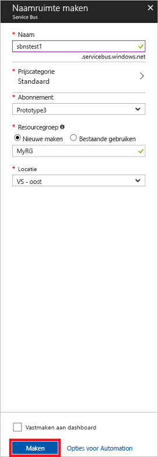

# <a name="quickstart-send-and-receive-messages-using-the-azure-portal-and-net"></a>Quickstart: Snelstart: berichten verzenden en ontvangen met behulp van Azure Portal en .NET

Microsoft Azure Service Bus is een geïntegreerde berichtenbroker voor bedrijven die voor een beveiligde en absoluut betrouwbare berichtenuitwisseling zorgt. In een typisch Service Bus-scenario hebt u gewoonlijk te maken met het van elkaar loskoppelen van twee of meer toepassingen, services of processen en het overbrengen van status- of gegevenswijzigingen. Dergelijke scenario's kunnen betrekking hebben op het plannen van meerdere batchtaken in andere toepassingen of services, of het activeren van de orderafhandeling. Een detailhandelsbedrijf kan bijvoorbeeld gegevens van het verkooppunt naar een back-office of regionaal distributiecentrum verzenden voor het aanvullen en bijwerken van de voorraad. In dit scenario verzendt en ontvangt de client-app berichten naar en van een Service Bus-wachtrij.  


In deze snelstart wordt beschreven hoe u berichten naar een Service Bus-wachtrij kunt verzenden en ervan kunt ontvangen. U gebruikt daarbij [Azure Portal][Azure portal] om een berichtennaamruimte te maken en binnen deze naamruimte een wachtrij te maken. Ook wordt beschreven hoe u de autorisatiereferenties binnen die naamruimte kunt verkrijgen. De procedure laat vervolgens zien hoe u berichten naar deze wachtrij verzendt en van de wachtrij ontvangt met behulp van de [.NET Standard-bibliotheek](https://www.nuget.org/packages/Microsoft.Azure.ServiceBus).

Als u nog geen abonnement op Azure hebt, kunt u een [gratis account][] maken voordat u begint.

## <a name="prerequisites"></a>Vereisten

Het volgende moet zijn geïnstalleerd om deze zelfstudie te voltooien:

- [Visual Studio 2017 update 3 (versie 15.3, 26730.01)](https://www.visualstudio.com/vs) of hoger.
- [NET Core SDK](https://www.microsoft.com/net/download/windows), versie 2.0 of later.

## <a name="log-on-to-the-azure-portal"></a>Aanmelden bij Azure Portal

Ga eerst naar [Azure Portal][Azure portal] en meld u aan met uw Azure-abonnement. De eerste stap bestaat uit het maken van een Service Bus-naamruimte van het type **Berichten**.

## <a name="create-a-service-bus-namespace"></a>Een Service Bus-naamruimte maken

Een Service Bus-berichtennaamruimte biedt een unieke scoping container, waarnaar wordt verwezen met de [volledig gekwalificeerde domeinnaam][] (FQDN), waarin u een of meer wachtrijen, onderwerpen en abonnementen maakt. In het volgende voorbeeld wordt een Service Bus-berichtennaamruimte in een nieuwe of bestaande [resourcegroep](/azure/azure-resource-manager/resource-group-portal) gemaakt:

1. Klik in het linkernavigatievenster van de portal achtereenvolgens op **+ Een resource maken**, **Bedrijfsintegratie** en **Service Bus**.
2. Voer in het dialoogvenster **Naamruimte maken** een naam in voor de naamruimte. In het systeem wordt onmiddellijk gecontroleerd of de naam beschikbaar is.
3. Nadat u hebt gecontroleerd of de naam van de naamruimte beschikbaar is, kiest u de prijscategorie (Standard of Premium).
4. Kies in het veld **Abonnement** een Azure-abonnement waarin u de naamruimte maakt.
5. Kies in het veld **Resourcegroep** een bestaande resourcegroep waarin de naamruimte zal zijn opgenomen of maak een nieuwe resourcegroep.      
6. Kies in **Locatie** het land of regio waarin uw naamruimte moet worden gehost.
7. Klik op **Create**. Uw naamruimte wordt nu gemaakt en ingeschakeld. U moet wellicht enkele minuten wachten terwijl de resources voor uw account worden ingericht.



### <a name="obtain-the-management-credentials"></a>De beheerreferenties ophalen

Bij het maken van een nieuwe naamruimte wordt automatisch een eerste SAS-regel (Shared Access Signature) gegenereerd met een bijbehorende primaire en secundaire sleutel die elk volledige controle over alle aspecten van de naamruimte bieden. Volg deze stappen om de eerste regel te kopiëren: 

1.  Klik op **Alle resources** en klik vervolgens op de zojuist gemaakte naam voor de naamruimte.
2. Klik in het venster van de naamruimte op **Beleid voor gedeelde toegang**.
3. Klik in het scherm **Beleid voor gedeelde toegang** op **RootManageSharedAccessKey**.
4. Klik in het venster **Beleid: RootManageSharedAccessKey** op de knop **Kopiëren** naast **Primaire verbindingsreeks** om de verbindingsreeks naar het klembord te kopiëren voor later gebruik. Plak deze waarde in Kladblok of een andere tijdelijke locatie. 

    ![connection-string][connection-string]
5. Herhaal de vorige stap: het kopiëren en plakken van de waarde voor de **Primaire sleutel** voor een tijdelijke locatie zodat u deze later kunt gebruiken.

## <a name="create-a-queue"></a>Een wachtrij maken

Als u een Service Bus-wachtrij wilt maken, moet u de naamruimte opgeven waarin u wilt dat deze wordt gemaakt. Het volgende voorbeeld laat zien hoe u op de portal een wachtrij kunt maken:

1. Klik in het navigatiedeelvenster links van de portal op **Service Bus** (als u geen **Service Bus** ziet, klik dan op **Meer services**).
2. Klik op de naamruimte waarin u de wachtrij wilt maken.
3. Klik in het venster voor de naamruimte op **Wachtrijen** en klik vervolgens in het venster **Wachtrijen** op **+ Wachtrij**.
4. Voer de waarde voor **Wachtrijnaam** in en hanteer voor de andere waarden de standaardinstellingen.
5. Klik onder aan het venster op **Maken**.
6. Noteer de naam van de wachtrij.

## <a name="send-and-receive-messages"></a>Berichten verzenden en ontvangen

Nadat de naamruimte en de wachtrij zijn ingericht en u over de benodigde referenties beschikt, bent u klaar om berichten te verzenden en te ontvangen. U kunt de code controleren in [deze GitHub-voorbeeldmap](https://github.com/Azure/azure-service-bus/tree/master/samples/Java/azure-servicebus/TopicFilters).

Ga als volgt te werk om de code uit te voeren:

1. Kloon de [Service Bus GitHub-opslagplaats](https://github.com/Azure/azure-service-bus/) met behulp van de volgende opdracht:

   ```shell
   git clone https://github.com/Azure/azure-service-bus.git
   ```

3. Navigeer naar de voorbeeldmap `azure-service-bus\samples\DotNet\GettingStarted\BasicSendReceiveQuickStart\BasicSendReceiveQuickStart`.

4. Kopieer de verbindingsreeks en de naam van de wachtrij die u hebt verkregen in de sectie [De beheerreferenties ophalen](#obtain-the-management-credentials).

5.  Typ de volgende opdracht bij een opdrachtprompt:

   ```shell
   dotnet build
   ```

6.  Navigeer naar de map `bin\Debug\netcoreapp2.0`.

7.  Typ de volgende opdracht om het programma uit te voeren. Zorg ervoor dat u `myConnectionString` vervangt door de waarde die u eerder hebt verkregen, en vervang `myQueueName` door de naam van de wachtrij die u hebt gemaakt:

   ```shell
   dotnet BasicSendReceiveQuickStart.dll -ConnectionString "myConnectionString" -QueueName "myQueueName"
   ``` 

8. Bekijk tien berichten die naar de wachtrij zijn verzonden en vervolgens van de wachtrij zijn ontvangen:

   

## <a name="clean-up-resources"></a>Resources opschonen

U kunt via de portal de resourcegroep, de naamruimte en de wachtrij verwijderen.

## <a name="understand-the-sample-code"></a>De voorbeeldcode begrijpen

Deze sectie bevat meer informatie over de werking van de voorbeeldcode. 

### <a name="get-connection-string-and-queue"></a>Verbindingsreeks en wachtrij ophalen

De verbindingsreeks en de naam van de wachtrij worden als opdrachtregelargumenten doorgegeven aan de methode `Main()`. `Main()` declareert twee tekenreeksvariabelen die deze waarden kunnen omvatten:

```csharp
static void Main(string[] args)
{
    string ServiceBusConnectionString = "";
    string QueueName = "";

    for (int i = 0; i < args.Length; i++)
    {
        var p = new Program();
        if (args[i] == "-ConnectionString")
        {
            Console.WriteLine($"ConnectionString: {args[i+1]}");
            ServiceBusConnectionString = args[i + 1]; 
        }
        else if(args[i] == "-QueueName")
        {
            Console.WriteLine($"QueueName: {args[i+1]}");
            QueueName = args[i + 1];
        }                
    }

    if (ServiceBusConnectionString != "" && QueueName != "")
        MainAsync(ServiceBusConnectionString, QueueName).GetAwaiter().GetResult();
    else
    {
        Console.WriteLine("Specify -Connectionstring and -QueueName to execute the example.");
        Console.ReadKey();
    }                            
}
```
 
De methode `Main()` start vervolgens de asynchrone berichtenlus `MainAsync()`.

### <a name="message-loop"></a>Berichtenlus

De methode MainAsync() maakt een wachtrijclient met de opdrachtregelargumenten, roept een ontvangende berichtenhandler met de naam `RegisterOnMessageHandlerAndReceiveMessages()` aan, en verzendt de berichtenreeks:

```csharp
static async Task MainAsync(string ServiceBusConnectionString, string QueueName)
{
    const int numberOfMessages = 10;
    queueClient = new QueueClient(ServiceBusConnectionString, QueueName);

    Console.WriteLine("======================================================");
    Console.WriteLine("Press any key to exit after receiving all the messages.");
    Console.WriteLine("======================================================");

    // Register QueueClient's MessageHandler and receive messages in a loop
    RegisterOnMessageHandlerAndReceiveMessages();

    // Send Messages
    await SendMessagesAsync(numberOfMessages);

    Console.ReadKey();

    await queueClient.CloseAsync();
}
```

De methode `RegisterOnMessageHandlerAndReceiveMessages()` stelt gewoon enkele opties voor de berichtenhandler in en roept vervolgens de methode `RegisterMessageHandler()` van de wachtrijclient aan, waardoor het ontvangen begint:

```csharp
static void RegisterOnMessageHandlerAndReceiveMessages()
{
    // Configure the MessageHandler Options in terms of exception handling, number of concurrent messages to deliver etc.
    var messageHandlerOptions = new MessageHandlerOptions(ExceptionReceivedHandler)
    {
        // Maximum number of Concurrent calls to the callback `ProcessMessagesAsync`, set to 1 for simplicity.
        // Set it according to how many messages the application wants to process in parallel.
        MaxConcurrentCalls = 1,

        // Indicates whether MessagePump should automatically complete the messages after returning from User Callback.
        // False below indicates the Complete will be handled by the User Callback as in `ProcessMessagesAsync` below.
        AutoComplete = false
    };

    // Register the function that will process messages
    queueClient.RegisterMessageHandler(ProcessMessagesAsync, messageHandlerOptions);
} 
```

### <a name="send-messages"></a>Berichten verzenden

De bewerkingen voor het maken en verzenden van berichten vinden in de methode `SendMessagesAsync()` plaats:

```csharp
static async Task SendMessagesAsync(int numberOfMessagesToSend)
{
    try
    {
        for (var i = 0; i < numberOfMessagesToSend; i++)
        {
            // Create a new message to send to the queue
            string messageBody = $"Message {i}";
            var message = new Message(Encoding.UTF8.GetBytes(messageBody));

            // Write the body of the message to the console
            Console.WriteLine($"Sending message: {messageBody}");

            // Send the message to the queue
            await queueClient.SendAsync(message);
        }
    }
    catch (Exception exception)
    {
        Console.WriteLine($"{DateTime.Now} :: Exception: {exception.Message}");
    }
}
```

### <a name="process-messages"></a>Berichten verwerken

De methode `ProcessMessagesAsync()` bevestigt, verwerkt en voltooit de ontvangst van de berichten:

```csharp
static async Task ProcessMessagesAsync(Message message, CancellationToken token)
{
    // Process the message
    Console.WriteLine($"Received message: SequenceNumber:{message.SystemProperties.SequenceNumber} Body:{Encoding.UTF8.GetString(message.Body)}");

    // Complete the message so that it is not received again.
    await queueClient.CompleteAsync(message.SystemProperties.LockToken);
}
```

## <a name="next-steps"></a>Volgende stappen

In dit artikel hebt u een Service Bus-naamruimte en andere resources gemaakt die zijn vereist voor het verzenden en ontvangen van berichten in een wachtrij. Voor meer informatie over het schrijven van code voor het verzenden en ontvangen van berichten, gaat u verder met de volgende zelfstudie over Service Bus:

> [!div class="nextstepaction"]
> [Azure Portal gebruiken voor het bijwerken van de voorraad](./service-bus-tutorial-topics-subscriptions-portal.md)


[gratis account]: https://azure.microsoft.com/free/?ref=microsoft.com&utm_source=microsoft.com&utm_medium=docs&utm_campaign=visualstudio
[volledig gekwalificeerde domeinnaam]: https://wikipedia.org/wiki/Fully_qualified_domain_name
[Azure portal]: https://portal.azure.com/

[connection-string]: ./media/service-bus-quickstart-portal/connection-string.png
[service-bus-flow]: ./media/service-bus-quickstart-portal/service-bus-flow.png
