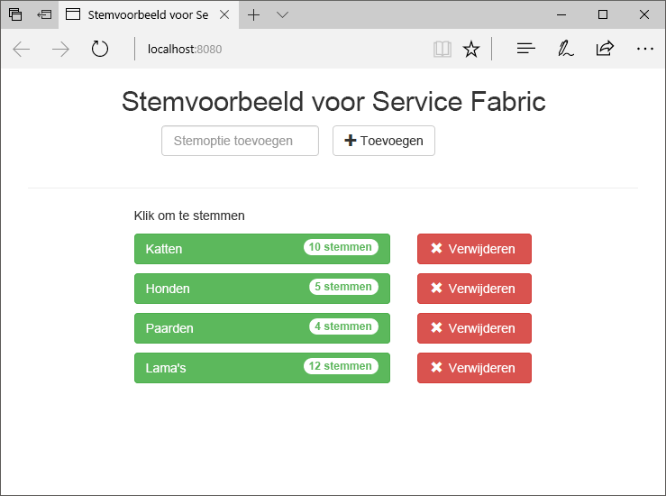
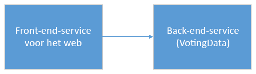
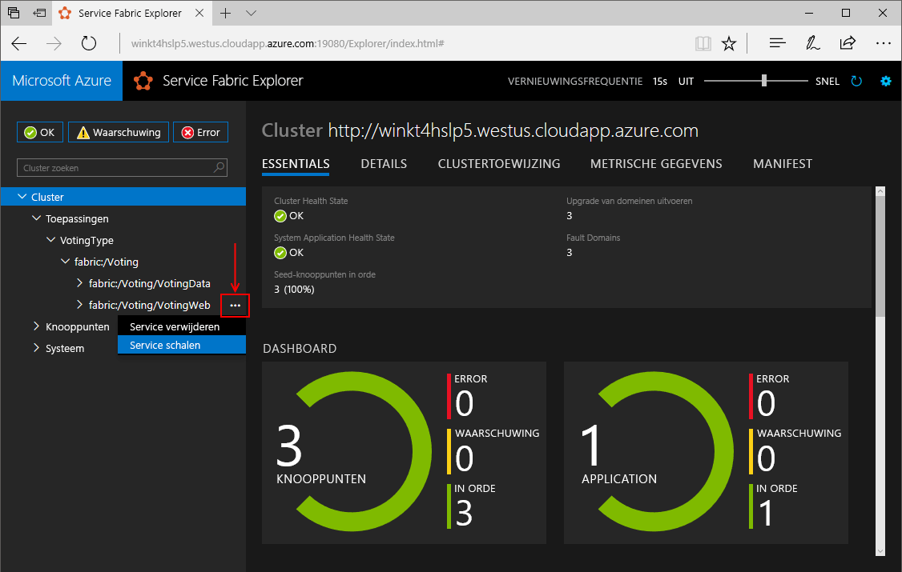
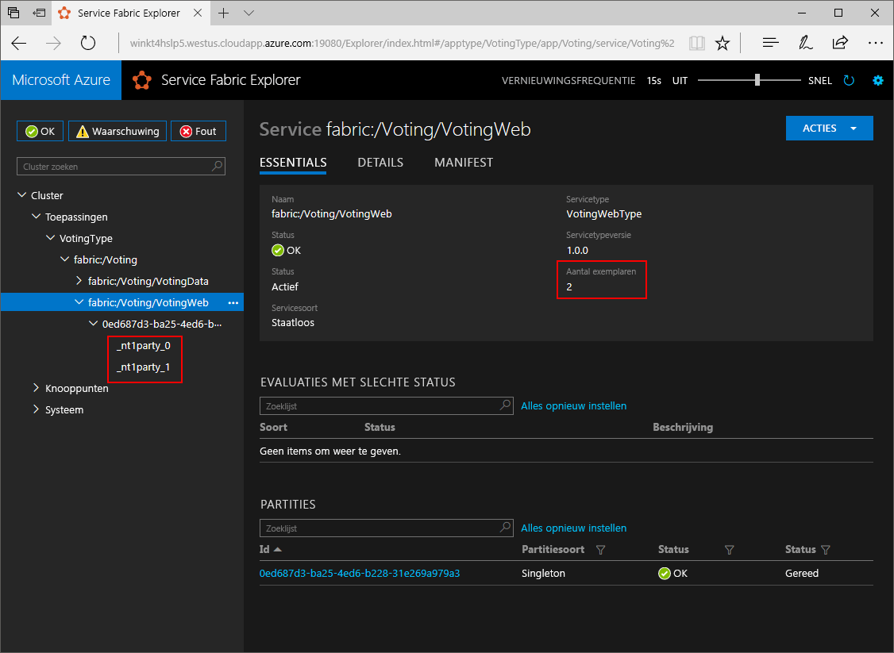
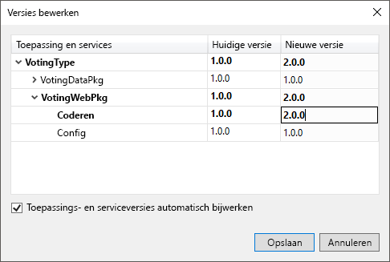
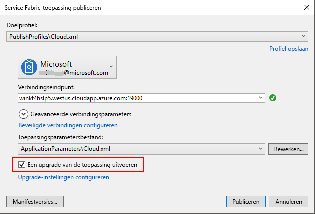
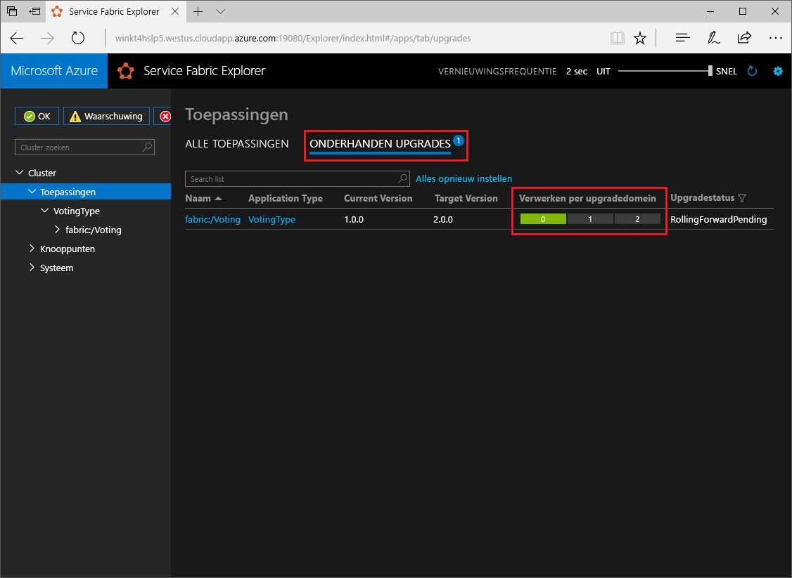

# <a name="create-a-net-service-fabric-application-in-azure"></a>Een .NET-Service Fabric-toepassing maken in Azure
Azure Service Fabric is een platform voor gedistribueerde systemen waarmee u schaalbare en betrouwbare microservices en containers implementeert en beheert. 

Deze Quick Start laat zien hoe u uw eerste .NET-toepassing in Service Fabric implementeert. Wanneer u klaar bent, hebt u een stemtoepassing met een ASP.NET Core-web-front-end die stemresultaten opslaat in een stateful back-endservice in het cluster.



Met behulp van deze toepassing leert u hoe u:
> [!div class="checklist"]
> * een toepassing kunt maken met .Net en Service Fabric
> * ASP.NET Core gebruiken als een webfront-end
> * Toepassingsgegevens in een stateful service opslaan
> * Lokaal problemen met uw toepassing oplossen
> * De toepassing in een cluster in Azure implementeren
> * De toepassing op meerdere knooppunten uitschalen
> * Een rolling upgrade op een toepassingen uitvoeren

## <a name="prerequisites"></a>Vereisten
Dit zijn de vereisten voor het voltooien van deze Quickstart:
1. [Visual Studio 2017 installeren](https://www.visualstudio.com/) met de **Azure-ontwikkelworkload** en de **ASP.NET-ontwikkeling- en webontwikkelingworkloads**.
2. [Git installeren](https://git-scm.com/)
3. [Microsoft Azure Service Fabric SDK installeren](http://www.microsoft.com/web/handlers/webpi.ashx?command=getinstallerredirect&appid=MicrosoftAzure-ServiceFabric-CoreSDK)
4. Voer de volgende opdracht uit zodat Visual Studio in staat is om implementaties naar het lokale Service Fabric-cluster uit te voeren:
    ```powershell
    Set-ExecutionPolicy -ExecutionPolicy Unrestricted -Force -Scope CurrentUser
    ```

>[!NOTE]
> De voorbeeldtoepassing in deze snelstartgids maakt gebruik van functies die niet beschikbaar zijn in Windows 7.
>

## <a name="download-the-sample"></a>Het voorbeeld downloaden
Voer in een opdrachtvenster de volgende opdracht uit om de voorbeeld-app-opslagplaats te klonen op de lokale computer.
```
git clone https://github.com/Azure-Samples/service-fabric-dotnet-quickstart
```

## <a name="run-the-application-locally"></a>De toepassing lokaal uitvoeren
Klik met de rechtermuisknop op het pictogram van Visual Studio in het menu Start en kies **Als administrator uitvoeren**. U moet Visual Studio als administrator uitvoeren als u het foutopsporingsprogramma aan uw services wilt koppelen.

Open de oplossing **Voting.sln** van Visual Studio vanuit de opslagplaats die u hebt gekloond.  

De toepassing Voting is standaard ingesteld om te luisteren op poort 8080.  De poort van de toepassing is ingesteld in het bestand */VotingWeb/PackageRoot/ServiceManifest.xml*.  U kunt de poort van de toepassing wijzigen door het kenmerk**Port** van het element **Endpoint** bij te werken.  Als u de toepassing lokaal wilt implementeren en uitvoeren, moet de poort van de toepassing open zijn en beschikbaar zijn op uw computer.  Als u de poort van de toepassing wijzigt, moet u de waarde '8080' in dit artikel vervangen door de nieuwe waarde voor de poort van de toepassing.

Druk op **F5** om de toepassing te implementeren.

> [!NOTE]
> De eerste keer dat u de toepassing uitvoert en implementeert, wordt door Visual Studio een lokaal cluster voor foutopsporing gemaakt. Deze bewerking kan enige tijd duren. De status van het maken van het cluster wordt weergegeven in het Visual Studio-uitvoervenster.  In de uitvoer ziet u het bericht: 'De URL van de toepassing is niet ingesteld of is geen HTTP/HTTPS-URL zodat de browser niet door de toepassing kan worden geopend'.  Dit bericht betekent niet dat er een fout is opgetreden, maar dat een browser niet automatisch kan worden gestart.

Wanneer de implementatie is voltooid, start u een browser en opent u deze pagina: `http://localhost:8080` - de webfront-end van de toepassing.


U kunt nu een reeks stemmingsopties toevoegen en beginnen met stemmen. De toepassing wordt uitgevoerd en alle gegevens worden in uw Service Fabric-cluster opgeslagen, zonder dat daarvoor een aparte database nodig is.

## <a name="walk-through-the-voting-sample-application"></a>Stapsgewijs door de voorbeeldstemtoepassing gaan
De stemtoepassing bestaat uit twee services:
- Web-front-endservice (VotingWeb): een ASP.NET Core web-front-endservice die de webpagina ondersteunt en web-API's beschikbaar stelt om te communiceren met de back-endservice.
- Back-endservice (VotingData): een ASP.NET Core-webservice, die een API beschikbaar stelt om de stemresultaten in een betrouwbare dictionary op schijf op te slaan.



Wanneer u in de toepassing stemt, vinden de volgende gebeurtenissen plaats:
1. Een JavaScript verzendt de stemaanvraag als een HTTP PUT-aanvraag naar de web-API in de web-front-endservice.

2. De web-front-endservice gebruikt een proxyserver om een HTTP PUT-aanvraag te vinden en door te sturen naar de back-endservice.

3. De back-endservice neemt de binnenkomende aanvraag aan en slaat het bijgewerkte resultaat op in een betrouwbare dictionary die wordt gerepliceerd naar meerdere knooppunten binnen het cluster en opgeslagen op schijf. Gegevens van de toepassing worden opgeslagen in het cluster, zodat er geen database nodig is.

## <a name="debug-in-visual-studio"></a>Fouten opsporen met Visual Studio
Als u met Visual Studio fouten opspoort in de toepassing, gebruikt u daarvoor een lokaal ontwikkelingscluster van Service Fabric. U hebt de mogelijkheid om uw foutopsporingservaring aan uw specifieke scenario aan te passen. In deze toepassing worden gegevens met behulp van een betrouwbare dictionary opgeslagen in de back-endservice. Visual Studio verwijdert standaard de toepassing wanneer u het foutopsporingsprogramma stopt. Door de toepassing te verwijderen, worden de gegevens in de back-endservice ook verwijderd. Als u de gegevens tussen de foutopsporingssessies wilt kunnen behouden, kunt u de **foutopsporingsmodus van de toepassing** als eigenschap op het **Voting**-project in Visual Studio wijzigen.

Als u wilt zien wat er in de code gebeurt, moet u de volgende stappen uitvoeren:
1. Open het bestand **/VotingWeb/Controllers/VotesController.cs** en stel een onderbrekingspunt in de methode **Put** van de web-API (regel 47) in. U kunt in Solution Explorer in Visual Studio naar het bestand zoeken.

2. Open het bestand **/VotingData/Controllers/VoteDataController.cs** en stel een onderbrekingspunt in de methode **Put** van deze web-API (regel 50) in.

3. Ga terug naar de browser en klik op een stemoptie of voeg een nieuwe stemoptie toe. U komt uit bij het eerste onderbrekingspunt in de API-controller van de web-front-end.
    - Dit is het punt waarop door JavaScript in de browser een aanvraag wordt verzonden naar de web-API-controller in de front-endservice.
    
    

    - Stel eerst de URL van de ReverseProxy samen voor onze back-endservice **(1)**.
    - Verzend vervolgens de HTTP PUT-aanvraag naar de ReverseProxy **(2)**.
    - Tot slot wordt het antwoord van de back-endservice naar de client geretourneerd **(3)**.

4. Druk op **F5** om door te gaan
    - U bent nu op het onderbrekingspunt in de back-endservice aanbeland.
    
    

    - In de eerste regel in de methode **(1)** wordt door de `StateManager` een betrouwbare dictionary met de naam `counts` aangeroepen of toegevoegd.
    - Alle interacties met waarden in een betrouwbare dictionary vereisen een transactie, met deze instructie **(2)** wordt die transactie gemaakt.
    - Werk in de transactie de waarde bij van de relevante sleutel voor de stemoptie en voer de bewerking **(3)** door. Zodra de doorvoermethode resultaten retourneert, worden de gegevens bijgewerkt in de dictionary en gerepliceerd naar andere knooppunten in het cluster. De gegevens worden nu veilig opgeslagen in het cluster en de back-endservice kan een failover-overschakeling uitvoeren naar andere knooppunten, waarbij de gegevens beschikbaar blijven.
5. Druk op **F5** om door te gaan

Als u de foutopsporingssessie wilt stoppen, drukt u op **Shift+F5**.

## <a name="deploy-the-application-to-azure"></a>De toepassing implementeren in Azure
Voor het implementeren van de toepassing in Azure, hebt u een Service Fabric-cluster nodig waarop de toepassing wordt uitgevoerd. 

### <a name="join-a-party-cluster"></a>Deelnemen aan een cluster van derden
Clusters van derden zijn gratis, tijdelijke Service Fabric-clusters die worden gehost op Azure en uitgevoerd door het Service Fabric-team. Iedereen kan hier toepassingen implementeren en meer te weten komen over het platform. Het cluster gebruikt één zelfondertekend certificaat voor knooppunt-naar-knooppunt- en client-naar-knooppunt-beveiliging. 

Meld u aan en [neem deel aan een Windows-cluster](http://aka.ms/tryservicefabric). Download het PFX-certificaat naar uw computer door op de koppeling **PFX** te klikken. Het certificaat en de waarde van het **verbindingseindpunt** worden in volgende stappen gebruikt.


Op een Windows-computer installeert u de PFX in het certificaatarchief *CurrentUser\My*.

```powershell
PS C:\mycertificates> Import-PfxCertificate -FilePath .\party-cluster-873689604-client-cert.pfx -CertStoreLocation Cert:
\CurrentUser\My


   PSParentPath: Microsoft.PowerShell.Security\Certificate::CurrentUser\My

Thumbprint                                Subject
----------                                -------
3B138D84C077C292579BA35E4410634E164075CD  CN=zwin7fh14scd.westus.cloudapp.azure.com
```

Onthoud de vingerafdruk voor de volgende stap.

> [!Note]
> Standaard is de web-front-endservice geconfigureerd om te luisteren op poort 8080 naar binnenkomend verkeer. Poort 8080 is geopend in het cluster van derden.  Als u de poort van de toepassing moet wijzigen, moet u dat doen op een van de poorten die in het cluster van derden zijn geopend.
>

### <a name="deploy-the-application-using-visual-studio"></a>De toepassing implementeren met Visual Studio
Nu de toepassing klaar is, kunt u deze rechtstreeks vanuit Visual Studio implementeren naar een cluster.

1. Klik met de rechtermuisknop op **Voting** in Solution Explorer en kies **Publiceren**. Het dialoogvenster Publiceren wordt weergegeven.


2. Kopieer het **verbindingseindpunt** van het cluster van derden naar het veld **Verbindingseindpunt**. Bijvoorbeeld `zwin7fh14scd.westus.cloudapp.azure.com:19000`. Klik op **Advanced Connection Parameters** en vul de volgende gegevens in.  De waarden *FindValue* en *ServerCertThumbprint* moeten overeenkomen met de vingerafdruk van het certificaat dat in een vorige stap is geïnstalleerd. 

    

    Elke toepassing in het cluster moet een unieke naam hebben.  Clusters van derden vormen echter een openbare, gedeelde omgeving en er kan een conflict met een bestaande toepassing optreden.  Als er een naamconflict is, wijzigt u de naam van het Visual Studio-project en voert u de implementatie opnieuw uit.

3. Klik op **Publish**.

4. Open een browser en typ het adres van het cluster gevolgd door ':8080' om bij de toepassing in het cluster te komen, bijvoorbeeld `http://zwin7fh14scd.westus.cloudapp.azure.com:8080`. U zou nu moeten kunnen zien dat de toepassing in het cluster in Azure wordt uitgevoerd.


## <a name="scale-applications-and-services-in-a-cluster"></a>Toepassingen en services voor schalen in een cluster
Service Fabric-services kunnen eenvoudig worden geschaald in een cluster om een wijziging in de belasting voor de services aan te kunnen. U schaalt een service door het aantal exemplaren te wijzigen dat wordt uitgevoerd in het cluster. Er zijn meerdere manieren waarop u uw services kunt schalen. U kunt daarvoor scripts of opdrachten van PowerShell of Service Fabric-CLI (sfctl) gebruiken. Gebruik voor dit voorbeeld Service Fabric Explorer.

Service Fabric Explorer kan worden uitgevoerd in alle Service Fabric-clusters en is toegankelijk door vanuit een browser naar de HTTP-beheerpoort (19080) te bladeren, bijvoorbeeld `http://zwin7fh14scd.westus.cloudapp.azure.com:19080`. 

U kunt een waarschuwing van de browser krijgen dat de locatie niet wordt vertrouwd. Dat komt omdat het certificaat zelfondertekend is. U kunt de waarschuwing negeren en doorgaan. Selecteer het geïnstalleerde certificaat om verbinding te maken indien u daarom wordt gevraagd. 

Voer de volgende stappen uit om de web-front-endservice te schalen:

1. Open Service Fabric Explorer in het cluster - bijvoorbeeld: `http://zwin7fh14scd.westus.cloudapp.azure.com:19080`.
2. Klik op het beletselteken (drie punten) naast het knooppunt **fabric:/Voting/VotingWeb** in de structuurweergave en kies **Service schalen**.

    

    U kunt er nu voor kiezen om het aantal exemplaren van de web-front-endservice te schalen.

3. Wijzig het aantal in **2** en klik op **Service schalen**.
4. Klik op het knooppunt **fabric:/Voting/VotingWeb** in de structuurweergave en vouw het partitieknooppunt uit (vertegenwoordigd door een GUID).

    

    Na een tijdje kunt u zien dat de service uit twee exemplaren bestaat.  In de structuurweergave ziet u op welke knooppunten de exemplaren worden uitgevoerd.

Met deze eenvoudige beheertaak is het aantal beschikbare resources voor het verwerken van gebruikersbelasting voor de front-endservice verdubbeld. Het is belangrijk te weten dat u niet meerdere exemplaren van een service nodig hebt om ervoor te zorgen dat deze op betrouwbare wijze wordt uitgevoerd. Als de service mislukt, wordt in Service Fabric een nieuw exemplaar van de service uitgevoerd in het cluster.

## <a name="perform-a-rolling-application-upgrade"></a>Een rolling upgrade op een toepassingen uitvoeren
Service Fabric voert de implementatie van nieuwe updates voor uw toepassing op een veilige manier uit. Rolling upgrades zorgen dat er geen downtime is als de upgrades worden bijgewerkt of als deze worden teruggedraaid omdat er zich fouten hebben voorgedaan.

Als u de toepassing wilt upgraden, gaat u als volgt te werk:

1. Open in Visual Studio het bestand **/VotingWeb/Views/Home/Index.cshtml**.
2. Wijzig de kop van de pagina door tekst toe te voegen of bij te werken. Wijzig de kop bijvoorbeeld in 'Voorbeeld van Service Fabric Voting v2'.
3. Sla het bestand op.
4. Klik met de rechtermuisknop op **Voting** in Solution Explorer en kies **Publiceren**. Het dialoogvenster Publiceren wordt weergegeven.
5. Klik op de knop **Manifestversie** om de versie van de service en de toepassing te wijzigen.
6. Wijzig de versie van het **code-element** onder **VotingWebPkg** in bijvoorbeeld '2.0.0' en klik op **Opslaan**.

    
7. Schakel in het dialoogvenster **Service Fabric-toepassing publiceren** het selectievakje De toepassing bijwerken in en klik op **Publiceren**.

    
8. Open uw browser en blader naar het adres van het cluster op poort 19080, bijvoorbeeld `http://zwin7fh14scd.westus.cloudapp.azure.com:19080`.
9. Klik in de structuurweergave op het knooppunt **Toepassingen** en vervolgens op **Upgrades worden uitgevoerd** in het rechterdeelvenster. U ziet nu hoe de upgrade wordt uitgevoerd op de upgradedomeinen in uw cluster en dat elk domein wordt bijgewerkt voordat het volgende wordt bijgewerkt. Een upgradedomein wordt in de voortgangsbalk groen weergegeven als de status van het domein is geverifieerd.
    

    Service Fabric voert upgrades veilig uit door na het bijwerken van de service op elk knooppunt in het cluster twee minuten te wachten. Houd er rekening mee dat de volledige update ongeveer acht minuten kan duren.

10. U kunt de toepassing blijven gebruiken terwijl de upgrade wordt uitgevoerd. Omdat er twee exemplaren van de service in het cluster worden uitgevoerd, wordt als reactie op een aantal van uw aanvragen mogelijk een bijgewerkte versie van de toepassing verstrekt, terwijl op basis van andere aanvragen mogelijk nog steeds de oude versie wordt verstrekt.

## <a name="next-steps"></a>Volgende stappen
In deze snelstartgids hebt u de volgende zaken geleerd:

> [!div class="checklist"]
> * een toepassing maken met .NET en Service Fabric
> * ASP.NET Core gebruiken als een webfront-end
> * Toepassingsgegevens in een stateful service opslaan
> * Lokaal problemen met uw toepassing oplossen
> * De toepassing in een cluster in Azure implementeren
> * De toepassing op meerdere knooppunten uitschalen
> * Een rolling upgrade op een toepassingen uitvoeren

Raadpleeg de volgende zelfstudie voor meer informatie over Service Fabric en .NET:
> [!div class="nextstepaction"]
> [.NET application on Service Fabric](service-fabric-tutorial-create-dotnet-app.md) (.NET-toepassing op Service Fabric)
