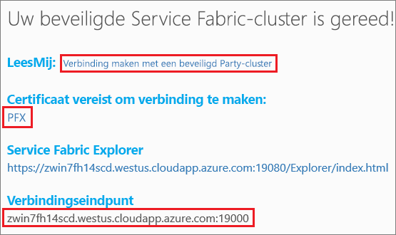

# <a name="tutorial-deploy-an-application-to-a-service-fabric-cluster-in-azure"></a>Zelfstudie: een toepassing implementeren in een Service Fabric-cluster in Azure
Deze zelfstudie is deel twee van een reeks en laat zien hoe u een Azure Service Fabric-toepassing implementeert in een cluster die in Azure wordt uitgevoerd.

In deel twee van de reeks zelfstudies leert u het volgende:
> [!div class="checklist"]
> * [Een .NET Service Fabric-toepassing bouwen](service-fabric-tutorial-create-dotnet-app.md)
> * De toepassing implementeren in een extern cluster
> * [CI/CD configureren met behulp van Visual Studio Team Services](service-fabric-tutorial-deploy-app-with-cicd-vsts.md)
> * [Controle en diagnostische gegevens voor de toepassing instellen](service-fabric-tutorial-monitoring-aspnet.md)

In deze zelfstudiereeks leert u het volgende:
> [!div class="checklist"]
> * Een toepassing implementeren in een extern cluster met behulp van Visual Studio
> * Een toepassing verwijderen uit een cluster met behulp van Service Fabric Explorer

## <a name="prerequisites"></a>Vereisten
Voor u met deze zelfstudie begint:
- Als u nog geen abonnement op Azure hebt, maak dan een [gratis account](https://azure.microsoft.com/free/?WT.mc_id=A261C142F)
- [Installeer Visual Studio 2017](https://www.visualstudio.com/) en installeer de workloads **Azure-ontwikkeling** en **ASP.NET-ontwikkeling en webontwikkeling**.
- [Installeer de Service Fabric-SDK](service-fabric-get-started.md)

## <a name="download-the-voting-sample-application"></a>De voorbeeldtoepassing om te stemmen downloaden
Als u in [deel één van deze zelfstudiereeks](service-fabric-tutorial-create-dotnet-app.md) niet de voorbeeldtoepassing om te stemmen hebt gemaakt, kunt u deze downloaden. Voer in een opdrachtvenster de volgende opdracht uit om de voorbeeld-app-opslagplaats te klonen op de lokale computer.

```
git clone https://github.com/Azure-Samples/service-fabric-dotnet-quickstart
```

## <a name="set-up-a-party-cluster"></a>Een Party-cluster instellen
Clusters van derden zijn gratis, tijdelijke Service Fabric-clusters die worden gehost op Azure en uitgevoerd door het Service Fabric-team. Iedereen kan hier toepassingen implementeren en meer te weten komen over het platform. Helemaal gratis!

Als u toegang wilt tot een Party-cluster, gaat u naar deze site: http://aka.ms/tryservicefabric en volgt u de instructies om toegang te krijgen tot een cluster. U hebt een Facebook- of GitHub-account nodig voor toegang tot een Party-cluster.

Als u wilt, kunt u ook uw eigen cluster gebruiken in plaats van het Party-cluster.  De web-front-end van ASP.NET Core gebruikt de reverse proxy om te communiceren met de back-end van de stateful service.  Reverse proxy is standaard ingeschakeld voor Party-clusters en het lokale ontwikkelcluster.  Als u de voorbeeldtoepassing om te stemmen in uw eigen cluster implementeert, moet u [de reverse proxy inschakelen in het cluster](service-fabric-reverseproxy.md#setup-and-configuration).

> [!NOTE]
> Party-clusters zijn niet beveiligd, wat betekent dat uw toepassingen en gegevens in de clusters mogelijk zichtbaar zijn voor anderen. Implementeer dus geen inhoud die anderen niet mogen zien. Lees voor uitgebreide informatie onze gebruiksvoorwaarden (Engelstalig).

Meld u aan en [neem deel aan een Windows-cluster](http://aka.ms/tryservicefabric). Download het PFX-certificaat naar uw computer door op de koppeling **PFX** te klikken. Het certificaat en de waarde van het **verbindingseindpunt** worden in volgende stappen gebruikt.



Op een Windows-computer installeert u het PFX-bestand in het certificaatarchief *CurrentUser\My*.

```powershell
PS C:\mycertificates> Import-PfxCertificate -FilePath .\party-cluster-873689604-client-cert.pfx -CertStoreLocation Cert:
\CurrentUser\My


  PSParentPath: Microsoft.PowerShell.Security\Certificate::CurrentUser\My

Thumbprint                                Subject
----------                                -------
3B138D84C077C292579BA35E4410634E164075CD  CN=zwin7fh14scd.westus.cloudapp.azure.com
```


## <a name="deploy-the-app-to-the-azure"></a>De app implementeren in Azure
Nu de toepassing klaar is, kunt u deze rechtstreeks vanuit Visual Studio implementeren naar het Party-cluster.

1. Klik met de rechtermuisknop op **Voting** in Solution Explorer en kies **Publiceren**. 

    

2. Kopieer het **verbindingseindpunt** van het cluster van derden naar het veld **Verbindingseindpunt**. Bijvoorbeeld `zwin7fh14scd.westus.cloudapp.azure.com:19000`. Klik op **Advanced Connection Parameters** en vul de volgende gegevens in.  De waarden *FindValue* en *ServerCertThumbprint* moeten overeenkomen met de vingerafdruk van het certificaat dat in de vorige stap is geïnstalleerd. Klik op **Publish**. 

    Nadat het publiceren is voltooid, moet u via een browser een aanvraag kunnen verzenden naar de toepassing.

3. Open de browser van uw voorkeur en typ het adres van het cluster (het verbindingseindpunt zonder de poortgegevens, bijvoorbeeld win1kw5649s.westus.cloudapp.azure.com).

    U moet nu hetzelfde resultaat zien als bij het lokaal uitvoeren van de toepassing.

    

## <a name="remove-the-application-from-a-cluster-using-service-fabric-explorer"></a>De toepassing verwijderen uit een cluster met behulp van Service Fabric Explorer
Service Fabric Explorer is een grafische gebruikersinterface voor het verkennen en beheren van toepassingen in een Service Fabric-cluster.

De toepassing verwijderen uit het Party-cluster:

1. Ga naar de Service Fabric Explorer, via de koppeling die is gepubliceerd op de aanmeldingspagina van het Party-cluster, zoals Bijvoorbeeld: https://win1kw5649s.westus.cloudapp.azure.com:19080/Explorer/index.html.

2. Ga in Service Fabric Explorer naar het knooppunt **fabric:/Voting** in de boomstructuur aan de linkerkant.

3. Klik op de knop **Actions** in het deelvenster **Essentials** aan de rechterkant en kies **Delete Application**. Bevestig dat u het exemplaar van de toepassing wilt verwijderen, waarna het exemplaar wordt verwijderd van onze toepassing die wordt uitgevoerd in het cluster.


## <a name="remove-the-application-type-from-a-cluster-using-service-fabric-explorer"></a>Het toepassingstype verwijderen uit een cluster met behulp van Service Fabric Explorer
Toepassingen worden als toepassingstypen geïmplementeerd in een Service Fabric-cluster. Hierdoor is het mogelijk om meerdere exemplaren en versies van de toepassing uit te voeren binnen het cluster. Nadat het actieve exemplaar van onze toepassing is verwijderd, kunnen we ook het type verwijderen om zo de implementatie helemaal te wissen.

Meer informatie over het toepassingsmodel in Service Fabric kunt u lezen in [Een toepassing modelleren in Service Fabric](service-fabric-application-model.md).

1. Ga naar het knooppunt **VotingType** in de boomstructuur.

2. Klik op de knop **Actions** in het deelvenster **Essentials** aan de rechterkant en kies **Unprovision Type**. Bevestig dat u het toepassingstype wilt verwijderen.


Hiermee zijn we aan het einde gekomen van de zelfstudie.

## <a name="next-steps"></a>Volgende stappen
In deze zelfstudie heeft u het volgende geleerd:

> [!div class="checklist"]
> * Een toepassing implementeren in een extern cluster met behulp van Visual Studio
> * Een toepassing verwijderen uit een cluster met behulp van Service Fabric Explorer

Ga door naar de volgende zelfstudie:
> [!div class="nextstepaction"]
> [Doorlopende integratie instellen met behulp van Visual Studio Team Services](service-fabric-tutorial-deploy-app-with-cicd-vsts.md)
