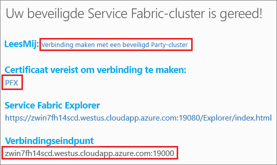
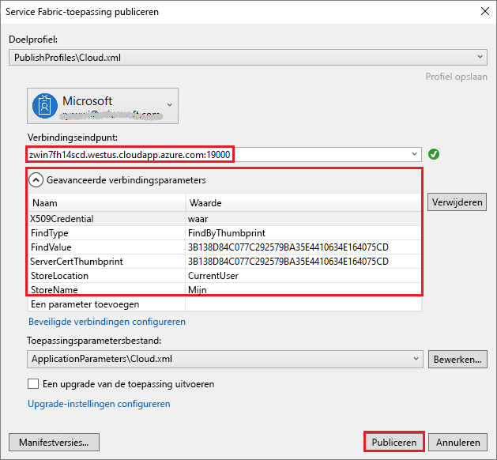

# <a name="tutorial-deploy-a-service-fabric-application-to-a-cluster-in-azure"></a>Zelfstudie: Een Service Fabric-toepassing implementeren naar een cluster in Azure

Deze zelfstudie is deel twee van een serie. In deze zelfstudie ziet u hoe u een Azure Service Fabric-toepassing implementeert in een nieuw cluster in Azure.

In deze zelfstudie leert u het volgende:
> [!div class="checklist"]
> * Een cluster van derden maken.
> * Een toepassing implementeren in een extern cluster met behulp van Visual Studio.

In deze zelfstudie leert u het volgende:
> [!div class="checklist"]
> * [Een .NET Service Fabric-toepassing bouwen](service-fabric-tutorial-create-dotnet-app.md).
> * De toepassing implementeren in een extern cluster.
> * [Een HTTPS-eindpunt toevoegen aan een front-end-service van ASP.NET Core](service-fabric-tutorial-dotnet-app-enable-https-endpoint.md).
> * [CI/CD configureren met behulp van Azure-pijplijnen](service-fabric-tutorial-deploy-app-with-cicd-vsts.md).
> * [Controle en diagnostische gegevens voor de toepassing instellen](service-fabric-tutorial-monitoring-aspnet.md).

## <a name="prerequisites"></a>Vereisten

Voor u met deze zelfstudie begint:

* Als u nog geen abonnement op Azure hebt, maakt u een [gratis account](https://azure.microsoft.com/free/?WT.mc_id=A261C142F) aan.
* [Installeer Visual Studio 2017](https://www.visualstudio.com/) en installeer de workloads **Azure-ontwikkeling** en **ASP.NET-ontwikkeling en webontwikkeling**.
* [Installeer de Service Fabric-SDK](service-fabric-get-started.md).

## <a name="download-the-voting-sample-application"></a>De voorbeeldtoepassing om te stemmen downloaden

Als u in [deel één van deze zelfstudiereeks](service-fabric-tutorial-create-dotnet-app.md) niet het voorbeeld van een stemtoepassing hebt gemaakt, kunt u dit downloaden. Voer in een opdrachtvenster de volgende code uit om de voorbeeld-app-opslagplaats te klonen op de lokale computer.

```git
git clone https://github.com/Azure-Samples/service-fabric-dotnet-quickstart 
```

## <a name="publish-to-a-service-fabric-cluster"></a>Een Service Fabric-cluster publiceren

Nu de toepassing klaar is, kunt u deze rechtstreeks vanuit Visual Studio implementeren naar een cluster. Een [Service Fabric-cluster](https://docs.microsoft.com/en-gb/azure/service-fabric/service-fabric-deploy-anywhere) is een met het netwerk verbonden reeks virtuele of fysieke machines waarop uw microservices worden geïmplementeerd en beheerd.

Voor deze zelfstudie kunt u de stemtoepassing op twee manieren met behulp van Visual Studio implementeren naar een Service Fabric-cluster:

* Publiceren naar een (extern) testcluster. 
* Publiceren naar een bestaand cluster in uw abonnement. U kunt Service Fabric-clusters maken via de [Azure-portal](https://portal.azure.com), met behulp van [PowerShell](./scripts/service-fabric-powershell-create-secure-cluster-cert.md)- of [Azure CLI](./scripts/cli-create-cluster.md)-scripts, of vanuit een [Azure Resource Manager-sjabloon](service-fabric-tutorial-create-vnet-and-windows-cluster.md).

> [!NOTE]
> Veel services gebruiken de omgekeerde proxy om met elkaar te communiceren. Clusters die zijn gemaakt vanuit Visual Studio en clusters van derden hebben omgekeerde proxy standaard ingeschakeld. Als u een bestaand cluster gebruikt, moet u [de omgekeerde proxy in het cluster inschakelen](service-fabric-reverseproxy-setup.md).


### <a name="find-the-voting-web-service-endpoint-for-your-azure-subscription"></a>Het eindpunt van de stem-webservice vinden voor uw Azure-abonnement

Als u de stemtoepassing wilt publiceren naar uw eigen Azure-abonnement, dient u het eindpunt van de front-end-webservice op te zoeken. Als u een Party-cluster gebruikt, maakt u verbinding met poort 8080 met behulp van het automatisch geopende voorbeeld van een stemtoepassing. U hoeft dit niet te configureren in de load balancer van het Party-cluster.

De front-endwebservice luistert op een specifieke poort. Wanneer de toepassing in een cluster in Azure wordt geïmplementeerd, worden zowel het cluster als de toepassing achter een load balancer van Azure uitgevoerd. De toepassingspoort moet worden geopend met behulp van een regel in de load balancer voor het cluster van Azure. De open poort verzendt binnenkomend verkeer door naar de webservice. De poort wordt gevonden in het bestand **VotingWeb/PackageRoot/ServiceManifest.xml** in het element **Eindpunt**. Een voorbeeld is poort 8080.

```xml
<Endpoint Protocol="http" Name="ServiceEndpoint" Type="Input" Port="8080" />
```

Open deze poort voor uw Azure-abonnement met behulp van een taakverdelingsregel in Azure. Gebruik hiervoor een [PowerShell-script](./scripts/service-fabric-powershell-open-port-in-load-balancer.md) of de ga naar de load balancer voor dit cluster in de [Azure-portal](https://portal.azure.com).

### <a name="join-a-party-cluster"></a>Deelnemen aan een Party-cluster

> [!NOTE]
>  Ga verder met de sectie [De toepassing implementeren met behulp van Visual Studio](#publish-the-application-by-using-visual-studio) als u de toepassing wilt publiceren in uw eigen cluster binnen een Azure-abonnement. 

Party-clusters zijn kosteloze, tijdelijke Service Fabric-clusters die worden gehost in Azure en worden uitgevoerd door het Service Fabric-team. Iedereen kan toepassingen implementeren en meer te weten te komen over het platform. Het cluster gebruikt één zelfondertekend certificaat voor beveiliging van zowel knooppunt-naar-knooppunt als client-naar-knooppunt.

Meld u aan en [neem deel aan een Windows-cluster](http://aka.ms/tryservicefabric). Download het PFX-certificaat naar uw computer door de koppeling **PFX** te selecteren. Klik op de koppeling **Hoe kan ik verbinding maken met een beveiligd Party-cluster?** en kopieer het certificaatwachtwoord. Het certificaat, het certificaatwachtwoord en de waarde van het **verbindingseindpunt** worden in volgende stappen gebruikt.



> [!Note]
> Er is per uur een beperkt aantal Party-clusters beschikbaar. Als er een fout optreedt wanneer u zich probeert aan te melden voor een Party-cluster, wacht u even en probeert u het opnieuw. Of volg deze stappen in de zelfstudie [Een .NET-app implementeren](https://docs.microsoft.com/azure/service-fabric/service-fabric-tutorial-deploy-app-to-party-cluster#deploy-the-sample-application) om een Service Fabric-cluster in uw Azure-abonnement te maken en de toepassing erin te implementeren. Als u nog geen abonnement op Azure hebt, kunt u een [gratis account](https://azure.microsoft.com/free/?WT.mc_id=A261C142F) maken.
>

Installeer de PFX op uw Windows-computer in het certificaatarchief **CurrentUser\My**.

```powershell
PS C:\mycertificates> Import-PfxCertificate -FilePath .\party-cluster-873689604-client-cert.pfx -CertStoreLocation Cert:\CurrentUser\My -Password (ConvertTo-SecureString 873689604 -AsPlainText -Force)


   PSParentPath: Microsoft.PowerShell.Security\Certificate::CurrentUser\My

Thumbprint                                Subject
----------                                -------
3B138D84C077C292579BA35E4410634E164075CD  CN=zwin7fh14scd.westus.cloudapp.azure.com
```

Onthoud de vingerafdruk voor de volgende stap.

> [!Note]
> Standaard is de web-front-endservice geconfigureerd om te luisteren op poort 8080 naar binnenkomend verkeer. Poort 8080 is geopend in het Party-cluster. Als u de poort van de toepassing moet wijzigen, moet u deze wijzigen in een van de poorten die in het Party-cluster zijn geopend.
>

### <a name="publish-the-application-by-using-visual-studio"></a>De toepassing publiceren met Visual Studio

Nu de toepassing klaar is, kunt u deze rechtstreeks vanuit Visual Studio implementeren naar een cluster.

1. Klik met de rechtermuisknop op **Voting** in Solution Explorer. Kies **Publiceren**. Het dialoogvenster **Publiceren** wordt weergegeven.

2. Kopieer het **verbindingseindpunt** van het Party-cluster of van uw Azure-abonnement naar het veld **Verbindingseindpunt**. Een voorbeeld is `zwin7fh14scd.westus.cloudapp.azure.com:19000`. Selecteer **Geavanceerde verbindingsparameters**.  Controleer of de waarden **FindValue** en **ServerCertThumbprint** overeenkomen met de vingerafdruk van het certificaat dat in een vorige stap voor een Party-cluster is geïnstalleerd of het certificaat dat overeenkomt met uw Azure-abonnement.

    

    Elke toepassing in het cluster moet een unieke naam hebben. Party-clusters vormen een openbare, gedeelde omgeving en er kan een conflict met een bestaande toepassing optreden. Als er een naamconflict is, wijzigt u de naam van het Visual Studio-project en voert u de implementatie opnieuw uit.

3. Selecteer **Publiceren**.

4. Open een browser en voer het adres van het cluster in gevolgd door **:8080** om bij de toepassing in het cluster te komen. Of voer een andere poort in, als er een is geconfigureerd. Een voorbeeld is `http://zwin7fh14scd.westus.cloudapp.azure.com:8080`. U ziet dat de toepassing in het cluster in Azure wordt uitgevoerd. Probeer op de pagina voting web enkele stemopties toe te voegen en te verwijderen en stem op een of meer van deze opties.

    


## <a name="next-steps"></a>Volgende stappen

Ga door naar de volgende zelfstudie:
> [!div class="nextstepaction"]
> [HTTPS inschakelen](service-fabric-tutorial-dotnet-app-enable-https-endpoint.md)
