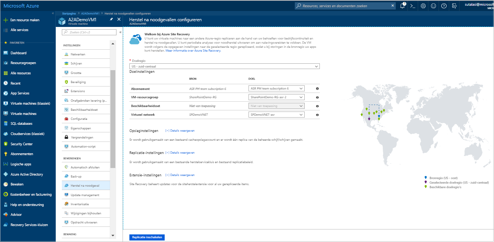
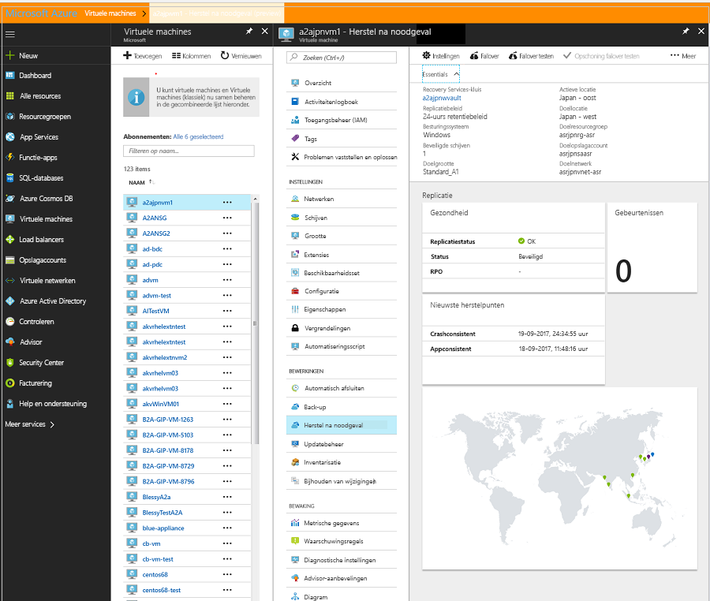
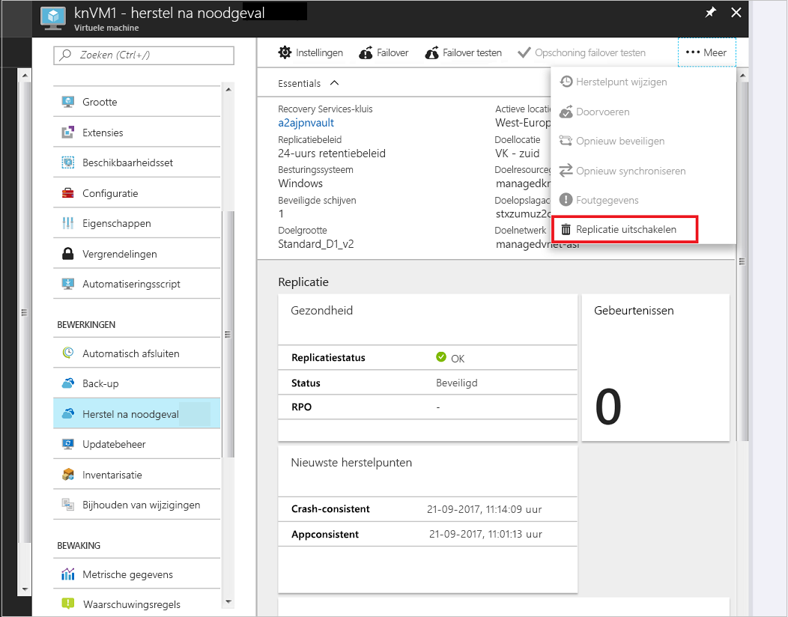

# Een Azure VM gerepliceerd naar een andere Azure-regio (Preview)

De [Azure Site Recovery](site-recovery-overview.md) service draagt bij aan uw strategie voor zakelijke continuïteit en noodherstel herstel (BCDR) door uw business-apps te houden beschikbaar tijdens geplande en ongeplande uitval. Site Recovery beheert en noodherstel van on-premises machines en virtuele Azure-machines (VM's), met inbegrip van replicatie, failovers en herstel ingedeeld.

Deze snelstartgids wordt beschreven hoe een Azure VM gerepliceerd naar een andere Azure-regio.

Als u nog geen abonnement op Azure hebt, maak dan een [gratis account](https://azure.microsoft.com/free/?WT.mc_id=A261C142F) aan voordat u begint.

## Meld u aan bij Azure.

Meld u via http://portal.azure.com aan bij Azure Portal.

## Replicatie inschakelen voor de Azure VM

1. Klik in de Azure-portal op **virtuele machines**, en selecteer de virtuele machine die u wilt repliceren.

2. In **instellingen**, klikt u op **herstel na noodgevallen (preview)**.
3. In **configureren van herstel na noodgevallen** > **doelregio** Selecteer het de doelregio waarnaar u zult repliceren.
4. Accepteer de standaardinstellingen voor deze snelstartgids.
5. Klik op **replicatie inschakelen**. Een taak voor het inschakelen van replicatie voor de virtuele machine wordt gestart.

    

## Controleer de instellingen voor

Nadat de taak is voltooid, kunt u de replicatiestatus controleren, replicatie-instellingen wijzigen en de implementatie testen.

1. Klik in het menu VM **herstel na noodgevallen (preview)**.
2. U kunt controleren, status van replicatie, de herstelpunten die zijn gemaakt en de bron en doel van de regio's op de kaart.

   

## Resources opschonen

De virtuele machine in de primaire regio stopt wanneer u replicatie uitschakelt repliceren:

- De bron-replicatie-instellingen worden automatisch opgeschoond.
- Site Recovery facturering voor de virtuele machine ook stopt.

Stop replicatie al als volgt:

1. Selecteer de virtuele machine.
2. In **herstel na noodgevallen (preview)**, klikt u op **meer**.
3. Klik op **schakelt u replicatie uit**.

   

## Volgende stappen

In deze snelstartgids kunt u één VM gerepliceerd naar een secundaire regio.

> [!div class="nextstepaction"]
> [Herstel na noodgevallen configureren voor Azure Virtual machines](azure-to-azure-tutorial-enable-replication.md)
