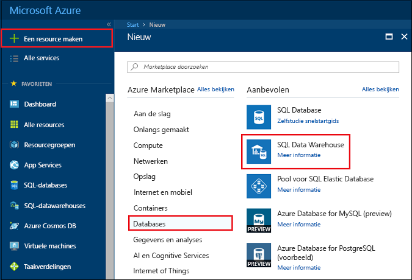
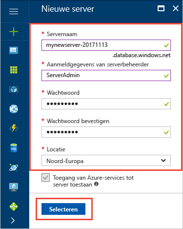
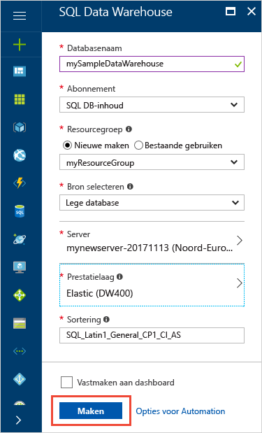
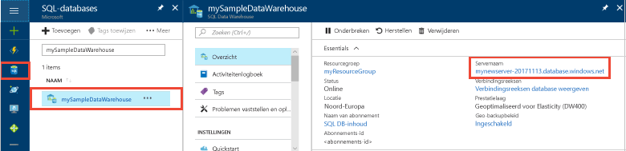
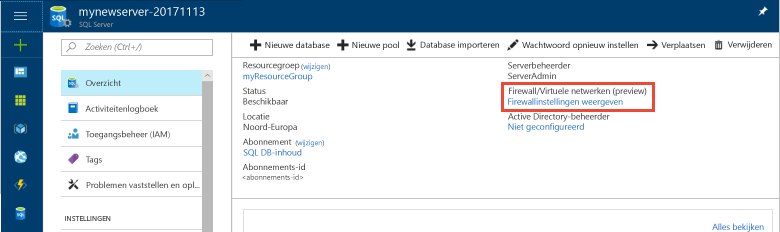
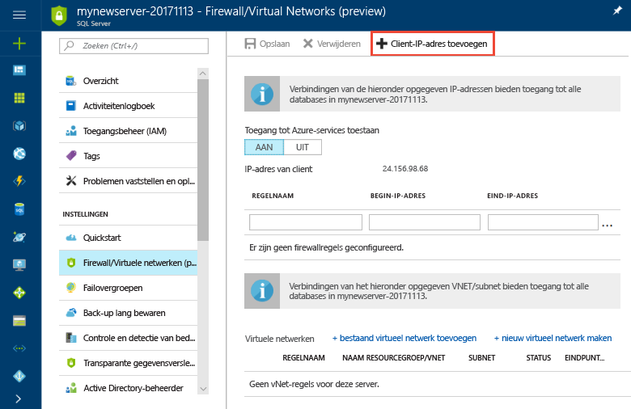
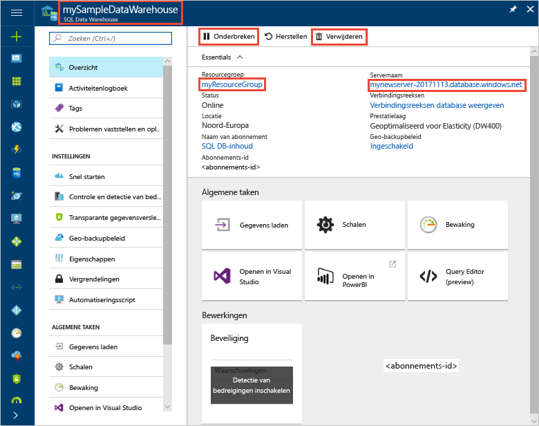

# <a name="use-polybase-to-load-data-from-azure-blob-storage-to-azure-sql-data-warehouse"></a>PolyBase gebruiken om gegevens te laden uit Azure blob storage met Azure SQL Data Warehouse

PolyBase is de standaard bij het laden van technologie voor het ophalen van gegevens in SQL Data Warehouse. In deze zelfstudie gebruikt u PolyBase New York taxi gegevens laden vanuit Azure blob-opslag naar Azure SQL Data Warehouse. De zelfstudie wordt gebruikgemaakt van de [Azure-portal](https://portal.azure.com) en [SQL Server Management Studio](/sql/ssms/download-sql-server-management-studio-ssms.md) (SSMS) naar: 

> [!div class="checklist"]
> * Een datawarehouse maken in de Azure portal
> * Een firewallregel op serverniveau in de Azure portal instellen
> * Verbinding maken met het datawarehouse met SSMS
> * Maken van een gebruiker die is aangewezen om gegevens te laden
> * Externe tabellen voor gegevens in Azure blob-opslag maken
> * Gebruik de CTAS T-SQL-instructie gegevens laadt in uw datawarehouse
> * De voortgang van de gegevens weergeven zoals deze wordt geladen
> * Statistieken maken voor de zojuist geladen gegevens

Als u een Azure-abonnement geen [een gratis account maken](https://azure.microsoft.com/free/) voordat u begint.

## <a name="before-you-begin"></a>Voordat u begint

Voordat u deze zelfstudie begint, download en installeer de nieuwste versie van [SQL Server Management Studio](/sql/ssms/download-sql-server-management-studio-ssms.md) (SSMS).


## <a name="log-in-to-the-azure-portal"></a>Aanmelden bij Azure Portal

Meld u aan bij [Azure Portal](https://portal.azure.com/).

## <a name="create-a-blank-sql-data-warehouse"></a>Een lege SQL datawarehouse maken

Er wordt een Azure SQL-databasewarehouse gemaakt met een gedefinieerde set [compute-resources](performance-tiers.md). De database wordt gemaakt in een [Azure-resourcegroep](../azure-resource-manager/resource-group-overview.md) en in een [logische Azure SQL-server](../sql-database/sql-database-features.md). 

Volg deze stappen voor het maken van een lege SQL datawarehouse. 

1. Klik in de linkerbovenhoek van Azure Portal op de knop **Nieuw**.

2. Selecteer op de pagina **Nieuw** de optie **Databases**, en selecteer onder **Aanbevolen** op de pagina **Nieuw** de optie **SQL Data Warehouse**.

    

3. Vul het SQL Data Warehouse-formulier in met de volgende gegevens:   

   | Instelling | Voorgestelde waarde | Beschrijving | 
   | ------- | --------------- | ----------- | 
   | **Databasenaam** | mySampleDataWarehouse | Zie [Database-id's](/sql/relational-databases/databases/database-identifiers) voor geldige databasenamen. | 
   | **Abonnement** | Uw abonnement  | Zie [Abonnementen](https://account.windowsazure.com/Subscriptions) voor meer informatie over uw abonnementen. |
   | **Resourcegroep** | myResourceGroup | Zie [Naming conventions](https://docs.microsoft.com/azure/architecture/best-practices/naming-conventions) (Naamgevingsconventies) voor geldige resourcegroepnamen. |
   | **Bron selecteren** | Lege database | Hiermee geeft u een lege database maken. Opmerking: een datawarehouse is een type database.|

    

4. Klik op **Server** als u een nieuwe server voor de nieuwe database wilt maken en configureren. Vul het **nieuwe serverformulier** in met de volgende gegevens: 

    | Instelling | Voorgestelde waarde | Beschrijving | 
    | ------- | --------------- | ----------- |
    | **Servernaam** | Een wereldwijd unieke naam | Zie [Naming conventions](https://docs.microsoft.com/azure/architecture/best-practices/naming-conventions) (Naamgevingsconventies) voor geldige servernamen. | 
    | **Aanmeldgegevens van serverbeheerder** | Een geldige naam | Zie [Database-id's](https://docs.microsoft.com/sql/relational-databases/databases/database-identifiers) voor geldige aanmeldingsnamen.|
    | **Wachtwoord** | Een geldig wachtwoord | Uw wachtwoord moet uit minstens acht tekens bestaan en moet tekens bevatten uit drie van de volgende categorieën: hoofdletters, kleine letters, cijfers en niet-alfanumerieke tekens. |
    | **Locatie** | Een geldige locatie | Zie [Azure-regio's](https://azure.microsoft.com/regions/) voor informatie over regio's. |

    

5. Klik op **Selecteren**.

6. Klik op **prestatielaag** om op te geven of het datawarehouse is geoptimaliseerd voor elasticiteit of compute en het aantal eenheden datawarehouse. 

7. Voor deze zelfstudie selecteert u de **geoptimaliseerd voor elasticiteit** servicelaag. De schuifregelaar is standaard ingesteld op **DW400**.  Verplaats de regelaar omhoog en omlaag om te zien hoe dit werkt. 

    

8. Klik op **Toepassen**.
9. Selecteer op de pagina SQL Data Warehouse een **sortering** voor de database leeg. Gebruik de standaardwaarde voor deze zelfstudie. Zie voor meer informatie over sorteringen [sorteringen](/sql/t-sql/statements/collations.md)

11. Nu u het SQL Database-formulier hebt ingevuld, klikt u op **Maken** om de database in te richten. De inrichting duurt een paar minuten. 

    

12. Klik op de werkbalk op **Meldingen** om het implementatieproces te bewaken.
    
     

## <a name="create-a-server-level-firewall-rule"></a>Een serverfirewallregel maken

Met de SQL Database Warehouse-service wordt een firewall op serverniveau gemaakt die voorkomt dat externe toepassingen en hulpprogramma’s verbinding maken met de server of databases op de server. Als u de connectiviteit wilt inschakelen, kunt u firewallregels toevoegen waarmee connectiviteit voor bepaalde IP-adressen wordt ingeschakeld.  Volg deze stappen om een [firewallregel op serverniveau](../sql-database/sql-database-firewall-configure.md) te maken voor het IP-adres van uw client. 

> [!NOTE]
> SQL Database Warehouse communiceert via poort 1433. Als u verbinding wilt maken vanuit een bedrijfsnetwerk, is uitgaand verkeer via poort 1433 mogelijk niet toegestaan vanwege de firewall van het netwerk. In dat geval kunt u geen verbinding maken met uw Azure SQL Database-server, tenzij de IT-afdeling poort 1433 openstelt.
>

1. Wanneer de implementatie is voltooid, klikt u op **SQL Databases** in het menu aan de linkerkant. Klik vervolgens op de pagina **SQL Databases** op **mySampleDatabase**. De overzichtspagina voor de database wordt geopend, met de volledig gekwalificeerde servernaam (bijvoorbeeld **mynewserver-20171113.database.windows.net**) en opties voor verdere configuratie. 

2. Kopieer deze volledig gekwalificeerde servernaam om in volgende Quick Starts verbinding te maken met de server en de bijbehorende databases. Klik vervolgens op de naam van de server om serverinstellingen te openen.

     

3. Klik op de naam van de server om serverinstellingen te openen.

     

5. Klik op **Firewallinstellingen weergeven**. De pagina **Firewallinstellingen** voor de SQL Database-server wordt geopend. 

     

4. Klik op **IP van client toevoegen** op de werkbalk om uw huidige IP-adres aan een nieuwe firewallregel toe te voegen. Een firewallregel kan poort 1433 openen voor een afzonderlijk IP-adres of voor een aantal IP-adressen.

5. Klik op **Opslaan**. Er wordt een firewallregel op serverniveau gemaakt voor uw huidige IP-adres waarbij poort 1433 op de logische server wordt geopend.

6. Klik op **OK** en sluit de pagina **Firewallinstellingen**.

U kunt nu via dit IP-adres verbinding maken met de SQL-server en de bijbehorende datawarehouses. De verbinding werkt met SQL Server Management Studio of een ander hulpprogramma van uw keuze. Wanneer u verbinding maakt, gebruikt u het ServerAdmin-account dat u eerder hebt gemaakt.  

> [!IMPORTANT]
> Voor alle Azure-services is toegang via de SQL Database-firewall standaard ingeschakeld. Klik op **UIT** op deze pagina en klik vervolgens op **Opslaan** om de firewall uit te schakelen voor alle Azure-services.

## <a name="get-the-fully-qualified-server-name"></a>De volledig gekwalificeerde servernaam ophalen

Haal de volledig gekwalificeerde servernaam van uw SQL-server op uit Azure Portal. U gaat de volledig gekwalificeerde naam later gebruiken bij het verbinden met de server.

1. Meld u aan bij [Azure Portal](https://portal.azure.com/).
2. Selecteer **SQL-databases** in het menu links en klik op uw database op de pagina **SQL-databases**. 
3. In het deelvenster **Essentials** van de Azure Portal-pagina van uw database kopieert u de **servernaam**. In dit voorbeeld is de volledig gekwalificeerde servernaam mynewserver-20171113.database.windows.net. 

      

## <a name="connect-to-the-server-as-server-admin"></a>Als serverbeheerder verbinding maken met de server

In deze sectie wordt gebruikgemaakt van [SSMS](/sql/ssms/download-sql-server-management-studio-ssms.md) (SQL Server Management Studio) om een verbinding tot stand te brengen met de Azure SQL-server.

1. Open SQL Server Management Studio.

2. Voer in het dialoogvenster **Verbinding maken met server** de volgende informatie in:

    | Instelling      | Voorgestelde waarde | Beschrijving | 
    | ------------ | --------------- | ----------- | 
    | Servertype | Database-engine | Deze waarde is verplicht |
    | Servernaam | De volledig gekwalificeerde servernaam | De naam moet er ongeveer als volgt: **mynewserver 20171113.database.windows.net**. |
    | Verificatie | SQL Server-verificatie | SQL-verificatie is het enige verificatietype dat we in deze zelfstudie hebben geconfigureerd. |
    | Aanmelden | Het beheerdersaccount voor de server | Dit is het account dat u hebt opgegeven tijdens het maken van de server. |
    | Wachtwoord | Het wachtwoord voor het beheerdersaccount voor de server | Dit is het wachtwoord dat u hebt opgegeven tijdens het maken van de server. |

    

4. Klik op **Verbinden**. Het venster Objectverkenner wordt geopend in SSMS. 

5. Vouw **Databases** uit in Objectverkenner. Vouw **systeemdatabases** en **master** de objecten weergeven in de database master.  Vouw **mySampleDatabase** om de objecten in uw nieuwe database weer te geven.

     

## <a name="create-a-user-for-loading-data"></a>Een gebruiker maken voor het laden van gegevens

De server-beheerdersaccount is bedoeld om beheerbewerkingen uitvoeren en is niet geschikt voor het uitvoeren van query's van gebruikersgegevens. Laden van gegevens is een geheugenintensieve bewerking. [Geheugen maximumwaarden](performance-tiers.md#memory-maximums) worden gedefinieerd volgens [prestatielaag](performance-tiers.md), en [bronklasse](resource-classes-for-workload-management.md). 

Het is raadzaam een aanmelding en de gebruiker die is toegewezen voor het laden van gegevens maken. Vervolgens het laden van de gebruiker toevoegen aan een [bronklasse](resource-classes-for-workload-management.md) waarmee een toewijzing voor de maximale hoeveelheid geheugen.

Aangezien u momenteel als de serverbeheerder verbonden bent, kunt u aanmeldingen en gebruikers. Volg deze stappen voor het maken van een gebruikersnaam en een gebruiker met de naam **LoaderRC20**. Wijs de gebruiker de **staticrc20** bronklasse. 

1.  SSMS, met de rechtermuisknop op **master** wilt geven een vervolgkeuzemenu en kiest u **nieuwe Query**. Een nieuwe queryvenster wordt geopend.

    

2. Voer in het queryvenster deze T-SQL-opdrachten voor het maken van een gebruikersnaam en een gebruiker met de naam LoaderRC20, vervangen door uw eigen wachtwoord voor 'a123STRONGpassword!'. 

    ```sql
    CREATE LOGIN LoaderRC20 WITH PASSWORD = 'a123STRONGpassword!';
    CREATE USER LoaderRC20 FOR LOGIN LoaderRC20;
    ```

3. Klik op **Uitvoeren**.

4. Met de rechtermuisknop op **mySampleDataWarehouse**, en kies **nieuwe Query**. Een nieuwe query venster wordt geopend.  

    
 
5. Voer de volgende T-SQL-opdrachten voor het maken van een databasegebruiker LoaderRC20 met de naam voor de aanmelding LoaderRC20. De tweede regel verleent de nieuwe gebruiker met machtigingen voor beheer op de nieuwe datawarehouse.  Deze machtigingen zijn vergelijkbaar met het maken van de gebruiker de eigenaar van de database. De derde regel wordt de nieuwe gebruiker toegevoegd als lid van de staticrc20 [bronklasse](resource-classes-for-workload-management.md).

    ```sql
    CREATE USER LoaderRC20 FOR LOGIN LoaderRC20;
    GRANT CONTROL ON DATABASE::[mySampleDataWarehouse] to LoaderRC20;
    EXEC sp_addrolemember 'staticrc20', 'LoaderRC20';
    ```

6. Klik op **Uitvoeren**.

## <a name="connect-to-the-server-as-the-loading-user"></a>Verbinding maken met de server als de gebruiker laden

De eerste stap voor het laden van gegevens is het aanmelden als LoaderRC20.  

1. Klik in Object Explorer, op de **Connect** vervolgkeuzelijst menu en selecteer **Database-Engine**. De **verbinding maken met Server** dialoogvenster wordt weergegeven.

    

2. Geef de volledig gekwalificeerde servernaam en voer **LoaderRC20** als de aanmelding.  Voer uw wachtwoord voor LoaderRC20.

3. Klik op **Verbinden**.

4. Wanneer de verbinding klaar is, ziet u twee serververbindingen in Object Explorer. Een verbinding als de serverbeheerder en één verbinding als MedRCLogin.

    

## <a name="create-external-tables-for-the-sample-data"></a>Externe tabellen voor de voorbeeldgegevens maken

U bent klaar om te beginnen met het proces van de gegevens in uw nieuwe datawarehouse te laden. Deze zelfstudie leert u hoe u [Polybase](/sql/relational-databases/polybase/polybase-guide.md) New York City taxi CAB-bestand om gegevens te laden van een Azure storage-blob. Raadpleeg het [laadoverzicht](sql-data-warehouse-overview-load.md) voor informatie over het overbrengen van gegevens naar Azure-blobopslag of het rechtstreeks vanuit de bron laden van gegevens in SQL Data Warehouse.

Voer de volgende SQL-scripts opgeven informatie over de gegevens die u wilt laden. Deze informatie omvat waar de gegevens zich bevindt, de indeling van de inhoud van de gegevens en de definitie van de tabel voor de gegevens. 

1. In de vorige sectie u aangemeld bij uw datawarehouse als LoaderRC20. Met de rechtermuisknop op uw verbinding LoaderRC20 in SSMS, en selecteer **nieuwe Query**.  Een nieuwe queryvenster wordt weergegeven. 

    

2. Vergelijk uw query-venster naar de vorige afbeelding.  Controleer of uw nieuwe queryvenster wordt uitgevoerd als LoaderRC20 en uitvoeren van query's op uw MySampleDataWarehouse-database. Gebruik deze query-venster om uit te voeren op alle stappen van de laden.

3. Maak een hoofdsleutel voor de database MySampleDataWarehouse. U hoeft maar één hoofdsleutel per database te maken. 

    ```sql
    CREATE MASTER KEY;
    ```

4. Voer de volgende [externe gegevensbron maken](/sql/t-sql/statements/create-external-data-source-transact-sql.md) instructie voor het definiëren van de locatie van de blob van Azure. Dit is de locatie van de gegevens van externe taxi CAB-bestand.  Voor het uitvoeren van een opdracht die u hebt toegevoegd aan het query-venster, markeer de opdrachten die u wilt uitvoeren en klik op **Execute**.

    ```sql
    CREATE EXTERNAL DATA SOURCE NYTPublic
    WITH
    (
        TYPE = Hadoop,
        LOCATION = 'wasbs://2013@nytaxiblob.blob.core.windows.net/'
    );
    ```

5. Voer de volgende [EXTERNAL FILE FORMAT maken](/sql/t-sql/statements/create-external-file-format-transact-sql.md) T-SQL-instructie opmaak eigenschappen en opties voor het bestand met externe gegevens op te geven. Deze instructie Hiermee geeft u de externe gegevens wordt opgeslagen als tekst en de waarden worden gescheiden door de pipe ('| ') teken. Het externe bestand is gecomprimeerd met Gzip. 

    ```sql
    CREATE EXTERNAL FILE FORMAT uncompressedcsv
    WITH (
        FORMAT_TYPE = DELIMITEDTEXT,
        FORMAT_OPTIONS ( 
            FIELD_TERMINATOR = ',',
            STRING_DELIMITER = '',
            DATE_FORMAT = '',
            USE_TYPE_DEFAULT = False
        )
    );
    CREATE EXTERNAL FILE FORMAT compressedcsv
    WITH ( 
        FORMAT_TYPE = DELIMITEDTEXT,
        FORMAT_OPTIONS ( FIELD_TERMINATOR = '|',
            STRING_DELIMITER = '',
        DATE_FORMAT = '',
            USE_TYPE_DEFAULT = False
        ),
        DATA_COMPRESSION = 'org.apache.hadoop.io.compress.GzipCodec'
    );
    ```

6.  Voer de volgende [CREATE SCHEMA](/sql/t-sql/statements/create-schema-transact-sql.md) instructie voor het maken van een schema voor de externe bestandsindeling. Het schema biedt een manier te organiseren van de externe tabellen die u gaat maken.

    ```sql
    CREATE SCHEMA ext;
    ```

7. Maak de externe tabellen. De tabel definities worden opgeslagen in SQL Data Warehouse, maar de tabellen verwijzen naar gegevens die zijn opgeslagen in Azure blob-opslag. Voer de volgende T-SQL-opdrachten uit om verschillende externe tabellen te maken die allemaal verwijzen naar de Azure-blob die eerder is gedefinieerd in de externe gegevensbron.

    ```sql
    CREATE EXTERNAL TABLE [ext].[Date] 
    (
        [DateID] int NOT NULL,
        [Date] datetime NULL,
        [DateBKey] char(10) COLLATE SQL_Latin1_General_CP1_CI_AS NULL,
        [DayOfMonth] varchar(2) COLLATE SQL_Latin1_General_CP1_CI_AS NULL,
        [DaySuffix] varchar(4) COLLATE SQL_Latin1_General_CP1_CI_AS NULL,
        [DayName] varchar(9) COLLATE SQL_Latin1_General_CP1_CI_AS NULL,
        [DayOfWeek] char(1) COLLATE SQL_Latin1_General_CP1_CI_AS NULL,
        [DayOfWeekInMonth] varchar(2) COLLATE SQL_Latin1_General_CP1_CI_AS NULL,
        [DayOfWeekInYear] varchar(2) COLLATE SQL_Latin1_General_CP1_CI_AS NULL,
        [DayOfQuarter] varchar(3) COLLATE SQL_Latin1_General_CP1_CI_AS NULL,
        [DayOfYear] varchar(3) COLLATE SQL_Latin1_General_CP1_CI_AS NULL,
        [WeekOfMonth] varchar(1) COLLATE SQL_Latin1_General_CP1_CI_AS NULL,
        [WeekOfQuarter] varchar(2) COLLATE SQL_Latin1_General_CP1_CI_AS NULL,
        [WeekOfYear] varchar(2) COLLATE SQL_Latin1_General_CP1_CI_AS NULL,
        [Month] varchar(2) COLLATE SQL_Latin1_General_CP1_CI_AS NULL,
        [MonthName] varchar(9) COLLATE SQL_Latin1_General_CP1_CI_AS NULL,
        [MonthOfQuarter] varchar(2) COLLATE SQL_Latin1_General_CP1_CI_AS NULL,
        [Quarter] char(1) COLLATE SQL_Latin1_General_CP1_CI_AS NULL,
        [QuarterName] varchar(9) COLLATE SQL_Latin1_General_CP1_CI_AS NULL,
        [Year] char(4) COLLATE SQL_Latin1_General_CP1_CI_AS NULL,
        [YearName] char(7) COLLATE SQL_Latin1_General_CP1_CI_AS NULL,
        [MonthYear] char(10) COLLATE SQL_Latin1_General_CP1_CI_AS NULL,
        [MMYYYY] char(6) COLLATE SQL_Latin1_General_CP1_CI_AS NULL,
        [FirstDayOfMonth] date NULL,
        [LastDayOfMonth] date NULL,
        [FirstDayOfQuarter] date NULL,
        [LastDayOfQuarter] date NULL,
        [FirstDayOfYear] date NULL,
        [LastDayOfYear] date NULL,
        [IsHolidayUSA] bit NULL,
        [IsWeekday] bit NULL,
        [HolidayUSA] varchar(50) COLLATE SQL_Latin1_General_CP1_CI_AS NULL
    )
    WITH
    (
        LOCATION = 'Date',
        DATA_SOURCE = NYTPublic,
        FILE_FORMAT = uncompressedcsv,
        REJECT_TYPE = value,
        REJECT_VALUE = 0
    ); 
    CREATE EXTERNAL TABLE [ext].[Geography]
    (
        [GeographyID] int NOT NULL,
        [ZipCodeBKey] varchar(10) COLLATE SQL_Latin1_General_CP1_CI_AS NOT NULL,
        [County] varchar(50) COLLATE SQL_Latin1_General_CP1_CI_AS NULL,
        [City] varchar(50) COLLATE SQL_Latin1_General_CP1_CI_AS NULL,
        [State] varchar(50) COLLATE SQL_Latin1_General_CP1_CI_AS NULL,
        [Country] varchar(50) COLLATE SQL_Latin1_General_CP1_CI_AS NULL,
        [ZipCode] varchar(50) COLLATE SQL_Latin1_General_CP1_CI_AS NULL
    )
    WITH
    (
        LOCATION = 'Geography',
        DATA_SOURCE = NYTPublic,
        FILE_FORMAT = uncompressedcsv,
        REJECT_TYPE = value,
        REJECT_VALUE = 0 
    );      
    CREATE EXTERNAL TABLE [ext].[HackneyLicense]
    (
        [HackneyLicenseID] int NOT NULL,
        [HackneyLicenseBKey] varchar(50) COLLATE SQL_Latin1_General_CP1_CI_AS NOT NULL,
        [HackneyLicenseCode] varchar(50) COLLATE SQL_Latin1_General_CP1_CI_AS NULL
    )
    WITH
    (
        LOCATION = 'HackneyLicense',
        DATA_SOURCE = NYTPublic,
        FILE_FORMAT = uncompressedcsv,
        REJECT_TYPE = value,
        REJECT_VALUE = 0
    );
    CREATE EXTERNAL TABLE [ext].[Medallion]
    (
        [MedallionID] int NOT NULL,
        [MedallionBKey] varchar(50) COLLATE SQL_Latin1_General_CP1_CI_AS NOT NULL,
        [MedallionCode] varchar(50) COLLATE SQL_Latin1_General_CP1_CI_AS NULL
    )
    WITH
    (
        LOCATION = 'Medallion',
        DATA_SOURCE = NYTPublic,
        FILE_FORMAT = uncompressedcsv,
        REJECT_TYPE = value,
        REJECT_VALUE = 0
    )
    ;  
    CREATE EXTERNAL TABLE [ext].[Time]
    (
        [TimeID] int NOT NULL,
        [TimeBKey] varchar(8) COLLATE SQL_Latin1_General_CP1_CI_AS NOT NULL,
        [HourNumber] tinyint NOT NULL,
        [MinuteNumber] tinyint NOT NULL,
        [SecondNumber] tinyint NOT NULL,
        [TimeInSecond] int NOT NULL,
        [HourlyBucket] varchar(15) COLLATE SQL_Latin1_General_CP1_CI_AS NOT NULL,
        [DayTimeBucketGroupKey] int NOT NULL,
        [DayTimeBucket] varchar(100) COLLATE SQL_Latin1_General_CP1_CI_AS NOT NULL
    )
    WITH
    (
        LOCATION = 'Time',
        DATA_SOURCE = NYTPublic,
        FILE_FORMAT = uncompressedcsv,
        REJECT_TYPE = value,
        REJECT_VALUE = 0
    );
    CREATE EXTERNAL TABLE [ext].[Trip]
    (
        [DateID] int NOT NULL,
        [MedallionID] int NOT NULL,
        [HackneyLicenseID] int NOT NULL,
        [PickupTimeID] int NOT NULL,
        [DropoffTimeID] int NOT NULL,
        [PickupGeographyID] int NULL,
        [DropoffGeographyID] int NULL,
        [PickupLatitude] float NULL,
        [PickupLongitude] float NULL,
        [PickupLatLong] varchar(50) COLLATE SQL_Latin1_General_CP1_CI_AS NULL,
        [DropoffLatitude] float NULL,
        [DropoffLongitude] float NULL,
        [DropoffLatLong] varchar(50) COLLATE SQL_Latin1_General_CP1_CI_AS NULL,
        [PassengerCount] int NULL,
        [TripDurationSeconds] int NULL,
        [TripDistanceMiles] float NULL,
        [PaymentType] varchar(50) COLLATE SQL_Latin1_General_CP1_CI_AS NULL,
        [FareAmount] money NULL,
        [SurchargeAmount] money NULL,
        [TaxAmount] money NULL,
        [TipAmount] money NULL,
        [TollsAmount] money NULL,
        [TotalAmount] money NULL
    )
    WITH
    (
        LOCATION = 'Trip2013',
        DATA_SOURCE = NYTPublic,
        FILE_FORMAT = compressedcsv,
        REJECT_TYPE = value,
        REJECT_VALUE = 0
    );
    CREATE EXTERNAL TABLE [ext].[Weather]
    (
        [DateID] int NOT NULL,
        [GeographyID] int NOT NULL,
        [PrecipitationInches] float NOT NULL,
        [AvgTemperatureFahrenheit] float NOT NULL
    )
    WITH
    (
        LOCATION = 'Weather',
        DATA_SOURCE = NYTPublic,
        FILE_FORMAT = uncompressedcsv,
        REJECT_TYPE = value,
        REJECT_VALUE = 0
    )
    ;
    ```

8. Vouw in Object Explorer mySampleDataWarehouse om te zien van de lijst met externe tabellen die u zojuist hebt gemaakt.

    

## <a name="load-the-data-into-your-data-warehouse"></a>De gegevens in uw datawarehouse laden

Deze sectie maakt gebruik van de externe tabellen die u zojuist hebt gedefinieerd voor het laden van de voorbeeldgegevens uit Azure Storage-Blob naar SQL Data Warehouse.  

> [!NOTE]
> Deze zelfstudie worden de gegevens rechtstreeks in de laatste tabel geladen. In een productieomgeving, meestal gebruikt u CREATE TABLE AS SELECT laden naar een tijdelijke tabel. U kunt alle benodigde transformaties uitvoeren wanneer deze worden in de faseringstabel. Als u wilt de gegevens in de faseringstabel toevoegen aan een productietabel, kunt u de INSERT... SELECT-instructie. Zie voor meer informatie [gegevens in een productietabel invoegen](guidance-for-loading-data.md#inserting-data-into-a-production-table).
> 

Het script gebruikt de [maken tabel AS selecteren (CTAS)](/sql/t-sql/statements/create-table-as-select-azure-sql-data-warehouse.md) T-SQL-instructie voor het laden van de gegevens van Azure Storage-Blob in nieuwe tabellen in het datawarehouse. CTAS maakt een nieuwe tabel op basis van de resultaten van een select-instructie. De nieuwe tabel heeft dezelfde gegevenstypen en kolommen als de resultaten van de selecteerinstructie. Wanneer de select-instructie uit een externe tabel selecteert, wordt in SQL Data Warehouse de gegevens in een relationele tabel in het datawarehouse geïmporteerd. 

1. Voer het volgende script om de gegevens in de nieuwe tabellen in uw datawarehouse laden.

    ```sql
    CREATE TABLE [dbo].[Date]
    WITH
    ( 
        DISTRIBUTION = ROUND_ROBIN,
        CLUSTERED COLUMNSTORE INDEX
    )
    AS SELECT * FROM [ext].[Date]
    OPTION (LABEL = 'CTAS : Load [dbo].[Date]')
    ;
    CREATE TABLE [dbo].[Geography]
    WITH
    ( 
        DISTRIBUTION = ROUND_ROBIN,
        CLUSTERED COLUMNSTORE INDEX
    )
    AS
    SELECT * FROM [ext].[Geography]
    OPTION (LABEL = 'CTAS : Load [dbo].[Geography]')
    ;
    CREATE TABLE [dbo].[HackneyLicense]
    WITH
    ( 
        DISTRIBUTION = ROUND_ROBIN,
        CLUSTERED COLUMNSTORE INDEX
    )
    AS SELECT * FROM [ext].[HackneyLicense]
    OPTION (LABEL = 'CTAS : Load [dbo].[HackneyLicense]')
    ;
    CREATE TABLE [dbo].[Medallion]
    WITH
    (
        DISTRIBUTION = ROUND_ROBIN,
        CLUSTERED COLUMNSTORE INDEX
    )
    AS SELECT * FROM [ext].[Medallion]
    OPTION (LABEL = 'CTAS : Load [dbo].[Medallion]')
    ;
    CREATE TABLE [dbo].[Time]
    WITH
    (
        DISTRIBUTION = ROUND_ROBIN,
        CLUSTERED COLUMNSTORE INDEX
    )
    AS SELECT * FROM [ext].[Time]
    OPTION (LABEL = 'CTAS : Load [dbo].[Time]')
    ;
    CREATE TABLE [dbo].[Weather]
    WITH
    ( 
        DISTRIBUTION = ROUND_ROBIN,
        CLUSTERED COLUMNSTORE INDEX
    )
    AS SELECT * FROM [ext].[Weather]
    OPTION (LABEL = 'CTAS : Load [dbo].[Weather]')
    ;
    CREATE TABLE [dbo].[Trip]
    WITH
    (
        DISTRIBUTION = ROUND_ROBIN,
        CLUSTERED COLUMNSTORE INDEX
    )
    AS SELECT * FROM [ext].[Trip]
    OPTION (LABEL = 'CTAS : Load [dbo].[Trip]')
    ;
    ```

2. Bekijk uw gegevens tijdens het laden. U laadt meerdere GB's aan gegevens en comprimeert die tot hoogwaardige geclusterde columnstore-indexen. Voer de volgende query uit, die gebruikmaakt van dynamische beheerweergaven (DMV's) om de status van de belasting weer te geven. Pak er een kopje koffie bij nadat u de query hebt gestart. SQL Data Warehouse doet ondertussen het zware werk voor u.

    ```sql
    SELECT
        r.command,
        s.request_id,
        r.status,
        count(distinct input_name) as nbr_files,
        sum(s.bytes_processed)/1024/1024/1024 as gb_processed
    FROM 
        sys.dm_pdw_exec_requests r
        INNER JOIN sys.dm_pdw_dms_external_work s
        ON r.request_id = s.request_id
    WHERE
        r.[label] = 'CTAS : Load [dbo].[Date]' OR
        r.[label] = 'CTAS : Load [dbo].[Geography]' OR
        r.[label] = 'CTAS : Load [dbo].[HackneyLicense]' OR
        r.[label] = 'CTAS : Load [dbo].[Medallion]' OR
        r.[label] = 'CTAS : Load [dbo].[Time]' OR
        r.[label] = 'CTAS : Load [dbo].[Weather]' OR
        r.[label] = 'CTAS : Load [dbo].[Trip]'
    GROUP BY
        r.command,
        s.request_id,
        r.status
    ORDER BY
        nbr_files desc, 
        gb_processed desc;
    ```

3. Bekijk alle systeemquery's.

    ```sql
    SELECT * FROM sys.dm_pdw_exec_requests;
    ```

4. Profiteer van uw gegevens mooi geladen in het datawarehouse te zien.

    

## <a name="create-statistics-on-newly-loaded-data"></a>Statistieken maken voor zojuist geladen gegevens

SQL Data Warehouse bevat geen functionaliteit voor het automatisch maken of bijwerken van statistieken. Voor hoge queryprestaties is het dan ook belangrijk dat u voor elke kolom in elke tabel statistieken maakt nadat de tabel de eerste keer is geladen. Het is ook belangrijk dat de statistieken worden bijgewerkt wanneer gegevens substantieel zijn gewijzigd.

Voer deze opdrachten om statistieken te maken voor kolommen die kunnen worden gebruikt in joins.

    ```sql
    CREATE STATISTICS [dbo.Date DateID stats] ON dbo.Date (DateID);
    CREATE STATISTICS [dbo.Trip DateID stats] ON dbo.Trip (DateID);
    ```

## <a name="clean-up-resources"></a>Resources opschonen

U bent in rekening worden gebracht rekenresources en gegevens die u in uw datawarehouse geladen. Deze worden afzonderlijk gefactureerd. 

- Als u de gegevens in de opslag wilt houden, kunt u het berekenen onderbreken wanneer u het datawarehouse niet gebruikt. Door de rekencapaciteit onderbreken u worden pas kosten voor opslag van gegevens en u kunt de berekeningen hervatten wanneer u klaar bent voor het werken met de gegevens.
- Als u in de toekomst geen kosten meer wilt hebben, kunt u de datawarehouse verwijderen. 

Volg deze stappen om de resources op te schonen zoals gewenst.

1. Meld u aan bij de [Azure-portal](https://portal.azure.com), klikt u op uw datawarehouse.

    

2. Als u het berekenen wilt onderbreken, klikt u op de knop **Onderbreken**. Als het datawarehouse is onderbroken, ziet u een **Start** knop.  Als u het berekenen wilt hervatten, klikt u op **Start**.

3. Als u wilt verwijderen, het datawarehouse zodat u geen voor compute of de opslag afgeschreven, klikt u op **verwijderen**.

4. Als u de door u gemaakte SQL-server wilt verwijderen, klikt u op **mynewserver-20171113.database.windows.net** in de vorige afbeelding. Klik vervolgens op **Verwijderen**.  Wees voorzichtig met dit als de server verwijdert, worden alle databases die zijn toegewezen aan de server.

5. Als u de resourcegroep wilt verwijderen, klikt u op **myResourceGroup**. Klik vervolgens op **Resourcegroep verwijderen**.

## <a name="next-steps"></a>Volgende stappen 
In deze zelfstudie hebt u geleerd hoe een datawarehouse maken en een gebruiker maken om gegevens te laden. U externe tabellen om te definiëren van de structuur voor gegevens die zijn opgeslagen in Azure Storage-Blob gemaakt en vervolgens de PolyBase CREATE TABLE AS SELECT-instructie gebruikt voor het laden van gegevens in uw datawarehouse. 

U hebt deze dingen:
> [!div class="checklist"]
> * Een datawarehouse gemaakt in de Azure portal
> * Een firewallregel op serverniveau in de Azure portal instellen
> * Verbonden met het datawarehouse met SSMS
> * Het maken van een gebruiker toegewezen voor het laden van gegevens
> * Externe tabellen voor gegevens in Azure Storage-Blob gemaakt
> * De CTAS T-SQL-instructie gebruikt om gegevens te laden in uw datawarehouse
> * De voortgang van de gegevens weergegeven zoals deze wordt geladen
> * Gemaakte statistieken voor de zojuist geladen gegevens

Ga naar het Migratieoverzicht van voor informatie over het migreren van een bestaande database in SQL Data Warehouse.

> [!div class="nextstepaction"]
>[Meer informatie over het migreren van een bestaande database in SQL Data Warehouse](sql-data-warehouse-overview-migrate.md)
