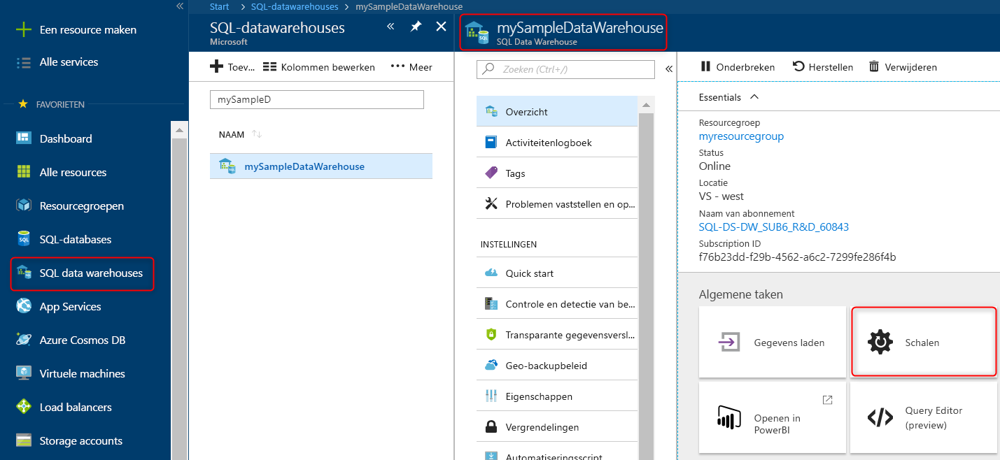

# Snelstart: rekenkracht uitschalen in Azure SQL Data Warehouse in Azure Portal

Rekenkracht uitschalen in Azure SQL Data Warehouse in Azure Portal. [Vergroot de schaal van Compute](sql-data-warehouse-manage-compute-overview.md) voor betere prestaties of verklein de schaal juist om kosten te besparen. 

Als u nog geen Azure-abonnement hebt, maakt u een [gratis account](https://azure.microsoft.com/free/) voordat u begint.

## Aanmelden bij Azure Portal

Meld u aan bij [Azure Portal](https://portal.azure.com/).

## Voordat u begint

U kunt een eigen datawarehouse schalen. U kunt ook [Snelstart: maken en verbinden - portal](create-data-warehouse-portal.md) gebruiken om een datawarehouse met de naam **mySampleDataWarehouse** te maken.  Met deze snelstart wordt **mySampleDataWarehouse** geschaald.

## De schaal van Compute aanpassen

In SQL Data Warehouse kunt u het aantal rekenresources verhogen of verlagen door de DWU's aan te passen. Met behulp van [Maken en verbinden - portal](create-data-warehouse-portal.md) is **mySampleDataWarehouse** gemaakt en vervolgens gestart met 400 DWU's. In de volgende stappen wordt het aantal DWU’s voor **mySampleDataWarehouse** aangepast.

DWU’s wijzigen:

1. Klik op **SQL Data Warehouses** op de linkerpagina in de Azure Portal.
2. Selecteer **mySampleDataWarehouse** op de pagina **SQL Data Warehouses**. De datawarehouse wordt geopend.
3. Klik op **Schalen**.

    

2. Verplaats in het paneel Schalen de schuifregelaar naar links of rechts om de DWU-instelling te wijzigen.

    

3. Klik op **Opslaan**. Er verschijnt een bevestigingsbericht. Klik op **Ja** om te bevestigen of **Nee** om te annuleren.

    

## Volgende stappen
U hebt nu geleerd hoe u de rekenkracht voor uw datawarehouse wijzigt. Voor meer informatie over Azure SQL Data Warehouse gaat u verder met de zelfstudie voor het laden van gegevens.

> [!div class="nextstepaction"]
>[Gegevens laden in een SQL-datawarehouse](load-data-from-azure-blob-storage-using-polybase.md)
