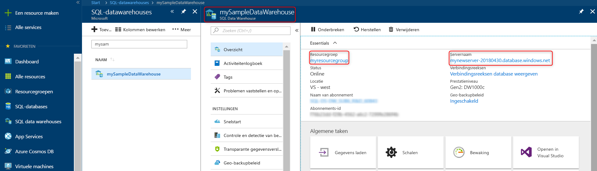

# <a name="quickstart-scale-compute-in-azure-sql-data-warehouse-in-powershell"></a>Snelstart: De schaal van rekenkracht vergroten in Azure SQL Data Warehouse in PowerShell

De schaal van rekenkracht vergroten in Azure SQL Data Warehouse in PowerShell. [Vergroot de schaal van Compute](sql-data-warehouse-manage-compute-overview.md) voor betere prestaties of verklein de schaal juist om kosten te besparen.

Als u nog geen Azure-abonnement hebt, maakt u een [gratis account](https://azure.microsoft.com/free/) voordat u begint.

Voor deze zelfstudie is moduleversie 5.1.1 of hoger van Azure PowerShell vereist. Voer `Get-Module -ListAvailable AzureRM` uit om te zien welke versie u momenteel hebt. Als u PowerShell wilt installeren of upgraden, raadpleegt u [De Azure PowerShell-module installeren](/powershell/azure/install-azurerm-ps.md).

## <a name="before-you-begin"></a>Voordat u begint

In deze snelstart wordt ervan uitgegaan dat u al een SQL-datawarehouse hebt waarvan u de schaal kunt aanpassen. Gebruik [Maken en verbinden - portal](create-data-warehouse-portal.md) om een datawarehouse met de naam **mySampleDataWarehouse** te maken.

## <a name="log-in-to-azure"></a>Meld u aan bij Azure.

Meld u aan bij uw Azure-abonnement met behulp van de opdracht [Connect-AzureRmAccount](/powershell/module/azurerm.profile/connect-azurermaccount) en volg de instructies op het scherm.

```powershell
Connect-AzureRmAccount
```

Voer [Get-AzureRmSubscription](/powershell/module/azurerm.profile/get-azurermsubscription) uit om te zien welk abonnement u gebruikt.

```powershell
Get-AzureRmSubscription
```

Als u een ander abonnement dan het standaardabonnement wilt gebruiken, voert u [Select-AzureRmSubscription](/powershell/module/azurerm.profile/select-azurermsubscription) uit.

```powershell
Select-AzureRmSubscription -SubscriptionName "MySubscription"
```

## <a name="look-up-data-warehouse-information"></a>Datawarehousegegevens opzoeken

Zoek de databasenaam, de servernaam en de resourcegroep op voor het datawarehouse dat u wilt onderbreken en hervatten.

Volg deze stappen om de locatiegegevens voor uw datawarehouse op te zoeken.

1. Meld u aan bij [Azure Portal](https://portal.azure.com/).
2. Klik op de linkerpagina in Azure Portal op **SQL-databases**.
3. Selecteer **mySampleDataWarehouse** op de pagina **SQL-databases**. De datawarehouse wordt geopend.

    

4. Noteer de naam van het datawarehouse. Deze wordt gebruikt als de databasenaam. Een datawarehouse is een type database. Noteer ook de naam van de server en de resourcegroep. U gebruikt deze in de opdrachten voor het onderbreken en hervatten.
5. Als uw server foo.database.windows.net is, gebruikt u alleen het eerste deel als de servernaam in de PowerShell-cmdlets. Op de voorgaande afbeelding is de volledige servernaam newserver 20171113.database.windows.net. We gebruiken **newserver-20171113** als de servernaam in de PowerShell-cmdlet.

## <a name="scale-compute"></a>De schaal van Compute aanpassen

In SQL Data Warehouse kunt u het aantal rekenresources verhogen of verlagen door de DWU's aan te passen. Met behulp van [Maken en verbinden - portal](create-data-warehouse-portal.md) is **mySampleDataWarehouse** gemaakt en vervolgens gestart met 400 DWU's. In de volgende stappen wordt het aantal DWU's voor **mySampleDataWarehouse** aangepast.

Als u datawarehouse-eenheden wilt wijzigen, gebruikt u de PowerShell-cmdlet [Set-AzureRmSqlDatabase](/powershell/module/azurerm.sql/set-azurermsqldatabase). In het volgende voorbeeld worden de datawarehouse-eenheden ingesteld op DW300 voor de database **mySampleDataWarehouse** die wordt gehost in de resourcegroep **myResourceGroup** op server  **mynewserver 20171113**.

```Powershell
Set-AzureRmSqlDatabase -ResourceGroupName "myResourceGroup" -DatabaseName "mySampleDataWarehouse" -ServerName "mynewserver-20171113" -RequestedServiceObjectiveName "DW300"
```

## <a name="check-data-warehouse-state"></a>Status van datawarehouse controleren

Als u de huidige status van de datawarehouse wilt zien, gebruikt u de PowerShell-cmdlet [Get-AzureRmSqlDatabase](/powershell/module/azurerm.sql/get-azurermsqldatabase). Hiermee wordt de status van de **mySampleDataWarehouse**-database in resourceGroup **myResourceGroup** en server **mynewserver-20171113.database.windows.net**.

```powershell
$database = Get-AzureRmSqlDatabase -ResourceGroupName myResourceGroup -ServerName mynewserver-20171113 -DatabaseName mySampleDataWarehouse
$database
```

Dit resulteert in ongeveer het volgende:

```powershell
ResourceGroupName             : myResourceGroup
ServerName                    : mynewserver-20171113
DatabaseName                  : mySampleDataWarehouse
Location                      : North Europe
DatabaseId                    : 34d2ffb8-b70a-40b2-b4f9-b0a39833c974
Edition                       : DataWarehouse
CollationName                 : SQL_Latin1_General_CP1_CI_AS
CatalogCollation              :
MaxSizeBytes                  : 263882790666240
Status                        : Online
CreationDate                  : 11/20/2017 9:18:12 PM
CurrentServiceObjectiveId     : 284f1aff-fee7-4d3b-a211-5b8ebdd28fea
CurrentServiceObjectiveName   : DW300
RequestedServiceObjectiveId   : 284f1aff-fee7-4d3b-a211-5b8ebdd28fea
RequestedServiceObjectiveName :
ElasticPoolName               :
EarliestRestoreDate           :
Tags                          :
ResourceId                    : /subscriptions/xxxxxxxx-xxxx-xxxx-xxxx-xxxxxxxxxxxx/
                                resourceGroups/myResourceGroup/providers/Microsoft.Sql/servers/mynewserver-20171113/databases/mySampleDataWarehouse
CreateMode                    :
ReadScale                     : Disabled
ZoneRedundant                 : False
```

U ziet de **Status** van de database in de uitvoer. In dit geval kunt u zien dat deze database online is.  Wanneer u deze opdracht uitvoert, ontvangt u de statuswaarde Online, Onderbreken, Hervatten, Schalen of Onderbroken.

Voer de volgende opdracht uit om de status op zichzelf te bekijken:

```powershell
$database | Select-Object DatabaseName,Status
```

## <a name="next-steps"></a>Volgende stappen
U hebt nu geleerd hoe u de rekenkracht voor uw datawarehouse wijzigt. Voor meer informatie over Azure SQL Data Warehouse gaat u verder met de zelfstudie voor het laden van gegevens.

> [!div class="nextstepaction"]
>[Gegevens laden in een SQL-datawarehouse](load-data-from-azure-blob-storage-using-polybase.md)
