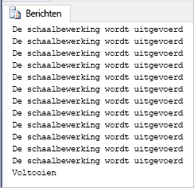

# <a name="quickstart-scale-compute-in-azure-sql-data-warehouse-using-t-sql"></a>Quickstart: Compute schalen in Azure SQL Data Warehouse met behulp van T-SQL

Schaal Compute in Azure SQL Data Warehouse met behulp van T-SQL en SSMS (SQL Server Management Studio). [Vergroot de schaal van Compute](sql-data-warehouse-manage-compute-overview.md) voor betere prestaties of verklein de schaal juist om kosten te besparen. 

Als u nog geen Azure-abonnement hebt, maakt u een [gratis account](https://azure.microsoft.com/free/) voordat u begint.

## <a name="before-you-begin"></a>Voordat u begint

Download en installeer de nieuwste versie van [SSMS](/sql/ssms/download-sql-server-management-studio-ssms) (SQL Server Management Studio).
 
## <a name="create-a-data-warehouse"></a>Een datawarehouse maken

Gebruik [Quickstart: Create and Connect - portal](create-data-warehouse-portal.md) (Quickstart: maken en verbinden - portal) om een datawarehouse te maken met de naam **mySampleDataWarehouse**. Voltooi de quickstart om ervoor te zorgen dat u een firewallregel hebt en dat u vanuit SQL Server Management Studio verbinding kunt maken met uw datawarehouse.

## <a name="connect-to-the-server-as-server-admin"></a>Als serverbeheerder verbinding maken met de server

In deze sectie wordt gebruikgemaakt van [SSMS](/sql/ssms/download-sql-server-management-studio-ssms) (SQL Server Management Studio) om een verbinding tot stand te brengen met de Azure SQL-server.

1. Open SQL Server Management Studio.

2. Voer in het dialoogvenster **Verbinding maken met server** de volgende informatie in:

   | Instelling       | Voorgestelde waarde | Beschrijving | 
   | ------------ | ------------------ | ------------------------------------------------- | 
   | Servertype | Database-engine | Deze waarde is verplicht |
   | Servernaam | De volledig gekwalificeerde servernaam | Hier volgt een voorbeeld: **mynewserver-20171113.database.windows.net**. |
   | Verificatie | SQL Server-verificatie | SQL-verificatie is het enige verificatietype dat in deze zelfstudie is geconfigureerd. |
   | Aanmelden | Het beheerdersaccount voor de server | Het account dat u hebt opgegeven tijdens het maken van de server. |
   | Wachtwoord | Het wachtwoord voor het beheerdersaccount voor de server | Dit is het wachtwoord dat u hebt opgegeven tijdens het maken van de server. |

    

4. Klik op **Verbinden**. Het venster Objectverkenner wordt geopend in SQL Server Management Studio. 

5. Vouw **Databases** uit in Objectverkenner. Vouw vervolgens **mySampleDatabase** uit om de objecten in uw nieuwe database weer te geven.

     

## <a name="view-service-objective"></a>Servicedoelstelling weergeven
De instelling voor de servicedoelstelling bevat het aantal DWU’s voor de datawarehouse. 

De huidige DWU’s voor uw datawarehouse bekijken:

1. Vouw onder de verbinding met **mynewserver-20171113.database.windows.net** de optie **Systeemdatabases** uit.
2. Klik met de rechtermuisknop op **master** en selecteer **Nieuwe query**. Een nieuwe queryvenster wordt geopend.
3. Voer de volgende query uit om een selectie te maken in de dynamische beheerweergave sys.database_service_objectives. 

    ```sql
    SELECT
        db.name [Database]
    ,   ds.edition [Edition]
    ,   ds.service_objective [Service Objective]
    FROM
        sys.database_service_objectives ds
    JOIN
        sys.databases db ON ds.database_id = db.database_id
    WHERE 
        db.name = 'mySampleDataWarehouse'
    ```

4. In de volgende resultaten ziet u dat **mySampleDataWarehouse** een servicedoelstelling van DW400 heeft. 

    


## <a name="scale-compute"></a>De schaal van Compute aanpassen
In SQL Data Warehouse kunt u het aantal rekenresources verhogen of verlagen door de DWU's aan te passen. Met behulp van [Maken en verbinden - portal](create-data-warehouse-portal.md) is **mySampleDataWarehouse** gemaakt en vervolgens gestart met 400 DWU's. In de volgende stappen wordt het aantal DWU’s voor **mySampleDataWarehouse** aangepast.

DWU’s wijzigen:

1. Klik met de rechtermuisknop op **master** en selecteer **Nieuwe query**.
2. Gebruik de T-SQL-instructie [ALTER DATABASE](/sql/t-sql/statements/alter-database-azure-sql-database) om de servicedoelstelling te wijzigen. Voer de volgende query uit om de servicedoelstelling te wijzigen in DW300. 

    ```Sql
    ALTER DATABASE mySampleDataWarehouse
    MODIFY (SERVICE_OBJECTIVE = 'DW300')
    ;
    ```

## <a name="monitor-scale-change-request"></a>Schaalaanpassingsverzoek controleren
Als u de voortgang van de eerdere aanpassingsaanvraag wilt bekijken, kunt u de `WAITFORDELAY` T-SQL syntax gebruiken om de dynamische beheerweergave (DMV) sys.dm_operation_status te peilen.

Op de volgende manier peilt u de aanpassingsstatus van het serviceobject:

1. Klik met de rechtermuisknop op **master** en selecteer **Nieuwe query**.
2. Voer de volgende query uit om de DMV sys.dm_operation_status te peilen.

    ```sql
    WHILE 
    (
        SELECT TOP 1 state_desc
        FROM sys.dm_operation_status
        WHERE 
            1=1
            AND resource_type_desc = 'Database'
            AND major_resource_id = 'MySampleDataWarehouse'
            AND operation = 'ALTER DATABASE'
        ORDER BY
            start_time DESC
    ) = 'IN_PROGRESS'
    BEGIN
        RAISERROR('Scale operation in progress',0,0) WITH NOWAIT;
        WAITFOR DELAY '00:00:05';
    END
    PRINT 'Complete';
    ```
3. In de resulterende uitvoer ziet u een logboek van de statuspeiling.

    

## <a name="check-data-warehouse-state"></a>Status van datawarehouse controleren

Als een datawarehouse wordt onderbroken, kunt u deze niet verbinden met T-SQL. Als u de huidige status van de datawarehouse wilt zien, kunt u een PowerShell-cmdlet gebruiken. Zie [Check data warehouse state - Powershell](quickstart-scale-compute-powershell.md#check-data-warehouse-state) (Status van datawarehouse controleren - PowerShell) voor een voorbeeld. 

## <a name="check-operation-status"></a>Bewerkingsstatus controleren

Voer de volgende query uit in de DMV [sys.dm_operation_status](/sql/relational-databases/system-dynamic-management-views/sys-dm-operation-status-azure-sql-database) om informatie te krijgen over de verschillende beheerbewerkingen in uw SQL-datawarehouse. Zo wordt bijvoorbeeld de bewerking en de status van de bewerking (IN_PROGRESS of COMPLETED) geretourneerd.

```sql
SELECT *
FROM
    sys.dm_operation_status
WHERE
    resource_type_desc = 'Database'
AND 
    major_resource_id = 'MySampleDataWarehouse'
```


## <a name="next-steps"></a>Volgende stappen
U hebt nu geleerd hoe u de rekenkracht voor uw datawarehouse wijzigt. Voor meer informatie over Azure SQL Data Warehouse gaat u verder met de zelfstudie voor het laden van gegevens.

> [!div class="nextstepaction"]
>[Gegevens laden in een SQL-datawarehouse](load-data-from-azure-blob-storage-using-polybase.md)
