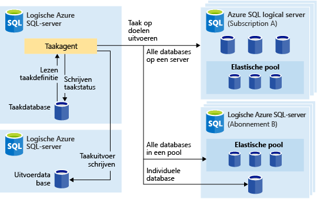
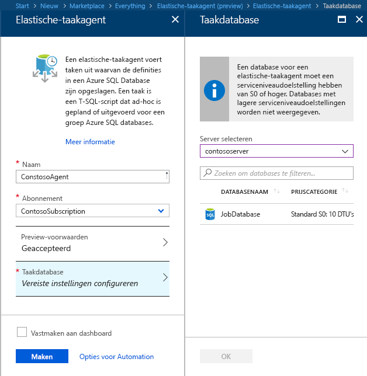
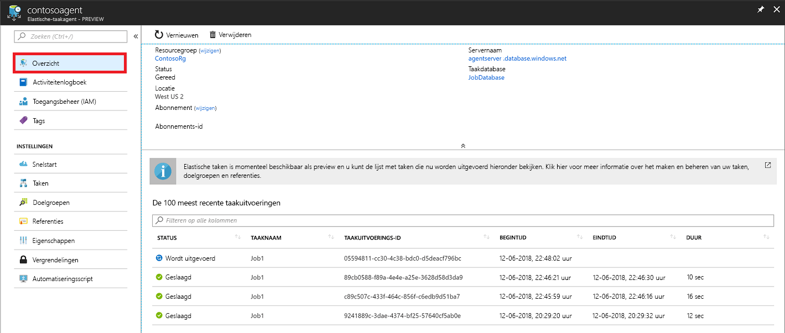
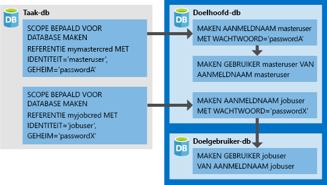

# <a name="manage-groups-of-databases-with-elastic-database-jobs"></a>Groepen van databases beheren met Taken voor Elastic Database

**Taken voor Elastic Database** bieden de mogelijkheid om een of meer T-SQL-scripts parallel in een groot aantal databases uit te voeren volgens een schema of op aanvraag.

**Taken uitvoeren voor een willekeurige combinatie van databases**: een of meer afzonderlijke databases, alle databases op een server, alle databases in een elastische pool of shardkaart, met de extra flexibiliteit om specifieke database al dan niet op te nemen. **Taken kunnen worden uitgevoerd op meerdere servers en meerdere pools, en kunnen zelfs worden uitgevoerd voor databases in verschillende abonnementen.** Servers en pools worden dynamisch opgesomd tijdens runtime, zodat taken worden uitgevoerd voor alle databases die op het moment van de uitvoering in de doelgroep aanwezig zijn.

De volgende afbeelding toont hoe een taakagent taken uitvoert op verschillende soorten doelgroepen:




## <a name="why-use-elastic-jobs"></a>Waarom elastische taken gebruiken?

### <a name="manage-many-databases"></a>Veel databases beheren

- Plan beheertaken die elke weekdag, na kantooruren enzovoort, moeten worden uitgevoerd.
- Implementeer schemawijzigingen, referentiebeheer, het verzamelen van prestatiegegevens of telemetrie van tenant (klant). Werk referentiegegevens (algemene informatie voor alle databases) bij.
- Bouw indexen opnieuw om queryprestaties te verbeteren. Configureer taken die op terugkerende basis, bijvoorbeeld tijdens daluren, moeten worden uitgevoerd.
- Verzamel op continue basis queryresultaten uit een reeks databases in een centrale tabel. Prestatiequery's kunnen voortdurend worden uitgevoerd en geconfigureerd om de uitvoering van aanvullende taken te activeren.

### <a name="collect-data-for-reporting"></a>Gegevens verzamelen voor rapportage

- Verzamel gegevens uit een verzameling Azure SQL-databases in één doeltabel.
- Voer langer durende gegevensverwerkingsquery's uit voor groot aantal databases, zoals het verzamelen van klanttelemetrie. Resultaten worden in één doeltabel verzameld voor verdere analyse.

### <a name="reduce-overhead"></a>Overhead verminderen

- Normaal gesproken moet u elke database apart verbinden om Transact-SQL-instructies of andere beheertaken te kunnen uitvoeren. Een taak handelt het aanmelden bij elke database in de doelgroep af. U definieert, onderhoudt en handhaaft Transact-SQL-scripts die in een groep van Azure SQL-databases moeten worden uitgevoerd.

### <a name="accounting"></a>Boekhouding

- Taken registreren de uitvoeringsstatus voor elke database. U krijgt automatische nieuwe pogingen in geval van mislukte pogingen.

### <a name="flexibility"></a>Flexibiliteit

- Definieer aangepaste groepen van Azure SQL-databases en definieer schema's voor het uitvoeren van een taak.


## <a name="elastic-job-components"></a>Onderdelen van een elastische taak

|Onderdeel  | Beschrijving (aanvullende gegevens onder de tabel) |
|---------|---------|
|[**Elastische-taakagent**](#elastic-job-agent) |  De Azure-resource die u maakt om taken uit te voeren en te beheren.   |
|[**Taakdatabase**](#job-database)    |    Een Azure SQL-database die de taakagent gebruikt om taakgerelateerde gegevens, taakdefinities, enzovoort op te slaan.      |
|[**Doelgroep**](#target-group)      |  De verzameling servers, pools, databases en shardkaarten waarvoor een taak moet worden uitgevoerd.       |
|[**Job**](#job)  |  Een taak is een werkeenheid die uit een of meer [taakstappen](#job-step) bestaat. Taakstappen bepalen welk T-SQL-script moet worden uitgevoerd en andere details die nodig zijn voor het uitvoeren van het script.  |


### <a name="elastic-job-agent"></a>Elastische-taakagent

Een elastische-taakagent is de Azure-resource voor het maken, uitvoeren en beheren van taken. De elastische-taakagent is een Azure-resource die u maakt in de portal ([PowerShell](elastic-jobs-powershell.md) en REST worden ook ondersteund). 

Voor het maken van een **elastische-taakagent** hebt u een bestaande SQL-database nodig. De agent configureert deze bestaande database als de [*taakdatabase*](#job-database).

De elastische-taakagent is gratis. De taakdatabase wordt tegen hetzelfde tarief gefactureerd als een SQL-database.

### <a name="job-database"></a>Taakdatabase

De *taakdatabase* wordt gebruikt voor het definiëren van taken en het bijhouden van de status en geschiedenis van taakuitvoeringen. De *taakdatabase* wordt ook gebruikt voor het opslaan van metagegevens van de agent, logboeken, resultaten en taakdefinities. De database bevat ook veel nuttige opgeslagen procedures en andere databaseobjecten voor het maken, uitvoeren en beheren van taken met T-SQL.

Voor de huidige preview is een bestaande Azure SQL-database (S0 of hoger) vereist om een elastische-taakagent te kunnen maken.

De *taakdatabase* hoeft niet letterlijk nieuw te zijn, maar het moet een schone, lege database op servicelaag S0 of hoger zijn. De aanbevolen servicelaag van de *taakdatabase* is S1 of hoger. Dit hangt echter af van de prestatiebehoeften van uw taken: het aantal taakstappen, het aantal keer en met welke frequentie de taken worden uitgevoerd. Zo is een S0-database misschien voldoende voor een taakagent die enkele taken per uur uitvoert, maar als een taak elke minuut moet worden uitgevoerd, presteert deze database misschien onvoldoende en is een hogere servicelaag misschien beter.


#### <a name="job-database-permissions"></a>Machtigingen voor taakdatabase

Tijdens het maken van een taakagent worden er een schema, tabellen en een rol met de naam *jobs_reader* gemaakt in de *taakdatabase*. De rol is gemaakt met de volgende machtigingen en is ontworpen om beheerders gedetailleerder toegangsbeheer te geven voor het bewaken van de taak:


|Rolnaam  |Machtigingen voor schema 'jobs'  |Machtigingen voor schema 'jobs_internal'  |
|---------|---------|---------|
|**jobs_reader**     |    SELECT     |    Geen     |

> [!IMPORTANT]
> Houd rekening met de beveiligingsaspecten voordat u iemand als een databasebeheerder toegang verleent tot de *taakdatabase*. Een kwaadwillende gebruiker met machtigingen voor het maken of bewerken van taken kan een taak die gebruikmaakt van een opgeslagen referentie maken of bewerken om verbinding te maken met een database onder het beheer van de kwaadwillende gebruiker. Op die manier kan de kwaadwillende gebruiker het wachtwoord van de referenties achterhalen.


### <a name="target-group"></a>Doelgroep

Een *doelgroep* definieert de verzameling databases waarvoor een taakstap wordt uitgevoerd. Een doelgroep kan een willekeurig aantal en een willekeurige combinatie van de volgende elementen bevatten:

- **Azure SQL-server**: als een server is opgegeven, maken alle databases die op het moment waarop de taak wordt uitgevoerd aanwezig zijn in de server deel uit van de groep. De referenties van de hoofddatabase moeten worden opgegeven zodat de groep kan worden opgesomd en worden bijgewerkt voordat de taak wordt uitgevoerd.
- **Elastische pool**: als een elastische groep is opgegeven, maken alle databases die zich op het moment dat de taak wordt uitgevoerd in de elastische groep bevinden, deel uit van de groep. Wat de server betreft, moeten de referenties van de hoofddatabase worden opgegeven zodat de groep kan worden bijgewerkt voordat de taak wordt uitgevoerd.
- **Individuele database**: geef een of meer afzonderlijke databases op als onderdeel van de groep.
- **Shardkaart**: databases van een shardkaart.

> [!TIP]
> Op het moment dat de taak wordt uitgevoerd, wordt de reeks databases in de doelgroepen die servers of pools bevatten, opnieuw geëvalueerd met behulp van *dynamische opsomming*. Dynamische opsomming zorgt ervoor dat **taken worden uitgevoerd voor alle databases die in de server of de groep bestaan op het moment dat de taak wordt uitgevoerd**. Een herevaluatie van de lijst met databases tijdens runtime is met name nuttig als het lidmaatschap van de pool of server regelmatig verandert.


Pools en individuele databases kunnen worden opgegeven als ingesloten in of uitgesloten van de groep. Zo kunt u een doelgroep maken met een willekeurige combinatie van databases. Zo kunt u bijvoorbeeld een server toevoegen aan een doelgroep, maar specifieke databases in een elastische pool uitsluiten van (of een hele pool uitsluiten).

Een doelgroep kan databases in meerdere abonnementen en uit meerdere regio's bevatten. Regio-overschrijdende uitvoeringen hebben echter wel een hogere latentie dan uitvoeringen binnen dezelfde regio.


### <a name="job"></a>Job

Een *taak* is een werkeenheid die wordt uitgevoerd volgens een schema of als een eenmalige taak. Een taak bestaat uit een of meer *taakstappen*.

#### <a name="job-step"></a>Taakstap

Elke taakstap bevat een uit te voeren T-SQL-script, een of meer doelgroepen waarvoor het T-SQL-script moet worden uitgevoerd en de referenties die de agent nodig heeft om verbinding te maken met de doeldatabase. Elke taakstap heeft een instelbaar beleid voor time-out en nieuwe pogingen, en kan optioneel uitvoerparameters bevatten.

#### <a name="job-output"></a>Taakuitvoer

Het resultaat van de stappen van een taak op elke doeldatabase worden gedetailleerd geregistreerd en scriptuitvoer kan worden vastgelegd in een opgegeven tabel. U kunt een database opgeven om de resultaatgegevens van een taak vast te leggen.

#### <a name="job-history"></a>Jobgeschiedenis

De taakgeschiedenis wordt opgeslagen in de *taakdatabase*. Met een systeemopschoontaak wordt uitvoergeschiedenis verwijderd die ouder is dan 45 dagen. Als u geschiedenis wilt verwijderen die nog geen 45 dagen oud is, roept u de procedure **sp_purge_history** in de *taakdatabase* aan.

## <a name="workflow-to-create-configure-and-manage-jobs"></a>Werkstroom voor het maken, configureren en beheren van taken

### <a name="create-and-configure-the-agent"></a>De agent maken en configureren

1. Maak of identificeer een lege SQL-database op servicelaag S0 of hoger. Deze wordt tijdens het maken van de elastische-taakagent als de *taakdatabase* gebruikt.
2. Maak een elastische-taakagent in de [portal](https://portal.azure.com/#create/Microsoft.SQLElasticJobAgent) of met [PowerShell](elastic-jobs-powershell.md#create-the-elastic-job-agent).

   

### <a name="create-run-and-manage-jobs"></a>Taken maken, uitvoeren en beheren

1. Maak een referentie voor taakuitvoering in de *taakdatabase* met [PowerShell](elastic-jobs-powershell.md#create-job-credentials-so-that-jobs-can-execute-scripts-on-its-targets) of [T-SQL](elastic-jobs-tsql.md#create-a-credential-for-job-execution).
2. Definieer de doelgroep (de databases waarvoor u de taak wilt uitvoeren) met behulp van [PowerShell](elastic-jobs-powershell.md#define-the-target-databases-you-want-to-run-the-job-against) of [T-SQL](elastic-jobs-tsql.md#create-a-target-group-servers).
3. Maak een taakagentreferentie in elke database waarin de taak wordt uitgevoerd [(voeg de gebruiker (of rol) toe aan elke database in de groep)](https://docs.microsoft.com/azure/sql-database/sql-database-control-access). Zie de [PowerShell-zelfstudie](elastic-jobs-powershell.md#create-job-credentials-so-that-jobs-can-execute-scripts-on-its-targets) voor een voorbeeld.
4. Maak een taak met [PowerShell](elastic-jobs-powershell.md#create-a-job) of [T-SQL](elastic-jobs-tsql.md#deploy-new-schema-to-many-databases).
5. Voeg taakstappen toe met [PowerShell](elastic-jobs-powershell.md#create-a-job-step) of [T-SQL](elastic-jobs-tsql.md#deploy-new-schema-to-many-databases).
6. Voer een taak uit met [PowerShell](elastic-jobs-powershell.md#run-the-job) of [T-SQL](elastic-jobs-tsql.md#begin-ad-hoc-execution-of-a-job).
7. Bewaak de uitvoeringsstatus van de taak met de portal, [PowerShell](elastic-jobs-powershell.md#monitor-status-of-job-executions) of [T-SQL](elastic-jobs-tsql.md#monitor-job-execution-status).

   

## <a name="credentials-for-running-jobs"></a>Referenties voor het uitvoeren van taken

Taken gebruiken [databasereferenties](/sql/t-sql/statements/create-database-scoped-credential-transact-sql) om verbinding te maken met de databases die tijdens de uitvoering zijn opgegeven door de doelgroep. Als een doelgroep servers of pools bevat, worden deze databasereferenties gebruikt om verbinding te maken met de hoofddatabase en de beschikbare databases op te sommen.

Het instellen van de juiste referenties voor het uitvoeren van een taak kan enigszins verwarrend zijn. Houd daarom de volgende punten in gedachten:

- De databasereferenties moeten worden gemaakt in de *taakdatabase*.
- **Alle doeldatabases moeten een aanmelding met [voldoende machtigingen](https://docs.microsoft.com/sql/relational-databases/security/permissions-database-engine) hebben om de taak te kunnen voltooien**  (jobuser in onderstaand diagram).
- Referenties moeten binnen taken kunnen worden hergebruikt en de referentiewachtwoorden worden versleuteld en beveiligd tegen gebruikers die alleen-lezen toegang hebben tot taakobjecten.

De volgende afbeelding is gemaakt als hulp bij het begrijpen en instellen van de juiste taakreferenties. **Denk eraan dat de gebruiker moet worden gemaakt in elke database (alle *doelgebruikersdatabases*) waarin de taak moet worden uitgevoerd**.



## <a name="security-best-practices"></a>Aanbevolen procedures voor beveiliging

Een paar aandachtspunten voor best practices voor het werken met elastische taken:

- Beperk het gebruik van de API's tot vertrouwde personen.
- Referenties moeten slechts de minimale bevoegdheden hebben die nodig zijn om de taakstap uit te voeren. Zie [Authorization and Permissions SQL Server](https://docs.microsoft.com/dotnet/framework/data/adonet/sql/authorization-and-permissions-in-sql-server) (Autorisatie en machtigingen voor SQL Server) voor meer informatie.
- Wanneer u een server en/of pool als lid van de doelgroep gebruikt, wordt het ten zeerste aanbevolen om een aparte referentie te maken met rechten voor de hoofddatabase om databases weer te geven/op te sommen die worden gebruikt om de databaselijsten van de server(s) en/of pool(s) uit te vouwen voordat de taak wordt uitgevoerd.


## <a name="agent-performance-capacity-and-limitations"></a>Agentprestaties, - capaciteit en -beperkingen

Elastische taken gebruiken minimale rekenresources tijdens het wachten tot langlopende taken zijn voltooid.

Afhankelijk van de grootte van de doelgroep van databases en de gewenste uitvoeringstijd voor een taak (aantal gelijktijdige werkrollen), vraagt de agent meer of minder rekenkracht en prestaties van de *taakdatabase* (hoe meer doelen en taken, hoe hoger de vereiste hoeveelheid rekenkracht).

Op dit moment is de preview beperkt tot 100 gelijktijdige taken.

### <a name="prevent-jobs-from-reducing-target-database-performance"></a>Voorkomen dat taken de prestaties van de doeldatabase doen afnemen

Om ervoor te zorgen dat resources niet worden overbelast tijdens het uitvoeren van taken voor databases in een elastische SQL-pool, kunnen taken zo worden geconfigureerd dat het aantal databases waarvoor een taak tegelijkertijd wordt uitgevoerd, wordt beperkt.

##  <a name="differences-between-elastic-jobs-and-sql-server-agent"></a>Verschillen tussen elastische taken en SQL Server Agent

Hier volgen enkele noemenswaardige verschillen tussen SQL Server Agent (on-premises beschikbaar en als onderdeel van SQL Database Managed Instance) en de elastische-taakagent van Azure SQL Database (nu beschikbaar voor SQL Database en SQL Data Warehouse).


|  |Elastische taken  |SQL Server Agent |
|---------|---------|---------|
|Bereik     |  Een willekeurig aantal Azure SQL Databases en/of datawarehouses in dezelfde Azure-cloud als de taakagent. Doelen kunnen zich op verschillende logische servers en in verschillende abonnementen en/of regio's bevinden. <br><br>Doelgroepen kunnen bestaan uit afzonderlijke databases of datawarehouses of alle databases in een server, pool, shardkaart (dynamisch opgesomd tijdens runtime van taak). | Een individuele database in hetzelfde SQL Server-exemplaar als de SQL agent. |
|Ondersteunde API's en hulpprogramma's     |  Portal, PowerShell, T-SQL, Azure Resource Manager      |   T-SQL, SQL Server Management Studio (SSMS)     |


## <a name="best-practices-for-creating-jobs"></a>Best practices voor het maken van taken

### <a name="idempotent-scripts"></a>Idempotente scripts
De T-SQL-scripts van een taak moeten [idempotent](https://en.wikipedia.org/wiki/Idempotence) zijn. **Idempotent** betekent dat de resultaten van een geslaagd script hetzelfde zijn wanneer dit script opnieuw wordt uitgevoerd. Een script kan mislukken door tijdelijke netwerkproblemen. In dat geval wordt automatisch een vooraf ingesteld aantal keer opnieuw geprobeerd om de taak uit te voeren alvorens het wordt afgebroken. Een idempotent script heeft hetzelfde resultaat, zelfs als het twee keer (of vaker) wordt uitgevoerd.

Een eenvoudige tactiek is te testen of een object bestaat voordat u het maakt.


```sql
IF NOT EXIST (some_object)
    -- Create the object
    -- If it exists, drop the object before recreating it.
```

Op dezelfde manier moet een script met succes kunnen worden uitgevoerd door logisch te testen op problemen en hierop te reageren.


## <a name="next-steps"></a>Volgende stappen

- [Elastische taken maken en beheren met PowerShell](elastic-jobs-powershell.md)
- [Elastische taken maken en beheren met Transact-SQL (T-SQL)](elastic-jobs-tsql.md)