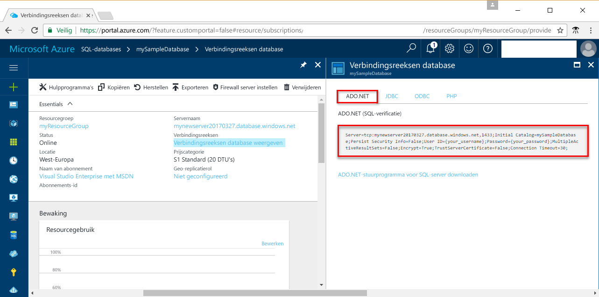

# <a name="use-net-core-c-to-query-an-azure-sql-database"></a>.NET Core (C#) gebruiken om een query uit te voeren voor een Azure SQL-database

In deze beknopte zelfstudie wordt gedemonstreerd hoe u [.NET Core](https://www.microsoft.com/net/) gebruikt in Windows/Linux/macOS om een C#-programma te maken dat verbinding maakt met een Azure SQL-database, en hoe u Transact-SQL-instructies gebruikt om een query uit te voeren voor de gegevens.

## <a name="prerequisites"></a>Vereisten

Zorg ervoor dat u over het volgende beschikt om deze beknopte zelfstudie te voltooien:

[!INCLUDE [prerequisites-create-db](../../includes/sql-database-connect-query-prerequisites-create-db-includes.md)]

- Een [firewallregel op serverniveau](sql-database-get-started-portal.md#create-a-server-level-firewall-rule) voor het openbare IP-adres van de computer die u gebruikt voor deze beknopte zelfstudie.

- U hebt [.NET Core voor uw besturingssysteem](https://www.microsoft.com/net/core) geïnstalleerd. 

## <a name="sql-server-connection-information"></a>SQL Server-verbindingsgegevens

[!INCLUDE [prerequisites-server-connection-info](../../includes/sql-database-connect-query-prerequisites-server-connection-info-includes.md)]

#### <a name="for-adonet"></a>Voor ADO.NET

1. Ga verder door op **Databaseverbindingsreeksen tonen** te klikken.

2. Bekijk de volledige **ADO.NET**-verbindingsreeks.

    

> [!IMPORTANT]
> U moet een firewallregel hebben ingesteld voor het openbare IP-adres van de computer waarop u deze zelfstudie uitvoert. Als u een andere computer gebruikt of een ander openbaar IP-adres hebt, maakt u een [firewallregel op serverniveau met behulp van Azure Portal](sql-database-get-started-portal.md#create-a-server-level-firewall-rule). 
>
  
## <a name="create-a-new-net-project"></a>Een nieuw .NET-project maken

1. Open een opdrachtprompt en maak een map met de naam *sqltest*. Navigeer naar de map die u hebt gemaakt, en voer de volgende opdracht uit:

    ```
    dotnet new console
    ```

2. Open ***sqltest.csproj*** met uw favoriete teksteditor en voeg System.Data.SqlClient als een afhankelijkheid met de volgende code toe:

    ```xml
    <ItemGroup>
        <PackageReference Include="System.Data.SqlClient" Version="4.4.0" />
    </ItemGroup>
    ```

## <a name="insert-code-to-query-sql-database"></a>Code invoegen om een query uit te voeren voor een SQL-database

1. Open **Program.cs** in uw ontwikkelomgeving of favoriete teksteditor.

2. Vervang de inhoud door de volgende code en voeg de juiste waarden toe voor de server, de database, de gebruiker en het wachtwoord.

```csharp
using System;
using System.Data.SqlClient;
using System.Text;

namespace sqltest
{
    class Program
    {
        static void Main(string[] args)
        {
            try 
            { 
                SqlConnectionStringBuilder builder = new SqlConnectionStringBuilder();
                builder.DataSource = "your_server.database.windows.net"; 
                builder.UserID = "your_user";            
                builder.Password = "your_password";     
                builder.InitialCatalog = "your_database";

                using (SqlConnection connection = new SqlConnection(builder.ConnectionString))
                {
                    Console.WriteLine("\nQuery data example:");
                    Console.WriteLine("=========================================\n");
                    
                    connection.Open();       
                    StringBuilder sb = new StringBuilder();
                    sb.Append("SELECT TOP 20 pc.Name as CategoryName, p.name as ProductName ");
                    sb.Append("FROM [SalesLT].[ProductCategory] pc ");
                    sb.Append("JOIN [SalesLT].[Product] p ");
                    sb.Append("ON pc.productcategoryid = p.productcategoryid;");
                    String sql = sb.ToString();

                    using (SqlCommand command = new SqlCommand(sql, connection))
                    {
                        using (SqlDataReader reader = command.ExecuteReader())
                        {
                            while (reader.Read())
                            {
                                Console.WriteLine("{0} {1}", reader.GetString(0), reader.GetString(1));
                            }
                        }
                    }                    
                }
            }
            catch (SqlException e)
            {
                Console.WriteLine(e.ToString());
            }
            Console.ReadLine();
        }
    }
}
```

## <a name="run-the-code"></a>De code uitvoeren

1. Voer bij de opdrachtprompt de volgende opdrachten uit:

   ```csharp
   dotnet restore
   dotnet run
   ```

2. Controleer of de bovenste 20 rijen worden geretourneerd, en sluit vervolgens het toepassingsvenster.


## <a name="next-steps"></a>Volgende stappen

- [Aan de slag met .NET Core in Windows/Linux/macOS met behulp van de opdrachtregel ](/dotnet/core/tutorials/using-with-xplat-cli).
- Meer informatie over [verbinding maken met en een query uitvoeren voor een Azure SQL-database met behulp van het .NET Framework en Visual Studio](sql-database-connect-query-dotnet-visual-studio.md).  
- Meer informatie over [Uw eerste Azure SQL-database ontwerpen met behulp van SSMS](sql-database-design-first-database.md) of [Uw eerste Azure SQL-database ontwerpen met behulp van .NET](sql-database-design-first-database-csharp.md).
- Raadpleeg de [.NET-documentatie](https://docs.microsoft.com/dotnet/) voor meer informatie over .NET.
