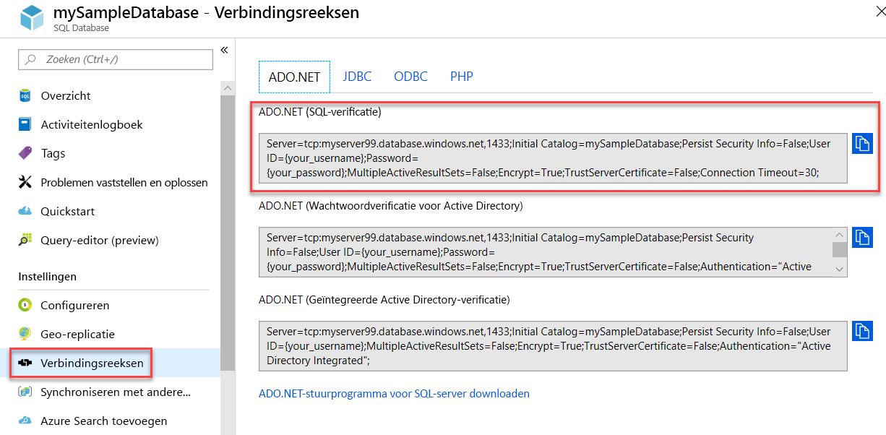

# <a name="quickstart-use-net-core-c-to-query-an-azure-sql-database"></a>Snelstartgids: .NET Core (C#) gebruiken om een query uit te voeren voor een Azure SQL-database

In deze snelstartgids wordt beschreven hoe u met [.NET Core](https://www.microsoft.com/net/) en C#-code verbinding maakt met een Azure SQL-database en een Transact-SQL-instructie toepast om een query uit te voeren voor de gegevens.

## <a name="prerequisites"></a>Vereisten

Voor deze zelfstudie hebt u het volgende nodig:

[!INCLUDE [prerequisites-create-db](../../includes/sql-database-connect-query-prerequisites-create-db-includes.md)]

- [Een firewallregel op serverniveau](sql-database-get-started-portal-firewall.md) voor het openbare IP-adres van uw computer.

- [.NET Core voor uw besturingssysteem](https://www.microsoft.com/net/core) moet zijn geïnstalleerd. 

> [!NOTE]
> In deze snelstartgids wordt gebruik gemaakt van de *mySampleDatabase*-database. Als u een andere database wilt gebruiken, moet u de databaseverwijzingen wijzigen en de `SELECT`-query aanpassen in de C#-code.


## <a name="get-sql-server-connection-information"></a>SQL Server-verbindingsgegevens ophalen

[!INCLUDE [prerequisites-server-connection-info](../../includes/sql-database-connect-query-prerequisites-server-connection-info-includes.md)]

#### <a name="get-adonet-connection-information-optional"></a>ADO.NET-verbindingsgegevens ophalen (optioneel)

1. Navigeer naar de pagina **mySampleDatabase** en selecteer vervolgens onder **Instellingen** de optie **Verbindingsreeksen**.

2. Bekijk de volledige **ADO.NET**-verbindingsreeks.

    

3. Kopieer de **ADO.NET**-verbindingsreeks als u van plan bent om deze te gebruiken.
  
## <a name="create-a-new-net-core-project"></a>Een nieuw .NET Core-project maken

1. Open een opdrachtprompt en maak een map met de naam **sqltest**. Navigeer naar deze map en voer de volgende opdracht uit.

    ```cmd
    dotnet new console
    ```
    Hiermee maakt u nieuwe app-projectbestanden, waaronder een eerste C#-codebestand (**Program.cs**), een XML-configuratiebestand (**sqltest.csproj**) en de benodigde binaire bestanden.

2. Open **sqltest.csproj** in een teksteditor en plak de volgende XML-code tussen de `<Project>`-tags. Hiermee voegt u `System.Data.SqlClient` toe als een afhankelijkheid.

    ```xml
    <ItemGroup>
        <PackageReference Include="System.Data.SqlClient" Version="4.6.0" />
    </ItemGroup>
    ```

## <a name="insert-code-to-query-sql-database"></a>Code invoegen om een query uit te voeren voor een SQL-database

1. Open **Program.cs** in een teksteditor.

2. Vervang de inhoud door de volgende code en voeg de juiste waarden toe voor de server, de database, de gebruikersnaam en het wachtwoord.

> [!NOTE]
> Als u een ADO.NET-verbindingsreeks wilt gebruiken, vervangt u de vier regels in de code waarmee de server, de database, de gebruikersnaam en het wachtwoord worden ingesteld door de onderstaande regel. Stel in de verbindingsreeks uw gebruikersnaam en wachtwoord in.
>
>    `builder.ConnectionString="<your_ado_net_connection_string>";`

```csharp
using System;
using System.Data.SqlClient;
using System.Text;

namespace sqltest
{
    class Program
    {
        static void Main(string[] args)
        {
            try 
            { 
                SqlConnectionStringBuilder builder = new SqlConnectionStringBuilder();

                builder.DataSource = "<your_server.database.windows.net>"; 
                builder.UserID = "<your_username>";            
                builder.Password = "<your_password>";     
                builder.InitialCatalog = "<your_database>";
         
                using (SqlConnection connection = new SqlConnection(builder.ConnectionString))
                {
                    Console.WriteLine("\nQuery data example:");
                    Console.WriteLine("=========================================\n");
                    
                    connection.Open();       
                    StringBuilder sb = new StringBuilder();
                    sb.Append("SELECT TOP 20 pc.Name as CategoryName, p.name as ProductName ");
                    sb.Append("FROM [SalesLT].[ProductCategory] pc ");
                    sb.Append("JOIN [SalesLT].[Product] p ");
                    sb.Append("ON pc.productcategoryid = p.productcategoryid;");
                    String sql = sb.ToString();

                    using (SqlCommand command = new SqlCommand(sql, connection))
                    {
                        using (SqlDataReader reader = command.ExecuteReader())
                        {
                            while (reader.Read())
                            {
                                Console.WriteLine("{0} {1}", reader.GetString(0), reader.GetString(1));
                            }
                        }
                    }                    
                }
            }
            catch (SqlException e)
            {
                Console.WriteLine(e.ToString());
            }
            Console.WriteLine("\nDone. Press enter.");
            Console.ReadLine(); 
        }
    }
}
```

## <a name="run-the-code"></a>De code uitvoeren

1. Voer in de prompt de volgende opdrachten uit.

   ```cmd
   dotnet restore
   dotnet run
   ```

2. Controleer of de bovenste twintig rijen worden geretourneerd.

   ```text
   Query data example:
   =========================================

   Road Frames HL Road Frame - Black, 58
   Road Frames HL Road Frame - Red, 58
   Helmets Sport-100 Helmet, Red
   Helmets Sport-100 Helmet, Black
   Socks Mountain Bike Socks, M
   Socks Mountain Bike Socks, L
   Helmets Sport-100 Helmet, Blue
   Caps AWC Logo Cap
   Jerseys Long-Sleeve Logo Jersey, S
   Jerseys Long-Sleeve Logo Jersey, M
   Jerseys Long-Sleeve Logo Jersey, L
   Jerseys Long-Sleeve Logo Jersey, XL
   Road Frames HL Road Frame - Red, 62
   Road Frames HL Road Frame - Red, 44
   Road Frames HL Road Frame - Red, 48
   Road Frames HL Road Frame - Red, 52
   Road Frames HL Road Frame - Red, 56
   Road Frames LL Road Frame - Black, 58
   Road Frames LL Road Frame - Black, 60
   Road Frames LL Road Frame - Black, 62

   Done. Press enter.
   ```
3. Druk op **Enter** om het toepassingsvenster te sluiten.

## <a name="next-steps"></a>Volgende stappen

- [Aan de slag met .NET Core in Windows/Linux/macOS met behulp van de opdrachtregel ](/dotnet/core/tutorials/using-with-xplat-cli).
- Meer informatie over [verbinding maken met en een query uitvoeren voor een Azure SQL-database met behulp van het .NET Framework en Visual Studio](sql-database-connect-query-dotnet-visual-studio.md).  
- Meer informatie over [Uw eerste Azure SQL-database ontwerpen met behulp van SSMS](sql-database-design-first-database.md) of [Een Azure SQL-database ontwerpen en hiermee verbinding maken met behulp van C# en ADO.NET](sql-database-design-first-database-csharp.md).
- Raadpleeg de [.NET-documentatie](https://docs.microsoft.com/dotnet/) voor meer informatie over .NET.
