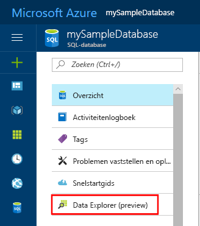
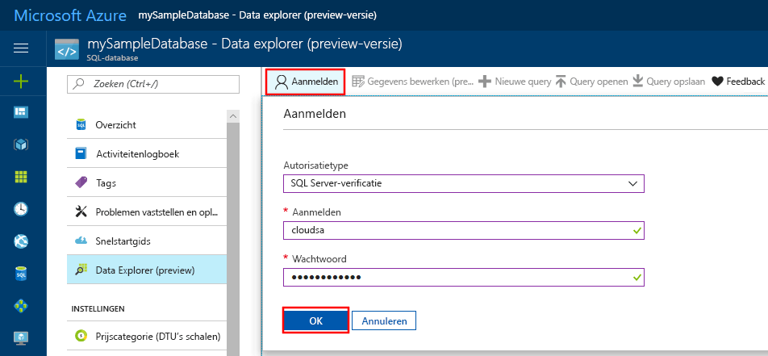

# <a name="azure-portal-use-the-sql-query-editor-to-connect-and-query-data"></a>Azure Portal: de SQL-queryeditor gebruiken om verbinding te maken en query's op gegevens uit te voeren

De SQL-queryeditor is een hulpprogramma voor het uitvoeren van query's in de browser waarmee u op een efficiënte en eenvoudige manier SQL-query's kunt uitvoeren op uw Azure SQL-database of Azure SQL Data Warehouse zonder Azure Portal te verlaten. In deze snelstartgids ziet u hoe u de queryeditor gebruikt om verbinding te maken met een SQL-database en vervolgens Transact-SQL-instructies gebruikt om gegevens in de database te zoeken, in te voegen, bij te werken en te verwijderen.

## <a name="prerequisites"></a>Vereisten

In deze Quick Start wordt uitgegaan van de resources die u hebt gemaakt in een van deze Quick Starts:

[!INCLUDE [prerequisites-create-db](../../includes/sql-database-connect-query-prerequisites-create-db-includes.md)]

## <a name="log-in-to-the-azure-portal"></a>Aanmelden bij Azure Portal

Meld u aan bij [Azure Portal](https://portal.azure.com/).


## <a name="connect-using-sql-authentication"></a>Verbinding maken met behulp van SQL-verificatie
> [!NOTE]
> Zorg ervoor dat de optie Toegang tot Azure-services toestaan is ingesteld op 'AAN' in de firewall-instellingen van SQL Server. Met deze optie geeft de SQL-queryeditor toegang tot uw databases en datawarehouses.

1. Klik in het linkermenu op **SQL-database** en vervolgens op de database waarop u een query wilt uitvoeren.

2. Ga op de SQL Database-pagina voor uw database in het linkermenu naar **Data Explorer (preview)** en klik hierop.

    

3. Klik op **Aanmelden** en selecteer **SQL Server-verificatie** wanneer hierom wordt gevraagd. Geef vervolgens de gebruikersnaam en het wachtwoord van de serverbeheerder op die u hebt opgegeven toen u de database hebt gemaakt.

    

4. Klik op **OK** om u aan te melden.


## <a name="connect-using-azure-ad"></a>Verbinding maken met behulp van Azure AD

Als u een Active Directory-beheerder instelt, kunt u gebruikmaken van één identiteit om u aan te melden bij Azure Portal en uw SQL-database. Volg onderstaande stappen voor het configureren van een Active Directory-beheerder voor de SQL-server die u hebt gemaakt.

> [!NOTE]
> E-mailaccounts (bijvoorbeeld outlook.com, hotmail.com, live.com, gmail.com, yahoo.com) worden nog niet ondersteund als Active Directory-beheerders. Kies een gebruiker die ofwel in het systeem zelf in Azure Active Directory is gemaakt, ofwel gefedereerd in Azure Active Directory.

1. Selecteer **SQL-servers** in het linkermenu en selecteer uw SQL-server in de lijst met servers.

2. Selecteer de instelling **Active Directory-beheerder** in het menu Instellingen van de SQL-server.

3. Klik in de blade Active Directory-beheerder op de opdracht **Beheerder instellen** en selecteer de gebruiker of groep die als Active Directory-beheerder fungeert.

    

4. Klik bovenaan de blade Active Directory-beheerder op de opdracht **Opslaan** om de Active Directory-beheerder in te stellen.

Navigeer naar de SQL-database waarin u wilt zoeken, en klik in het linkermenu op **Data Explorer (preview)**. De pagina Data Explorer wordt geopend en er wordt automatisch verbinding gemaakt met de database.


## <a name="run-query-using-query-editor"></a>Query's uitvoeren met de queryeditor

Nadat u bent geverifieerd, typt u de volgende query in het deelvenster van de queryeditor om een query op categorie uit te voeren op de belangrijkste twintig producten.

```sql
 SELECT TOP 20 pc.Name as CategoryName, p.name as ProductName
 FROM SalesLT.ProductCategory pc
 JOIN SalesLT.Product p
 ON pc.productcategoryid = p.productcategoryid;
```

Klik op **Uitvoeren** en bekijk de resultaten van de query in het deelvenster **Resultaten**.


## <a name="insert-data-using-query-editor"></a>Gegevens invoegen met de queryeditor

Gebruik de volgende code om een nieuw product in te voegen in de tabel SalesLT.Product. Gebruik de Transact-SQL-instructie [INSERT](https://msdn.microsoft.com/library/ms174335.aspx).

1. Vervang in het queryvenster de vorige query door de volgende query:

   ```sql
   INSERT INTO [SalesLT].[Product]
           ( [Name]
           , [ProductNumber]
           , [Color]
           , [ProductCategoryID]
           , [StandardCost]
           , [ListPrice]
           , [SellStartDate]
           )
     VALUES
           ('myNewProduct'
           ,123456789
           ,'NewColor'
           ,1
           ,100
           ,100
           ,GETDATE() );
   ```

2. Klik in de werkbalk op **Uitvoeren** om een nieuwe rij in te voegen in de tabel Product.

## <a name="update-data-using-query-editor"></a>Gegevens bijwerken met de queryeditor

Gebruik de volgende code om het nieuwe product bij te werken dat u eerder hebt toegevoegd. Gebruik de Transact-SQL-instructie [UPDATE](https://msdn.microsoft.com/library/ms177523.aspx).

1. Vervang in het queryvenster de vorige query door de volgende query:

   ```sql
   UPDATE [SalesLT].[Product]
   SET [ListPrice] = 125
   WHERE Name = 'myNewProduct';
   ```

2. Klik in de werkbalk op **Uitvoeren** om de opgegeven rij in de tabel Product bij te werken.

## <a name="delete-data-using-query-editor"></a>Gegevens verwijderen met de queryeditor

Gebruik de volgende code om het nieuwe product te verwijderen dat u eerder hebt toegevoegd. Gebruik de Transact-SQL-instructie [DELETE](https://msdn.microsoft.com/library/ms189835.aspx).

1. Vervang in het queryvenster de vorige query door de volgende query:

   ```sql
   DELETE FROM [SalesLT].[Product]
   WHERE Name = 'myNewProduct';
   ```

2. Klik in de werkbalk op **Uitvoeren** om de opgegeven rij in de tabel Product te verwijderen.


## <a name="query-editor-considerations"></a>Overwegingen bij queryeditor

U moet enkele dingen weten voordat u met de queryeditor gaat werken terwijl deze de status Preview heeft:

1. Zorg ervoor dat de optie Toegang tot Azure-services toestaan is ingesteld op 'AAN' in de firewall-instellingen van Azure SQL Server. Met deze optie geeft de SQL-queryeditor toegang tot uw SQL-databases en datawarehouses.

2. Het aanmelden bij Azure Active Directory Administrator-beheerders werkt niet met accounts waarvoor tweeledige authenticatie is ingeschakeld.

3. E-mailaccounts (bijvoorbeeld outlook.com, hotmail.com, live.com, gmail.com, yahoo.com) worden nog niet ondersteund als Active Directory-beheerders. Kies een gebruiker die ofwel in het systeem zelf in Azure Active Directory is gemaakt, ofwel gefedereerd in Azure Active Directory

4. Query's op ruimtelijke gegevenstypen worden nog niet ondersteund in de queryeditor. Het uitvoeren van query's op ruimtelijke kolommen leidt tot de fout System.IO.FileNotFoundException.

5. Er is geen ondersteuning voor IntelliSense voor databasetabellen en -views. Het automatisch aanvullen van namen die al eerder zijn getypt, wordt wel ondersteund.

6. Door op de F5-toets te drukken, wordt de pagina Queryeditor vernieuwd en wordt de query waaraan wordt gewerkt, beëindigd. U kunt de knop Uitvoeren op de werkbalk gebruiken om query's uit te voeren.


## <a name="next-steps"></a>Volgende stappen

- Zie [Transact-SQL-verschillen tijdens in SQL Database oplossen](sql-database-transact-sql-information.md) voor informatie over Transact-SQL die in Azure SQL-databases wordt ondersteund.
