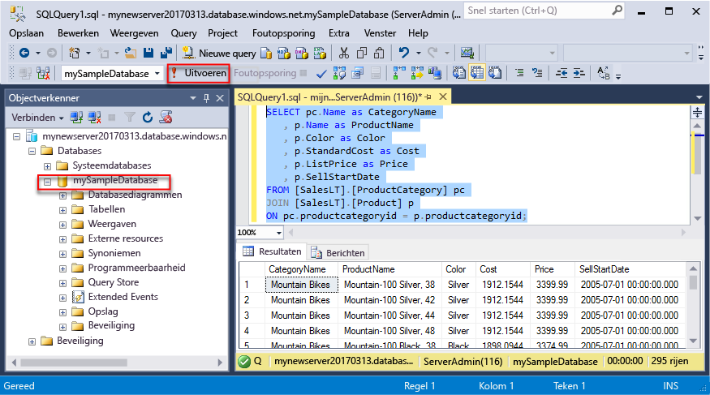
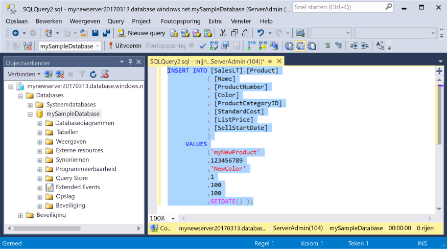
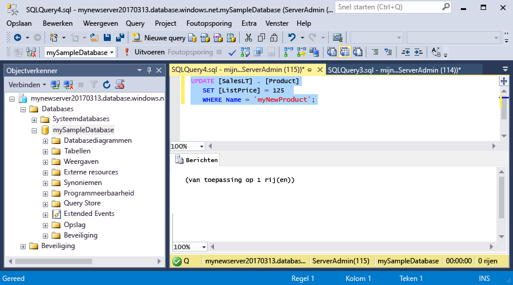
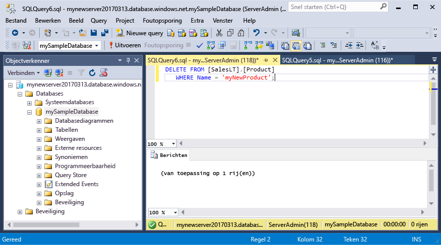

# <a name="azure-sql-database-use-sql-server-management-studio-to-connect-and-query-data"></a>Azure SQL Database: SQL Server Management Studio gebruiken om verbinding te maken en query's uit te voeren voor gegevens

[SSMS][ssms-install-latest-84g] (SQL Server Management Studio) is een geïntegreerde omgeving voor het beheren van een SQL-infrastructuur, van SQL Server tot SQL Database voor Microsoft Windows. In deze Quick Start ziet u hoe u SSMS gebruikt om verbinding te maken met een Azure SQL-database en vervolgens Transact-SQL-instructies gebruikt om gegevens in de database te zoeken, in te voegen, bij te werken en te verwijderen. 

## <a name="prerequisites"></a>Vereisten

In deze Quick Start wordt uitgegaan van de resources die u hebt gemaakt in een van deze Quick Starts:

[!INCLUDE [prerequisites-create-db](../../includes/sql-database-connect-query-prerequisites-create-db-includes.md)]

#### <a name="install-the-latest-ssms"></a>De nieuwste SSMS installeren

Voordat u begint, zorgt u ervoor dat u de nieuwste versie van [SSMS][ssms-install-latest-84g] hebt geïnstalleerd. 

## <a name="sql-server-connection-information"></a>SQL Server-verbindingsgegevens

[!INCLUDE [prerequisites-server-connection-info](../../includes/sql-database-connect-query-prerequisites-server-connection-info-includes.md)]

## <a name="connect-to-your-database"></a>Verbinding maken met uw database

Gebruik SQL Server Management Studio om verbinding te maken met uw Azure SQL Database-server. 

> [!IMPORTANT]
> Een logische Azure SQL Database-server luistert naar poort 1433. Als u vanachter een bedrijfsfirewall probeert verbinding te maken met een logische Azure SQL Database-server, moet deze poort in de bedrijfsfirewall zijn geopend om verbinding te kunnen maken.
>

1. Open SQL Server Management Studio.

2. Voer in het dialoogvenster **Verbinding maken met server** de volgende informatie in:

   | Instelling      | Voorgestelde waarde    | Beschrijving | 
   | ------------ | ------------------ | ----------- | 
   | **Servertype** | Database-engine | Deze waarde is verplicht. |
   | **Servernaam** | De volledig gekwalificeerde servernaam | De naam moet er ongeveer als volgt uitzien: **mijnnieuweserver20170313.database.windows.net**. |
   | **Verificatie** | SQL Server-verificatie | SQL-verificatie is het enige verificatietype dat we in deze zelfstudie hebben geconfigureerd. |
   | **Aanmelding** | Het beheerdersaccount voor de server | Dit is het account dat u hebt opgegeven tijdens het maken van de server. |
   | **Wachtwoord** | Het wachtwoord voor het beheerdersaccount voor de server | Dit is het wachtwoord dat u hebt opgegeven tijdens het maken van de server. |
   ||||

     

3. Klik op **Opties** in het dialoogvenster **Verbinding maken met server**. Voer in de sectie **Verbinding maken met database** **mySampleDatabase** in om verbinding te maken met deze database.

     

4. Klik op **Verbinden**. Het venster Objectverkenner wordt geopend in SSMS. 

     

5. In Objectverkenner vouwt u **Databases** en daarna **mySampleDatabase** uit om de objecten in de voorbeelddatabase weer te geven.

## <a name="query-data"></a>Querygegevens

Gebruik de volgende code om op categorie een query uit te voeren voor de 20 populairste producten. Gebruik de Transact-SQL-instructie [SELECT](https://msdn.microsoft.com/library/ms189499.aspx).

1. Klik in Objectverkenner met de rechtermuisknop op **mySampleDatabase** en klik vervolgens op **Nieuwe query**. Er wordt een leeg queryvenster geopend dat is verbonden met uw database.
2. Voer de volgende query in het queryvenster in:

   ```sql
   SELECT pc.Name as CategoryName, p.name as ProductName
   FROM [SalesLT].[ProductCategory] pc
   JOIN [SalesLT].[Product] p
   ON pc.productcategoryid = p.productcategoryid;
   ```

3. Klik in de werkbalk op **Uitvoeren** om gegevens op te halen uit de tabellen Product en ProductCategory.

    

## <a name="insert-data"></a>Gegevens invoegen

Gebruik de volgende code om een nieuw product in te voegen in de tabel SalesLT.Product. Gebruik de Transact-SQL-instructie [INSERT](https://msdn.microsoft.com/library/ms174335.aspx).

1. Vervang in het queryvenster de vorige query door de volgende query:

   ```sql
   INSERT INTO [SalesLT].[Product]
           ( [Name]
           , [ProductNumber]
           , [Color]
           , [ProductCategoryID]
           , [StandardCost]
           , [ListPrice]
           , [SellStartDate]
           )
     VALUES
           ('myNewProduct'
           ,123456789
           ,'NewColor'
           ,1
           ,100
           ,100
           ,GETDATE() );
   ```

2. Klik in de werkbalk op **Uitvoeren** om een nieuwe rij in te voegen in de tabel Product.

    

## <a name="update-data"></a>Gegevens bijwerken

Gebruik de volgende code om het nieuwe product bij te werken dat u eerder hebt toegevoegd. Gebruik de Transact-SQL-instructie [UPDATE](https://msdn.microsoft.com/library/ms177523.aspx).

1. Vervang in het queryvenster de vorige query door de volgende query:

   ```sql
   UPDATE [SalesLT].[Product]
   SET [ListPrice] = 125
   WHERE Name = 'myNewProduct';
   ```

2. Klik in de werkbalk op **Uitvoeren** om de opgegeven rij in de tabel Product bij te werken.

    

## <a name="delete-data"></a>Gegevens verwijderen

Gebruik de volgende code om het nieuwe product te verwijderen dat u eerder hebt toegevoegd. Gebruik de Transact-SQL-instructie [DELETE](https://msdn.microsoft.com/library/ms189835.aspx).

1. Vervang in het queryvenster de vorige query door de volgende query:

   ```sql
   DELETE FROM [SalesLT].[Product]
   WHERE Name = 'myNewProduct';
   ```

2. Klik in de werkbalk op **Uitvoeren** om de opgegeven rij in de tabel Product te verwijderen.

    

## <a name="next-steps"></a>Volgende stappen

- Zie [Meer informatie over Azure SQL Database-servers en -databases](sql-database-servers-databases.md) voor informatie over het maken en beheren van servers en databases met Transact-SQL.
- Zie [SQL Server Management Studio gebruiken](https://msdn.microsoft.com/library/ms174173.aspx) voor meer informatie over SSMS.
- Als u verbinding wilt maken en query's wilt uitvoeren met Azure Portal, raadpleegt u [Connect and query with the Azure Portal SQL query editor](sql-database-connect-query-portal.md) (Verbinding maken en query's uitvoeren met de SQL-query-editor in Azure Portal).
- Zie [Verbinding maken en query's uitvoeren met Visual Studio Code](sql-database-connect-query-vscode.md) als u verbinding wilt maken en query’s wilt uitvoeren met Visual Studio Code.
- Zie [Verbinding maken en query’s uitvoeren met .NET](sql-database-connect-query-dotnet.md) als u verbinding wilt maken en query’s wilt uitvoeren met .NET.
- Zie [Verbinding maken en query's uitvoeren met PHP](sql-database-connect-query-php.md) als u verbinding wilt maken en query's wilt uitvoeren met PHP.
- Zie [Verbinding maken en query's uitvoeren met Node.js](sql-database-connect-query-nodejs.md) als u verbinding wilt maken en query's wilt uitvoeren met Node.js.
- Zie [Verbinding maken en query's uitvoeren met Java](sql-database-connect-query-java.md) als u verbinding wilt maken en query's wilt uitvoeren met Java.
- Zie [Verbinding maken en query's uitvoeren met Python](sql-database-connect-query-python.md) als u verbinding wilt maken en query's wilt uitvoeren met Python.
- Zie [Verbinding maken en query's uitvoeren met Ruby](sql-database-connect-query-ruby.md) als u verbinding wilt maken en query's wilt uitvoeren met Ruby.


<!-- Article link references. -->

[ssms-install-latest-84g]: https://docs.microsoft.com/sql/ssms/sql-server-management-studio-ssms

