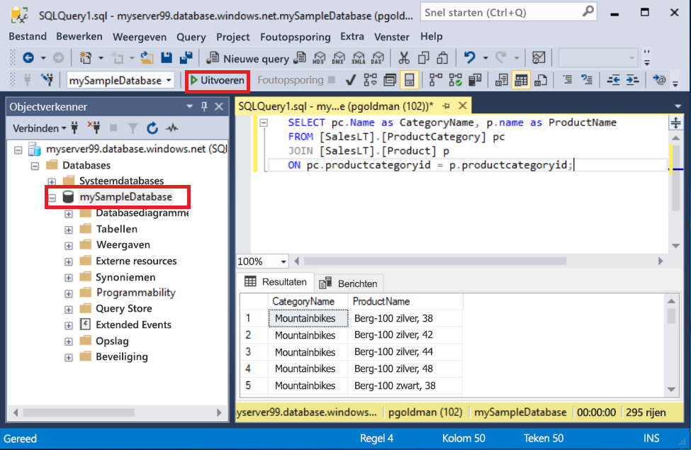
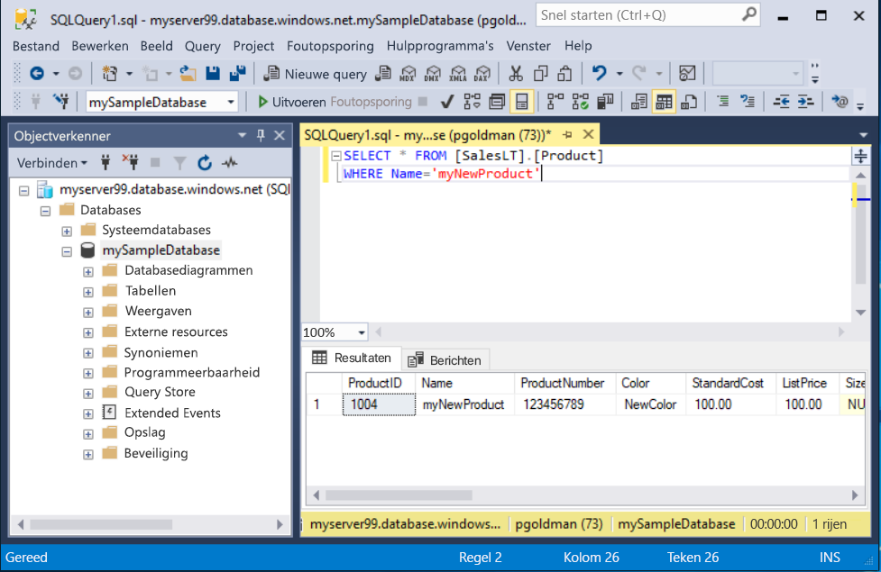

# <a name="quickstart-use-sql-server-management-studio-to-connect-and-query-an-azure-sql-database"></a>Snelstartgids: SQL Server Management Studio gebruiken om verbinding te maken en query's uit te voeren op een Azure SQL database

In deze snelstart gaat u [SQL Server Management Studio][ssms-install-latest-84g] (SSMS) gebruiken om een verbinding tot stand te brengen met een SQL-database in Azure. Vervolgens gaat u Transact-SQL-instructies uitvoeren om gegevens op te vragen, in te voegen, bij te werken en te verwijderen. U kunt SSMS gebruiken voor het beheren van een SQL-infrastructuur, van SQL Server tot SQL Database voor Microsoft Windows.  

## <a name="prerequisites"></a>Vereisten

Voor deze zelfstudie hebt u het volgende nodig:

[!INCLUDE [prerequisites-create-db](../../includes/sql-database-connect-query-prerequisites-create-db-includes.md)]

#### <a name="install-the-latest-ssms"></a>De nieuwste SSMS installeren

Voordat u begint, controleert u of u de meest recente [SSMS][ssms-install-latest-84g] hebt geïnstalleerd. 

## <a name="sql-server-connection-information"></a>SQL Server-verbindingsgegevens

[!INCLUDE [prerequisites-server-connection-info](../../includes/sql-database-connect-query-prerequisites-server-connection-info-includes.md)]

## <a name="connect-to-your-database"></a>Verbinding maken met uw database

In SMSS maakt u verbinding met uw Azure SQL Database-server. 

> [!IMPORTANT]
> Een logische Azure SQL Database-server luistert naar poort 1433. Om verbinding te maken met een logische server achter een firewall van het bedrijf, moet de firewall voor deze poort zijn geopend.
>

1. Open SQL Server Management Studio. Het dialoogvenster **Verbinding maken met server** wordt geopend.

2. Voer de volgende informatie in:

   | Instelling      | Voorgestelde waarde    | Beschrijving | 
   | ------------ | ------------------ | ----------- | 
   | **Servertype** | Database-engine | Vereiste waarde. |
   | **Servernaam** | De volledig gekwalificeerde servernaam | Dit moet er ongeveer als volgt uitzien: **mijnnieuweserver20170313.database.windows.net**. |
   | **Verificatie** | SQL Server-verificatie | In deze zelfstudie wordt gebruik gemaakt van SQL-verificatie. |
   | **Aanmelding** | Gebruikers-id voor het beheerdersaccount voor de server | De gebruikers-id van het serverbeheerdersaccount dat wordt gebruikt voor het maken van de server. |
   | **Wachtwoord** | Het wachtwoord voor het serverbeheerdersaccount | Het wachtwoord van het serverbeheerdersaccount dat wordt gebruikt voor het maken van de server. |
   ||||

     

3. Selecteer **Opties** in het dialoogvenster **Verbinding maken met server**. In de vervolgkeuzelijst **Verbinding maken met database** selecteert u **mySampleDatabase**.

     

4. Selecteer **Verbinden**. Het venster Objectverkenner wordt geopend. 

5. Als u de objecten van de database wilt weergeven, vouwt u **Databases** uit en vouwt u vervolgens **mySampleDatabase** uit.

     

## <a name="query-data"></a>Querygegevens

Voer deze Transact-SQL \[SELECT](https://msdn.microsoft.com/library/ms189499.aspx)-code uit om op categorie een query uit te voeren voor de twintig populairste producten.

1. Klik in Objectverkenner met de rechtermuisknop op **mySampleDatabase** en selecteer vervolgens **Nieuwe query**. Er wordt een nieuw queryvenster geopend dat is verbonden met uw database.

2. Plak deze SQL-query in het queryvenster.

   ```sql
   SELECT pc.Name as CategoryName, p.name as ProductName
   FROM [SalesLT].[ProductCategory] pc
   JOIN [SalesLT].[Product] p
   ON pc.productcategoryid = p.productcategoryid;
   ```

3. Selecteer op de werkbalk **Uitvoeren** om gegevens op te halen uit de tabellen `Product` en `ProductCategory`.

    

## <a name="insert-data"></a>Gegevens invoegen

Voer deze Transact-SQL [INSERT](https://msdn.microsoft.com/library/ms174335.aspx)-code uit om een nieuw product te maken in de tabel `SalesLT.Product`.

1. Vervang de vorige query door deze.

   ```sql
   INSERT INTO [SalesLT].[Product]
           ( [Name]
           , [ProductNumber]
           , [Color]
           , [ProductCategoryID]
           , [StandardCost]
           , [ListPrice]
           , [SellStartDate] )
     VALUES
           ('myNewProduct'
           ,123456789
           ,'NewColor'
           ,1
           ,100
           ,100
           ,GETDATE() );
   ```

2. Selecteer **Uitvoeren** om een nieuwe rij in te voegen in de tabel `Product`. In het deelvenster **Berichten** wordt **(1 rij beïnvloedt)** weergegeven.

## <a name="view-the-result"></a>Het resultaat weergeven

1. Vervang de vorige query door deze.

   ```sql
   SELECT * FROM [SalesLT].[Product] 
   WHERE Name='myNewProduct' 

2. Select **Execute**. The following result appears. 

   

 
## Update data

Run this [UPDATE](https://msdn.microsoft.com/library/ms177523.aspx) Transact-SQL code to modify your new product.

1. Replace the previous query with this one.

   ```sql
   UPDATE [SalesLT].[Product]
   SET [ListPrice] = 125
   WHERE Name = 'myNewProduct';
   ```

2. Selecteer **Uitvoeren** om de opgegeven rij in de tabel `Product` bij te werken. In het deelvenster **Berichten** wordt **(1 rij beïnvloedt)** weergegeven.

## <a name="delete-data"></a>Gegevens verwijderen

Voer deze Transact-SQL [DELETE](https://msdn.microsoft.com/library/ms189835.aspx)-code uit om uw nieuwe product te verwijderen.

1. Vervang de vorige query door deze.

   ```sql
   DELETE FROM [SalesLT].[Product]
   WHERE Name = 'myNewProduct';
   ```

2. Selecteer **Uitvoeren** om de opgegeven rij in de tabel `Product` te verwijderen. In het deelvenster **Berichten** wordt **(1 rij beïnvloedt)** weergegeven.

## <a name="next-steps"></a>Volgende stappen

- Zie [SQL Server Management Studio ](https://msdn.microsoft.com/library/ms174173.aspx) voor meer informatie over SSMS.
- Als u verbinding wilt maken en query's wilt uitvoeren met Azure Portal, raadpleegt u [Connect and query with the Azure Portal SQL query editor](sql-database-connect-query-portal.md) (Verbinding maken en query's uitvoeren met de SQL-query-editor in Azure Portal).
- Zie [Verbinding maken en query's uitvoeren met Visual Studio Code](sql-database-connect-query-vscode.md) als u verbinding wilt maken en query’s wilt uitvoeren met Visual Studio Code.
- Zie [Verbinding maken en query’s uitvoeren met .NET](sql-database-connect-query-dotnet.md) als u verbinding wilt maken en query’s wilt uitvoeren met .NET.
- Zie [Verbinding maken en query's uitvoeren met PHP](sql-database-connect-query-php.md) als u verbinding wilt maken en query's wilt uitvoeren met PHP.
- Zie [Verbinding maken en query's uitvoeren met Node.js](sql-database-connect-query-nodejs.md) als u verbinding wilt maken en query's wilt uitvoeren met Node.js.
- Zie [Verbinding maken en query's uitvoeren met Java](sql-database-connect-query-java.md) als u verbinding wilt maken en query's wilt uitvoeren met Java.
- Zie [Verbinding maken en query's uitvoeren met Python](sql-database-connect-query-python.md) als u verbinding wilt maken en query's wilt uitvoeren met Python.
- Zie [Verbinding maken en query's uitvoeren met Ruby](sql-database-connect-query-ruby.md) als u verbinding wilt maken en query's wilt uitvoeren met Ruby.


<!-- Article link references. -->

[ssms-install-latest-84g]: https://docs.microsoft.com/sql/ssms/sql-server-management-studio-ssms

