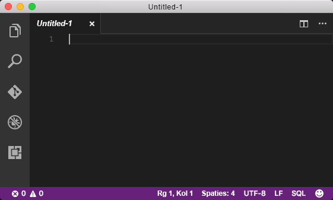
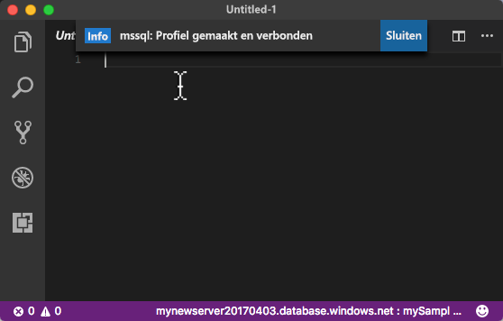
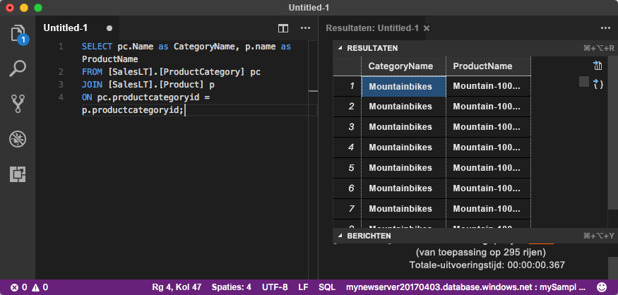

# <a name="azure-sql-database-use-visual-studio-code-to-connect-and-query-data"></a>Azure SQL Database: Visual Studio Code gebruiken om verbinding te maken en query's uit te voeren voor gegevens

[Visual Studio Code](https://code.visualstudio.com/docs) is een grafische code-editor voor Linux, Mac OS en Windows die ondersteuning biedt voor extensies, waaronder de [mssql-extensie](https://aka.ms/mssql-marketplace) voor het uitvoeren van query's in Microsoft SQL Server, Azure SQL Database en SQL Data Warehouse. In deze Quick Start ziet u hoe u Visual Studio Code gebruikt om verbinding te maken met een Azure SQL-database en vervolgens Transact-SQL-instructies gebruikt om gegevens in de database te zoeken, in te voegen, bij te werken en te verwijderen.

## <a name="prerequisites"></a>Vereisten

In deze Quick Start wordt uitgegaan van de resources die u hebt gemaakt in een van deze Quick Starts:

[!INCLUDE [prerequisites-create-db](../../includes/sql-database-connect-query-prerequisites-create-db-includes.md)]

#### <a name="install-vs-code"></a>VS-code installeren

Voordat u begint, zorgt u ervoor dat u de nieuwste versie van [Visual Studio Code](https://code.visualstudio.com/Download) hebt geïnstalleerd en dat de [mssql-extensie](https://aka.ms/mssql-marketplace) is geladen. Zie [VS Code installeren](https://docs.microsoft.com/sql/linux/sql-server-linux-develop-use-vscode#install-vs-code) voor hulp bij het installeren van de mssql-extensie. Zie ook [mssql voor Visual Studio Code](https://marketplace.visualstudio.com/items?itemName=ms-mssql.mssql). 

## <a name="configure-vs-code"></a>VS-code configureren 

### <a name="mac-os"></a>**Mac OS**
Voor Mac OS moet u OpenSSL installeren. Dit is een vereiste voor DotNet Core waarvan de mssql-extensie gebruikmaakt. Open de terminal en voer de volgende opdrachten in om **brew** en **OpenSSL** te installeren. 

```bash
ruby -e "$(curl -fsSL https://raw.githubusercontent.com/Homebrew/install/master/install)"
brew update
brew install openssl
mkdir -p /usr/local/lib
ln -s /usr/local/opt/openssl/lib/libcrypto.1.0.0.dylib /usr/local/lib/
ln -s /usr/local/opt/openssl/lib/libssl.1.0.0.dylib /usr/local/lib/
```

### <a name="linux-ubuntu"></a>**Linux (Ubuntu)**

Er is geen speciale configuratie vereist.

### <a name="windows"></a>**Windows**

Er is geen speciale configuratie vereist.

## <a name="sql-server-connection-information"></a>SQL Server-verbindingsgegevens

Haal de verbindingsgegevens op die nodig zijn om verbinding te maken met de Azure SQL-database. U hebt de volledig gekwalificeerde servernaam, databasenaam en aanmeldingsgegevens in de volgende procedures nodig.

[!INCLUDE [prerequisites-server-connection-info](../../includes/sql-database-connect-query-prerequisites-server-connection-info-includes.md)]

## <a name="set-language-mode-to-sql"></a>Taalmodus instellen op SQL

Zorg ervoor dat de taalmodus in Visual Studio Code is ingesteld op **SQL** om mssql-opdrachten en T-SQL IntelliSense in te schakelen.

1. Open een nieuw Visual Studio Code venster. 

2. Klik op **Tekst zonder opmaak** in de rechterbenedenhoek van de statusbalk.
3. In de vervolgkeuzelijst **Taalmodus selecteren** die wordt geopend, typt u **SQL** en drukt u vervolgens op **ENTER** om de taalmodus in te stellen op SQL. 

   

## <a name="connect-to-your-database"></a>Verbinding maken met uw database

Gebruik Visual Studio Code om verbinding te maken met uw Azure SQL Database-server.

> [!IMPORTANT]
> Voordat u doorgaat, zorgt u ervoor dat u uw server-, database- en aanmeldingsgegevens bij de hand hebt. Wanneer u begint met het invoeren van de verbindingsprofielgegevens, moet u als u de focus van Visual Studio Code wijzigt, het maken van het verbindingsprofiel opnieuw starten.
>

1. In VS Code drukt u op **CTRL+SHIFT+P** (of **F1**) om het opdrachtenpalet te openen.

2. Typ **sqlcon** en druk op **ENTER**.

3. Druk op **ENTER** om **Verbindingsprofiel maken** te selecteren. Hiermee wordt een verbindingsprofiel gemaakt voor uw exemplaar van SQL Server.

4. Volg de aanwijzingen om de verbindingseigenschappen op te geven voor het nieuwe verbindingsprofiel. Wanneer u een waarde hebt ingevoerd, drukt u op **ENTER** om door te gaan. 

   | Instelling       | Voorgestelde waarde | Beschrijving |
   | ------------ | ------------------ | ------------------------------------------------- | 
   | **Servernaam | De volledig gekwalificeerde servernaam | De naam moet er ongeveer als volgt uitzien: **mijnnieuweserver20170313.database.windows.net**. |
   | **Databasenaam** | mySampleDatabase | De naam van de database waarmee u verbinding wilt maken. |
   | **Verificatie** | SQL-aanmelding| SQL-verificatie is het enige verificatietype dat we in deze zelfstudie hebben geconfigureerd. |
   | **Gebruikersnaam** | Het beheerdersaccount voor de server | Dit is het account dat u hebt opgegeven tijdens het maken van de server. |
   | **Wachtwoord (SQL-aanmelding)** | Het wachtwoord voor het beheerdersaccount voor de server | Dit is het wachtwoord dat u hebt opgegeven tijdens het maken van de server. |
   | **Wachtwoord opslaan?** | Ja of nee | Selecteer Ja als u het wachtwoord niet elke keer wilt opgeven. |
   | **Voer een naam in voor dit profiel** | Een profielnaam, zoals **mySampleDatabase** | Een opgeslagen profiel zorgt ervoor dat de verbinding sneller tot stand komt bij toekomstige aanmeldingen. | 

5. Druk op **ESC** om het bericht te sluiten met de informatie dat het profiel is gemaakt en verbonden.

6. Controleer in de statusbalk of er verbinding is gemaakt.

   

## <a name="query-data"></a>Querygegevens

Gebruik de volgende code om op categorie een query uit te voeren voor de 20 populairste producten. Gebruik de Transact-SQL-instructie [SELECT](https://msdn.microsoft.com/library/ms189499.aspx).

1. Voer in het venster **Editor** de volgende query in in het lege queryvenster:

   ```sql
   SELECT pc.Name as CategoryName, p.name as ProductName
   FROM [SalesLT].[ProductCategory] pc
   JOIN [SalesLT].[Product] p
   ON pc.productcategoryid = p.productcategoryid;
   ```

2. Druk op **CTRL+SHIFT+E** om gegevens op te halen uit de tabellen Product en ProductCategory.

    

## <a name="insert-data"></a>Gegevens invoegen

Gebruik de volgende code om een nieuw product in te voegen in de tabel SalesLT.Product. Gebruik de Transact-SQL-instructie [INSERT](https://msdn.microsoft.com/library/ms174335.aspx).

1. In het venster **Editor** verwijdert u de eerdere query en voert u de volgende query in:

   ```sql
   INSERT INTO [SalesLT].[Product]
           ( [Name]
           , [ProductNumber]
           , [Color]
           , [ProductCategoryID]
           , [StandardCost]
           , [ListPrice]
           , [SellStartDate]
           )
     VALUES
           ('myNewProduct'
           ,123456789
           ,'NewColor'
           ,1
           ,100
           ,100
           ,GETDATE() );
   ```

2. Druk op **CTRL+SHIFT+E** om een nieuwe rij in te voegen in de tabel Product.

## <a name="update-data"></a>Gegevens bijwerken

Gebruik de volgende code om het nieuwe product bij te werken dat u eerder hebt toegevoegd. Gebruik de Transact-SQL-instructie [UPDATE](https://msdn.microsoft.com/library/ms177523.aspx).

1.  In het venster **Editor** verwijdert u de eerdere query en voert u de volgende query in:

   ```sql
   UPDATE [SalesLT].[Product]
   SET [ListPrice] = 125
   WHERE Name = 'myNewProduct';
   ```

2. Druk op **CTRL+SHIFT+E** om de opgegeven rij in de tabel Product bij te werken.

## <a name="delete-data"></a>Gegevens verwijderen

Gebruik de volgende code om het nieuwe product te verwijderen dat u eerder hebt toegevoegd. Gebruik de Transact-SQL-instructie [DELETE](https://docs.microsoft.com/sql/t-sql/statements/delete-transact-sql).

1. In het venster **Editor** verwijdert u de eerdere query en voert u de volgende query in:

   ```sql
   DELETE FROM [SalesLT].[Product]
   WHERE Name = 'myNewProduct';
   ```

2. Druk op **CTRL+SHIFT+E** om de opgegeven rij in de tabel Product te verwijderen.

## <a name="next-steps"></a>Volgende stappen

- Als u verbinding wilt maken en query's wilt uitvoeren met behulp van SQL Server Management Studio, raadpleegt u [Verbinding maken en query's uitvoeren met SSMS](sql-database-connect-query-ssms.md).
- Raadpleeg [Connect and query with the Azure Portal SQL query editor](sql-database-connect-query-portal.md) (Verbinding maken en query's uitvoeren met de SQL-query-editor in Azure Portal) als u verbinding wilt maken en query's wilt uitvoeren met Azure Portal.
- Zie het blogbericht [Create a database IDE with MSSQL extension](https://msdn.microsoft.com/magazine/mt809115) voor een MSDN-artikel over het gebruik van Visual Studio Code.
